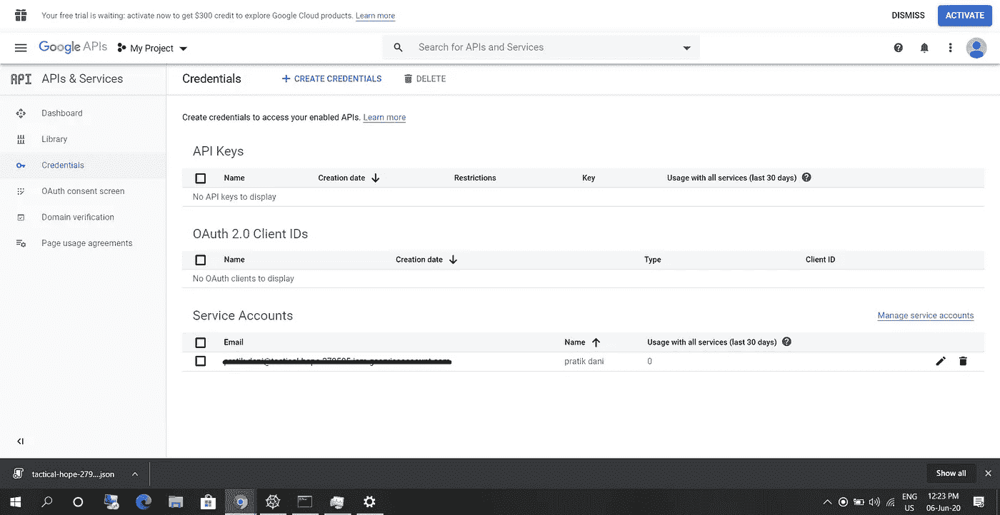

# 如何设置使用 Gmail API 发送电子邮件的凭证(第 1 部分)

> 原文：<https://levelup.gitconnected.com/how-to-set-up-credentials-to-and-send-an-email-using-the-gmail-api-259145a0a5ec>

## 通过 Gmail API 自动化您的电子邮件(第 1 部分)

在这一系列文章中，我将带你们了解我使用 Gmail API 能够实现的一切，从设置凭证开始，发送第一封电子邮件，回复某人，发送后续电子邮件，最后使用 Google Analytics 设置打开的电子邮件跟踪。

在 [Unsplash](https://unsplash.com/s/photos/automation?utm_source=unsplash&utm_medium=referral&utm_content=creditCopyText) 上 [NeONBRAND](https://unsplash.com/@neonbrand?utm_source=unsplash&utm_medium=referral&utm_content=creditCopyText) 拍摄的照片

在这个系列中，我们将讨论以下内容:

1.  获得一个 Google 开发人员帐户，设置凭证，并发送您的第一封电子邮件(第 1 部分)。
2.  添加附件、图片等，格式化电子邮件(第 2 部分)。
3.  回复某人并在同一条线索上发送后续消息(第 3 部分)。
4.  使用 Google Analytics 设置电子邮件打开跟踪(第 4 部分)。

这一部分的中心是创建一个服务帐户。首先，让我们把它分成几个阶段:

1.  打开 Gmail API。
2.  创建服务帐户。
3.  创建 OAuth 客户端 ID。
4.  授权服务帐户发送电子邮件。
5.  使用 Python 发送第一封电子邮件。

**打开 Gmail API**

访问[该向导](https://console.developers.google.com/start/api?id=gmail)在 Google 开发者控制台中创建一个项目。这不仅会创建一个项目，还会打开 Gmail API。

**创建服务账户**

这一部分要求您遵循几个步骤，但我将带您一步一步地完成它们:

1.  访问[此](https://console.developers.google.com/iam-admin/serviceaccounts) **服务帐户**页面并创建一个服务帐户。
2.  在表单中，将要求您输入**服务帐户名称**和**描述**(还有一个字段**服务帐户 id** ，但将自动填写)，输入服务帐户名称和描述(非必填)。完成后点击**创建**。
3.  对于**项目角色**，选择**项目>所有者**。然后点击**继续**。
4.  在下一页的**密钥**部分，点击**创建密钥> JSON，**之后，一个 JSON 文件将被下载并保存在一个安全的位置。点击**完成。**

如果一切顺利，你会在**服务账户**部分看到你的服务账户。大概是这样的(下面截图)

## **创建 OAuth 客户端 ID**

创建 **OAuth 凭证**需要我们填写 **OAuth 同意屏幕**表单，所以让我们先填写它。单击 OAuth 同意屏幕，您可以在屏幕左侧的导航窗格中找到该屏幕。

单击 OAuth 同意屏幕，您将在您的**应用程序名称**下看到一个表格(如果您愿意，您可以填写该表格中的其余详细信息，但这不是强制性的，也可以在以后完成)，通过单击**保存**继续下一步。

之后，我们将能够创建 **OAuth 凭证。**现在，让我们创建它，

1.  切换回 [**凭证页面**](https://console.developers.google.com/apis/credentials)**，现在点击**创建凭证> OAuthClient ID。****
2.  **从下拉菜单中选择应用程序类型(如果您不知道选择什么，则选择**Web**应用程序)。**
3.  **现在输入**名称**，在**授权重定向 URIs 下，**点击**添加 URI** ，在输入框中添加`http://localhost/`(这只是为了添加 URI)。从页面下载此凭证文件。将下载一个 JSON 文件，保存该文件，我们稍后将使用它发送电子邮件。**

## ****授权创建的 app 发送邮件****

**这部分的灵感来自于 [Gmail API 文档](https://developers.google.com/gmail/api/quickstart/python)。我们将按照本教程进行授权。**

1.  **安装依赖项，`pip install --upgrade google-api-python-client google-auth-httplib2 google-auth-oauthlib`**
2.  **运行下面的代码，只需将 JSON 文件的路径替换为我们在上一步中下载的 JSON 文件的路径。现在，我们只使用一个 scope(发送电子邮件)，我们将在后面的系列中使用更多的 scope。你可以在这里阅读关于示波器[的内容。](https://developers.google.com/gmail/api/auth/scopes)**

1.  **现在，当我们尝试运行`main`功能时，您的浏览器将会打开，您将首先进行身份验证，然后授权您创建的应用程序发送电子邮件。**
2.  **授权成功后，您的凭证 pickle 文件将存储在您的系统中。**
3.  **我们将在下一步使用这个 pickle 文件发送电子邮件。**

## ****使用 Python 发送第一封电子邮件****

**让我们从最激动人心的部分开始，即。如何发送电子邮件？**

**下面是我们可以通过 python 发送电子邮件的脚本。**

**在上面的脚本中，您必须用您的数据输入替换某些数据字段，其中最重要的是`path_to_pickle`、`sender`地址(发件人)和收件人地址(`to`)，您现在可以保留其他数据字段。**

**运行此脚本后，检查收件人邮箱，查看电子邮件是否发出。**

# **脚注**

**这只是本系列的第一部分，我们可以通过使用 Gmail API 做很多事情，我将在本系列的下一篇文章中介绍一些重要的事情。**

**如果这在某种程度上有所帮助，请随时按下“鼓掌”按钮。另外，如果你有任何问题，请在下面的评论区告诉我。**