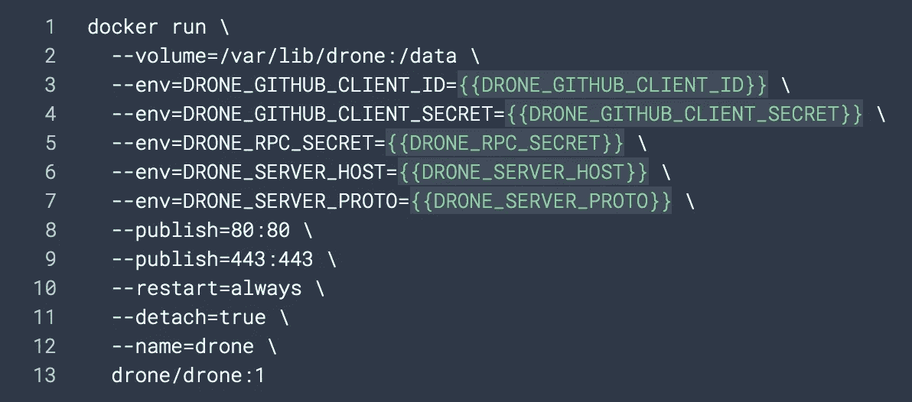
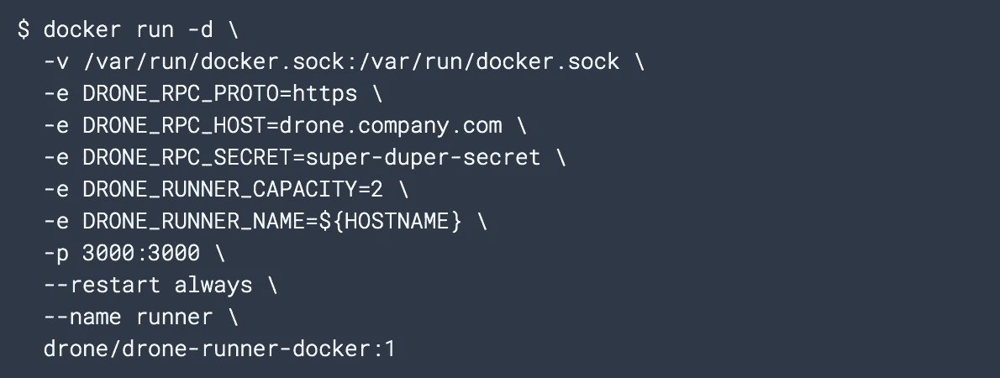

# 如何在 AWS EC2 上为有本地跑步者的 CRA 应用程序设置无人机 CI

> 原文：<https://levelup.gitconnected.com/how-to-set-up-drone-ci-on-aws-ec2-for-a-cra-app-with-local-dorunner-6164d619f354>

# 我们想要达到的目标

我们需要这样的设置，当我们推送到 Github 存储库时，会触发一个 webhook，自动执行一系列 CI 步骤。webhook 提供者是 Github，webhook 的消费者是我们将在 EC2 实例上设置的 CI 服务器。

CI 服务器被称为 Drone，它有一个 HTTP 端点，在推送 Github 存储库时被点击，这些存储库是用名为`.drone.yml`的 Drone 配置文件配置的。如果存储库包含该文件，那么需要执行该文件中指定的指令。这些指令合在一起称为工作负载，由无人机运行人员执行。

出于本文的目的，这些 CI 指令的执行将由本地机器上的运行者来完成。有不同类型的转轮，我们将使用 Docker 转轮。它轮询 EC2 中运行的无人机服务器，以执行 CI 工作负载，并在 Docker 容器中执行它们。

一般步骤是:

1.  启动一个 EC2 实例并在其上安装 Docker
2.  在 Github 中创建 OAuth 应用程序
3.  在 EC2 实例上运行一个无人机服务器
4.  在你的本地机器上设置一个无人机跑步者
5.  CRA，创建一个包含要执行的 CI 步骤的`.drone.yml`文件，并推送到 Github

# 1)启动并配置 EC2 实例

启动一个 EC2 实例并对其进行 ssh。我用的是 Ubuntu 18.04 免费层实例。允许 HTTP 和 HTTPS 入站访问端口 80 和 443。

按照 [Docker 文档](https://docs.docker.com/install/linux/docker-ce/ubuntu/)在实例上安装 Docker。

[无人机文档](https://docs.drone.io/server/provider/github/)解释了如何完成以下两个步骤，但我也在这里解释了它们，以防文档中有任何不清楚的地方，这些文档非常简洁。

# 2)在 Github 中创建 OAuth 应用程序

我们需要启用将在我们的 EC2 实例上运行的无人机服务器来访问我们的 Github 资源。

在下一步(步骤 3)中，我们将启动无人机服务器，并为其提供 OAuth2.0 客户端凭据，以便它可以使用 OAuth2.0 让我们登录 Github。Github 使用标准的授权代码授权类型，所以我们还需要提供一个授权重定向 URI(在 Github 中称为授权回调 URL)。

要做到这一点，按照 [Github 文档](https://developer.github.com/apps/building-oauth-apps/creating-an-oauth-app/)创建一个 Github OAuth 应用程序；你实际上要填写一张表格。该表单中的重要字段是授权回调 URL，您希望将其设置为`http://<ec2_instance_hostname>/login`。

点击`Register application`，下一屏显示`Client ID`和`Client Secret`。

# 3)在 EC2 实例上启动一个无人机服务器

这些步骤在[无人机文档](https://docs.drone.io/server/provider/github/)中也有描述。

首先，我们创建一个共享的秘密，该秘密将用于认证我们稍后创建的跑步者。`openssl rand -hex 16`生成密码，您可以稍后复制并粘贴。

下载无人机服务器，一个 docker 图片:`docker pull drone/drone:1`。

启动服务器，这是通过运行设置了几个环境变量的无人机服务器 docker 映像来完成的。

`DRONE_GITHUB_CLIENT_ID`和`DRONE_GITHUB_CLIENT_SECRET`在上面的步骤 2)中获得。`DRONE_RPC_SECRET`是我们在这一步前面生成的秘密。

`DRONE_SERVER_HOST`是我们 EC2 实例的 URL 的主机名部分；这将是类似`c2–10–101–22–10.eu-central-1.compute.amazonaws.com`的东西。

`DRONE_SERVER_PROTO`设置为`http`。其他部分可以像在无人机文档中一样进行设置:



此时，您可以运行`sudo docker ps`并看到一个名为`drone`的容器正在运行。

转到浏览器，在路径`/login`中导航到 EC2 实例的地址。你将通过 Github OAuth，并需要授权无人机访问你的一些 Github 资源。当您这样做时，您将被重定向到 Drone UI，这是一个仪表板，您可以在其中看到您的所有存储库和运行者正在执行的任何工作负载。

在这一点上，没有跑步者，你也没有推动任何回购有一个`.drone.yml`，所以什么也没有发生。

# 4)在你的本地机器上设置一个无人机运行器

这部分在[无人机文档](https://docs.drone.io/runner/docker/installation/linux/)中解释的足够好了。

你需要在你的本地机器上安装 Docker 和 Docker Drone Runner 的 Docker 镜像:`docker pull drone/drone-runner-docker:1`。

现在您需要做的就是运行这个映像，并使用一些环境变量，这样运行程序就知道 CI 服务器在哪里:它将轮询该服务器以执行工作负载。

文档显示以下命令:



无人机文档开始运行 Docker 图像

这里的要点是

*   我们已经为`http`设置了服务器，所以`DRONE_RPC_PROTO`应该是`http`。
*   `DRONE_RPC_HOST`是 EC2 实例，所以类似于`c2–10–101–22–10.eu-central-1.compute.amazonaws.com`。
*   `DRONE_RPC_SECRET`是我们在步骤 3)中生成的秘密，并在启动无人机服务器时作为环境变量传递

当您运行这个命令时，为了查看它是否工作，您需要检查这个`runner`容器:`docker logs runner`的日志。您希望看到的是远程服务器(EC2 CI 服务器)被成功 pinged 通。

# 5) CRA 与. drone.yml

使用`npx create-react-app my-app.`创建一个 React 应用

在那个项目的根目录下，创建`.drone.yml`文件。这是一个非常简单的 CI 管道。

```
kind: pipeline
type: docker
name: default
steps:
  - name: dronetest
    image: node
    commands:
      npm install
      npm test
```

如果项目中没有任何测试，这个管道将会失败，所以在这种情况下，要么移除`npm test`要么在项目中创建一个简单的测试文件。

为这个项目创建一个 Github repo，并将这个代码推送到这个 repo。当您这样做时，请看一下 Drone UI(EC2 实例上的根路径，使用 HTTP！)，这将显示有一个管道正在运行(在您的本地机器上)。