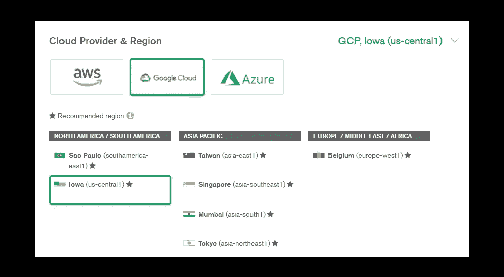

# 如何用 Spring Boot、Docker、Google Cloud Run 设置 MongoDB Atlas

> 原文：<https://levelup.gitconnected.com/how-to-set-up-mongodb-atlas-with-spring-boot-docker-and-google-cloud-run-60b51dfbddc0>


张秀坤·施罗德在 [Unsplash](https://unsplash.com?utm_source=medium&utm_medium=referral) 上拍摄的照片

## 立即开始您的谷歌云部署之旅

G 进入云开发的世界有时会让人有些不知所措。在最近的一篇文章中，我已经向您展示了[如何建立一个简单的发布-订阅实现](https://kennay-kermani.medium.com/simple-pub-sub-implementation-with-spring-boot-docker-and-rabbitmq-4ed7461de239)，它通常用于服务之间的通信。

在这篇教程中，我想介绍一些必要的步骤，以便在 Google Cloud 的帮助下将您的 Spring Boot 应用程序与一个 [MongoDB Atlas](https://www.mongodb.com/) 实例连接到云中，或者更具体地说 [Google Cloud Run](https://cloud.google.com/run) 。

为了以实际的方式遵循本文，您的项目有一些前提。

我假设:

*   你有一个工作 [Spring Boot 申请](https://spring.io/projects/spring-boot)
*   您有一个本地 MongoDB 实例，并希望将它部署到云中(或者更确切地说，是 MongoDB Atlas)
*   您已经在 [Google Cloud](https://console.developers.google.com/?pli=1) 上注册并创建了一个项目

# 创建 MongoDB Atlas 集群

MongoDB Atlas 提供了一个免费计划来测试他们令人敬畏的服务。就去[他们的网站](https://www.mongodb.com/cloud/atlas)报名吧。


在 **MongoDB Atlas 上创建集群**

点击**建立集群**。在下一个屏幕上，点击**创建一个集群**。选择**共享集群**空闲选项。

接下来，在**云提供商&区域**页面选择**谷歌云**和您选择的**区域**。



云提供商和地区选择

对于“**集群层”**坚持使用免费版本中包含的 **M0 沙箱**。保留其他设置，键入您选择的**集群名称**。点击**创建集群**，等待集群创建完成。

恭喜你！您刚刚建立了您的第一个 MongoDB Atlas 集群。

# 将 Spring Boot 与 MongoDB Atlas 连接起来

接下来，我们希望将我们的集群与 Spring Boot 应用程序集成。所以，还是在 MongoDB Atlas 控制台，点击**连接**。

点击**允许从任何地方访问**。

> **警告**:这在生产中可能极其危险，仅将此选项用于测试目的。

现在输入用户名和密码**并点击**创建数据库用户**。点击**选择连接方式，**进入下一步。这里你只需要点击**连接你的应用**。选择 **Java** 作为**驱动**和你想要的**版本**。**

现在从显示的字段中复制代码。它将如下所示:

您需要更改以下参数:

*   **用户名** —您刚刚创建的数据库用户的用户名
*   **密码** —您刚刚创建的数据库用户的密码
*   myFirstDatabase —这是您的数据库的名称。你可以把它改成你喜欢的任何东西

使用修改后的代码片段，打开 Spring Boot 应用程序项目中的“**application . properties”**文件。现在设置 mongodb+srv 代码片段，并将其添加到"**spring . data . MongoDB . uri**"中，如下例所示:

如果您现在执行您的 Spring Boot 项目，它将自动连接到 MongoDB Atlas 集群，而不是您之前定义的本地数据库。

# Google 云设置

对于这一步，我假设您已经注册了一个 Google 帐户，并在 Google Cloud 控制台中创建了一个项目。为了最终将我们的 Spring Boot 实例部署到云中，我们首先需要设置一些东西。

## 激活容器注册表

首先，我们需要激活 [**Google 容器注册表(GCR)**](https://console.cloud.google.com/gcr) 。我们稍后将把我们的 Docker 图像上传到 GCR，然后再部署到 Google Cloud Run。

为此，只需在搜索栏中搜索[容器注册表](https://console.cloud.google.com/gcr)，并点击**容器注册表**搜索结果。激活工具并继续下一步。

## 创建您的谷歌云运行应用程序

接下来，搜索**云运行**并点击相应的结果。如果尚未激活该功能，请激活它。

激活 GCR 后，点击**创建服务**。浏览工作流程的每个步骤。这些步骤不言自明。

当您成功创建了云运行服务后，您可以继续本文的下一步。

# 将你的 Spring Boot 申请归档

因为我们想将我们的 Spring Boot 应用程序部署到 Google Cloud Run，所以我们需要对它进行 dockerize。这意味着建立一个包括我们的 Spring Boot 应用程序的 Docker 映像。通过这种方式，我们以后能够将我们的应用程序部署到 Google Cloud Run。

首先在您的 Spring Boot 应用程序中创建一个项目级的新文件，并将其命名为 **Dockerfile** 。

添加上面 Github 要点的内容。虽然我不知道它被修复的确切 Java 版本，但我强烈建议不要低于 JDK 11.0.10，因为当你试图连接到你的 MongoDB Atlas 实例时，在较低版本的 TLS 上有一些已知的错误会影响你。

更具体地说，您将无法建立连接，因为 SSL 握手失败会导致套接字异常，可能如下所示:

```
exception={com.mongodb.MongoSocketWriteException: Exception sending message}, caused by {javax.net.ssl.SSLHandshakeException: extension (5) should not be presented in certificate_request}}
```

## 建立和发布你的 Docker 形象

现在我们已经配置了 docker 文件，我们可以开始构建它了。在一个良好的环境中，您可能会通过持续集成来自动化这一过程。但是为了清楚起见，我将向您展示构建 docker 文件并将其上传到 Google Cloud Run 的手动过程。

1 作为前提，确保[您已经安装了 Docker](https://docs.docker.com/get-docker/) 。

2.[下载安装 Google Cloud SDK shell](https://cloud.google.com/sdk/docs/install) 。

3.构建 Dockerfile 文件。为此，请打开您的终端，导航到您的项目顶层文件夹并执行以下命令。

4.打开谷歌云 SDK 外壳。

5.使用拥有足够权限的 Google 帐户登录。

6.执行以下命令，为您安装的 docker 提供与 Google Cloud 交互所需的凭据。

7.现在，我们将本地构建的 docker 映像推送到您的 Google 云存储库。

8.最后一步，我们将图像从 Google Cloud Repository 部署到 Google Cloud Run。执行该命令后，Google Cloud SDK Shell 将首先询问您部署映像的区域，您可以选择一个符合您偏好的区域。当你点击回车后，Shell 会要求你提供服务。你可以只输入你的应用程序的名字。

如果所有步骤成功，您将从 Google Cloud Run URL 访问您的 Spring Boot 应用程序。该应用程序将连接到您的 MongoDB Atlas 集群来处理数据库请求，并且能够通过 Google Cloud 进行扩展。

# 结论

正如我们在本文中看到的，通过 MongoDB Atlas 和 Google Cloud 的相互作用，Spring Boot 可以轻松地部署到云中。

MongoDB Atlas 提供了一个免费层选项，以便您可以测试他们的产品。Google Cloud 还免费提供测试积分，因此您可以零成本测试提议的云部署。

如果你喜欢我的文章，请留下掌声，并关注更多！

***免责声明:*** *我写这篇文章是出于教育目的。您独自负责本文中的任何步骤。我对使用上述任何服务可能产生的任何费用概不负责。请确保为您的云实例实现访问管理。*