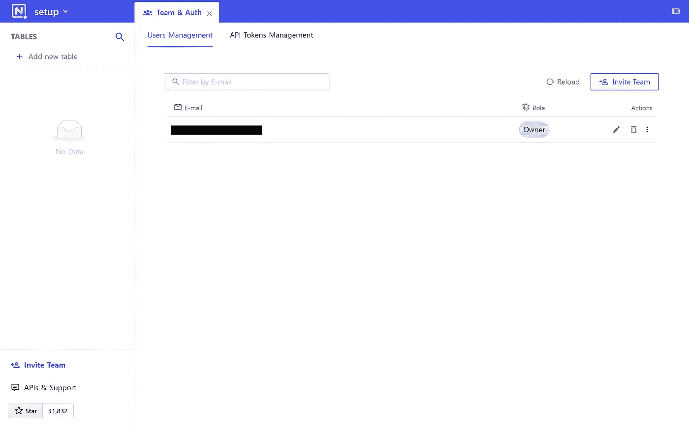

# 如何设置 NocoDB(使用 SSL)

> 原文：<https://levelup.gitconnected.com/how-to-set-up-nocodb-with-ssl-ff96bd36d078>


NocoDB 数据库作为电子表格演示

在数据库中创建和管理信息并不复杂或耗时。事实上，它可以像使用电子表格一样简单。文章“[何时使用数据库(作为电子表格)](https://switchupcb.medium.com/when-to-use-a-database-as-a-spreadsheet-4336defa5689)展示了**为什么**你应该使用数据库作为电子表格。本指南涵盖了**如何**使用 **NocoDB** 将数据库设置为电子表格。

# 什么是 NocoDB？

NocoDB 是一个开源的无代码平台，可以将任何数据库转换成智能电子表格。无代码开发平台允许程序员和非程序员通过图形用户界面和配置而不是传统的编程方法来创建应用软件。NocoDB 将自己描述为一个 **Airtable** 替代品，这是一个构建协作应用程序的平台。由于 NocoDB 是开源的，这意味着您可以免费获得 Airtable 的功能——通过自托管 NocoDB 的实例！

*免责声明:NocoDB 使用的是*[*agpl v3*](https://www.gnu.org/licenses/agpl-3.0.en.html)*许可证。这可能会影响您在贵公司使用该应用程序的能力(即* [*谷歌 AGPL 政策*](https://opensource.google/documentation/reference/using/agpl-policy) *)。*

# 如何设置 NocoDB

NocoDB 的完整设置需要三个步骤。

1.  建立关系数据库*(可选)*。
2.  在服务器上设置 NocoDB 的实例。
3.  从头开始一个项目，或者连接到关系数据库。

*注:您可以使用* [*NocoDB 文档*](https://docs.nocodb.com/) *了解更多信息。*

## 建立关系数据库

关系数据库提供数据存储和查询功能。NocoDB 目前支持多种关系数据库，包括 SQLite、MySQL、MariaDB、PostgreSQL、Microsoft SQL Server 和 AWS Aurora。由于可用的方法多种多样，本文将不集中讨论如何设置数据库。此外，NocoDB 不要求您设置一个数据库来使用它。但是，请注意，连接到外部数据库需要其连接凭据。

## 设置 NocoDB 实例

NocoDB web 应用程序*(来源于*[*【Github】*](https://github.com/nocodb/nocodb)*)*将数据库作为电子表格功能提供，其中包括用于与您的数据进行交互的图形界面。该应用程序必须在能够从远程连接 ***访问您的数据库的计算机(服务器)上运行，除非*** 您将数据库托管在与 NocoDB 实例 *(localhost)* **或**相同的服务器上，从头开始一个项目。在任何情况下，您都必须设置应用程序的运行实例。

在 [NocoDB 文档(安装)](https://docs.nocodb.com/getting-started/installation)中提供了许多设置 NocoDB 应用程序的方法。虽然您可以在任何计算机上设置这个应用程序，但是本指南假设您希望 NocoDB 实例可以在任何地方*(在您的桌面或移动设备上)*随时可用。因此，您应该从可以访问互联网的物理或虚拟服务器开始。在本指南中，来自**Digital Ocean(Basic Droplet)**的虚拟化服务器将与 **Ubuntu 22.04 LTS** 操作系统一起使用，以使用 **Docker** 安装 **NocoDB** 。

*用这个推荐链接注册数字海洋，在 60 天内获得 200 美元的信用:*[*https://m.do.co/c/9d1115abd57c*](https://m.do.co/c/9d1115abd57c)*。*

## 第一步:安装 NocoDB 先决条件

NocoDB Docker 安装的先决条件是 **Docker。**

您可以使用以下文章在 Ubuntu 22.04 上安装**Docker**:[如何在 Ubuntu 22.04 上安装和使用 Docker](https://www.digitalocean.com/community/tutorials/how-to-install-and-use-docker-on-ubuntu-22-04)。如果您通过启动 droplet 来设置您的服务器，那么[跳到该指南的第一步](https://www.digitalocean.com/community/tutorials/how-to-install-and-use-docker-on-ubuntu-22-04#step-1-installing-docker)。**步骤 2 和 3 是可选的**，而步骤 4+不是**设置 NocoDB 所必需的**。

## 第二步:安装 NocoDB 实例(通过 Docker)

使用 Docker 命令安装 NocoDB 的步骤(针对多个数据库)可在 [NocoDB 文档(通过 Docker 安装)](https://docs.nocodb.com/getting-started/installation#docker)中找到。或者，从您的服务器终端使用下面命令配置中的**一个**。在任何情况下，docker 映像都将从 NocoDB 在 [Docker Hub](https://hub.docker.com/r/nocodb/nocodb) 上的存储库中取出。

**基本安装**

NocoDB 的基本安装使用默认配置设置一个实例。这将在端口 8080 上启动您的应用程序*(将容器上的 8080 绑定到机器上的 8080)*使用 SQLITE 数据库*(用于 NocoDB 应用程序，而不是任何连接的数据库)*。

```
docker run -d --name nocodb \
-v "$(pwd)"/nocodb:/usr/app/data/ \
-p 8080:8080 \
nocodb/nocodb:latest
```

**生产安装**

[NocoDB 文档(生产设置)](https://docs.nocodb.com/getting-started/installation#production-setup)提供了设置生产应用程序的要求列表；以及用于配置应用程序的环境变量表。请记住，这些环境变量指的是用于管理 NocoDB 应用程序的数据存储工具，而不是您将转换为智能电子表格的任何数据库。请注意*“必须为生产用途配置* `*NC_DB*` *环境变量”。*

```
docker run -d --name nocodb \
-v "$(pwd)"/nocodb:/usr/app/data/ \
-p 8080:8080 \
-e NC_DB="INSERT APP DATABASE URL" \
nocodb/nocodb:latest
```

**私人安装**

如果未指定，以上安装将使用默认环境变量。因此，任何能够访问您的 NocoDB 安装的人都可以在上面创建一个帐户*(首先是一个* ***超级管理员*** *)* 。此外，将启用遥测技术。如果您希望只允许从后端创建帐户，请设置`NC_INVITE_ONLY_SIGNUP`环境变量。为了禁用遥测，设置`NC_DISABLE_TELE`环境变量。

```
docker run -d --name nocodb \
-v "$(pwd)"/nocodb:/usr/app/data/ \
-p 8080:8080 \
-e "NC_INVITE_ONLY_SIGNUP=true" \
-e "NC_DISABLE_TELE=true" \
nocodb/nocodb:latest
```

**安全套接字层(SSL)安装**

为了从 HTTPS 访问您的应用程序，使用本文后面的“[使用 SSL 设置 NocoDB】”一节中的 setup 命令。](#:~:text=Set%20up%20NocoDB%20with%20SSL%20(HTTPS))

## 第三步:将数据库连接到 NocoDB 实例

一旦 docker 命令被运行，NocoDB 进程将被启动。您可以通过使用`docker ps`检查容器的处理状态来确保这一点。您可能需要等待几分钟，让应用程序为请求做好准备。


上图显示了在服务器的 8080 端口(tcp)上运行的容器 ID 为`d00ece744f52`的`nocodb`图像。这意味着您可以从服务器的 IPv4 地址**上的**端口 8080** 访问实例。例如，当服务器的 IPv4 地址是`159.223.148.220`时，在浏览器中输入`159.223.148.220:8080`将会把你重定向到 NocoDB 注册页面。如果您的服务器有 8080 端口可以接入互联网，您将能够从任何设备访问 NocoDB。**

*想用域名？在您的 DNS 中创建一个* `*A*` *记录，将您的* `*subdomain.domain.tls*` *指向 IPv4 地址，然后使用* `*subdomain.domain.tls:8080*` *访问实例。*


创建超级用户后，您将能够登录并创建新项目。NocoDB 为您提供了从头创建一个新项目的能力，它会将您的数据存储在安装过程中指定的数据库中。或者，通过提供必要的数据库凭据连接到外部数据库。

*连接到 WordPress 数据库？在* `*wpconfig.php*` *文件中找到您的凭证。如果你使用的是受管理的 WordPress 实例，检查你的仪表板中的数据库管理器(例如 cPanel 上的 phpMyAdmin)或者联系你的托管支持团队以获得运行数据库的服务器的 IP 地址。您可能还需要使用同一个仪表板来启用远程连接。*


选择“新建项目”按钮。


外部凭据连接表单。

现在，您可以将数据库用作电子表格。



恭喜你！

# 使用 SSL 设置 noco db(HTTPS)

如果没有安全套接字层(SSL)，攻击者就能够读取和修改在您的服务器和接收信息的服务器*之间传输的*信息*。这将允许他们执行有问题的操作，例如嗅探您的 NocoDB 凭据*(一旦输入)*，欺骗实例，以及读取从您的数据库发送的数据。因此，建议向您的服务器添加 SSL 证书，并通过 HTTPS 协议与应用程序进行交互。否则，配置防火墙来限制您的服务器可以从*(在下一节)*接收入站连接的 IP。*

## 第一步:建立一个域

如果您**还没有**设置一个您可以用来访问您的应用程序的域，并将其指向您的服务器的 IPv4 地址。提醒一下，您可以通过在 DNS 中创建一个将您的`subdomain.domain.tls`指向 IPv4 地址的`A`记录来做到这一点。

## 第二步:设置反向代理

NocoDB 可以通过使用[反向代理](https://www.cloudflare.com/learning/cdn/glossary/reverse-proxy/)在 HTTPS 提供服务。这包括 Apache、NGINX、Caddy 等。

**球童**

Caddy 是内置于 Go 中的反向代理，旨在简化操作。从 [Caddy 服务器文档(安装)](https://caddyserver.com/docs/install)中安装 Caddy 的稳定版本。你可以使用命令`caddy version`来确认你的机器上是否有球童。下一步是创建一个 [Caddyfile](https://caddyserver.com/docs/quick-starts/caddyfile) ，它将 SSL 添加到您的域中，并将端口 8080 转发到端口 443。您可以使用以下命令来实现这一点。

```
touch Caddyfile
nano Caddyfile
```

在编辑器中，添加以下配置。

```
subdomain.domain.tlsreverse_proxy localhost:8080
```

* *保存使用 ctrl + X，Y，" Caddyfile "，回车。*

重新启动 caddy 服务器。

```
caddy stop
caddy start
```

如果您**还没有**，请确保启动您的 NocoDB 实例。然后，从浏览器访问您的实例。它应该表明您是从 HTTPS 访问。


恭喜你！

**NGINX**

Nginx 是一个反向代理，也可以用作反向代理、负载平衡器、邮件代理和 HTTP 缓存。因此，设置*(不止一种方法)和*会稍微复杂一些。对于全新的 NocoDB 安装，我推荐使用 [NGINX 代理自动化 ACME Companion](https://github.com/nginx-proxy/acme-companion) 来用 NGINX 设置 SSL。这需要遵循步骤 1 和步骤 2 来运行`nginx-proxy`和`acme-companion`容器。然后，通过使用下面的命令启动`nocodb`容器来代理它。

如果您的**已经启动了**实例，那么停止它，然后删除映像。

```
docker kill nocodb
docker rm nocodb
```

启动一个代理 NocoDB 容器。您可能需要等待几分钟，让应用程序为请求做好准备。然后，从浏览器访问您的实例。它应该表明您是从 HTTPS 访问。为了更加安全，以下配置使用了“私人安装”一节中的环境变量。

```
docker run -d --name nocodb \
-v "$(pwd)"/nocodb:/usr/app/data/ \
-p 8080:8080 \
-e "NC_INVITE_ONLY_SIGNUP=true" \
-e "NC_DISABLE_TELE=true" \
-e "VIRTUAL_HOST=subdomain.yourdomain.tld" \
-e "LETSENCRYPT_HOST=subdomain.yourdomain.tld" \
nocodb/nocodb:latest
```


恭喜你！

# 配置服务器防火墙

如果您**还没有**，您必须配置您的服务器的网络防火墙，以便您只能从某些端口访问服务器(包含 NocoDB 实例)。在数字海洋中，这就像使用提供的防火墙功能一样简单。例如，提供对端口 22 和 443 的入站访问，然后限制对端口 8080 的访问*(配置反向代理)*。或者，使用通用防火墙( [ufw](https://help.ubuntu.com/community/UFW) )命令行工具在 Ubuntu 上配置防火墙。

*有关保护数字海洋水滴的更多信息，请阅读* [*推荐的水滴设置*](https://docs.digitalocean.com/tutorials/recommended-droplet-setup/) *并观看* [*保护您的水滴*](https://www.digitalocean.com/community/tech_talks/securing-your-droplet) *。*

# 需要帮助吗？

想从技术设置中节省时间吗？SwitchUpCB Web Services 提供了许多服务，包括为您建立一个 NocoDB 项目。从[https://switchupcb.com/services](https://switchupcb.com/services)开始。

*原载于 2022 年 10 月 22 日 https://switchupcb.com*[](https://switchupcb.com/blog/how-to-set-up-nocodb-with-ssl/)**。**