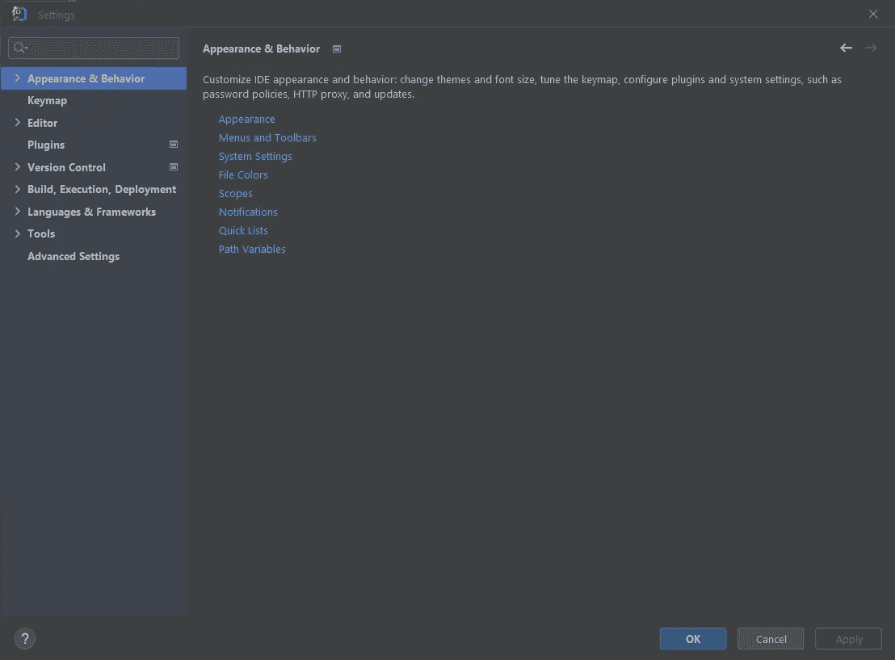
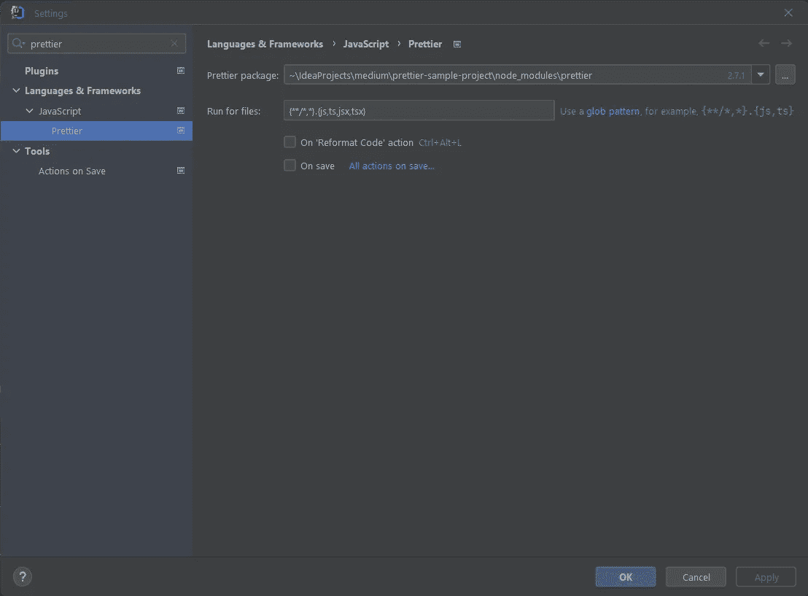

# 如何在 IntelliJ IDEA 中设置更漂亮的

> 原文：<https://levelup.gitconnected.com/how-to-set-up-prettier-in-intellij-idea-a9560a06f4bd>

## 保存时自动格式化代码


照片由[潘卡杰·帕特尔](https://unsplash.com/@pankajpatel?utm_source=medium&utm_medium=referral)在 [Unsplash](https://unsplash.com?utm_source=medium&utm_medium=referral) 拍摄

代码缩进会影响基本代码的可读性。出于一致性原因，您的代码应该在整个项目中遵循相同的缩进规则。

漂亮的是最流行的代码格式化程序之一。具体来说，它支持 JavaScript、JSX、Angular、Vue、Flow、TypeScript、CSS、Less、SCSS、HTML
Ember/Handlebars、JSON、GraphQL、Markdown、GFM、MDX 和 YAML 文件。

现在让我们学习如何在 IntelliJ IDEA/WebStorm 中配置更漂亮的来自动为你格式化你的代码！

# 1.安装更漂亮

通过在 IntelliJ 嵌入式终端中启动以下 npm 命令，在您的项目上本地安装`prettier`:

```
npm install --save-dev prettier
```


在 IntelliJ 中启动更漂亮的安装命令

这个命令将把`prettier`添加到项目的开发依赖项中。

# 2.安装 IntelliJ 漂亮插件

是时候在 IntelliJ 中安装更漂亮的插件了。点击“文件”>“设置…”进入“设置”弹出窗口



IntelliJ“设置”弹出窗口

在这里，点击左侧的“插件”菜单选项，选择顶部的“市场”标签，并在搜索栏中键入“更漂亮”。


搜索更漂亮的插件

点击“安装”为 IntelliJ 安装更漂亮的插件。然后，单击“确定”关闭“设置”窗口。

如果你在安装更漂亮的插件时遇到问题，请遵循官方 IntelliJ 指南中的[安装插件](https://www.jetbrains.com/help/idea/managing-plugins.html#install_plugin_from_repo)。

# 3.配置更漂亮的库

现在，您需要一个有效的[更漂亮的配置文件](https://prettier.io/docs/en/configuration.html)。例如，您可以在项目的根文件夹中创建一个`.prettierrc.json`文件，并将其初始化如下:

```
{
  "trailingComma": "all",
  "tabWidth": 2,
  "printWidth": 120,
  "semi": false,
  "singleQuote": false,
  "bracketSpacing": true
}
```

正如[官方文档](https://prettier.io/docs/en/configuration.html#basic-configuration)中所解释的，更漂亮的配置文件可以是 JSON、YAML、TOML 或 JavaScript 文件。这个配置文件定义了当格式化你的代码时，Prettier 将遵循的规则。

# 4.配置 IntelliJ 漂亮插件

再次点击“文件”>“设置…”打开 IntelliJ“设置”窗口。在搜索栏中输入“更漂亮”，然后选择“语言和框架”>“JavaScript”>“更漂亮”选项。

您现在应该会看到以下窗口:



IntelliJ 中更漂亮的配置窗口

如果您遵循了上面的标准过程，IntelliJ IDEA 应该能够自动定位`prettier`包。换句话说，IntelliJ IDEA 会自动为你填写“更漂亮的包装”字段。

否则，单击“更漂亮的包”字段左侧的“…”，并选择“节点模块”中的“更漂亮”文件夹，如下所示:


选择 beauty 所在的文件夹

单击“确定”关闭“选择更漂亮的包目录”弹出窗口。

现在，选中“代码重新格式化时”和“保存时”复选框来指定触发更漂亮的动作。


请注意,“代码重新格式化时”和“保存时”复选框被选中

这样，每当你手动或通过快捷方式启动 IntelliJ " [重新格式化代码](https://www.jetbrains.com/help/idea/reformat-and-rearrange-code.html)"动作代码，或保存文件时，Prettier 会自动为你格式化。

如果你想了解更多，请参见 save 官方指南上的[自动运行更漂亮。](https://www.jetbrains.com/help/idea/prettier.html#ws_prettier_run_automatically_in_current_project)

# 5.动作更漂亮

由于 IntelliJ appeller 插件被配置为在任何`.{js,ts,jsx,tsx}`上工作，`prettier`将自动为您格式化任何 JavaScript、TypeScript、JavaScript/Typescript XML 文件。

让我们看看这是如何工作的。


更漂亮的自动格式化代码操作

在通过按几次“Tab”按钮打破代码缩进后，我使用“Ctrl + Save”快捷键强制 IntelliJ 保存文件，并通过`prettier`触发代码格式化操作。正如你所看到的，漂亮自动缩进和格式化代码。

恭喜你。您刚刚学习了如何在 IntelliJ IDEA 中设置更漂亮的。从现在开始，你的代码将永远看起来很酷！

# 结论

代码缩进和格式在可读性方面起着关键作用。您希望您的代码看起来很酷，并在整个项目中保持一致，IntelliJ 提供的“重新格式化代码”功能可能不是最佳解决方案。为此，你需要一个更有效的代码格式化程序，而 Prettier 是一个固执己见的代码格式化程序。在这里，您学习了如何在 IntelliJ 中配置 Prettier，使它自动为您格式化代码。

感谢阅读！我希望这篇文章对你有所帮助。如果有任何问题、意见或建议，请随时联系我。