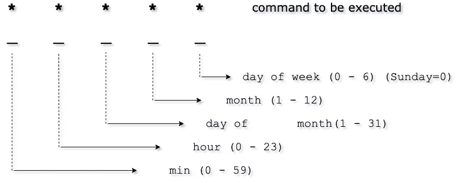

# 如何使用 Node.js 设置 MongoDB 定时备份

> 原文：<https://levelup.gitconnected.com/how-to-set-up-scheduled-mongodb-backups-with-a-bit-of-node-js-b81abebfa20>

## 通过几个依赖项和一些 JavaScript，您可以在服务器上为 MongoDB 实例设置自动备份。

Cron 语法— draw.io

本教程描述了使用 Node.js 为 MongoDB 设置自动备份的过程。

*   应安装`fs`和`lodash` npm 模块。
*   确保您的 MongoDB 受到用户名和密码的保护。 ***(推荐)***

## **第一步:**使用 mongodump 备份 MongoDB 数据。

我们现在将使用内置的`mongodump` 实用程序将整个 MongoDB 数据库备份(或“转储”)到包含您的数据库集合的备份文件夹中。

首先，让我们创建一个名为`database-backup`的备份目录来存储`mongodump`T24 创建的档案。

然后，在项目文件夹中创建一个名为`backup.js`的 JavaScript 文件，并添加下面的代码。

backup.js 文件

通过用数据库值替换`*<>*`之间的变量来设置数据库选项。

## 步骤 2:使用 cron 计划每日备份

为了安排备份脚本的夜间运行，我们将使用`cron`，这是一个内置于类 Unix 操作系统中的作业调度实用程序。

要创建 cron，使用`npm install cron --save`从 [NPM](https://www.npmjs.com/package/cron) 安装`cron`模块。

现在在您的项目中创建一个`cron.js`文件，并将下面的代码粘贴到其中。

corn.js 文件

备份脚本现在将在每周星期日 00:00 运行。

最后，将下面的代码添加到您的`index.js` 文件中:

index.js 文件

您可以将`0 0 * * 0`(在调度表达式中的 00:00 AM 执行)更改为您想要的备份频率和时间。要了解更多关于`cron`及其语法的信息，这里有一个由[*Cronitor*](https://crontab.guru/)*编写的 cron 表达式的简单编辑器。*

更多例子，点击 [*这里*](https://crontab.guru/examples.html) *。*

## 结论

在本教程中，我们学习了如何实现每夜逻辑 MongoDB 备份的策略。

本文的例子可以在 [GitHub 库](https://github.com/theouerd/mongodb-autoBackup)上找到。