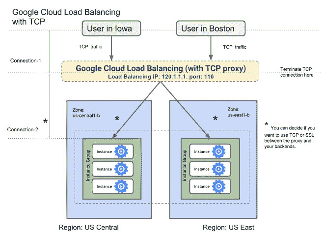

# 如何使用 GKE 在多区域集群中设置 TCP/UDP 服务

> 原文：<https://levelup.gitconnected.com/how-to-set-up-tcp-udp-services-in-multi-regional-clusters-using-gke-250a0c2163aa>

*Ignite Solutions 开发运营部高级工程师 Amit Yadav*

[爱比克泰德](https://www.brainyquote.com/authors/epictetus)的这句名言告诉我们很多关于可靠性的事情。而且说到 DevOps 的时候一针见血。一个典型的例子是:建立多区域集群来保护您的微服务的可靠性。

你不能依赖一个 Google Kubernetes 集群(GKE)在一个地区的一个区域中运行，尽管你可以创建一个区域性(多区域)集群，其中主集群和节点分布在一个地区的不同区域中(阅读更多关于区域和区域的信息[这里](https://cloud.google.com/compute/docs/regions-zones/))。这样，即使一个区域出现故障，您的服务和节点也可以在其他区域继续运行，您不必为此而失眠。

但是如果整个地区都瘫痪了呢？在一个区域集群中，即使几秒钟的停机时间也会导致您的服务完全不可用。

我在互联网上寻找答案，下面是我的发现…有关于如何将 HTTP 和 HTTPS 流量路由到多区域集群的文档:通过谷歌云平台(GCP)最近推出的命令行界面(CLI)工具，您可以使用[谷歌云负载平衡器](https://cloud.google.com/load-balancing/) (GCLB)为多集群 Kubernetes 引擎环境自动配置入口。你会得到这样的结果:



GCP 的 *kubemci* 工具对 HTTP 和 HTTPS 流量有用，但对 TCP 流量没用。*图像*

测试版的 *kubemci* 有助于在多个地区的多个集群(比如*南部集群*和*东南部集群*)中创建相同的服务，并使用[谷歌云负载平衡器](https://cloud.google.com/load-balancing/) (GCLB)的公共 IP 访问这些服务。GCP 的这个[设置多集群入口](https://cloud.google.com/kubernetes-engine/docs/how-to/multi-cluster-ingress)文档有助于在区域故障的情况下实现高可用性。根据 [Kubernetes Ingress](https://kubernetes.io/docs/concepts/services-networking/ingress/) 文档:“Ingress 将 *HTTP 和 HTTPS* 路由从集群外部暴露给集群内部的[服务](https://kubernetes.io/docs/concepts/services-networking/service/)”**但这并不适用于 TCP 流量。**

还有关于如何将 TCP 流量路由到单个虚拟机的[文档](https://cloud.google.com/load-balancing/docs/tcp/setting-up-tcp)。

关于如何将 TCP 流量路由到位于不同地区的两个[**【GKE】**](https://cloud.google.com/kubernetes-engine/)**集群(即虚拟机组)的文档少得惊人。如果你尝试过查找，你就会知道找到任何综合教程的困难。这花了一些功夫，但我终于弄明白了，我只是要与你分享它。**

## 如何将 TCP 流量路由到多区域集群？

我想建立高度可用的、多区域的 sftp 服务器来安全地传输内部使用 TCP 协议的文件，但是你可以为任何 TCP 服务这样做。

这篇[设置 TCP 代理负载平衡](https://cloud.google.com/load-balancing/docs/tcp/setting-up-tcp)文档是一个很好的起点。它仅指虚拟机，但以此为逐步参考，我将向您展示如何应用它来创建 GKE 集群(我相信您知道，集群是一组 GCP 计算实例虚拟机)。

注意，我修改了大部分输出:出于安全原因，一些被编辑，其他的为了简洁被删节(用省略号)。

您希望在这里创建集群，而不是创建实例。假设您熟悉 [gcloud 命令行工具](https://cloud.google.com/sdk/gcloud/)，使用以下命令在两个不同的区域创建两个集群，每个集群有两个节点(虚拟机):

```
*# Cluster name: cluster-south* gcloud container clusters create cluster-south \ --num-nodes 2 \ --zone asia-south1-a*# Cluster name: cluster-southeast* gcloud container clusters create cluster-south \ --num-nodes 2 \ --zone asia-south1-a
```

使用 *kubectl* 在集群上部署服务和应用程序。使用以下命令让您的 *kubectl* 逐个指向您的集群:

```
gcloud container clusters get-credentials cluster-name \ --zone zone-name
```

使用 kubectl 在 GKE 上部署服务。这个 *kubectl* 工具预装了 [gcloud](https://cloud.google.com/sdk/gcloud/) ，但是如果你还没有安装，点击[这里](https://kubernetes.io/docs/tasks/tools/install-kubectl/)。我总是运行所有的 *kubectl* 命令两次，切换集群以确保服务和部署在两个集群上都存在并且是相同的。

```
--- apiVersion: v1 kind: PersistentVolumeClaim metadata: name: sftp-claim spec: accessModes: - ReadWriteOnce resources: requests: storage: 100Mi --- apiVersion: extensions/v1beta1 kind: Deployment metadata: labels: app: sftp name: sftp spec: replicas: 1 strategy: type: Recreate template: metadata: labels: app: sftp spec: containers: - env: - name: USER value: user - name: PASS value: pass image: writl/sftp:latest name: sftp ports: - containerPort: 22 resources: {} volumeMounts: - mountPath: /data/incoming name: sftp-claim restartPolicy: Always volumes: - name: sftp-claim persistentVolumeClaim: claimName: sftp-claim
```

将其放在名为“sftp.yaml”的文件中，并对两个集群运行***ku bectl apply-f sftp . YAML***命令(使用***g cloud container clusters get-credentials***命令切换上下文，详见**步骤 1** )。如果您注意到，还通过“sftp.yaml”创建了一个持久卷声明。我们使用 [writl/sftp](https://hub.docker.com/r/writl/sftp/) docker 镜像来建立一个简单易用的 sftp 服务器。

类似地，通过将以下清单放在 sftp-service.yaml 文件中，创建一个公开端口 30061 的节点端口服务，并运行***ku bectl apply-f sftp-service . YAML***命令:

```
apiVersion: v1 kind: Service metadata: name: sftp-service spec: type: NodePort ports: - protocol: TCP port: 80 targetPort: 22 nodePort: 30061 selector: app: sftp
```

接下来，运行 ***kubectl get services，pods*** 以确保 pods 和服务在两个集群上运行。对于这两个集群，输出如下所示:

```
NAME READY STATUS RESTARTS AGE pod/sftp-hfs8v 1/1 Running 0 78s pod/sftp-nqhb2 1/1 Running 0 78s NAME TYPE CLUSTER-IP PORT(S) service/kubernetes ClusterIP 14.52.232.1 443/TCP service/sftp-svc NodePort 13.57.246.1 80:30061/TCP
```

您不需要在这里创建实例组或添加实例，因为 GKE 会为您创建实例组。但是，这两个组都需要一个命名端口。 ***gcloud 计算实例-组列表*** 应显示以下输出:

```
NAME LOCATION INSTANCES cluster-south..grp asia-south1-a 2 cluster-southeast..grp asia-southeast1-a 2
```

通过运行以下命令，为两个组设置命名端口:

```
cloud compute instance-groups set-named-ports \ instance-group-name \ --named-ports np30061:30061 --zone zone-name
```

该步骤需要一系列子步骤:

负载平衡器的后端服务使用运行状况检查来查看哪个集群/区域/服务能够正常转发流量。要为端口 *30061* 创建健康检查，请运行以下命令:

```
gcloud compute health-checks create tcp \ my-tcp-health-check --port 30061
```

简单地创建一个后端服务，它使用刚刚创建的健康检查和端口 *30061* 。

```
gcloud compute backend-services create \ my-tcp-backend-service \ --global \ --protocol TCP \ --health-checks my-tcp-health-check \ --timeout 5m \ --port-name np30061
```

将 GKE 创建的实例组添加到此后端服务。对于两个实例组，对所有组逐一运行以下命令:

```
gcloud compute backend-services add-backend \ my-tcp-backend-service \ --global \ --instance-group instance-group-name \ --instance-group-zone zone-name \ --balancing-mode UTILIZATION \ --max-utilization 0.8
```

运行以下命令来配置 TCP 代理:

```
gcloud compute target-tcp-proxies create \ my-tcp-lb-target-proxy \ --backend-service my-tcp-backend-service \ --proxy-header NONE
```

TCP 负载平衡器的 GCP 官方文档说，您可以使用 IPv4 或 IPv6 地址。我们将使用 IPv4。要保留静态 IPv4 地址，请运行以下命令:

```
gcloud compute addresses create tcp-lb-static-ipv4 \ --ip-version=IPV4 \ --global
```

使用 gcloud compute addresses list 命令获取 IPv4 地址 IP。

使用 IPv4 地址(比如 *xx.xxx.xxx.xx* )通过以下命令创建转发规则:

```
gcloud beta compute forwarding-rules create \ tcp-lb-forwarding-rule \ --global \ --target-tcp-proxy my-tcp-lb-target-proxy \ --address xx.xxx.xxx.xx \ --ports 195
```

选择 GCP TCP 负载均衡器支持的任意端口: *25，43，110，143，195，443，465，587，700，993，995，1883，5222* 。(我随机选择了港口 *195* 。)

防火墙规则将允许来自负载平衡器和运行状况检查的流量。LBs 和健康检查来源范围为 *130.211.0.0/22，35.191.0.0/16* 。使用标记来确保防火墙规则仅适用于标记的实例。GKE 将标记添加到集群运行时创建的所有实例中。一个实例组中的所有实例都有相同的标记。要查看与组相关联的标记，请运行以下命令:

```
gcloud compute instances list NAME ZONE gke-cluster-south-default-pool-67r asia-south1-a gke-cluster-south-default-pool-53q asia-south1-a gke-cluster-southeast-default-pool-86a asia-southeast1-a gke-cluster-southeast-default-pool-22g asia-southeast1-a # *Now run the below command to see the tags* gcloud compute instances describe instance-name \ --zone zone ...*output*... tags: fingerprint: H7326hhI3qU= items: - "gke-cluster-south-12345b67-node"
```

**注意:**该命令产生大量输出；您将在最后四行中找到标签**。**

**这里将有两个独特的标签—每组一个。使用这些标签创建所需的防火墙规则，以打开端口 *195* 和 *30061* :**

```
gcloud compute firewall-rules create \ allow-tcplb-and-health \ --source-ranges 130.211.0.0/22,35.191.0.0/16 \ --target-tags tag-instance-group-1,tag-instance-group-2 \ --allow tcp:195,tcp:30061
```

**就是这样！你都准备好了。只需等待几分钟，让负载平衡器完全设置好，然后通过运行以下命令连接到 sftp 服务器:**

```
sftp -P 195 user@xx.xxx.xxx.xx
```

**您应该能够成功登录到 sftp 服务器。您可以尝试使用***ku bectl delete-f sftp . YAML***从一个集群中删除服务器。您会注意到，如果您再次登录，负载平衡器会将流量路由到另一台服务器。**

**这种设置有什么好处？**

**您可以在 GKE 集群中添加和删除实例，而不会影响 sftp 服务器，因为您使用了一个标记和一个 [daemonset](https://kubernetes.io/docs/concepts/workloads/controllers/daemonset/) 。**

**在某些情况下，如果 GKE 使用新 IP 更新或重新创建虚拟机，它不会影响设置，因为它不会直接使用节点的 IP。**

**上下扩展真的很容易。如果您添加一个节点池(GKE 中的另一组虚拟机)，您需要做的只是:**

1.  **将指定端口添加到新组中**
2.  **将其添加到后端服务**
3.  **更新防火墙规则以多使用一个标记**

****额外提示:**测试设置，修改“sftp.yaml”中的***mount path:/data/incoming***。在 *cluster-south* 部署时，将其命名为***mount path:/data/incoming-1***，对于 *cluster-southeast* 将其命名为***mount path:/data/incoming-2***。这样，如果您登录到 sftp 服务器并运行 ls，您将获得上传文件夹名称，并轻松确定响应来自哪个集群和区域。**

****注意:**这里以 sftp 服务器为例。如果真的要部署 sftp 服务，存储是不会一致的。发生这种情况是因为每个 sftp 服务器都使用在自己的群集中运行的持久卷声明。为了方便地管理文件和存储的同步，您应该在两台服务器上安装一个通用的 Google 云存储桶。**

**就这么简单。如果你在某个地方遇到困难，或者你能提出更好的方法，请在评论中告诉我！**

***原载于 2019 年 9 月 9 日 https://www.ignitesol.com**的* [*。*](https://www.ignitesol.com/how-to-set-up-tcp-load-balancer-in-multi-regional-clusters-using-gke/)**