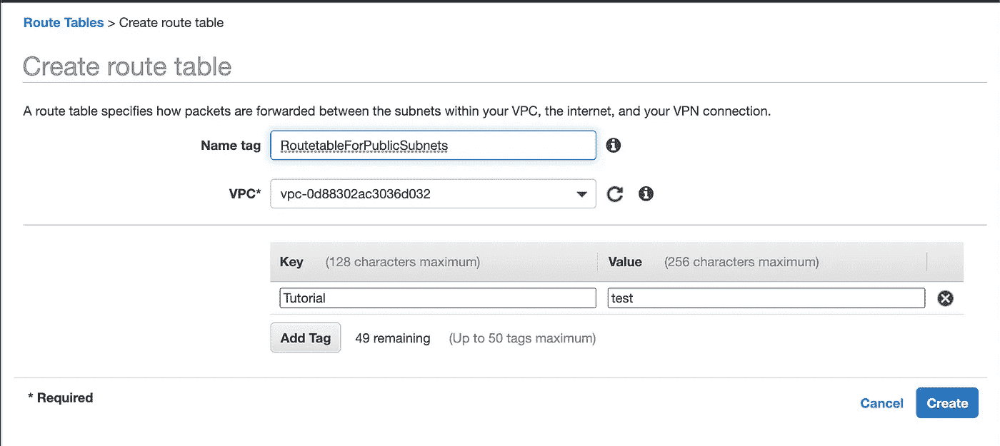

# 如何在 AWS 上设置 VPC

> 原文：<https://levelup.gitconnected.com/how-to-set-up-virtual-private-cloud-on-aws-10f6298fb45e>

绝对初学者的循序渐进指南

图片来源-谷歌

你有东西托管在 AWS 上。你到处都可以看到 VPC T2 这个词。

也许你和我一样，在想这个 **VPC** 到底是什么东西？

嗯，你来对地方了。今天，我们将学习 VPC(虚拟私有云)的所有基础知识，并自己创建一个。

在此过程中，您将学习一些网络基础知识，并深入了解 AWS 基础设施！

## 首先，什么是 VPC？

虚拟私有云可以被认为是一个私有网络，所有 aws 资源都将驻留在其中。这里的资源可以是从 EC2 实例到数据库的任何东西。

在你的私人网络里，你是老板。您可以设置哪些内容可以从外界访问，哪些内容需要保密。

# VPC 的组成部分

Vpc 的基本组件

## 子网络

子网是划分 VPC 的一种方式。您可以拥有一些私有子网或公共子网。

私有子网只能从 VPC 内部访问。例如，您不希望从任何地方都可以访问您的数据库。您希望只有您信任的应用程序(比如您的后端应用程序)才能访问它。

说到这里，您的 web 应用程序可以驻留在另一个公共子网内。因为普通用户会访问它。

您的每个子网将被分配一个自动生成的 IP 地址。

## 路由表

路由表在 VPC 中相当于路由器。

每当您的 VPC 中的任何资源试图访问位于另一个 IP 中的另一个资源时，它首先检查`route-table`以查看它是否有访问该资源的适当权限。

## 互联网网关

互联网网关顾名思义就是通往互联网的网关。

如果您想通过互联网访问您的资源，您的 VPC 必须有一个互联网网关。

这意味着互联网网关将使我们的最终用户能够访问我们 VPC 内部的安全资源。

## 安全组

安全组只是指定如何访问您的 VPC 的规则。

在这里，我们可以指定规则(TCP 或 HTTP 或 Https 或其他)和端口以及可以访问我们的 VPC 的允许资源。

现在我们要用这些东西来弄脏我们的手。你将需要一个 **aws** 账户来跟进。我们在本教程中做的任何事情都不会向您收费。

# 创造 VPC

去你的 AWS 控制台搜索 **VPC** 。进入并点击**创建 VPC** 。

这里，IPv4 CIDR 模块是需要注意的重要内容。IPV4 地址总共有 4 个字节(8 位),由点分隔。

(_ _).( _ _) .(_ _) .(_ _) (8 位)

每个字节有 2⁸或 256 个可能的值。值从 0 开始，因此可用值为 0–255。

因此，地址可以是 0.10.34.125，也可以是 23.6.32.87。

结尾的/16 表示前 16 位是网络地址。这意味着该 VPC 内的所有地址都将使用 10.12 开始其地址。(0–255).(0–255) .这是要记住的一件重要事情。

我们将其他一切都保持默认，然后单击**创建 VPC** ，我们就完成了。

# 创建子网

现在从侧边栏转到子网部分。我们点击**创建子网**

*   我们将它命名为 PublicSubnet，因为我们希望它是一个公共子网(如前所述)。
*   我们从下拉列表中选择新创建的 VPC
*   选择一个`availability-zone`。这些是物理服务器位置。你喜欢怎么选就怎么选。

> 在某些情况下(如创建 RDS ),您可能需要在不同的可用性区域中有多个子网。

*   我们将 IPv4 CIDR 地址块填充为 10.12.13.0/24
*   如前所述，该子网位于 VPC 内部，其 IPv4 CIDR 地址块以 10.12 开始。因此，我们的子网必须以相同的值作为前缀。对于第三块，我选择了 13。您可以选择 0 到 255 之间的任何值。
*   最后，我们添加了/24，这意味着该子网内的所有资源都将有一个以 10.12.13 开头的 IP 地址(总共固定 24 位)，只有最后一个二进制八位数会改变。因此，该子网中一个可能的 IP 地址是 10.12.13.43。AWS 会自动分配这个。
*   有一点要注意。我们可以用其他值(比如/22 或/ 23)来代替/24。但是为了简单起见，我们现在使用/24。
*   我们将以类似的方式创建另一个名为 Private Subnet 的子网

现在我们有两个子网可以使用。让我们继续创建一个互联网网关。

# 创建互联网网关

打开互联网网关部分，点击**创建互联网网关**

给个你喜欢的名字就完事了。

如前所述，我们需要一个互联网网关来使我们的公共子网与互联网通信。

现在，我们必须将这个互联网网关连接到我们的 VPC。从列表中单击 Internet 网关，并从“操作”菜单中选择“连接到 VPC”

从下拉菜单中选择我们的 VPC，你就完成了。现在我们的 Vpc 可以和互联网通话了。

但是我们没有指定哪些子网可以与互联网对话。我们现在将通过路由表将它们连接起来。

# 创建路由表

现在，我们从侧栏中选择路由表，并单击**创建路由表**

我们需要两张路由表。一个用于公共子网，另一个用于私有子网。

*   我们给它一个名字。
*   选择我们的目标 VPC
*   添加一个标签来识别它(不是强制性的)

点击创建并完成。

现在，我们从路由表列表中选择我们的路由表，并在表下选择名为 **Subnet Associations 的选项卡。**

在那里，我们单击名为**的按钮编辑子网关联**，并仅将我们的公共子网添加到路由表中。因为我们前面说过，我们将为我们的私有子网创建一个单独的路由表。您可以选择任意数量的子网。单击完成。

现在转到路线选项卡，选择**编辑路线**

在其中，点击**添加路线**并添加 0.0.0.0/0，这意味着 VPC 以外的所有路线。

我们将从下拉列表中选择**互联网网关**，并保存路由关联。

因此，现在我们有了一个`route-table`,其中关联了我们的一个子网。

我们的路由表指定了子网中的任何资源何时会请求某个 IP 地址以 10.12 开头的资源。。。那么它将被路由到本地

除此之外，请求将被路由到因特网网关，从那里它可以被外界访问。

同样，我们将为我们的私有子网创建另一个`route-table`。

并将该表与我们私有子网(或私有子网组)相关联。

我们不需要将该表连接到任何互联网网关，因为我们不希望该子网能够与互联网通信。

# 创建安全组

安全小组将指定如何访问我们在 VPC 的资源的规则。现在，我们从侧栏中选择安全组，并单击**创建安全组。**

*   我们给它一个名字，并选择我们的目标 VPC。

然后根据需要设置一些入站规则。这里有一些例子。

*   键入 HTTP，源被选择在任何地方。这意味着我们可以通过 HTTP 协议从互联网的任何地方访问这个 VPC。
*   HTTPS 也是如此。
*   对于 SSH，我们选择了我的 IP。因为我想从我的 IP 上 SSH 到我的资源。
*   对于 PostgreSQL，我选择了 Custom。我们可以指定 VPC 内部的哪些 Ip 地址可以访问我们的数据库。(它可以是运行 Web 应用程序的 EC2 实例的 IP 地址)

对于出站规则，您可以执行相同的操作。点击**创建安全组。**您可以随时编辑规则。

就是这样。现在，您拥有了自己的个人虚拟私有云，可以安全地部署资源并控制对资源的访问。理解 VPC 的概念将使您能够控制应用程序的安全方面。

今天到此为止。希望这对:D 有帮助

**通过**[**LinkedIn**](https://www.linkedin.com/in/56faisal/)**或我的** [**个人网站**](https://www.mohammadfaisal.dev/) **与我取得联系。**