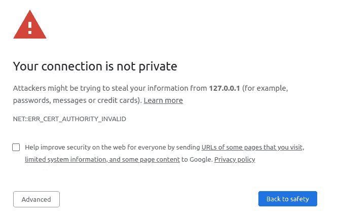

# 如何为您的本地机器设置开发 HTTPS/SSL 服务器

> 原文：<https://levelup.gitconnected.com/how-to-setup-a-development-https-ssl-server-for-your-local-machine-8c328ae26db8>



*   您是否参与过某些依赖关系要求您通过 HTTPS 服务器处理请求的项目？例如 Auth0 spajs
*   你被它卡住过很多次吗？

这里有两个解决方案可以帮助你永远避免这个问题。让我们开始吧。

# 使用 OPENSSL 创建自签名 SSL 证书。

要创建自签名 SSL/TLS 证书，您需要遵循以下步骤:

1.  在本地机器上安装 OpenSSL。OpenSSL 是一个免费的开源工具，允许您创建和管理 SSL/TLS 证书。
2.  生成私钥。私钥是唯一的秘密密钥，用于加密和解密数据。通过运行以下命令，您可以使用 OpenSSL 生成私钥:

```
openssl genrsa -out private.key 2048
```

这将创建一个名为“ **private.key** 的私钥文件，长度为 2048 位。

1.  创建证书签名请求(CSR)。CSR 是一个包含有关您的网站和组织的信息的文件，它用于从 CA 请求 SSL/TLS 证书。要创建 CSR，请运行以下命令:

```
openssl req -new -key private.key -out csr.pem
```

这将提示您输入有关您的网站和组织的各种详细信息，如域名、组织名称和位置。

1.  生成自签名证书。一旦创建了 CSR，就可以使用 OpenSSL 通过运行以下命令来生成自签名证书:

```
openssl x509 -req -days 365 -in csr.pem -signkey private.key -out certificate.pem
```

这将创建一个名为“certificate.pem”的自签名证书文件，有效期为 365 天。

1.  将您的 web 服务器配置为使用私钥和证书。一旦生成了私钥和证书，就需要配置 web 服务器来使用它们。这通常包括在 web 服务器的配置文件中指定私钥和证书文件的位置，并启用 SSL/TLS 协议。

# 用 MKCERT 创建自签名证书(最简单)。

mkcert 是一个免费的开源工具，允许您轻松地创建和管理用于本地开发的 SSL/TLS 证书。它通过在本地证书存储中自动安装证书并配置您的 web 服务器来使用它，简化了创建和安装自签名证书的过程。

1.  在本地机器上安装 mkcert。你可以从 [mkcert 网站](https://mkcert.org/)下载最新版本的 mkcert，或者使用 Homebrew(在 macOS 上)或 Chocolatey(在 Windows 上)等软件包管理器安装。
2.  创建根证书颁发机构(CA)。CA 是颁发 SSL/TLS 证书的可信实体。mkcert 包括一个内置的 CA，您可以用它来签署您自己的证书。要创建 CA，请运行以下命令:

```
mkcert -install
```

这将创建一个根 CA 证书和私钥，并将根 CA 证书安装在本地证书存储中。

1.  为本地域生成证书。一旦创建了 CA，就可以使用 mkcert 为本地域生成证书。例如，如果您的本地域是“localhost”，您可以运行以下命令:

```
mkcert localhost
```

这将为“localhost”创建一个证书和私钥，并将它们存储在当前目录中。

1.  配置您的 web 服务器以使用该证书。生成证书后，您需要配置您的 web 服务器来使用它。mkcert 包括一个名为“mkcert-certutil”的实用程序，可以帮助您完成这一任务。例如，如果您正在使用 Apache，您可以运行以下命令:

```
mkcert-certutil -cert-file localhost.pem -key-file private-key.pem -install-cert
```

这将在本地证书存储中安装证书和私钥，并更新 Apache 配置以使用它们。

如果你想购买一个真实的证书(免费)在一个真实的服务器上完成这个过程，请阅读这个[帖子](https://stephenadesina.com/?p=421)。

请在下面评论你是如何使用这些方法的。

**Secundum Allos Parakletos**