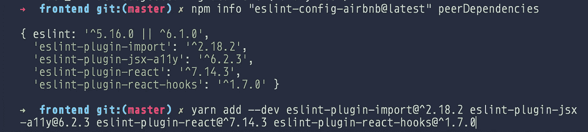

# 如何像专业人士一样设置 JavaScript Monorepo

> 原文：<https://levelup.gitconnected.com/how-to-setup-a-js-monorepo-like-a-professional-cf71d13501c5>

## 这没有你想象的那么难

照片由[阿维·理查兹](https://unsplash.com/@avirichards?utm_source=unsplash&utm_medium=referral&utm_content=creditCopyText)在 [Unsplash](https://unsplash.com/s/photos/working?utm_source=unsplash&utm_medium=referral&utm_content=creditCopyText) 拍摄

我传统上讨厌 ESLint，Babel，Babel，之类的。不要误解我，它们是非常棒的工具；用这些工具的集合来创建一个新项目简直是一场噩梦。

上周末，我深入研究了如何引导一个体面的 JavaScript Monorepo，包括代码林挺执行、测试支持和体面的构建过程。

如果你和我一样，你在之前的大部分 React 项目中都使用过 Create React App。它能帮你处理很多事情，真的很好。但是，如果您想使用多个不同的包创建一个更大的库，该怎么办呢？如果您想要对存储库规则和脚本进行更严格的控制，该怎么办？或者只是想获得从头开始建立自己的 React 环境的经验？我的问题的答案是 [Lerna](https://lerna.js.org/) ，一个方便的 JS monorepo 管理工具。

我以前检查过它，但我记得对这个工具进行了贴现，因为当时它似乎在我的多重回购项目中一切都很好。现在，在这个长达一年的项目的末尾，我希望我们能够对代码管理进行更严格的控制，并利用 Lerna。

因此，这里有一些关于如何使用 Lerna 建立存储库的基础知识，随着开发过程的发展，它将为您的成功奠定基础。

# 创建新的存储库

导航到您在 GitHub 或 BitBucket(或随便什么)中的配置文件，并创建一个新的存储库。然后用可信赖的老`git clone <url>`克隆它。或者，用`yarn init`和`cd`创建一个新文件夹。别忘了添加你的`.gitignore`文件。下面是我在这个示例项目中使用的简单方法:

简单。Lerna 和包裹 monorepo 的 gitignore 配置

***作为参考，*** 我已经将设置为 [public GitHub repository](https://github.com/DanielCender/test-lerna-setup) 的完整样板文件上传到我的个人资料中，因此我们可以看到本指南的最终结果。

## 现在，一些意见

我个人更喜欢使用 Yarn 来管理我的包。事实上，对于大多数开发项目来说，Yarn over NPM 的好处微乎其微，所以无论您是通过一个还是另一个来管理您的依赖关系，都没有关系。只不过是[红](https://www.npmjs.com/)对[蓝](https://yarnpkg.com/lang/en/)的另一种情况。据我所知，目前 NPM 唯一的优势在于它使用全局缓存来安装常见的依赖项，甚至在你离线的时候。

# 让 Lerna 跑起来

如果我的指令过期，请遵循此处的[指令](https://lerna.js.org/#getting-started)。

**TL；博士-** 运行`npm install --global lerna`或`yarn add global lerna`，然后`cd <proj folder>` & & `lerna init`。

这应该和`npm init`或`yarn init`一样，创建一个包含基本字段的 package.json 文件。将`--independent`或`--i`标记添加到 init 命令中，为您的单个包单独设置版本，如果您*不打算同时将更新部署到您的所有包中，您将需要这样做。*

确保您的 lerna.json 配置文件与您选择的 NPM 客户端相匹配。我的看起来像这样:

lerna.json 配置示例

然后，您将需要创建至少一个包，使其成为一个生产空间。因此，要么跑`lerna create <package name>`或`cd`进入`packages`和`mkdir <folder>`你的荣耀之路。

如果使用`mkdir`，确保在新的包中运行`yarn init`以正确设置。

# 设置 ESLint

埃斯林一直是我的眼中钉。对于 JS 开发人员来说，除了 Babel 之外，它可以说是所有外围工具中最难处理的。巴别是一头野兽。

## 设置

根据文档，运行`yarn add eslint --dev`，然后运行`npx eslint --init`。如果您使用 Yarn，当指南询问您是否要使用 NPM 添加包装时，请务必选择 N。无论您在哪里运行这些命令，您都应该有一个`.eslintrc`文件。我个人喜欢在每个需要特定设置的子包中安装这些工具。当试图从根目录请求库或依赖项时，会出现一些奇怪的复杂性。大多数 JS 运行时/捆绑工具在直接目录中寻找各自的`node_modules`包。Verdaccio 的这篇文档比我更简洁地解释了这个良好实践。

有许多林挺标准可以用 ESLint 配置。Airbnb 的风格配置可能是最受欢迎的标准，但也有一个[谷歌配置](https://www.npmjs.com/search?q=eslint-config%20google)有很好的追随者。如果你不想弄乱它，ESLint 附带了一个推荐的配置，默认情况下已经在你的`.eslintrc`文件中设置好了。

这是基本的 Airbnb 配置，其中包括所有规则，但不包括与 React 相关的规则。

如果您正在使用 React，[这个配置](https://www.npmjs.com/package/eslint-config-airbnb)将包含您需要的规则。

根据这两个设置的自述文件，有几种方法可以安装所有必需的依赖项，但是如果没有其他方法，您可以运行`npm info "eslint-config-airbnb-base@latest" peerDependencies`来列出对等依赖项和版本，然后为每个列出的对等依赖项运行`yarn add --dev <dependency>@<version>`(对于`eslint-config-airbnb`也是如此)。**记住**也要安装配置包，否则运行`eslint`时会出错。

发现合适的 ESLint Airbnb 配置部门

但是我们的工作还没有完成。我们需要确保用`"extends”: [“airbnb"]`扩展我们的 ESLint `.eslintrc`(或其他 JS/JSON 配置)，这将告诉 ESLint 在我们的模块中使用配置。

通过在你的第一个包/目录中制作一个样本 index.html 文件来测试我们新的 ESLint 设置。

基本 HTML 样板文件

然后创建一个简单的`index.js`文件供 ESLint 运行。

index.js 文件示例

当我们对我们的包运行 ESLint 时，这个 index.js 文件应该抛出几个错误。

在你的包的`package.json`文件中添加`“lint”: “eslint — debug index.js”`到`“scripts”: {}` ,看起来是这样的:

示例 package.json 文件

如果我们运行`yarn lint`或`npm run lint`并且在我们的控制台中从 ESLint 得到语法错误，这将意味着一个成功的 ESLint 设置。

如果你在 Lerna repo 的根目录下设置了 ESLint 和 Airbnb 配置插件，那么当你在包中运行那个`yarn lint`脚本时，你可能会出错📦。对于最快速的设置，最好将每个包视为一个单独的存储库，并显式定义所有依赖项，无论是开发还是普通。

# 设置包裹

好了，ESLint 都设置好了，我们应该可以开始配置我们的捆绑包了。为此，我们将使用 Parcel，一个零配置的 web 应用捆绑器。我发现 package 比 Webpack 更容易运行。按照入门页面的[部分](https://parceljs.org/getting_started.html#adding-parcel-to-your-project)将包裹添加到您的包裹中。

我将运行:`yarn add parcel-bundler --dev`并将必要的脚本添加到我们简单的 package.json 文件中。我们的文件现在应该是这样的，减去了依赖版本的差异。

带有宗地脚本的 package.json

此时，您应该能够运行:`yarn dev`来启动默认情况下将在`[http://localhost:1234](http://localhost:1234)`提供的开发包。注意 parcel 是如何指向 index.html 的入口点的，因为该文件导入了我们到目前为止包中唯一的 JS 文件。然而,`lint`脚本仍然会显式地在 JS 文件上运行。

此时，您可以继续使用这个设置来管理一个简单的带有手工制作的 HTML 的普通 JS 项目。然而，几乎可以肯定地说，大多数项目都希望包含一个像 React 这样的框架。

# 添加 React

在你的包中运行`yarn add react react-dom`即可。编辑您的 HTML 文件，并在`<body></body>`标签中添加一个`

`，您可以在其中附加 React 应用程序。

用一个基本的 React 应用程序样板替换`index.js`。

如果我们再次运行`yarn dev`,这应该是现成的。如果您想在独立回购的背景下查看此设置，请参考本文。

# 巴别塔设置

package 让我们的 React 应用程序使用 Babel 变得异常简单。我们所需要做的就是安装我们的 Babel 预置并添加一个`.babelrc`文件到我们的包中。

跑:`yarn add --dev @babel/preset-react @babel/preset-env`

添加一个`.babelrc`文件:

简单巴别塔构型

package 将检测这种配置，并默认使用 Babel 将我们的 JSX 和 ES6 代码转换为 ES5 语法。我们运行`yarn dev`，我们会再次注意到 package-bundler 使用 Babel 来捆绑我们的启动应用程序。

这绝不是如何设置/管理/部署 monorepos 的全面指南，而只是如何设置一个简单的基于 web 的应用程序的起点。如果这篇文章对任何人有帮助，我会发布另一篇文章，概述如何为 React 和非 React 设置集成测试库。

每个独特的应用程序的设置和维护涉及的内容如此之多，没有一个指南能够满足所有的需求。我与 Lerna 一起工作的个人和职业时间是愉快的，并让我大开眼界，了解了大型团队如何管理受快速开发变化和紧密集成的子模块系统影响的项目。

在使用 React 和无服务器框架构建了一个项目之后，我开始研究 monorepo 设置，这两个部分存在于不同的回购中。如果我们在开发中使用 monorepo 设置，许多 bug、不必要的复杂性和变更管理困难都可以消除。

最后，这里有一些在类似设置中使用 Lerna 的非常容易识别的项目:

*   [巴别塔](https://github.com/babel/babel)
*   [创建 React 应用](https://github.com/facebook/create-react-app)
*   [反应路由器](https://github.com/ReactTraining/react-router)
*   [帕格](https://github.com/pugjs/pug)
*   [笑话](https://github.com/facebook/jest)
*   [故事书](https://github.com/storybookjs/storybook)
*   盖茨比
*   [古腾堡](https://github.com/WordPress/gutenberg)
*   [AWS 放大 JS](https://github.com/aws-amplify/amplify-js)

> 我的名字叫丹尼尔·森德，我是一个热衷于不断开发我的工艺的技术专家。目前是所有工具 Web、GraphQL 和 Mobile 的忠实粉丝。
> 
> 如果你觉得这篇文章有帮助，请分享它，传播知识！如果你对我的指南有任何问题，请回复我，我会尽快处理。