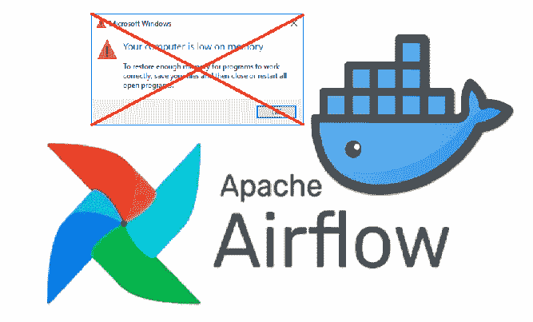
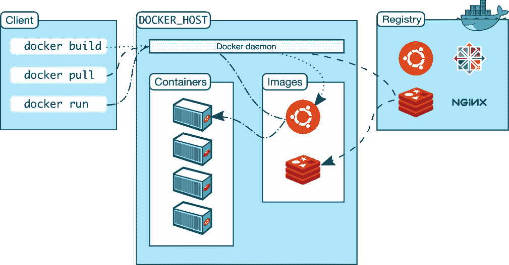

# 如何为气流设置一个轻量级的本地版本

> 原文：<https://levelup.gitconnected.com/how-to-setup-a-lightweight-local-version-for-airflow-96feaab2e835>

# 由 Docker 和 Docker 组成



忘记运行 Airflow 时的“低内存”问题(徽标取自 [Apache Airflow](https://airflow.apache.org/) 和 [Docker](https://www.docker.com/)

本文由 [DataTalksClub](https://datatalks.club/) 在[数据工程师 Zoomcamp](https://github.com/DataTalksClub/data-engineering-zoomcamp) 第一版的范围下创作。我将介绍我对最初提出的开发所做的一个技术变更，以在本地运行 **Apache Airflow** (参见 [*什么是“在本地运行一个软件”*](https://medium.com/@lgsoliveira/what-means-to-run-one-software-locally-a8b556d6f34c) )，并使用 **Docker** 和 **Docker Compose** 。正如在这个[视频](https://www.youtube.com/watch?v=A1p5LQ0zzaQ&list=PL3MmuxUbc_hJed7dXYoJw8DoCuVHhGEQb&index=23)中看到的那样，这个改编后来被并入了 DE Zoomcamp。

我们将在本文中讨论的内容:

*   什么是阿帕奇气流和 Docker
*   如何设置轻量级 Docker 版本来运行气流
*   这种设置更轻的原因

这不是一个关于 Airflow 或 Docker 的教程，而是一个关于如何设置一个要求较低的 Docker 环境版本来本地运行 Airflow 的解释。

在 Docker 容器内运行气流的“完全”建议版本是高度资源密集型的，因此推动了许多计算机/笔记本电脑(我的笔记本电脑的冷却风扇总是开着)。关于完整版本的更多信息，我建议你去看看上面提到的数据工程 Zoomcamp 和这篇由 Leandro Bueno 写的[文章](https://www.linkedin.com/pulse/airflow-o-que-%C3%A9-o-faz-hands-on-leandro-bueno/)(葡萄牙语)。

# 1.气流和 Docker 简介

# 1.1 阿帕奇气流

Apache Airflow 是数据工程领域最著名的工具之一，因此我不会花太多时间来解释它。

该软件是一个开源的数据编制工具，允许通过连接**有向无环图** ( **DAG** s)中的几个进程来建立完整的端到端管道。它连接并组织管理数据的任务，并不是官方 [Airflow 网站](https://airflow.apache.org/docs/apache-airflow/stable/#):*air flow 所说的数据流工具，也不是数据流解决方案。任务不会将数据从一个移动到另一个(虽然任务可以交换元数据！)".*


[阿帕奇气流](https://airflow.apache.org/)的官方标志

[Airbnb](http://airbnb.com) 于 2014 年开发了 Airflow，2015 年作为免费工具提供，次年捐赠给了 [Apache 基金会](https://www.apache.org/)。

除了开源之外，Airflow 还有以下主要优势:

*   根据 Airflow 官方网站的说法，它更易于维护、版本化、可测试和协作，因为它都是用代码开发的；
*   自始至终使用知名编程语言 Python
*   它有几个内置的操作符，但是如果它们不能满足您的要求，您可以编写自己的自定义操作符；
*   即使全部都是用代码开发的，它也有一个奇妙的网络界面，允许正确的流程轻描淡写；
*   它是高度可扩展的。

# 1.2.码头工人和码头工人组成

一年前，我开始从事 Docker 的工作，这是一套奇妙的平台软件(PAAS)产品，我现在是它的超级粉丝。

该工具使用操作系统级虚拟化，允许对容器中的软件进行奇妙的定制，可以轻松地与您的同事或开发环境之间共享，“*并确保您共享的每个人都获得以相同方式工作的相同容器”*(由[官方 Docker 网站](https://docs.docker.com/get-started/overview/#:~:text=Docker%20provides%20the%20ability%20to,simultaneously%20on%20a%20given%20host.))。

Docker 的工作方式非常简单，因为它使用了客户机-服务器架构。"*Docker 客户端与* ***Docker 守护进程*** *对话，后者负责构建、运行和分发 Docker 容器。Docker 客户机和守护进程可以在同一个系统上运行，或者您可以将 Docker 客户机连接到远程 Docker 守护进程。Docker 客户机和守护程序使用 REST API 通过 UNIX 套接字或网络接口进行通信。另一个 Docker 客户端是 Docker Compose，它让您可以使用由一组容器组成的应用程序。*(文字摘自 Docker 官方网站)。



Docker 架构(来自 Docker 官方网站)

使用 Docker 最常见的方式是在一个名为 **Dockerfile** 的文本文件中设置几个指令。该文件首先从公共 Docker 存储库中“调用”一个图像(例如 Python 图像、Airflow 图像等)来设置基础图像，然后它将运行几个用户定义的命令来定制您的新图像。然后在运行“docker build”命令后，创建一个新的映像，并将整个上下文(递归地)发送到守护进程。

***“Docker Compose****是一个定义和运行多容器 Docker 应用的工具。它使用 YAML 文件来配置应用程序的服务，并通过一个命令执行所有容器的创建和启动过程(……)****docker-compose . yml****文件用于定义应用程序的服务，包括各种配置选项。”*(文字摘自[维基百科](https://en.wikipedia.org/wiki/Docker_(software)) *)。*

# 2.使用要求较低的 Docker-compose 版本(带附加信息)在本地设置和运行 Airflow

我在本节中介绍的设置是在我上面提到的 Zoomcamp 的最终顶点的范围内构建并成功运行的。你可以在这里看到我的全部顶点。

我把文章的这一部分分成两部分:

1.  主要设计，使气流运行在码头集装箱和
2.  我创建的适应允许一个不太苛刻的配置。

# 2.1.允许气流在 Docker 中流动的结构

为了在本地运行 Airflow(在 Docker 容器中)，我使用了一个扩展映像，其中包含一些额外的依赖项。

因此，我首先创建了一个指向我需要的 Airflow 版本的 Dockerfile，比如 apache/airflow:2.2.3，作为基本映像。

```
FROM apache/airflow:2.2.3
```

然后我通过添加一些要安装的定制包来定制这个 Dockerfile。我最需要的是 *gcloud* 来连接 GCS bucket/Data Lake 并集成“requirements.txt”来通过 pip install 安装库。

这是我承诺的**奖励**:我决定在我的 DAG 中运行 spark(使用 Pyspark ),所以我必须在 docker 文件中配置 Spark。这可以通过添加 bash 命令来设置 Java env，并插入命令来下载运行 Spark 所需的所有文件来实现。此外，有必要插入 Pyspark 作为一个需求。

```
ENV JAVA_HOME=/home/jdk-11.0.2 ENV PATH="${JAVA_HOME}/bin/:${PATH}" **RUN** DOWNLOAD_URL="https://download.java.net/java/GA/jdk11/9/GPL/openjdk-11.0.2_linux-x64_bin.tar.gz" \ 
&& TMP_DIR="$(mktemp **-d**)" \
&& curl **-fL** "**${**DOWNLOAD_URL**}**" **--output** "**${**TMP_DIR**}**/openjdk-11.0.2_linux-x64_bin.tar.gz" \
&& mkdir **-p** "**${**JAVA_HOME**}**" \
&& tar xzf "**${**TMP_DIR**}**/openjdk-11.0.2_linux-x64_bin.tar.gz" **-C** "**${**JAVA_HOME**}**" **--strip-components**=1 \
&& rm **-rf** "**${**TMP_DIR**}**" \
&& java **--version**
```

然后我运行 curl 将官方的 docker-compose 安装文件(docker-compose.yml)从最新的 Airflow 版本导入到我的笔记本电脑中。

```
curl -LfO 'https://airflow.apache.org/docs/apache-airflow/stable/docker-compose.yaml'
```

然后我修改了 Yaml 文件以运行 docker-compose:

*   在 x-airflow-common 中，a)我删除了 image 标记，替换为我的 Dockerfile，b)将我的 google_credentials 以只读方式安装在 volumes 部分，c)设置环境变量 GOOGLE_APPLICATION_CREDENTIALS 和 air flow _ CONN _ GOOGLE _ CLOUD _ DEFAULT；
*   而且我把 AIRFLOW__CORE__LOAD_EXAMPLES 改成了 false

有了前面提到的所有步骤，我准备运行完整版，用 Docker 在本地运行 Airflow。

# 2.2.允许轻量级版本的修改

为了实现拥有一个轻量级版本的目标，我必须删除 docker-compose.yml 文件的几个部分。正如我将在下一节中解释的那样，所有这些进程都被删除了。

1.  我首先删除了 *redis* 部分:

```
**redis**:
  **image**: redis:latest
  **expose**:
    - 6379
  **healthcheck**:
    **test**: ["CMD", "redis-cli", "ping"]
    **interval**: 5s
    **timeout**: 30s
    **retries**: 50
  **restart**: always
```

2.这是为了移除气流工作服务。这是一种有争议的方法，因为我们正在讨论工人，但在下一节中，您将理解这一点:

```
**airflow-worker**:
  <<: *airflow-common
  **command**: celery worker
  **healthcheck**:
    **test**:
      - "CMD-SHELL"
      - 'celery --app airflow.executors.celery_executor.app inspect ping -d "celery@$${HOSTNAME}"'
    **interval**: 10s
    **timeout**: 10s
    **retries**: 5
  **environment**:
    <<: *airflow-common-env
    *# Required to handle warm shutdown of the celery workers properly*
    *# See https://airflow.apache.org/docs/docker-stack/entrypoint.html#signal-propagation*
    **DUMB_INIT_SETSID**: "0"
  **restart**: always
  **depends_on**:
    <<: *airflow-common-depends-on
    **airflow-init**:
      **condition**: service_completed_successfully
```

3.然后我去掉了*气流触发器*的部分:

```
**airflow-triggerer**:
  <<: *airflow-common
  **command**: triggerer
  **healthcheck**:
    **test**: ["CMD-SHELL", 'airflow jobs check --job-type TriggererJob --hostname "$${HOSTNAME}"']
    **interval**: 10s
    **timeout**: 10s
    **retries**: 5
  **restart**: always
  **depends_on**:
    <<: *airflow-common-depends-on
    **airflow-init**:
      **condition**: service_completed_successfully
```

4.最后，移除了*花*部分:

```
**flower**:
  <<: *airflow-common
  **command**: celery flower
  **ports**:
    - 5555:5555
  **healthcheck**:
    **test**: ["CMD", "curl", "--fail", "http://localhost:5555/"]
    **interval**: 10s
    **timeout**: 10s
    **retries**: 5
  **restart**: always
  **depends_on**:
    <<: *airflow-common-depends-on
    **airflow-init**:
      **condition**: service_completed_successfully
```

删除这些部分后，需要纠正一些依赖关系:

```
**user**: "${AIRFLOW_UID:-50000}:0"
  **depends_on**:
    &airflow-common-depends-on
    **redis**:
      **condition**: service_healthy
    **postgres**:
      **condition**: service_healthy
```

最终我将执行程序从 CoreExecutor 设置为 LocalExecutor。在下一部分，我将解释为什么我们改变了执行者，为什么这是**最重要的部分**。

```
AIRFLOW__CORE__EXECUTOR: LocalExecutor
```

docker-compose.yml 的原始和正式版本是 [this](https://airflow.apache.org/docs/apache-airflow/stable/docker-compose.yaml) ，我的最终版本在这里[呈现](https://github.com/guoliveira/data-engineer-zoomcamp-project/blob/main/Airflow/docker-compose.yaml)。

# 3.为什么这个装置更轻

这种设置比完整版轻的主要原因是由于选择将核心执行器设置为 **LocalExecutor** (单节点)。然后，在相关关系中，依赖于 **CeleryExecutor** (多节点)的一些特性可以被移除。

在 Airflow 中，DAG 将由于三个主要组件而被执行和完成，a)元数据 **数据库**，b)调度器和 c)执行器(来自天文学家网站

执行器的功能是与调度器一起工作，了解哪些资源将在它们排队时实际完成这些任务。

CeleryExecutor(与 [Celery](https://docs.celeryq.dev/en/stable/) 分布式系统相关)是专门为水平扩展而制造的，因为 CeleryExecutor 与独立工作人员的“池”(在可靠的分布式系统中)一起工作，它可以通过消息(根据[astronomy . io](https://www.astronomer.io/guides/airflow-executors-explained/)网站)在这些工作人员之间委派任务。然而，这个执行器是高度资源密集型的。LocalExecutor 举例说明了单节点架构(因此它的资源很少)，但它仍然允许并行。

> 因此，建议使用 LocalExecutor 进行本地测试(在本地运行),使用 CeleryExecutor 进行生产。

因为我将 Executor 设置为 LocalExecutor，所以我可以删除部件*air flow-work*r 和 *flower* ，因为它们只适用于芹菜架构。

*Redis* 是一个简单的缓存服务器(见 [Redis.io](https://redis.io/) )，需要设置为 CeleryExecutor 的芹菜后端(见 [CeleryExecutor](https://airflow.apache.org/docs/apache-airflow/1.10.13/executor/celery.html#:~:text=For%20this%20to%20work%2C%20you%20need%20to%20setup%20a%20Celery%20backend%20(RabbitMQ%2C%20Redis%2C%20%E2%80%A6){:target=%22_blank%22}) )。因为我们不会使用这个执行程序，所以删除这个服务是安全的-

我决定移除*气流触发器*，因为它是一个专门为 asyncio 事件循环设计的新气流服务，我不打算使用它。

# 结论

现在，我可以在局部运行气流，而不会对我的笔记本电脑造成太大损坏，也不用担心我的散热面的完整性(这感觉不像我在操作飞机😉)因为我们使用单节点执行器(但仍有并行性)运行它，并且运行的进程更少。

我希望得到您对本文信息的反馈。

你认为我在技术观点上是清楚还是不清楚？

我写了什么技术上的错误吗？

你喜欢这篇文章吗？关注我更多关于[媒介](https://medium.com/@lgsoliveira)的文章。