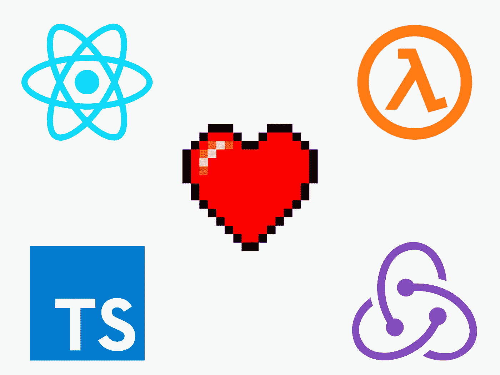
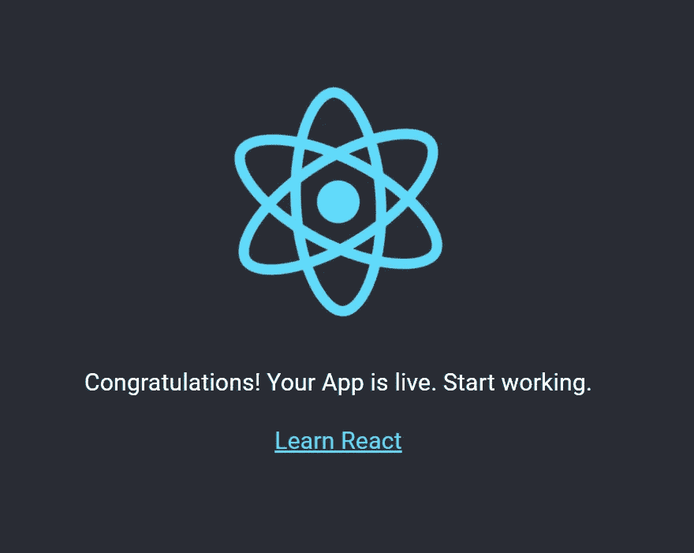

# 如何用 TypeScript，Redux 和 Material-UI 设置一个 React SPA

> 原文：<https://levelup.gitconnected.com/how-to-setup-a-react-spa-with-typescript-redux-and-material-ui-99a1e1ec7d54>

## 将功能组件与 TypeScript 的强大功能结合起来



本文将指导您使用 TypeScript、Redux、React-Router 和 Material-UI 启动一个新的 React.js 应用程序。

本文的所有代码都可以在 [this repository](https://github.com/mariofonteles/react-redux-typescript-boilerplate) 上找到，下次您想快速开始使用您的应用程序时，可以将其用作样板文件！

# 入门指南

首先，你需要 Node.js 和 NPM，所以确保你已经安装并更新了它们。

现在，我们将使用`create-react-app`来启动我们的新应用程序，因此执行以下命令:

```
npm install -g create-react-appcreate-react-app myApp --typescriptcd myApp
```

现在，让我们从依赖项开始。在本应用中，我们将使用:

*   反应路由器
*   材料-用户界面
*   Redux
*   还原-Thunk

我们将在后面详细解释为什么要使用这些方法。现在，让我们添加依赖项:

```
npm install --save react-router-dom @material-ui/core redux react-redux redux-thunk
```

现在，由于我们正在使用 TypeScript，我们需要为我们的一些包添加类型:

```
npm install --save-dev @types/react-router-dom @types/material-ui @types/redux @types/react-redux 
```

安装完依赖项后，我们现在可以开始设置应用程序了。

# **设置**

首先，我们需要修改我们的`index.tsx`文件，如下所示:

这里发生了很多事情，所以让我们把它分成几部分:

# 路由器

首先，我们将`<Router></Router>`组件添加到文件中。这样，我们的路由器将能够正确地服务于我们的路由。

# 材料-用户界面

Material-UI 是一个非常棒的 React 主题化工具，它有一个非常强大的文档和一组非常棒的组件。我们添加了`<ThemeProvider>`、`<CssBaseline>`组件和`theme.tsx`文件，这样我们就可以为我们的应用程序提供定制的材质主题。

说到`theme.tsx`文件，应该是这样的:

该文件负责设置整个应用程序可访问的任何全局*样式*规则或变量。

# Redux

最后，我们在组件树的顶层添加了`<Provider store={store}>`。这样做的目的是设置 Redux 存储，这样我们就可以在任何地方访问 actions 和 reducers。

`store`由`configureStore()`方法定义，我们像这样导入它:

```
import configureStore from './store/store';
```

显然，那个文件还不存在，所以让我们创建它。

# 定义我们的商店

首先，让我们在`src`文件夹中创建一个`store`文件夹，并在其中添加一个`store.ts`文件，如下所示:

这就是事情开始变得有趣的地方。有了 TypeScript，我们就有能力*键入*我们所有的动作和 Reducers，以及存储本身。这意味着我们可以确保组件在任何时候都得到正确的支持，同时也使我们的代码更容易阅读和维护。让我们详细看看这段代码做了什么:

```
import { applyMiddleware, combineReducers, createStore, Store } from 'redux';import thunk from 'redux-thunk'; import { IBasicState, basicReducer } from '../reducers/basicReducer';
```

这里我们从 Redux 导入必要的依赖项。您可能会注意到两件事:

*   `redux-thunk`进口

[Thunk](https://github.com/reduxjs/redux-thunk) 是一个很棒的 Redux 中间件。基本上，Thunk 允许我们做的是在我们的操作中返回一个`function`,而不是马上分派它。这使我们能够正确处理`async`行为，比如`axios`或`fetch` REST API 请求。

*   `reducers`进口

我们目前正在从位于`reducers/basicReducer`的文件中导入两个东西:`IBasicState`和`basicReducer`。在我们推进商店之前，我们将为我们的第一个减压器定义一个基本的脚手架。

# 动作和减速器

如你所知，Redux 通过减速器的循环动作来工作。一个动作被分派，该动作被一个 Reducer 解析，任何订阅该动作的组件都将收到最终数据并相应地更新它们的状态。

让我们创建我们的第一个减速器，位于`src/reducers/basicReducer.ts:`

在我们称为`basicReducer.ts`的文件中，我们使用 TypeScript 接口来键入`basicComponent`应该具有的状态。现在这是非常基本的，但是我们将在以后的后续文章中扩展它的功能。让我们来分解一下`basicReducer()`功能:

*   首先，我们定义`Reducer<IBasicState, BasicActions>`。这确保了这个缩减器只能返回我们的基本状态定义，并响应我们稍后将创建的基本动作。该函数接收两个参数:`state`，这是当前状态，或者默认情况下，是已定义的`initialBasicState`。第二个参数是`action`，是这个 reducer 应该响应什么的定义。
*   然后，在`switch()`语句中，我们比较`action.type`属性以返回所需的状态属性来更新组件的状态。请注意，我们巧妙地使用了 JavaScript spread 操作符来返回整个状态，并在我们想要更改的属性旁边添加了`...state`。

现在，让我们定义我们的`src/actions/basicActions.ts`文件:

在这里，我们创建了一个基本模板，说明一个动作应该做什么，以及一个简单的动作类型。`BasicActionTypes`应该为`basicComponent`列举所有可能的动作。对于每个列举的动作，我们需要为该动作定义一个接口，如`IBasicAnyAction`所示，它为`ANY`动作定义了适当的类型。

`export type BasicActions = IBasicAnyAction`是我们对所有与基本组件相关的动作的类型定义。现在，我们只有`ANY`动作，但是如果我们有一些其他的动作，比如说，由`IBasicPushAction`接口定义的`PUSH`动作，`BasicActions`类型将如下所示:

```
export type BasicActions = IBasicAnyAction | IBasicPushAction
```

我们使用 TypeScript 联合类型来实现这一点。

最后，我们定义了`basicAction`函数。这个函数使用 Thunk 返回一个`async`函数，而不仅仅是立即分派动作，允许我们添加任何我们想要的逻辑。同样，我们只定义了一个动作类型，但是如果我们有更多的动作类型，我们需要为每个动作定义额外的函数。

# 回到商店

现在我们定义了我们的动作和 Reducers，让我们再来看看我们的 Redux 存储:

`IAppState`接口定义了我们的应用程序的根状态。现在，我们只有一个`basicState`道具，由我们之前创建的`IBasicState`接口定义。我们将在本文的第二部分展开这个状态。

接下来，我们定义我们的`rootReducer`，它是一个常量，将我们所有的 reducers 组合成一个。我们在`configureStore()`功能上使用它:

```
export default function configureStore(): Store<IAppState, any> 
{      
const store = createStore(rootReducer, undefined,    applyMiddleware(thunk)); 
return store;
}
```

这个函数负责创建我们的商店和应用 Thunk 中间件。

# 定义应用程序组件

我们快到了！现在我们需要做的就是创建一个简单的应用程序组件，这样我们就可以测试我们的项目了。我们可以这样做:

这没什么特别的:这是`create-react-app`应该为你创建的基本应用组件。

要检查我们的应用程序是否正常工作，请在项目的根文件夹中运行以下命令:

```
npm start
```



而且很管用！您已经成功启动了一个包含 TypeScript、Redux、React-Router 和 Material-UI 的 React 应用程序。

# 后续步骤

在本文的下一部分，我们将创建一些功能组件，并使用 React 钩子与 Redux 存储进行交互。