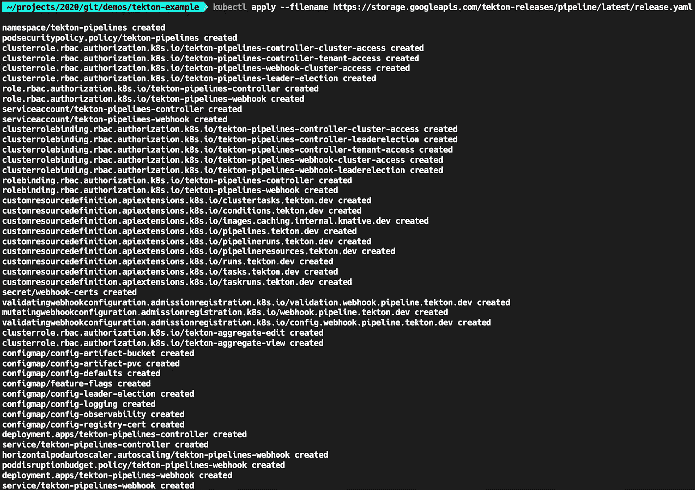

# OpenShift 和 Kubernetes 的快速 Tekton 指南

> 原文：<https://levelup.gitconnected.com/how-to-setup-a-tekton-ci-cd-environment-442dae6bd301>


*用示例代码在 OpenShift 4 或 Kubernetes 1.16+上用 Tekton (v0.19.0)创建云原生管道。*

[Tekton](https://github.com/tektoncd/pipeline) 是一个开源工具，它将 CI/CD 作业作为 Kubernetes 集群中的容器来运行。该工具可用于构建、测试、培训或部署您的程序。我使用 Tekton 取得了一些成功，但是没有找到太多的文档，所以我把这个例子[项目](https://github.com/tekton-example)放在一起，学习并帮助其他人测试这个令人兴奋的开源工具。本文将向您展示如何运行这个示例，并希望您熟悉这个工具是如何工作的。

*注意* : Tekton 处于测试阶段。有关 Tekton 的最新指南，请参见 Tekton [文档](https://github.com/tektoncd/pipeline/tree/main/docs)。

# 概观

Tekton 通过创建 Kubernetes 自定义资源定义来工作。这些资源对象用于管理代码的生命周期。示例代码是一个存储在 git 中的二进制应用程序，它构建在一个映像中，并作为一个容器部署在 Kubernetes 集群中。

这主要包括三个目录:

*资源/*
*任务/*
*管道/*

有一个 java 库、[common-Java-dependencies](https://github.com/tekton-example/common-java-dependencies)和 [java-app-example](https://github.com/tekton-example/java-app-example) 二进制的存储库。在 [k8s/](https://github.com/tekton-example/java-app-example/tree/main/k8s) 下，二进制文件有一个 http 端点，定义为在网络上公开应用程序。

这个例子可以扩展到[蓝绿色部署](https://en.wikipedia.org/wiki/Blue-green_deployment)，或者与 [ArgoCD](https://argo-cd.readthedocs.io/en/stable/core_concepts/) 一起使用。请随意解构这些构件，并将其用于其他编程语言。

管道执行以下步骤:

1.  **构建二进制**应用的依赖[库](https://github.com/tekton-example/common-java-dependencies)，然后构建二进制
2.  **使用[docker 文件](https://github.com/tekton-example/java-app-example/blob/main/src/main/docker/Dockerfile.jvm)创建一个** **容器图像**
3.  **将映像**推送到私有映像注册表( [DockerHub](https://hub.docker.com/) )
4.  **使用 Tekton 资源文件部署并公开二进制文件**

更具体地说，这包括以下步骤:

1.  安装 git
2.  安装 Maven
3.  克隆库
4.  构建库 jar
5.  克隆二进制文件
6.  构建并打包二进制 jar
7.  创建二进制文件的容器映像
8.  用 skopeo 推动形象
9.  创建资源文件*或*发布新版本的二进制文件

—

与其他 CI/CD 工具相比，Tekton 很有趣，因为它可以共享 Kubernetes 环境中使用的相同机器。在示例源代码中，我将其简化为一个步骤，即创建 PipelineRun 资源。如果你愿意，你也可以用一个[触发器](https://tekton.dev/docs/triggers/)来自动操作。

# 使用 Tekton

下面是让它在您自己的环境中工作所需的内容。

## 安装 Tekton

您可以使用[操作器](https://operatorhub.io/operator/tektoncd-operator)安装 Tekton。在撰写本文时，它使用了一个旧的测试版本(0.15.2 对 0.19.0)，但它也安装了 [Tekton 仪表板](https://github.com/tektoncd/dashboard)。

我建议遵循以下官方步骤:

1.  [TektonCD 安装](https://github.com/tektoncd/pipeline/blob/master/docs/install.md)或 [TektonCD 入门](https://tekton.dev/docs/getting-started/)
2.  [TektonCD CLI 安装](https://github.com/tektoncd/cli)



Easy OpenShift TektonCD 安装示例

这在 *tekton-pipelines* 名称空间中为 Tekton 创建了所有必要的资源。最值得注意的是，我们看到了管道、管道运行、任务等的 CRD。您不需要 CLI 工具，但建议您使用。

## 鉴定

1.  如果您没有使用 operator install，请使用 kubectl 创建一个带有`cluster-admin`的[服务帐户](https://kubernetes.io/docs/tasks/configure-pod-container/configure-service-account/)，或者将 Tekton 分配给一个现有的 SA。

```
kubectl create configmap config-defaults \
--from-literal=default-service-account=pipelineSA \
-o yaml -n tekton-pipelines \
--dry-run=client  | kubectl replace -f -kubectl create clusterrolebinding pipeline --clusterrole=cluster-admin --serviceaccount=my_other_namespace:pipelineSA
```

2.创建图像注册表机密。把它和服务协议联系起来。

```
kubectl create secret docker-registry my-docker-registry-secret \
 — docker-server=docker.io \
 — docker-username=<username> \
 — docker-password=<api_token> \
 — docker-email=<email>kubectl secrets link pipeline my-docker-registry-secret
```

如果您需要它来提取依赖项，您还需要添加以下内容:

`kubectl secrets link pipeline srd-docker-registry --for=pull`

对于 git，Tekton 想要一个关于这个秘密的特定注释，如下所示

GitHub 认证的密码

`kubectl create -f gitsecret.yaml
kubectl secrets link pipeline gitsecret`

## 创建管道存储

管道需要一个地方来克隆源代码和共享缓存的构建工件。为此，Tekton 提供了一个名为 Workspaces 的测试功能，可以跨任务挂载和共享卷。

下面是创建 5Gi PersistentVolumeClaim 的 yaml:

管道共享缓存的 PersistentVolumeClaim

`kubectl create -f pipeline-pvc.yaml`

这通过工作区安装到管道，并作为管道的参数给出。通过创建 PipelineRun 对象，可以方便地提供管道的参数。例如，此部分将包含在 PipelineRun yaml:

```
workspaces:
- name: source
    persistentVolumeClaim:
      claimName: pipeline-pvc
```

—

或者，您可能会发现在每次管道执行时生成一个新的 PVC 比使用相同的 PVC 进行缓存更好。如果您想采用这种方法，可以在 PipelineRun 中这样定义它:

```
workspaces:
  - name: source
    volumeClaimTemplate:
      spec:
        resources:
          requests:
            storage: 5Gi
        volumeMode: Filesystem
        accessModes:
          - ReadWriteOnce
```

欲了解更多信息，请查看此有用的[文档](https://github.com/tektoncd/pipeline/blob/master/docs/auth.md)。

## 配置 Tekton 任务

最后，配置`tasks/`资源对象以满足您的需求。您可以从`git-clone`任务开始，它只需要源代码的 URL 作为它的参数，即`[https://github.com/tekton-example/java-app-example.git](https://github.com/tekton-example/java-app-example.git)`。完成后，用`kubectl create -f tasks/`创建它们。

示例项目中提供的一些其他任务包括:

`maven-build` —生成 settings.xml 文件或使用现有文件。它是 git 存储库安装到 Tekton 工作区的源参数。
`build-maven-image` —构建、容器化和推送 java 映像。
`apply-manifests` —创建 OpenShift 资源，以使用来自映像注册表的最新映像来部署和/或更新 java 应用程序。

测试任务的一种方法是使用 tekton CLI，如下所示:

```
tkn task start git-clone --param url=[https://github.com/tekton-example/java-app-example.git](https://github.com/tekton-example/java-app-example.git) --param revision=main --param subdirectory=application-source --workspace name=output,claimName=pipeline-pvc --showlog
```

任务完成后，您就可以创建管道并使用 PipelineRun 对象触发它了:

`kubectl create -f java-app-example-pipelinerun.yaml`

使用 Tekton CLI 监控管道进度也很方便:

`tkn pr logs -Lf`

查看 [Tekton 目录](https://hub.tekton.dev/)了解更多创意。

*在* [*LinkedIn*](https://www.linkedin.com/in/steele-desmond/) *上跟我连线。
感谢阅读。*