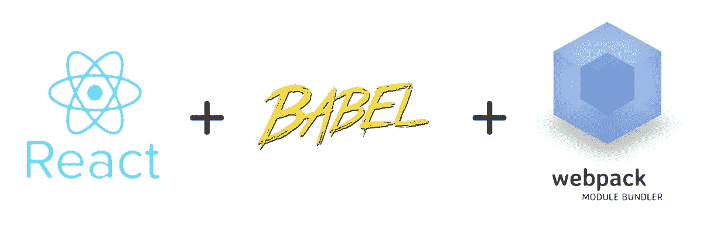
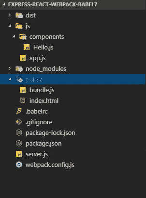
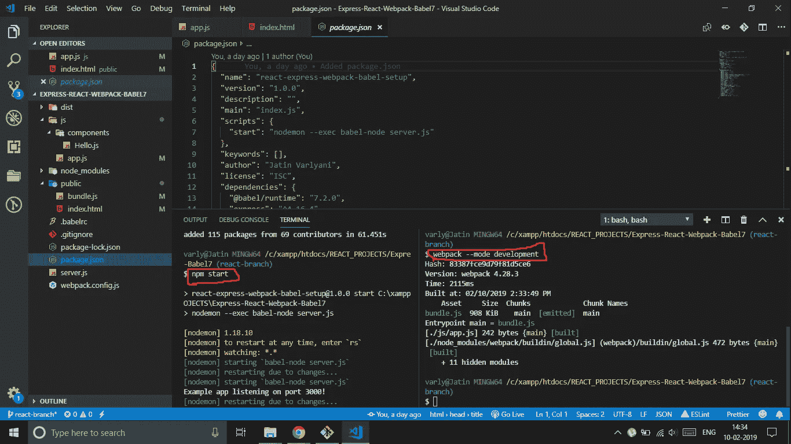
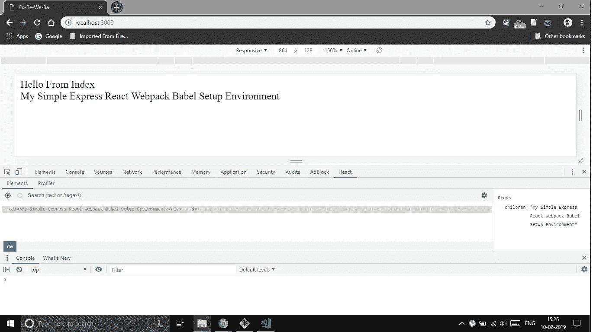

# 如何使用 React Webpack Express Babel 设置环境

> 原文：<https://levelup.gitconnected.com/how-to-setup-environment-using-react-webpack-express-babel-d5f1b572b678>



# **设置项目结构**

键入以下命令:

```
mkdir express-react-webpack-babel
cd express-react-webpack-babelnpm  init -y
```

最后一个命令在您的文件夹中初始化`package.json`，我们将使用它来安装必要的依赖项。通过使用我指定的相同版本的包，你将 100%保证你会得到和我在这个项目中一样的结果。

# 安装快速

Express 是一个 ***最小且灵活的*** Node.js web 应用程序框架，为 web 和移动应用程序提供了一组健壮的特性。它是 Node.js 事实上的标准服务器框架。

```
npm install --save express@4.16.4
```

安装 ExpressJS 后，使用命令创建一个名为`server.js`的 JS 文件

```
touch server.js
```

并添加以下几行:

```
const express = require("express")let  app = express()*app.get('/', (req, res) => res.send("HELLO FROM EXPRESS"));*app.use(express.static('public'))app.listen(3000,  () => console.log("Example app listening on port 3000!"));
```

通过这几行代码，您可以在终端中使用该命令运行服务器。

```
node server.js
```

*您将看到服务器正在监听端口 3000。*

现在，让我们先在根目录&中创建一个`public` 目录，在其中创建一个`index.html`

```
mkdir public
cd public
touch index.html
```



创建的文件应该有以下内容:`public/index.html`

```
<!DOCTYPE html>
<html>
  <head>
    <title>Express React Webpack Babel Setup</title>
  </head>
  <body>
     Hello From Index
    <div id="app"></div>
    <script src="./bundle.js"></script>
  </body>
</html>
```

关于内容的两个重要事实:

*   `bundle.js`文件将是 Webpack 生成的文件
*   div ***id=app*** 属性将帮助我们的根 React 组件找到它的入口点

因此，我们接下来可能采取的步骤是:

*   设置 Webpack 将我们的源文件打包成一个文件`bundle.js`
*   构建我们的第一个 React 根组件，它使用入口点 ***id=app***

# 安装 Webpack

Webpack 是一个让你编译 JavaScript 模块的工具。又称为 ***模块捆扎机*** 。理解这一点很重要，因为 Webpack 不是在您的页面中运行，而是在您的开发过程中运行。

```
npm install --save-dev  
webpack@4.28.3 
webpack-dev-server@3.1.14
webpack-cli@3.1.2
```

让我们在根目录下创建***web pack . config . js***文件。

```
touch webpack.config.js
```

并提供如下内容:

```
module.exports = {
  entry: './js/app.js',
  output: {
    path: path.join(__dirname, 'public'),
    publicPath: '/',
    filename: 'bundle.js',
  },
  devServer: {
    contentBase: './dist',
  },
};
```

我们的项目中缺少的是`js/app.js` 文件。

```
mkdir js
cd js
touch app.js
```

在 ***js/app.js*** 中添加下面一行进行测试

```
console.log('My Express React Webpack Babel Setup');
```

# 巴别塔设置

Babel 是一个 JavaScript***trans piler***将 ES6 JavaScript 转换成普通的旧版本 ES5 JavaScript，可以在任何浏览器(甚至是旧版本的浏览器)上运行。

它使新的 ES6 规范中添加到 JavaScript 的所有语法糖都可用，包括类、粗箭头和多行字符串

```
npm install --save-dev 
babel/core@7.2.2
babel/node@7.0.0
babel/cli@7.0.0
babel/preset-react@7.0.0
babel/preset-env@7.2.3
babel/babel-loader@8.0.4
```

现在 webpack 配置需要更改，所以在其中添加以下代码。

现在让我们创建一个`.babelrc`文件:

```
touch .babelrc
```

在其中添加预设

```
{
  "presets": [
    "@babel/preset-env", "@babel/react"
  ]
}
```

# 反应设置

ReactJS 是一个开源的 JavaScript 库，专门用于构建单页面应用程序的用户界面。它用于处理 web 和移动应用程序的 ***视图*** 层。React 还允许我们创建 ***可重用的 UI 组件***

```
npm install --save
react@16.8.1
react-dom@16.8.1
```

在您的`js/app.js`中，您可以删除 console.log 并实现您的 React 代码。

```
import React from 'react';
import ReactDOM from 'react-dom';const title = 'My Simple Express React Webpack Babel Setup Environment';ReactDOM.render(
  <div>{title}</div>,
  document.getElementById('app')
);
```

# 安装 Nodemon

这是一个帮助开发基于 Node.js 的应用程序的工具，当检测到目录中的文件更改时，它会自动 ***重新启动*** 节点应用程序。

```
npm install --save-dev nodemon
```

在 package.json 的 ***启动脚本*** 中添加以下几行代码

```
start: "nodemon --exec babel-node server.js"
```

***最终的 package.json*** 应该是这样的。我的有点不同，因为我安装了一些额外的依赖项。

现在在一个终端运行`webpack` ，在另一个终端运行`npm start` 。



`webpack --mode development`将在公共目录中生成一个`bundle.js`，其中包含我们的应用程序所需的所有捆绑包。

当你去 [http://localhost:3000](http://localhost:3000) 的时候，你应该会看到这样的东西



# 恭喜🎉🎉

现在您已经设置好了开发环境，所以继续享受吧！

如果你真的喜欢这篇文章，请给这篇文章一个掌声👏 👏👏

请随时联系我的 LinkedIn 账户:[https://linkedin.com/in/jatin-varlyani-127290150](https://linkedin.com/in/jatin-varlyani-127290150/)

您也可以在 GitHub ✌️上派生或克隆这个库

[](https://github.com/Jatin-8898/express-react-webpack-babel-setup) [## jatin-8898/express-react-webpack-babel-setup

### 使用 Express、React、Webpack 和 Babel 7 快速设置环境的简单入门模板。:tada: …

github.com](https://github.com/Jatin-8898/express-react-webpack-babel-setup) [](https://levelup.gitconnected.com)[](https://gitconnected.com/learn/express-js) [## 学习快递-最佳快递教程(2019) | gitconnected

### 6 大速成教程-免费学习速成。课程由开发人员提交并投票，使您能够…

gitconnected.com](https://gitconnected.com/learn/express-js) [](https://gitconnected.com/learn/react) [## 学习 React -最佳 React 教程(2019) | gitconnected

### 排名前 49 的 React 教程-免费学习 React。课程由开发人员提交并投票，使您能够…

gitconnected.com](https://gitconnected.com/learn/react)