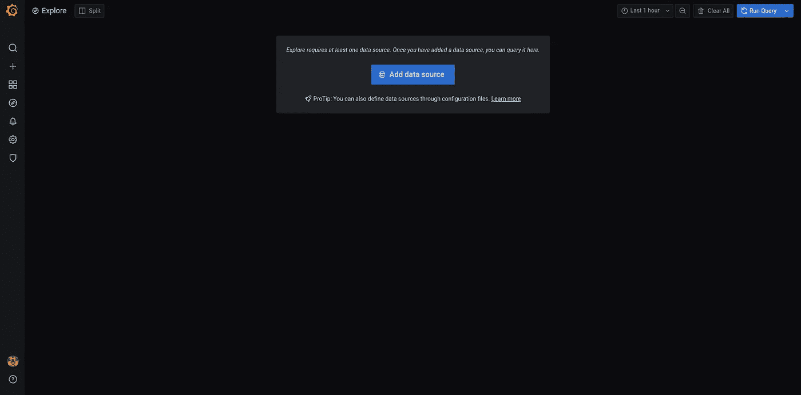
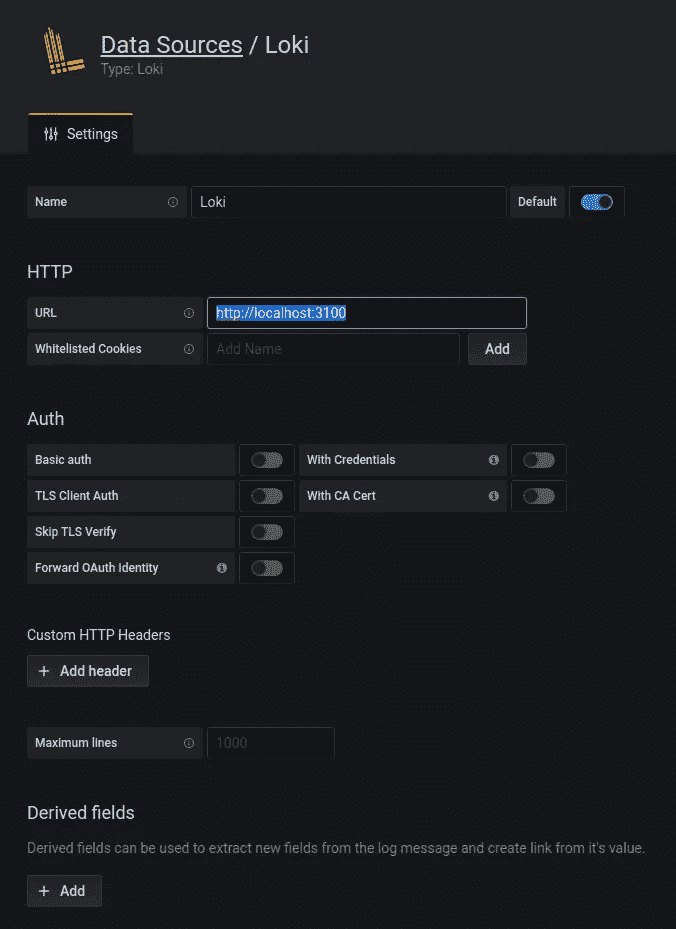
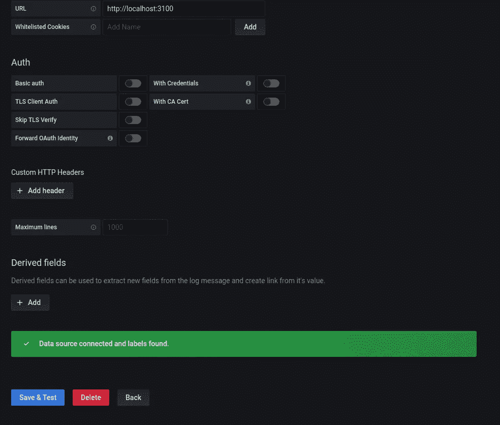
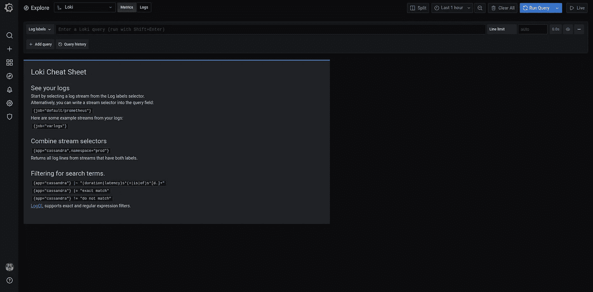
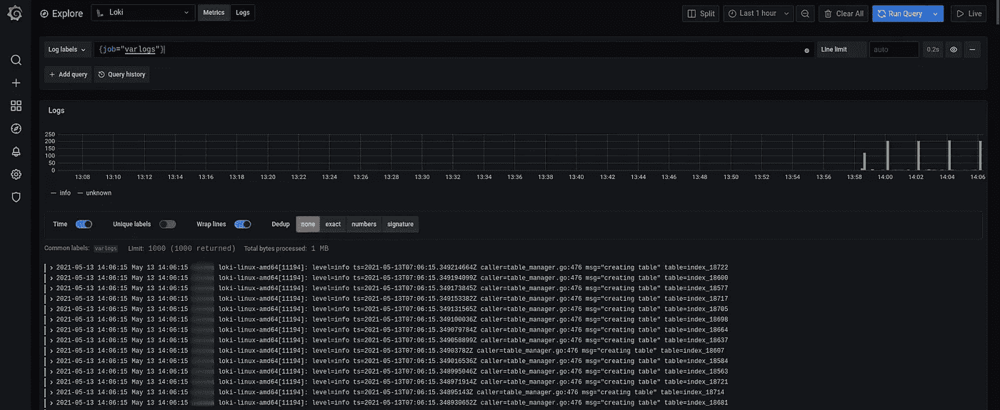

# 如何设置免费日志管理的 Grafana Loki

> 原文：<https://levelup.gitconnected.com/how-to-setup-grafana-loki-for-free-log-management-ceb60558503c>

使用开源解决方案设置日志管理。


格拉法纳·洛基

# 为什么我们需要日志管理？

假设您在专用服务器上运行您的应用程序。然后你的应用程序出现了一个错误，你需要调试它，你首先要做的很可能是查看日志文件，你将寻找应用程序堆栈跟踪。如果您的应用程序没有太多流量，那么将应用程序写入日志文件并使用 cat、tail 和 grep 就足以找到关于该错误的特定日志。

但是当日志分散在几个文件中时会发生什么呢？假设您已经设置了一个日志循环，每隔几个小时或达到某个文件大小时循环一次日志。同一个堆栈跟踪可以分成几个文件，在几个日志文件中查找堆栈跟踪是一个非常耗时的过程。更重要的是，现在微服务模式是一种趋势，每个服务都将日志写入自己的日志文件。在服务日志文件中查找错误是一件非常麻烦的事情。

日志管理为我们提供了一个界面，可以在多个日志文件中查找相同的跟踪，因为日志只写在一个文件中。

# 为什么是格拉夫纳·洛基？

存在几种日志管理解决方案。他们中的大多数都有免费的付费模式，但只有一定的限制，从 100 MB 到 100 GB。Grafana Loki 是一个开源解决方案。因此，它是免费的，没有任何限制。

另一个流行的开源解决方案是 ELK (Elasticsearch、Logstash 和 Kibana) stack。为了运行它，我们需要 JVM，这不可避免地需要大量的资源来运行。在 Elastic 文档中，它说内存小于 8 GB 的机器往往会适得其反。

另一方面，Grafana Loki 可以在相对较小的服务器上流畅运行。我已经在我的业余爱好机器上运行 Grafana Loki 两年多了，它只有 2 个内核和 2 GB 内存，没有任何问题。

# 先决条件

运行 Linux 版本≥18.04 的 Ubuntu 服务器。

# 步伐

1.下载配置文件。

```
$ sudo mkdir /opt/loki
$ cd /opt/loki$ wget https://raw.githubusercontent.com/grafana/loki/master/cmd/loki/loki-local-config.yaml$ wget https://raw.githubusercontent.com/grafana/loki/main/clients/cmd/promtail/promtail-local-config.yaml
```

> 记得修改***prom tail-local-config . YAML***日志文件路径指向你的应用日志。

如果无法下载配置文件，请使用下面的配置手动创建它们。

***prom tail-local-config . YAML***

```
server: 
  http_listen_port: 9080 
  grpc_listen_port: 0 

positions: 
  filename: /tmp/positions.yaml 

clients: 
  - url: [http://localhost:3100/loki/api/v1/push](http://localhost:3100/loki/api/v1/push) 

scrape_configs: 
- job_name: system 
  static_configs: 
  - targets: 
      - localhost 
    labels: 
      job: varlogs 
      __path__: /var/log/*log # modify to point at your application log file
```

**Loki-local-config . YAML**

```
auth_enabled: false 

server: 
  http_listen_port: 3100 
  grpc_listen_port: 9096 

ingester: 
  wal: 
    enabled: true 
    dir: /tmp/wal 
  lifecycler: 
    address: 127.0.0.1 
    ring: 
      kvstore: 
        store: inmemory 
      replication_factor: 1 
    final_sleep: 0s 
  chunk_idle_period: 1h       # Any chunk not receiving new logs in this time will be flushed 
  max_chunk_age: 1h           # All chunks will be flushed when they hit this age, default is 1h 
  chunk_target_size: 1048576  # Loki will attempt to build chunks up to 1.5MB, flushing first if chunk_idle_period or max_chunk_age is
 reached first 
  chunk_retain_period: 30s    # Must be greater than index read cache TTL if using an index cache (Default index read cache TTL is 5m) 
  max_transfer_retries: 0     # Chunk transfers disabled 

schema_config: 
  configs: 
    - from: 2020-10-24 
      store: boltdb-shipper 
      object_store: filesystem 
      schema: v11 
      index: 
        prefix: index_ 
        period: 24h 

storage_config: 
  boltdb_shipper: 
    active_index_directory: /tmp/loki/boltdb-shipper-active 
    cache_location: /tmp/loki/boltdb-shipper-cache 
    cache_ttl: 24h         # Can be increased for faster performance over longer query periods, uses more disk space 
    shared_store: filesystem 
  filesystem: 
    directory: /tmp/loki/chunks 

compactor: 
  working_directory: /tmp/loki/boltdb-shipper-compactor 
  shared_store: filesystem 

limits_config: 
  reject_old_samples: true 
  reject_old_samples_max_age: 168h 

chunk_store_config: 
  max_look_back_period: 0s 

table_manager: 
  retention_deletes_enabled: false 
  retention_period: 0s 

ruler: 
  storage: 
    type: local 
    local: 
      directory: /tmp/loki/rules 
  rule_path: /tmp/loki/rules-temp 
  alertmanager_url: http://localhost:9093 
  ring: 
    kvstore: 
      store: inmemory 
  enable_api: true
```

3.下载 Grafana Loki 和 Promtail。

```
$ wget [https://github.com/grafana/loki/releases/download/v2.2.1/loki-linux-amd64.zip](https://github.com/grafana/loki/releases/download/v2.2.1/loki-linux-amd64.zip)$ sudo unzip loki-linux-amd64.zip$ wget [https://github.com/grafana/loki/releases/download/v2.2.1/promtail-linux-amd64.zip](https://github.com/grafana/loki/releases/download/v2.2.1/promtail-linux-amd64.zip)$ sudo unzip promtail-linux-amd64.zip
```

4.确保二进制文件和配置存在。

```
$ ls**Output**:
root@arwego:/opt/loki# ls -l 
total 153964 
-rwxr-xr-x 1 root root 53501952 Apr  6 07:55 **loki-linux-amd64** 
-rw-r--r-- 1 root root 17277632 Apr  6 07:58 **loki-linux-amd64.zip** 
-rw-r--r-- 1 root root     1832 May 13 13:18 loki-local-config.yaml 
-rwxr-xr-x 1 root root 67333584 Apr  6 07:57 **promtail-linux-amd64** 
-rw-r--r-- 1 root root 19522160 Apr  6 07:58 **promtail-linux-amd64.zip** 
-rw-r--r-- 1 root root      303 May 13 13:18 promtail-local-config.yaml
```

4.为 Promtail 设置 systemd。

```
$ sudo cat *<<***EOF >**/etc/systemd/system/promtail.service
[Unit] 
Description=Promtail service 
After=network.target 

[Service] 
Type=simple 
#User=promtail 
ExecStart=/opt/loki/promtail-linux-amd64 -config.file /opt/loki/promtail-local-config.yaml 
Restart=always 

[Install] 
WantedBy=multi-user.target**EOF**$ sudo systemctl start promtail.service
$ sudo systemctl enable promtail.service
```

5.为 Loki 设置 systemd。

```
$ sudo cat *<<***EOF >**/etc/systemd/system/loki.service
[Unit] 
Description=Loki service 
After=network.target 

[Service] 
Type=simple 
#User=loki 
ExecStart=/opt/loki/loki-linux-amd64 -config.file /opt/loki/loki-local-config.yaml 
Restart=always 

[Install] 
WantedBy=multi-user.target**EOF**$ sudo systemctl start loki.service
$ sudo systemctl enable loki.service
```

6.确保两项服务都已启动并运行。

```
$ sudo systemctl status promtail**Output:
●** promtail.service - Promtail service 
     Loaded: loaded (/etc/systemd/system/promtail.service; enabled; vendor preset: enabled) 
     Active: **active (running)** since Thu 2021-05-13 13:34:38 WIB; 1min 10s ago 
   Main PID: 11234 (promtail-linux-) 
      Tasks: 11 (limit: 19006) 
     Memory: 36.3M 
     CGroup: /system.slice/promtail.service 
             └─11234 /opt/loki/promtail-linux-amd64 -config.file /opt/loki/promtail-local-config.yaml$ sudo systemctl status loki**Output**:
**●** loki.service - Loki service 
     Loaded: loaded (/etc/systemd/system/loki.service; enabled; vendor preset: enabled) 
     Active: **active (running)** since Thu 2021-05-13 13:34:15 WIB; 2min 43s ago 
   Main PID: 11194 (loki-linux-amd6) 
      Tasks: 9 (limit: 19006) 
     Memory: 66.0M 
     CGroup: /system.slice/loki.service 
             └─11194 /opt/loki/loki-linux-amd64 -config.file /opt/loki/loki-local-config.yaml$ curl [http://localhost:3100/metrics](http://localhost:3100/metrics)**Output**:
# HELP cortex_cache_corrupt_chunks_total Total count of corrupt chunks found in cache. 
# TYPE cortex_cache_corrupt_chunks_total counter 
cortex_cache_corrupt_chunks_total 0 
# HELP cortex_chunk_store_chunks_per_query Distribution of #chunks per query. 
# TYPE cortex_chunk_store_chunks_per_query histogram 
cortex_chunk_store_chunks_per_query_bucket{le="10"} 0 
cortex_chunk_store_chunks_per_query_bucket{le="80"} 0
...
```

7.安装 Grafana。

```
$ sudo apt-get install -y apt-transport-https
$ sudo apt-get install -y software-properties-common wget$ wget -q -O - https://packages.grafana.com/gpg.key | sudo apt-key add -$ echo "deb https://packages.grafana.com/enterprise/deb stable main" | sudo tee -a /etc/apt/sources.list.d/grafana.list$ sudo apt-get update
$ sudo apt-get install grafana$ sudo systemctl daemon-reload
$ sudo systemctl start grafana-server
$ sudo systemctl enable grafana-server 
```

8.确保 Grafana 已启动并运行。

```
$ sudo systemctl status grafana-server**Output:**
**●** grafana-server.service - Grafana instance 
     Loaded: loaded (/lib/systemd/system/grafana-server.service; enabled; vendor preset: enabled) 
     Active: **active (running)** since Thu 2021-05-13 13:58:26 WIB; 1min 27s ago 
       Docs: http://docs.grafana.org 
   Main PID: 16311 (grafana-server) 
      Tasks: 10 (limit: 19006) 
     Memory: 17.0M 
     CGroup: /system.slice/grafana-server.service$ curl [http://localhost:3000](http://localhost:3100/metrics)**Output**:
<a href="/login">Found</a>.
```

8.到你的浏览器打开[http://localhost:3000/log in](http://localhost:3000/login)。


9.使用默认凭据登录:

```
username: admin
password: admin
```

10.创建新密码。

11.转到[http://localhost:3000/explore](http://localhost:3000/explore)并添加一个新的数据源。



12.添加 Loki 数据源。


13.在 HTTP URL 字段中输入 [http://localhost:3100](http://localhost:3100) 。



14.单击保存并测试。您应该看到一个绿色的弹出窗口，提示数据源已连接，标签已找到。



15.再次前往[http://localhost:3000/explore](http://localhost:3000/explore)。您的 Loki 数据源现在应该会显示出来。



16.在查询字段中输入 ***{job="varlogs"}*** ，并通过键入 CTRL + Enter 或右上角的蓝色按钮来运行它。您应该看到显示了一些日志。



瞧，我们完成了。我们已经成功地为日志管理设置了 Grafana Loki。

# 解决纷争

## 冲突端口

最常见的问题是端口冲突。Grafana 运行在 3000 端口，Loki 运行在 3100 端口，Promtail 运行在 9080 端口。确保这些端口没有被其他服务占用。如果它被占用，您需要将配置更改为可用端口，并重新启动服务。

## 缺失日志

最常见的问题是您忘记更新***prom tail-local-config . YAML***文件路径以指向您的应用程序日志。另一个常见的问题是，您的应用程序实际上没有向日志文件中写入任何日志。

## 理解查询语法

它使用的是 Grafana LogQL。你可以在这里了解更多。

# 参考

*   **格拉夫纳·洛基**:[https://grafana.com/docs/loki/latest/](https://grafana.com/docs/loki/latest/)
*   https://grafana.com/docs/loki/latest/logql/
*   **ELK 的硬件规格:**[https://www . elastic . co/guide/en/elastic search/guide/current/Hardware . html](https://www.elastic.co/guide/en/elasticsearch/guide/current/hardware.html)