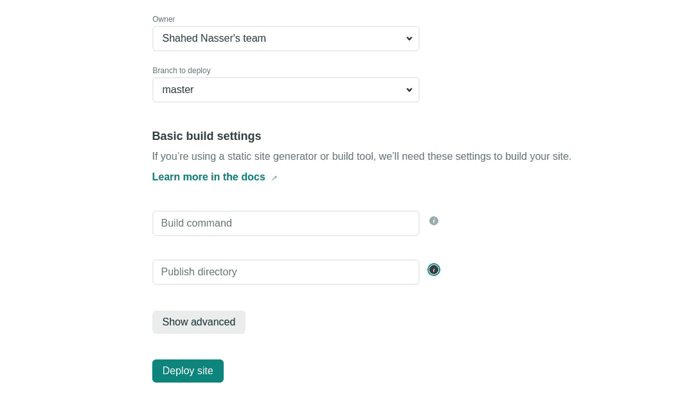
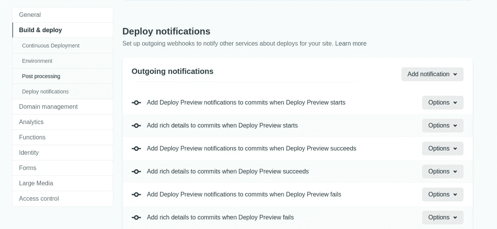

# 如何使用 Netlify 在 GitHub Repo 上设置 PRs 预览

> 原文：<https://levelup.gitconnected.com/how-to-setup-previews-for-prs-on-your-github-repo-using-netlify-105c80574875>

*你也可以在我的个人博客* [*这里*](https://shahednasserblog.tk/how-to-setup-previews-for-prs-on-your-github-repo/) *查看这篇帖子。*

对于维护人员来说，设置和检查在他们的存储库上创建的每个 pull 请求是一件很麻烦的事情，尤其是当存储库变得流行或者在 Hacktoberfest 期间。

Netlify 帮助您免费为您的知识库中收到的每个 PR 生成预览，设置非常简单！

# 创建一个网络账户

前往 [Netlify](https://app.netlify.com/signup?_ga=2.186805096.1187265105.1606308521-719326085.1601620184) 创建账户。你可以选择注册 GitHub、GitLab、Bitbucket 或者 email。选择注册 GitHub 是最快的方法，因为你可以直接让它访问你的库。

# 创建新网站

创建帐户后，系统会提示您创建新站点。您首先需要选择您正在使用的 Git 提供者。在我们的例子中，它是 GitHub。

将会打开一个新窗口，要求您授权 Netlify 访问您的 GitHub 存储库。

下一步是选择要显示预览的存储库。您将获得一个可供选择的存储库列表。

在您选择了您的存储库之后，您将被要求选择分支。

还会要求您添加一些构建设置:

1.  **构建命令:**在项目上运行以准备生产所必需的命令。如果您正在使用一些框架或开发依赖项，或者您的项目需要在准备公开发布之前做一些事情，您需要为它创建一个脚本并在此输入命令。例如，如果您正在使用 npm，并且您有一个构建脚本，那么您应该在这里输入`npm run build`
2.  **发布目录:**如果您的存储库有一个发布目录，如`build`、`public`或 static，那么应该在这里输入。否则，存储库的根将被发布用于生产。

如果出于配置目的需要添加一些环境变量，您可以单击“显示高级”，然后单击“新建变量”并开始添加变量及其值。

完成后，单击部署站点。您将被重定向到您的站点的新仪表板，显示有关当前部署的详细信息以及其他信息。

您会注意到，您的项目将被赋予一个随机的 URL 和名称。比如坚决-古德-351866。您可以更改域设置，并输入自定义域(如果有的话)。

# 为 PRs 生成构建预览

转到站点设置，从侧边栏中选择“构建和部署”。然后向下滚动到“部署通知”。

然后，点击“添加通知”下拉菜单，选择“GitHub Pull 请求注释”。将会打开一个新窗口，要求您选择应该添加评论的事件。选择“部署预览成功”。

接下来，您可以选择将要显示的评论。此评论将在自定义生成的 URL 旁边。输入一些评论，如“你的预览准备好了！”。

完成后，单击保存。

# 结论

完成上述步骤后，将为每个新的 PR 生成一个预览，您将在 PR 上看到一个带有 URL 的评论，您可以在那里查看预览。