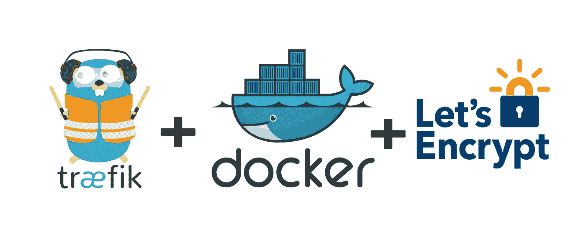

# 如何使用自动加密证书解析器设置 Traefik v2

> 原文：<https://levelup.gitconnected.com/how-to-setup-traefik-v2-with-automatic-lets-encrypt-certificate-resolver-83de0ed0f542>

## 你必须用 SSL 来保护你的网站！

## 今天，拥有 SSL 加密的网站非常重要。本指南将展示在 traefik 负载平衡器中内置一个自动 SSL 解析器是多么容易。



说明用于实现目标的组件

在我学会如何停靠后，我需要的下一件事是一个服务来帮助我组织我的网站。这就是为什么我了解到 [traefik](https://traefik.io/) 是一个:

> 运行良好的云原生网络堆栈

*traefik* 的一个重要特性是能够为由 *traefik* 管理的每个域自动创建[加密](https://letsencrypt.org/) SSL 证书。

然后我开始研究…


我坐在电脑前研究

我测试了几种配置，并在我的本地机器上创建了我自己的 *traefik* 实例，直到我想到了这个 docker-compose.yml:

这个文件包含**的几个重要章节:**

1.  两个入口点`web` ( ***线 8*** )和`websecure` ( ***线 9*** )，分别用于`http`和`https`
2.  启用 docker(***Line 10***)但默认不发布每个容器( ***Line 11*** )
3.  激活 API(使用标签中定义的 URL)(***第 12 行*** )
4.  证书处理。定义一个信息邮件( ***第 13 行*** )，设置一个存储`acme.json` ( ***第 14 行*** )，激活 TLS ( ***第 15 行*** )
5.  暴露端口为 HTTP ( ***第 17 行*** )和 HTTPS ( ***第 18 行*** )
6.  在 volumes 部分中，docker-socket 将被安装到`**traefik**` 容器中( ***第 20 行*** )，而`acme.json`将被安装到本地文件系统中( ***第 21 行*** )
7.  启用此服务的`traefik` (***第 23 行*** )。必须这样做，因为默认情况下没有服务被导出(*见第 11 行*)
8.  添加 dashboard 域( ***行 25*** )，定义一个服务( ***行 26*** )，激活 TLS ( ***行 27*** )，使用预先定义的证书解析器( ***行 28*** )，并设置`websecure`入口点( ***行 29*** )
9.  激活 *HTTP -基本认证* 中间件( ***第 30 行*** )，该中间件将在下一行被*创建*
10.  创建用*HTTP-Basic Auth***(***Line 31***)加密的`**traefik**` 仪表板**
11.  **全局重定向到 HTTPS 被定义和激活的中间件( ***第 32 - 37 行*** )**
12.  **为了测试，我定义了另一个服务`**whoami**`，只是为了显示一些数据并测试 **SSL 证书**的创建( ***第 41 行-第 55 行*** )**

****在**运行 docker-compose.yml 之前，必须创建一个网络**！这是必要的，因为在文件**中使用了外部网络(第 56-58 行)**。这很重要，因为外部网络`traefik-public`将在不同的服务之间使用。****

****外部网络是通过以下方式创建的:****

```
**docker create network traefik-public**
```

****最后一步是导出所需的变量并运行`docker-compose.yml`:****

```
**export PRIMARY_DOMAIN=yourdomain.de
export TRAEFIK_SSLEMAIL=youremai@yourdomain.de

docker-compose up -d**
```

****上面的命令现在将创建两个新的子域(https://dashboard . your domain . de 和[https://whoami . your domain . de)](https://whoami.yourdomain.de))，它也使用由 Let's Encrypt 提供的 **SSL** 证书****

************

******伊登·康斯坦丁诺在 [Unsplash](https://unsplash.com?utm_source=medium&utm_medium=referral) 上拍摄的照片******

# ******结束语******

******我希望这篇文章给了你一个如何设置 traefik 的快速简洁的概述******

******代码方面可以做很多改进。然而，就目前非常有限的功能而言，这已经足够了。它更多的是关于定制新的命令，但是总是关注最少的真实来源。******

******码头快乐！🥳 👨🏻‍💻******

# ******这篇博客到此结束。我很想听听你的想法和想法🤗请把它们记在下面👇👇👇******

# ******✍️作者******

# ******保罗·克努特******

******👨🏻‍💻🤓🏋️‍🏸🎾🚀******

******丈夫，两个孩子的父亲，极客，终身学习者，技术爱好者和软件工程师******

******本博客最初发布于[https://www . pauls blog . dev/how-to-setup-traefik-with-automatic-lets encrypt-certificate-resolver/](https://www.paulsblog.dev/how-to-setup-traefik-with-automatic-letsencrypt-certificate-resolver/)******

# ******打招呼🙌开启:******

******[Twitter](https://www.twitter.com/paulknulst) ， [LinkedIn](https://www.linkedin.com/in/paulknulst/) ， [GitHub](https://github.com/paulknulst) ，[个人网站](https://www.paulsblog.dev)******