# 如何使用 Python 和 Flask 为 Dash 应用程序设置用户认证

> 原文：<https://levelup.gitconnected.com/how-to-setup-user-authentication-for-dash-apps-using-python-and-flask-6c2e430cdb51>

## 创建用户帐户并保护对仪表板的访问


卢卡斯·布拉塞克在 [Unsplash](https://unsplash.com?utm_source=medium&utm_medium=referral) 上的照片

# 保护您的数据

不久前，有人宣称数据是数字经济中的新石油[ [1](https://www.wired.com/insights/2014/07/data-new-oil-digital-economy/) ]。自那次声明以来，理解网络安全和如何保护数据已经成为全球企业的头等大事。作为每天与敏感教育数据打交道的人，我亲身体会到保护记录的严重性。

在分析部门工作，我的一个常用仪表盘工具是 [Dash](https://plotly.com/dash/) by [Plotly](https://plotly.com/) 。Dash 是基于 Flask、Plotly.js 和 React.js 编写的 Python 框架。它将这些技术的复杂性抽象为易于应用的组件。任何有一点 Python 和 HTML 经验的人都会觉得 Dash 使他们能够毫不费力地创建强大的、交互式的基于 web 的仪表板。

> Dash & Plotly 每月被下载 400 万次，是世界生产 Python 分析的方式。—[p](http://plotly.com)lotly.com

**在本文中，我将介绍两种通过基于用户的认证来保护 Dash 应用的方法**:

1.  如何使用 [Dash-Auth](https://dash.plotly.com/authentication) (简单的例子)。
2.  如何使用[烧瓶-登录](https://flask-login.readthedocs.io/en/latest/)(高级示例)。

> 示例 2 的完整代码可以在文章的底部找到。

# 仪表板框架复习工具

在描述示例应用程序和起始代码时，我将非常简短地向您介绍 Dash 的核心概念。然而，如果你是 Dash 新手或者需要深入复习基础知识，可以从我的[*Dash*](https://medium.com/swlh/dashboards-in-python-for-beginners-and-everyone-else-using-dash-f0a045a86644)入门教程开始，或者查看我的网站[*pythondashboards.com*](http://pythondashboards.com)。

[](https://medium.com/swlh/dashboards-in-python-for-beginners-and-everyone-else-using-dash-f0a045a86644) [## Python 中的仪表盘，适用于初学者和使用 Dash 的其他人

### 使用 Python 中的 Dash 初学者教程构建一个基本的和高级的仪表板

medium.com](https://medium.com/swlh/dashboards-in-python-for-beginners-and-everyone-else-using-dash-f0a045a86644) 

在创建应用程序之前，从安装依赖项开始。

```
pip install dash
pip install dash-auth
```

因为本文的重点是保护仪表板，所以我将从一个简单的 Dash 应用程序示例开始，它由下拉列表和图表组成。接下来，我将添加身份验证。

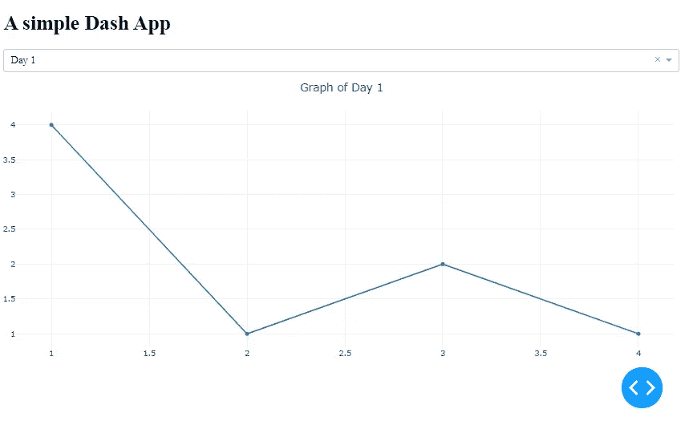

一个简单的 Dash 应用程序示例

如果你想要一个高级 Dash 应用程序的例子，[看看我用来主宰股票市场的仪表板](https://medium.com/swlh/how-to-create-a-dashboard-to-dominate-the-stock-market-using-python-and-dash-c35a12108c93)！

[](https://medium.com/swlh/how-to-create-a-dashboard-to-dominate-the-stock-market-using-python-and-dash-c35a12108c93) [## 如何使用 Python 和 Dash 创建控制股市的仪表板

### 自由期权订单流、价格、基本面、聊天集于一身

medium.com](https://medium.com/swlh/how-to-create-a-dashboard-to-dominate-the-stock-market-using-python-and-dash-c35a12108c93) 

# Dash 应用

Dash 应用由**布局**和**回调**组成:

## 布局

布局由一个组件树组成，描述了应用程序的外观以及用户如何体验内容。Dash 自带了几个组件库。

## 复试

[回调](https://dash.plot.ly/getting-started-part-2)使 Dash 应用程序具有交互性。回调是 Python 函数，每当*输入*属性改变时，就会自动调用。

# 仪表板应用程序启动代码

下面是认证演练的 Dash 应用程序启动代码。高级示例将使用相同的下拉菜单和图形功能，但明显增加了复杂性。

```
*#dependencies* 
import dash
import dash_core_components as dcc
import dash_html_components as html
import plotly*#instantiate Dash*
app = dash.Dash(__name__)*#Set the layout*
app.layout = html.Div([
    **html.H1**('A Simple Dash App')
    , **dcc.Dropdown**(
        id='dropdown'
        , options=[{'label': i, 'value': i} 
                for i in ['Day 1', 'Day 2']]
        , value='Day 1')
    , **dcc.Graph**(id='graph')
    ]) #end div*#set the callback for the dropdown interactivity*
[**@app**](http://twitter.com/app)**.callback**(
    dash.dependencies.Output('graph', 'figure')
    , [dash.dependencies.Input('dropdown', 'value')])
def update_graph(dropdown_value):
    if dropdown_value == 'Day 1':
        return {'layout': {'title': 'Graph of Day 1'}
                , 'data': [{'x': [1, 2, 3, 4]
                    , 'y': [4, 1, 2, 1]}]}
    else:
        return {'layout': {'title': 'Graph of Day 2'}
                ,'data': [{'x': [1, 2, 3, 4]
                    , 'y': [2, 3, 2, 4]}]}if __name__ == '__main__':
    app.run_server(debug=True)
```

请注意，应用程序布局由三个组件组成( [**html)。H1**](https://dash.plotly.com/dash-html-components/h1) ， [**dcc。下拉**](https://dash.plotly.com/dash-core-components/dropdown) ， [**dcc。Graph**](https://dash.plotly.com/dash-core-components/graph) )和一个回调来使它有点交互性。用户可以在下拉列表中的两个项目之间进行选择，图形会相应地更新。

当 app 在终端运行时，可以通过浏览器使用这个 URL 在本地访问: [http://127.0.0.1:8050/](http://127.0.0.1:8050/) 。如果它被托管在某个地方，任何人都可以访问它并查看图表。因为我只希望某些人访问仪表板，所以我将使用 **Dash-Auth** 来设置[基本 HTTP 认证](https://developer.mozilla.org/en-US/docs/Web/HTTP/Authentication)。

# 使用破折号验证的基本验证

使用 Dash-Auth 库很容易，但是它有一些限制。例如，使用基本身份验证，我必须在字典中硬编码用户名和密码，并将用户名/密码对发送给我希望访问应用程序的用户。用户不能创建自己的帐户或更改密码，也不能注销。在使用 Flask-Login 的高级示例中，我将让用户创建自己的用户名和密码！

**警告**:像对待 API 密钥一样对待用户名/密码对，把它们放在源代码库之外！[记得将文件添加到您的。gitignore](https://towardsdatascience.com/a-simple-git-workflow-for-github-beginners-and-everyone-else-87e39b50ee08) 。

## 文件结构

该应用程序使用两个文件。我将用户名/密码对作为文本存储在 python 文件中，与应用程序代码分开。在高级示例中，我将使用 SQLite 数据库来存储用户数据。

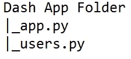

文件结构

## 文件用户. py

文件 **users.py** 包含用户名/密码字典。如果我需要让三个人访问 Dash 应用程序，我需要创建三个用户名/密码对，如下所示:

```
***#user dictionary***
USERNAME_PASSWORD_PAIRS = {
     'user1': 'test1'
    , 'user2': 'test2'
    , 'user3': 'test3'
}
```

## 文件 app.py

文件 **app.py** 包含 Dash 应用程序的代码。对于依赖项，从 **users.py** 文件导入 ***dash_auth*** 库和用户字典。

```
***#import dash-auth and users dictionary***
import dash_auth
from users import USERNAME_PASSWORD_PAIRS
```

接下来，在 app.py 文件中实例化应用程序后，添加这一小段样板代码:

```
auth = dash_auth.BasicAuth(app, USERNAME_PASSWORD_PAIRS)
```

它应该是这样的:

```
***#import dependencies***
import dash_auth
from users import USERNAME_PASSWORD_PAIRS***#instantiate Dash***
app = dash.Dash(__name__)
auth = dash_auth.BasicAuth(
    app,
    USERNAME_PASSWORD_PAIRS
)### layout and callbacks ###
...
```

就是这样！现在已经设置了基本身份验证。打开 Dash 应用程序时，会提示用户输入用户名和密码。

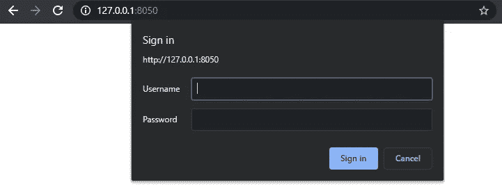

Dash 认证提示

从 **users.py** 文件中输入一个用户/密码组合来访问仪表板。

在幕后，HTTP 身份验证框架正在挑战客户机请求，迫使它提供身份验证信息。该过程开始于服务器以未授权的响应状态响应客户端(401)。想要向服务器进行身份验证的客户端必须包含带有凭据的授权请求标头。

**注意**，交换 ***必须*** 发生在 HTTPS (TLS)连接上才安全。该流程由 [RFC 7235](https://tools.ietf.org/html/rfc7235) 定义。

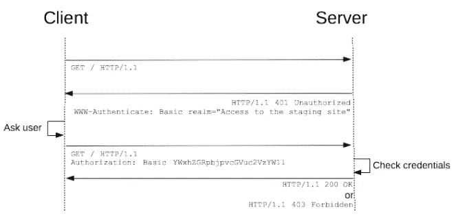

通用 HTTP 认证框架(Mozilla Contributors)[https://developer . Mozilla . org/en-US/docs/Web/HTTP/authentic ation](https://developer.mozilla.org/en-US/docs/Web/HTTP/Authentication)

# 使用 Flask-Login 的高级身份验证

**Dash-Auth** 库为用户访问仪表板提供了一种简单的方法，但是在会话管理方面提供的很少。对于更健壮的认证解决方案，我推荐使用 [Flask-Login 库](https://flask-login.readthedocs.io/en/latest/)。它将活动用户的 ID 存储在会话中，允许他们登录和注销，同时保护用户的会话不被 cookie 窃贼窃取。根据文件:

> 它处理登录、注销和长时间记住用户会话的常见任务。

虽然 Flask-Login 功能强大，但也有一些限制。它没有固有的方法来注册用户或恢复帐户。我将解释如何创建这些函数。此外，该库只处理登录或注销，不处理其他权限。

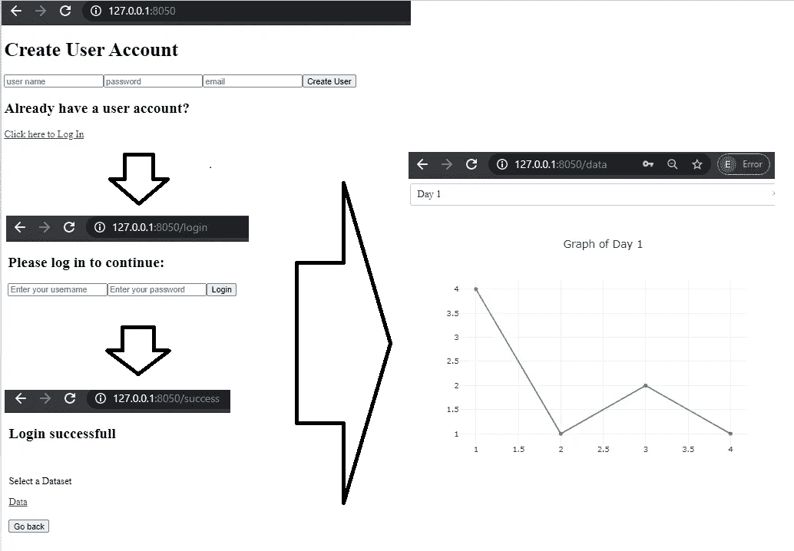

通过 Dash 应用程序进行身份验证的工作流程

# 属国

这个高级示例使用了几个强大的 Python 库。深入解释它们超出了本教程的范围，但是我会尽最大努力从高层次解释每个组件。

使用 **pip** 安装这些必要的库: *sqlalchemy、flask-sqlalchemy、flask-login、werkzeug 和 configparser。*

```
***#import dependencies******#manage database and users*** import sqlite3
from sqlalchemy import Table, create_engine
from sqlalchemy.sql import select
from flask_sqlalchemy import SQLAlchemy
from flask_login import login_user, logout_user, current_user, LoginManager, UserMixin***#manage password hashing***
from werkzeug.security import generate_password_hash, check_password_hash***#use to config server***
import warnings
import configparser
import os***#dash dependencies***
import dash_core_components as dcc
import dash_html_components as html
import dash
from dash.dependencies import Input, Output, State
```

# 文件结构

文件结构类似于第一个例子，因为它只包含两个文件。文件 **app.py** 包含 Dash 应用程序的代码，将由几个不同的布局组成，以适应创建用户帐户、登录和显示图表数据。

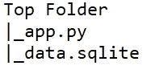

文件结构

# 文件 data.sqlite

我建议在创建 Dash 应用程序之前，用一个 *Users* 表创建数据库。

**data.sqlite** 文件是数据库，在 *Users* 表中存储用户名、密码和电子邮件地址。为了保护用户密码，将使用 [werkzeug 库](https://werkzeug.palletsprojects.com/en/1.0.x/)对密码进行[散列](https://www.wired.com/2016/06/hacker-lexicon-password-hashing/)。Werkzeug 是一个高级的 [web 服务器网关接口](https://en.wikipedia.org/wiki/Web_Server_Gateway_Interface) ( [WSGI](https://en.wikipedia.org/wiki/Web_Server_Gateway_Interface) )实用程序库。

## 设置数据库和用户表

如果数据库尚不存在，连接时将自动创建。

```
conn = sqlite3.connect('data.sqlite')
```

如上面的*认证工作流程*图所示，我希望用户创建自己的账户。用于将用户帐户写入数据库的数据库连接和插入语句将由 [SQLAlchemy 库](https://www.sqlalchemy.org/)管理。此外，由于 Dash 构建在 Flask 之上，我将使用 [Flask-SQLAlchemy](https://flask-sqlalchemy.palletsprojects.com/en/2.x/) 来配置服务器与数据库进行交互。

[SQLAlchemy](https://www.sqlalchemy.org/) 是一个强大而灵活的企业级 SQL 工具包和用于 Python 的[对象关系映射器](https://en.wikipedia.org/wiki/Object%E2%80%93relational_mapping#:~:text=Object%2Drelational%20mapping%20(ORM%2C,from%20within%20the%20programming%20language.)。 [Flask-SQLAlchemy](https://flask-sqlalchemy.palletsprojects.com/en/2.x/) 是对 [Flask](http://flask.pocoo.org/) 的扩展，为 Flask 应用程序增加了对 [SQLAlchemy](https://www.sqlalchemy.org/) 的支持。由于 Dash 是基于 Flask 构建的，所以一切都可以完美地协同工作。

## 创建用户表

为了在数据库中存储用户帐户，我需要一个表，其中包含用户名*、*密码*和*电子邮件*列。SQLAlchemy 可以处理表的创建。使用下面的模板创建 ***用户*** 表。*

注意，这可以使用原始 SQL 而不是 SQLAlchemy 来完成。

```
conn = sqlite3.connect('data.sqlite')***#connect to the database***
engine = create_engine('sqlite:///data.sqlite')
db = SQLAlchemy()***#class for the table Users***
class Users(db.Model):
    id = db.Column(db.Integer, primary_key=True)
    username = db.Column(db.String(15), unique=True, nullable = False)
    email = db.Column(db.String(50), unique=True)
    password = db.Column(db.String(80))Users_tbl = Table('users', Users.metadata)***#fuction to create table using Users class*** def create_users_table():
    Users.metadata.create_all(engine)***#create the table***
create_users_table()
```

注意，该表是通过运行 **create_users_table** 函数创建的。

我发现使用 pandas 库检查表格数据是最容易的，因为 dataframes 以列和行的形式漂亮地呈现了数据。

```
import pandas as pd
c = conn.cursor()
df = pd.read_sql('select * from users', conn)
df
```

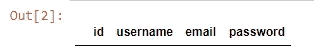

查询用户表

现在，数据库和表已经设置好了，是时候创建 Dash 应用程序了！

# 配置 Dash 应用服务器

由于我使用的是 Flask 和 SQLAlchemy，所以配置这个应用程序比简单的 Dash 应用程序要复杂一些。使用这段 boiler-plate 代码为 Dash 应用程序配置 Flask 服务器，并让它通过 SQLAlchemy 与数据库交互。如果您使用 SQLAlchemy 来构建 Users 表，那么这些代码的大部分应该已经很熟悉了。

```
warnings.filterwarnings("ignore")***#connect to SQLite database***
conn = sqlite3.connect('data.sqlite')
engine = create_engine('sqlite:///data.sqlite')
db = SQLAlchemy()config = configparser.ConfigParser()***#create users class for interacting with users table*** class Users(db.Model):
    id = db.Column(db.Integer, primary_key=True)
    username = db.Column(db.String(15), unique=True, nullable = False)
    email = db.Column(db.String(50), unique=True)
    password = db.Column(db.String(80))Users_tbl = Table('users', Users.metadata)***#instantiate dash app***
app = dash.Dash(__name__)
server = app.server
app.config.suppress_callback_exceptions = True***#config the server to interact with the database
#Secret Key is used for user sessions***
server.config.update(
    SECRET_KEY=os.urandom(12),
    SQLALCHEMY_DATABASE_URI='sqlite:///data.sqlite',
    SQLALCHEMY_TRACK_MODIFICATIONS=False
)db.init_app(server)
```

注意 **os.urandom** 用于生成 ***SECRET_KEY*** 。这将在下一节解释，因为它与 Flask-Login 功能相关。

有关配置应用程序的更深入的信息，我建议查看 Flask-SQLAlchemy 配置文档。

[](https://flask-sqlalchemy.palletsprojects.com/en/2.x/config/) [## 配置-烧瓶-SQLAlchemy 文档(2.x)

### Flask-SQLAlchemy 有以下配置值。Flask-SQLAlchemy 从您的主 Flask 加载这些值…

flask-sqlalchemy.palletsprojects.com](https://flask-sqlalchemy.palletsprojects.com/en/2.x/config/) 

# 在 Dash 应用中配置 Flask-Login

Flask-Login 是一个强大的库，在本教程中我只触及了皮毛。[阅读文档，获取 Flask-Login](https://flask-login.readthedocs.io/en/latest/) 提供的所有高级功能列表。

使用 [**LoginManager**](https://flask-login.readthedocs.io/en/latest/#flask_login.LoginManager) 类允许 Dash 应用程序使用 Flask-Login。默认情况下，Flask-Login 使用[会话](https://flask.palletsprojects.com/en/1.1.x/quickstart/#sessions)进行身份验证。这意味着配置必须包含密钥。这就是为什么 [SECERET_KEY](https://flask.palletsprojects.com/en/1.1.x/quickstart/#sessions) 在前面的部分被设置。

```
login_manager = LoginManager**()**
```

登录管理器让 Dash 应用程序做一些事情，比如从 ID 加载用户，并在登录过程中验证用户。

```
***#This provides default implementations for the methods that Flask-#Login expects user objects to have***
login_manager.init_app**(**app**)** class Users(UserMixin, Users):
    pass
```

需要回调 **login_manager** 来完成登录过程。这个回调将与 Dash 回调的其余部分一起进行。

```
***# callback to reload the user object*** [@login_manager](http://twitter.com/login_manager).user_loader
def load_user(user_id):
    return Users.query.get(int(user_id))
```

恭喜你！Flask-Login 已配置。现在是时候构建 Dash 应用程序的其余部分了。

# 创建仪表板应用程序布局

身份验证工作流程中的每个步骤都对应于 app.py 文件中的一个布局。在认证和 Dash 应用程序内容之间，总共使用了六种布局:

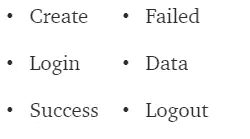

Dash 应用程序中的六种布局

## 创建布局

此布局用于让用户创建他们的用户帐户。它使用依赖于*输入的* [破折号核心组件](https://dash.plotly.com/dash-core-components)来接收用户输入。当用户点击**创建用户**按钮时，会触发一个回调，并将用户的输入写入数据库。

```
create = html.Div([ html.H1('Create User Account')
        , dcc.Location(id='create_user', refresh=True)
        , dcc.Input(id="username"
            , type="text"
            , placeholder="user name"
            , maxLength =15)
        , dcc.Input(id="password"
            , type="password"
            , placeholder="password")
        , dcc.Input(id="email"
            , type="email"
            , placeholder="email"
            , maxLength = 50)
        , html.Button('Create User', id='submit-val', n_clicks=0)
        , html.Div(id='container-button-basic')
    ])#end div
```

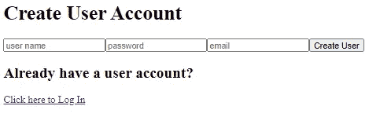

创建布局

## 创建回拨

使用回调，输入被写入数据库。使用破折号依赖状态存储输入。**状态**允许在不触发回调的情况下输入值，直到按下**创建用户**按钮。

注意回调中的一些事情:

*   我使用 SQLAlchemy 来插入值，而不是原始 SQL。

```
ins = Users_tbl.insert().values(username=un,  password=hashed_password, email=em,)
```

*   使用 [Werkzeug 库](https://werkzeug.palletsprojects.com/en/1.0.x/)中的[**generate _ password _ hash**](https://werkzeug.palletsprojects.com/en/1.0.x/utils/?highlight=check_password_hash#werkzeug.security.generate_password_hash)函数对用户密码进行哈希运算。

```
[@app](http://twitter.com/app).callback(
   [Output('container-button-basic', "children")]
    , [Input('submit-val', 'n_clicks')]
    , [State('username', 'value'), State('password', 'value'), State('email', 'value')])
def insert_users(n_clicks, un, pw, em):
    hashed_password = generate_password_hash(pw, method='sha256')
    if un is not None and pw is not None and em is not None:
        ins = Users_tbl.insert().values(username=un,  password=hashed_password, email=em,)
        conn = engine.connect()
        conn.execute(ins)
        conn.close()
        return [login]
    else:
        return [html.Div([html.H2('Already have a user account?'), dcc.Link('Click here to Log In', href='/login')])]
```

此外，请注意，在创建用户帐户时会返回登录布局，以便用户轻松登录。

## 登录布局

登录布局用于让用户在创建其用户帐户后登录。它使用**输入**字段和一个**按钮**，就像*创建*布局一样。

```
login =  html.Div([dcc.Location(id='url_login', refresh=True)
            , html.H2('''Please log in to continue:''', id='h1')
            , dcc.Input(placeholder='Enter your username',
                    type='text',
                    id='uname-box')
            , dcc.Input(placeholder='Enter your password',
                    type='password',
                    id='pwd-box')
            , html.Button(children='Login',
                    n_clicks=0,
                    type='submit',
                    id='login-button')
            , html.Div(children='', id='output-state')
        ]) #end div
```

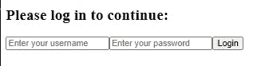

登录布局

## 登录回调

登录时有两个回调函数。第一个将用户传递到成功页面。第二个回调告诉用户，如果他们的信息是错误的或者在数据库中找不到，他们的用户名或密码是不正确的。

回调使用 Werkzeug 库中的函数[**check _ password _ hash**](https://werkzeug.palletsprojects.com/en/1.0.x/utils/?highlight=check_password_hash#werkzeug.security.check_password_hash)。

```
[@app](http://twitter.com/app).callback(
    Output('url_login', 'pathname')
    , [Input('login-button', 'n_clicks')]
    , [State('uname-box', 'value'), State('pwd-box', 'value')])
def successful(n_clicks, input1, input2):
    user = Users.query.filter_by(username=input1).first()
    if user:
        if check_password_hash(user.password, input2):
            login_user(user)
            return '/success'
        else:
            pass
    else:
        pass[@app](http://twitter.com/app).callback(
    Output('output-state', 'children')
    , [Input('login-button', 'n_clicks')]
    , [State('uname-box', 'value'), State('pwd-box', 'value')])
def update_output(n_clicks, input1, input2):
    if n_clicks > 0:
        user = Users.query.filter_by(username=input1).first()
        if user:
            if check_password_hash(user.password, input2):
                return ''
            else:
                return 'Incorrect username or password'
        else:
            return 'Incorrect username or password'
    else:
        return ''
```

注意回调使用 SQLAlchemy 通过用户名查询 Users 表。下面的代码描述了 SQLAlchemy 如何取回用户数据，以便验证密码。

```
Users.query.filter_by(username=input1).first()
```

## 成功布局

成功布局显示了用户在身份验证后可以访问的可用数据集。应用程序中唯一可用的数据集是我在第一个示例中为图表创建的数据集。

```
success = html.Div([dcc.Location(id='url_login_success', refresh=True)
            , html.Div([html.H2('Login successful.')
                    , html.Br()
                    , html.P('Select a Dataset')
                    , dcc.Link('Data', href = '/data')
                ]) #end div
            , html.Div([html.Br()
                    , html.Button(id='back-button', children='Go back', n_clicks=0)
                ]) #end div
        ]) #end div
```

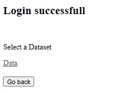

成功布局

## 失败的布局

当用户登录失败时，将显示失败的布局。注意**登录**布局嵌入在**失败**布局中，允许用户重新输入他们的凭证。

```
failed = html.Div([ dcc.Location(id='url_login_df', refresh=True)
            , html.Div([html.H2('Log in Failed. Please try again.')
                    , html.Br()
                    , html.Div([login])
                    , html.Br()
                    , html.Button(id='back-button', children='Go back', n_clicks=0)
                ]) #end div
        ]) #end div
```

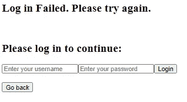

失败的布局

## 注销布局

用户注销后，将显示注销布局。与失败的布局一样，**登录**布局是嵌入式的，因此用户可以轻松地再次登录。

```
logout = html.Div([dcc.Location(id='logout', refresh=True)
        , html.Br()
        , html.Div(html.H2('You have been logged out - Please login'))
        , html.Br()
        , html.Div([login])
        , html.Button(id='back-button', children='Go back', n_clicks=0)
    ])#end div
```

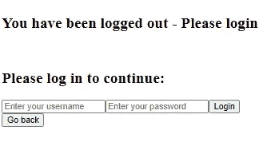

注销布局

## 数据打印格式

该布局显示了在第一个示例中设置的图表。

```
data = html.Div([dcc.Dropdown(
                    id='dropdown',
                    options=[{'label': i, 'value': i} for i in ['Day 1', 'Day 2']],
                    value='Day 1')
                , html.Br()
                , html.Div([dcc.Graph(id='graph')])
            ]) #end div
```

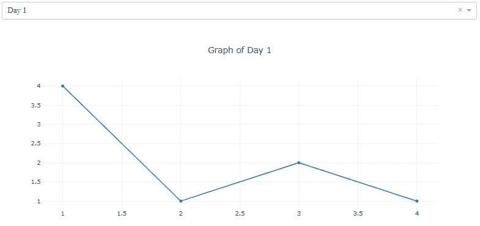

数据打印格式

## 数据回调

数据回调根据在下拉菜单中选择的选项输出图形。

```
#set the callback for the dropdown interactivity
[@app](http://twitter.com/app).callback(
    [Output('graph', 'figure')]
    , [Input('dropdown', 'value')])
def update_graph(dropdown_value):
    if dropdown_value == 'Day 1':
        return [{'layout': {'title': 'Graph of Day 1'}
                , 'data': [{'x': [1, 2, 3, 4]
                    , 'y': [4, 1, 2, 1]}]}]
    else:
        return [{'layout': {'title': 'Graph of Day 2'}
                ,'data': [{'x': [1, 2, 3, 4]
                    , 'y': [2, 3, 2, 4]}]}]
```

## 后退按钮回调

每个页面都有一个返回按钮，让用户返回到登录屏幕。这些回调更新适当的布局并将用户返回到登录屏幕。

```
[@app](http://twitter.com/app).callback(
    Output('url_login_success', 'pathname')
    , [Input('back-button', 'n_clicks')])
def logout_dashboard(n_clicks):
    if n_clicks > 0:
        return '/'[@app](http://twitter.com/app).callback(
    Output('url_login_df', 'pathname')
    , [Input('back-button', 'n_clicks')])
def logout_dashboard(n_clicks):
    if n_clicks > 0:
        return '/'# Create callbacks
[@app](http://twitter.com/app).callback(
    Output('url_logout', 'pathname')
    , [Input('back-button', 'n_clicks')])
def logout_dashboard(n_clicks):
    if n_clicks > 0:
        return '/'
```

# 显示布局

现在布局已经创建好了，我将设计 **app.layout** 来使用一个 **html。Div** ，它可以显示相应步骤的适当布局，作为 **html 的子元素。Div** 。回调用于控制哪个布局作为 **html 的子元素返回。ID 为*的 Div*** 组件页面内容。

```
app.layout= html.Div([
            html.Div(id='page-content', className='content')
            ,  dcc.Location(id='url', refresh=False)
        ]) ***#callback to determine layout to return***
[@app](http://twitter.com/app).callback(
    Output('page-content', 'children')
    , [Input('url', 'pathname')])
def display_page(pathname):
    if pathname == '/':
        return create
    elif pathname == '/login':
        return login
    elif pathname == '/success':
        if current_user.is_authenticated:
            return success
        else:
            return failed
    elif pathname =='/data':
        if current_user.is_authenticated:
            return data
    elif pathname == '/logout':
        if current_user.is_authenticated:
            logout_user()
            return logout
        else:
            return logout
    else:
        return '404'
```

代码现在已经完成了！当把它们放在一起时，从配置代码开始，然后添加布局，最后是回调。下面是高级示例的完整代码。

# 最终想法和完整的 Dash 应用程序

保护用户数据比以往任何时候都重要，现在您可以使用 [Dash-Auth](https://dash.plotly.com/authentication) 和 [Flask-Login](https://flask-login.readthedocs.io/en/latest/) 为您的 Dash 应用程序设置安全性和用户验证。这两种工具各有利弊。Dash-Auth 非常适合简单的 HTTP 基本认证，而 Flask-Login 提供了控制认证和用户会话的高级特性。

## 完全码

编码好所有单独的部分后，是时候展示完整的 Dash 应用程序了！我决定将配置、布局和回调整理到一个文件中。然而，将布局分割到它们自己的文件中以使事情更有组织性是非常好的。如果你喜欢这个教程，并想学习更多的 Dash，看看我的其他 Dash 教程！

[**Dash 初学者的 3 个高级示例**](https://medium.com/swlh/dashboards-in-python-3-advanced-examples-for-dash-beginners-and-everyone-else-b1daf4e2ec0a)[**实时更新并将数据流式传输到仪表板**](/dashboards-in-python-for-beginners-using-dash-live-updates-and-streaming-data-into-a-dashboard-37660c1ba661)[**响应式移动仪表板带有引导 CSS 组件**](https://medium.com/swlh/dashboards-in-python-for-beginners-using-dash-responsive-mobile-dashboards-with-bootstrap-css-2a0d05a53cf6)[**使用来自 Reddit 的数据创建数据表**](https://medium.com/swlh/dashboards-in-python-using-dash-creating-a-data-table-using-data-from-reddit-1d6c0cecb4bd)[**从仪表板导出数据**](https://medium.com/swlh/dashboards-in-python-for-beginners-using-dash-exporting-data-from-a-dashboard-fe0c5dec3ddb)

```
import dash_core_components as dcc
import dash_html_components as html
import dash
from dash.dependencies import Input, Output, Statefrom sqlalchemy import Table, create_engine
from sqlalchemy.sql import select
from flask_sqlalchemy import SQLAlchemyfrom werkzeug.security import generate_password_hash, check_password_hashimport sqlite3
import warningsimport os
from flask_login import login_user, logout_user, current_user, LoginManager, UserMixin
import configparserwarnings.filterwarnings("ignore")
conn = sqlite3.connect('data.sqlite')
engine = create_engine('sqlite:///data.sqlite')
db = SQLAlchemy()
config = configparser.ConfigParser()class Users(db.Model):
    id = db.Column(db.Integer, primary_key=True)
    username = db.Column(db.String(15), unique=True, nullable = False)
    email = db.Column(db.String(50), unique=True)
    password = db.Column(db.String(80))Users_tbl = Table('users', Users.metadata)app = dash.Dash(__name__)
server = app.server
app.config.suppress_callback_exceptions = True# config
server.config.update(
    SECRET_KEY=os.urandom(12),
    SQLALCHEMY_DATABASE_URI='sqlite:///data.sqlite',
    SQLALCHEMY_TRACK_MODIFICATIONS=False
)db.init_app(server)# Setup the LoginManager for the server
login_manager = LoginManager()
login_manager.init_app(server)
login_manager.login_view = '/login'#User as base
# Create User class with UserMixin
class Users(UserMixin, Users):
    passcreate = html.Div([ html.H1('Create User Account')
        , dcc.Location(id='create_user', refresh=True)
        , dcc.Input(id="username"
            , type="text"
            , placeholder="user name"
            , maxLength =15)
        , dcc.Input(id="password"
            , type="password"
            , placeholder="password")
        , dcc.Input(id="email"
            , type="email"
            , placeholder="email"
            , maxLength = 50)
        , html.Button('Create User', id='submit-val', n_clicks=0)
        , html.Div(id='container-button-basic')
    ])#end divlogin =  html.Div([dcc.Location(id='url_login', refresh=True)
            , html.H2('''Please log in to continue:''', id='h1')
            , dcc.Input(placeholder='Enter your username',
                    type='text',
                    id='uname-box')
            , dcc.Input(placeholder='Enter your password',
                    type='password',
                    id='pwd-box')
            , html.Button(children='Login',
                    n_clicks=0,
                    type='submit',
                    id='login-button')
            , html.Div(children='', id='output-state')
        ]) #end divsuccess = html.Div([dcc.Location(id='url_login_success', refresh=True)
            , html.Div([html.H2('Login successful.')
                    , html.Br()
                    , html.P('Select a Dataset')
                    , dcc.Link('Data', href = '/data')
                ]) #end div
            , html.Div([html.Br()
                    , html.Button(id='back-button', children='Go back', n_clicks=0)
                ]) #end div
        ]) #end divdata = html.Div([dcc.Dropdown(
                    id='dropdown',
                    options=[{'label': i, 'value': i} for i in ['Day 1', 'Day 2']],
                    value='Day 1')
                , html.Br()
                , html.Div([dcc.Graph(id='graph')])
            ]) #end divfailed = html.Div([ dcc.Location(id='url_login_df', refresh=True)
            , html.Div([html.H2('Log in Failed. Please try again.')
                    , html.Br()
                    , html.Div([login])
                    , html.Br()
                    , html.Button(id='back-button', children='Go back', n_clicks=0)
                ]) #end div
        ]) #end divlogout = html.Div([dcc.Location(id='logout', refresh=True)
        , html.Br()
        , html.Div(html.H2('You have been logged out - Please login'))
        , html.Br()
        , html.Div([login])
        , html.Button(id='back-button', children='Go back', n_clicks=0)
    ])#end divapp.layout= html.Div([
            html.Div(id='page-content', className='content')
            ,  dcc.Location(id='url', refresh=False)
        ])# callback to reload the user object
[@login_manager](http://twitter.com/login_manager).user_loader
def load_user(user_id):
    return Users.query.get(int(user_id))[@app](http://twitter.com/app).callback(
    Output('page-content', 'children')
    , [Input('url', 'pathname')])
def display_page(pathname):
    if pathname == '/':
        return create
    elif pathname == '/login':
        return login
    elif pathname == '/success':
        if current_user.is_authenticated:
            return success
        else:
            return failed
    elif pathname =='/data':
        if current_user.is_authenticated:
            return data
    elif pathname == '/logout':
        if current_user.is_authenticated:
            logout_user()
            return logout
        else:
            return logout
    else:
        return '404'#set the callback for the dropdown interactivity
[@app](http://twitter.com/app).callback(
    [Output('graph', 'figure')]
    , [Input('dropdown', 'value')])
def update_graph(dropdown_value):
    if dropdown_value == 'Day 1':
        return [{'layout': {'title': 'Graph of Day 1'}
                , 'data': [{'x': [1, 2, 3, 4]
                    , 'y': [4, 1, 2, 1]}]}]
    else:
        return [{'layout': {'title': 'Graph of Day 2'}
                ,'data': [{'x': [1, 2, 3, 4]
                    , 'y': [2, 3, 2, 4]}]}][@app](http://twitter.com/app).callback(
   [Output('container-button-basic', "children")]
    , [Input('submit-val', 'n_clicks')]
    , [State('username', 'value'), State('password', 'value'), State('email', 'value')])
def insert_users(n_clicks, un, pw, em):
    hashed_password = generate_password_hash(pw, method='sha256')
    if un is not None and pw is not None and em is not None:
        ins = Users_tbl.insert().values(username=un,  password=hashed_password, email=em,)
        conn = engine.connect()
        conn.execute(ins)
        conn.close()
        return [login]
    else:
        return [html.Div([html.H2('Already have a user account?'), dcc.Link('Click here to Log In', href='/login')])][@app](http://twitter.com/app).callback(
    Output('url_login', 'pathname')
    , [Input('login-button', 'n_clicks')]
    , [State('uname-box', 'value'), State('pwd-box', 'value')])
def successful(n_clicks, input1, input2):
    user = Users.query.filter_by(username=input1).first()
    if user:
        if check_password_hash(user.password, input2):
            login_user(user)
            return '/success'
        else:
            pass
    else:
        pass[@app](http://twitter.com/app).callback(
    Output('output-state', 'children')
    , [Input('login-button', 'n_clicks')]
    , [State('uname-box', 'value'), State('pwd-box', 'value')])
def update_output(n_clicks, input1, input2):
    if n_clicks > 0:
        user = Users.query.filter_by(username=input1).first()
        if user:
            if check_password_hash(user.password, input2):
                return ''
            else:
                return 'Incorrect username or password'
        else:
            return 'Incorrect username or password'
    else:
        return ''[@app](http://twitter.com/app).callback(
    Output('url_login_success', 'pathname')
    , [Input('back-button', 'n_clicks')])
def logout_dashboard(n_clicks):
    if n_clicks > 0:
        return '/'[@app](http://twitter.com/app).callback(
    Output('url_login_df', 'pathname')
    , [Input('back-button', 'n_clicks')])
def logout_dashboard(n_clicks):
    if n_clicks > 0:
        return '/'# Create callbacks
[@app](http://twitter.com/app).callback(
    Output('url_logout', 'pathname')
    , [Input('back-button', 'n_clicks')])
def logout_dashboard(n_clicks):
    if n_clicks > 0:
        return '/'if __name__ == '__main__':
    app.run_server(debug=True)
```

# 谢谢大家！

*   *如果你喜欢我的作品，* [*在 Medium 上关注我*](https://medium.com/@erickleppen) *了解更多！*
*   [*通过订阅*](https://erickleppen.medium.com/membership) 获得对我的内容的完全访问和帮助支持！
*   *我们来连线上*[*LinkedIn*](https://www.linkedin.com/in/erickleppen01/)
*   *用 Python 分析数据？查看我的* [*网站*](https://pythondashboards.com/) ！

[**—埃里克·克莱本**](http://pythondashboards.com/)

[](https://erickleppen.medium.com/the-ultimate-guide-to-erics-articles-d32df8241353) [## 埃里克文章的终极指南

### 我的所有内容按主题组织…

erickleppen.medium.com](https://erickleppen.medium.com/the-ultimate-guide-to-erics-articles-d32df8241353)