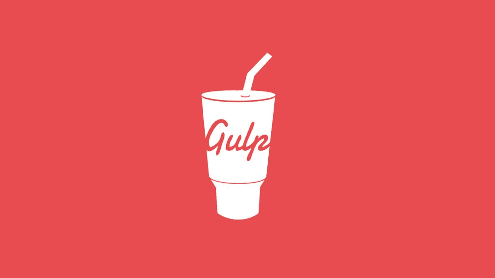
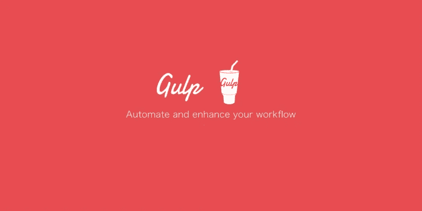
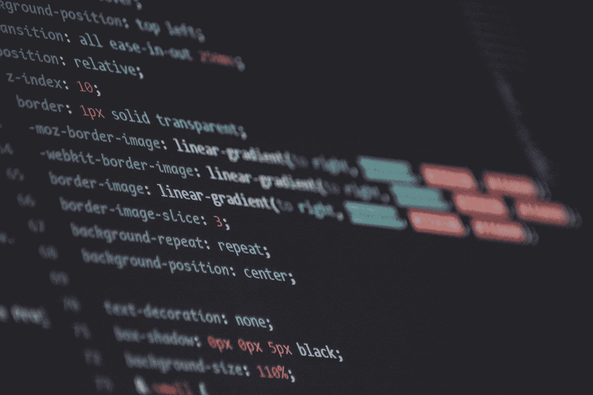
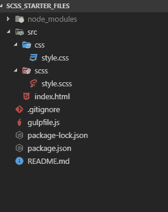

# 如何使用 Gulp 4 . 0 . 0 版设置您的工作流程

> 原文：<https://levelup.gitconnected.com/how-to-setup-your-workflow-using-gulp-v4-0-0-5450e3d7c512>

## 自动化单调乏味的任务的最好方法是。



在写这篇博文之前，我用老方法创建和维护我的前端项目:我主要写普通的 CSS。我发现自己在手工做一些工作，比如缩小、美化、添加前缀和林挺。这种洞察力给了我一个优化我的前端工作流以产生更好的代码的理由。

# **什么是一饮而尽？**

[Gulp](https://gulpjs.com/) 是一个工具包，用于自动化开发工作流程中痛苦或耗时的任务，因此您可以停止浪费时间，专注于构建一些东西。

Gulp 建立在 [Node.js](https://nodejs.org/en/) /JavaScript 之上，用来给它命令的 Gulp 文件也必须用 JavaScript 编写。

*   **自动化** — gulp 是一个工具包，它可以帮助您自动化开发工作流程中痛苦或耗时的任务。
*   **与平台无关的**——所有主流 ide 中都内置了集成，人们使用 PHP 和 gulp。NET、Node.js、Java 等平台。
*   **强大的生态系统** —使用 npm 模块做任何您想做的事情+超过 2000 个用于流文件转换的精选插件。
*   **简单** —通过只提供一个最小的 API 接口，gulp 易于学习和使用。



你可以通过 [NPM](https://www.npmjs.com/) 安装 Gulp， [Github](https://github.com/gulpjs/gulp/blob/master/docs/getting-started/1-quick-start.md) 库提供了入门指南。

# 什么是萨斯？

Sass 是世界上最成熟、最稳定、最强大的专业级 CSS 扩展语言。它也是利用我们 Gulp 工作流程的完美候选。

[](https://gitconnected.com/learn/sass) [## 学习 Sass -最佳 Sass 教程(2019) | gitconnected

### 9 大 Sass 教程。课程由开发者提交和投票，使您能够找到最好的 Sass 课程和…

gitconnected.com](https://gitconnected.com/learn/sass) 

不要被萨斯和 SCSS 选项所迷惑。起初这对我来说是个问题。scss 是 Sassy CSS，是. sass 的下一代。

Sass 有两种语法。最常用的语法被称为“SCSS”(Sassy CSS)，是 CSS3 语法的超集。这意味着每个有效的 CSS3 样式表也是有效的 SCSS。SCSS 文件使用扩展名. scss

第二种更古老的语法被称为缩进语法(或简称为“.萨斯”)。受 Haml 简洁的启发，它面向那些喜欢简洁胜过 CSS 相似性的人。它使用行的缩进来指定块，而不是括号和分号。缩进语法中的文件使用扩展名. sass。



照片由 [Maik Jonietz](https://unsplash.com/@der_maik_?utm_source=medium&utm_medium=referral) 在 [Unsplash](https://unsplash.com?utm_source=medium&utm_medium=referral) 上拍摄

# 我如何改进我的工作流程？

在我安装了 Gulp 之后，我去了 Gulp 插件注册表，搜索了 3694+个插件，挑选了那些对我的工作流程有帮助的。我决定利用 sass 和浏览器同步，这是非常有益的。

第一步是通过键入命令创建一个`package.json`文件

```
$ npm init
```

然后添加细节—下面显示了一个示例:

现在，要安装必要的依赖项，请输入以下命令。

```
$ npm install --*save-dev gulp-postcss autoprefixer cssnano gulp-sourcemaps gulp browser-sync gulp-sass*
```

我们在`package.json`中将 start 定义为`“gulp”`，因为我们想在`npm start`上运行 gulp 命令。

现在在项目的根目录下创建一个`gulp.js`文件。这个文件是我们编写利用 Gulp 的命令的地方

> 因为我们不想一次又一次地使用`*var*`，我们用逗号分隔变量声明。

现在让我们在同一个文件中创建源和目标的路径。

我们创建自己的函数`style()`。这个函数将`pipe`(传递内容)初始 Sass 代码的不同转换，最终创建跨浏览器兼容的小型 CSS。

让我们创建一个 *watcher* 函数，它监视我们的 Scss 文件，然后使用 *Browser Sync* 调用 reload 函数并在 UI 上显示我们的更新，自动重新加载更改。

现在添加并行运行的吞咽任务，即并行跟踪样式函数和观察器。

*我们最终的 gulpfile.js 看起来是这样的*。😃

示例目录结构如下所示。



目录结构

# 恭喜🎉🎉

吞咽任务已成功创建。😄现在，在 style.scss 中所做的任何更改都会自动将其转换为 style.css，并将其放在`src/css`文件夹中。

您也不需要刷新页面，因为我们已经使用了浏览器同步。

如果你真的喜欢这篇文章，请给这篇文章一个掌声👏 👏👏

你可以开始它或者贡献给这个库[这里](https://github.com/Jatin-8898/sass-starter-pack)

[](https://github.com/Jatin-8898/sass-starter-pack) [## jatin-8898/sass-启动包

### Sass starter 文件使用 Gulp 4.0.0。创建一个帐户，为 Jatin-8898/sass-starter-pack 的开发做出贡献…

github.com](https://github.com/Jatin-8898/sass-starter-pack) [](https://levelup.gitconnected.com/)[](https://gitconnected.com/learn/javascript) [## 学习 JavaScript -最佳 JavaScript 教程(2019) | gitconnected

### 排名前 64 的 JavaScript 教程。课程由开发者提交并投票，使您能够找到最好的…

gitconnected.com](https://gitconnected.com/learn/javascript)