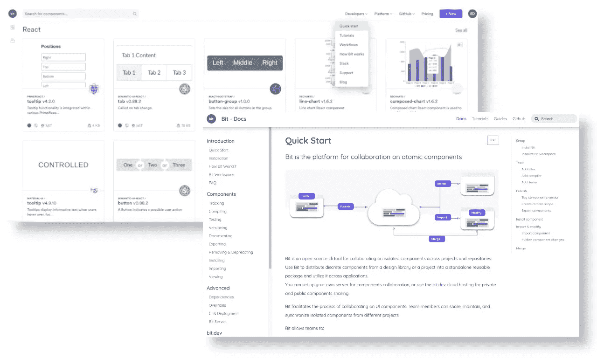

# 如何在 React 应用程序和 Gatsby 网站之间共享组件

> 原文：<https://levelup.gitconnected.com/how-to-share-components-between-react-apps-and-gatsby-websites-21c0541f8c78>

## 如何从 React 应用程序发布组件，并将其安装在 Gatsby 静态站点中。


图片来自[皮克斯拜](https://pixabay.com/?utm_source=link-attribution&utm_medium=referral&utm_campaign=image&utm_content=914823)

> 更新: *Bit 发布了全新版本，彻底改变了独立组件的开发流程，了解更多，* [***这里***](https://blog.bitsrc.io/building-a-react-component-library-d92a2da8eab9) *。*

静态文档/博客/营销网站补充单页应用(SPA)是很常见的。为很少变化的内容提供服务的工作非常适合静态网站，因为它们对 SEO 更友好，加载速度更快。

当应用程序和它的静态站点都是用 React 构建的时候，它们可以——也应该——共享它们的组件。这不仅是一种通过最大化代码重用来加快构建速度的方法，也是一种在所有产品之间保持一致的 UI 的方法(因为它们都与同一个品牌相关)。

[](https://bit.dev)

示例: [Bit.dev](https://bit.dev) 单页应用程序及其[文档](https://docs.bit.dev/)站点

# 用 Bit 发布 React 组件

[**Bit**](https://bit.dev/) 是一个工具和组件中枢，可以轻松发布和记录来自任何代码库的组件。它既提供了一个用于隔离和发布组件的 CLI 工具，又提供了一个托管、记录和显示组件的地方。

在本教程中，我将从我的超级流行的“坏笑话应用程序”中发布组件，并将它们安装在我的“坏笑话博客”中。正如我之前提到的，这两个看起来应该是一样的，因为它们都是同一个“糟糕笑话”品牌的一部分。


发布坏笑话应用程序的组件，并将其安装在补充博客中

# 在两者之间共享组件

1.  搭建“[烂段子 App](https://bad-jokes-app.firebaseapp.com/) ”。将其可重用组件发布到 [Bit.dev](https://bit.dev/) 上的组件集合中。
2.  和盖茨比一起创建一个[博客](https://bad-jokes-blog.netlify.app/)(“烂笑话博客”)。使用从“坏笑话应用程序”发布的组件。

# 1.和 CRA 一起开发“糟糕笑话应用”

```
$ npx create-react-app bad-jokes// and then some coding...
```

[](https://bad-jokes-app.firebaseapp.com/)

我的“烂笑话”应用。【https://bad-jokes-app.firebaseapp.com/ 

## 来源:

[](https://github.com/giteden/bad-jokes) [## 拙劣的笑话

### 一个针对糟糕笑话的 React 应用程序——使用 bit . dev-gite den/bad-sakes 的可重用组件构建

github.com](https://github.com/giteden/bad-jokes) 

我使用 CSS 模块来确保“类名冲突”在未来的应用程序中不会发生。我还将每个组件的文件放在同一个目录下，以使组件的发布者(您真正的发布者)和未来的维护者更容易理解。

```
|-- components
  |-- Button
    |-- Button.jsx
    |-- Button.module.css
    |-- index.js
  |-- Card
    |-- Card.jsx
    |-- Card.module.css
    |-- index.js
  |-- Text
    |-- Text.jsx
    |-- Text.module.css
    |-- index.js
  |-- AppBar
    |-- AppBar.jsx
    |-- AppBar.module.css
    |-- index.js
  |-- BadJokesViewer
    |-- BadJokesViewer.jsx
    |-- BadJokesViewer.module.css
    |-- index.js
```

我的应用程序有四个可重用组件— [在我的收藏中查看它们](https://bit.dev/eden/badjokes)。


“烂段子”可复用组件:[文本](https://bit.dev/eden/badjokes/text) | [按钮](https://bit.dev/eden/badjokes/button) | [卡片](https://bit.dev/eden/badjokes/card) | [AppBar](https://bit.dev/eden/badjokes/app-bar)

# 2.发布来自“糟糕笑话应用程序”的组件

首先，安装 Bit 的 CLI 工具(全球):

```
$ npm install bit-bin --global
```

转到项目的根目录，初始化一个 Bit 工作空间:

```
$ bit init
```

让我们开始跟踪“components”目录下的所有组件:

```
$ bit add src/components/*
```

为这些组件安装和配置编译器(这样它们就不会耦合到此应用的构建设置):

```
$ bit import bit.envs/compilers/react --compiler
```

是时候给这些组件贴上“标签”了:

```
$ bit tag --all
```

在 [Bit.dev](https://bit.dev) 上打开一个帐户，并创建一个新的集合(即将发布的组件的范围)。

然后，我们将使用我们的终端登录:

```
$ bit login
```

终于到了发布或“导出”我们的应用组件的时候了:

```
$ bit export eden.badjokes// where 'eden' is the username and 'badjokes' is the collection name
```

## **搞定！需要注意的两件事—**

1.  我已经使用了 prop-types 和 JSDocs 来记录(和类型化)坏笑话组件。Bit 已经为每个组件自动生成了文档(在使用 React with TypeScript 时也可以)。

**示例**

此按钮组件是用 prop-types 类型化的。`children`和`onClickMethod`各有一个用 JSDocs 编写的描述。默认情况下`disabled`道具设置为`false`。

Bit 会从上面的代码中生成[这个](https://bit.dev/eden/badjokes/button):

[](https://bit.dev/eden/badjokes/button)

在比特游乐场渲染的示例代码:[https://bit.dev/eden/badjokes/button](https://bit.dev/eden/badjokes/button)

[](https://bit.dev/eden/badjokes/button)

组件页面中显示的文档:[https://bit.dev/eden/badjokes/button](https://bit.dev/eden/badjokes/button)

2.请确保为您的组件提供一个示例(参见上面两张截图中的第一张)——否则，它将无法在 Bit's playground 中呈现。

[](https://bit.dev/eden/badjokes)

[Bit.dev](https://bit.dev/eden/badjokes) 上的“烂段子”收藏

# 3.为“坏笑话应用程序”创建一个盖茨比博客网站

为了尽快建立一个[博客](https://bad-jokes-blog.netlify.app/)，我用了盖茨比和`gatsby-starter-blog`的开头:

```
$ gatsby new bad-jokes-blog [https://github.com/gatsbyjs/gatsby-starter-blog](https://github.com/gatsbyjs/gatsby-starter-blog)
```

[](https://github.com/giteden/badjokes-blog) [## git Eden/bad jeans-博客

### 用 Gatsby 和 bit . dev-gite den/bad keys-blog 的可重用组件构建的博客站点

github.com](https://github.com/giteden/badjokes-blog) 

安装我们的组件之前的博客

然后，我们将前往博客的根文件夹，安装从“糟糕笑话应用程序”发布的两个组件:

```
$ npm i @bit/eden.badjokes.button
$ npm i @bit/eden.badjokes.card
```

请注意每个组件是如何单独安装的(正如您对未耦合到库的独立组件的期望)。

NPM 在这里被用来安装我们的组件，但重要的是要注意，它不是用作组件注册表(这将是位的注册表)。

让我们使用`post-page.js`文件中已安装的组件:

那就是[最终结果](https://bad-jokes-blog.netlify.app/):

[](https://bad-jokes-blog.netlify.app/)

“烂笑话博客”:[https://bad-jokes-blog.netlify.app/](https://bad-jokes-blog.netlify.app/)

在`index.tsx`页面中，坏笑话组件正在发挥作用:

[](https://bad-jokes-blog.netlify.app/)

# 结论

得益于 React 强大的生态系统，如今它几乎可以用来建造任何东西。由同一个框架构建的更多样化的产品意味着组件重用的更大潜力。当多个产品被构建为互补的部分(例如，一个应用程序和它的文档站点)或者在同一个品牌下时，尤其如此。

这不仅在理论上是正确的，而且在实践中也是正确的，这要感谢像 [Bit](https://bit.dev) 这样的工具，它们使得发布和记录来自任何代码库的单个组件变得简单。

在此了解关于独立组件的创作、版本控制和协作的更多信息:

[](https://blog.bitsrc.io/independent-components-the-webs-new-building-blocks-59c893ef0f65) [## 独立组件:网络的新构件

### 为什么你所知道的关于微服务、微前端、monorepos 甚至普通的旧组件库的一切…

blog.bitsrc.io](https://blog.bitsrc.io/independent-components-the-webs-new-building-blocks-59c893ef0f65) [](https://blog.bitsrc.io/building-a-react-design-system-for-adoption-and-scale-1d34538619d1) [## 为采用和扩展构建一个反应式设计系统

### 通过独立组件和可组合架构实现 DS 扩展和采用——附示例。

blog.bitsrc.io](https://blog.bitsrc.io/building-a-react-design-system-for-adoption-and-scale-1d34538619d1)