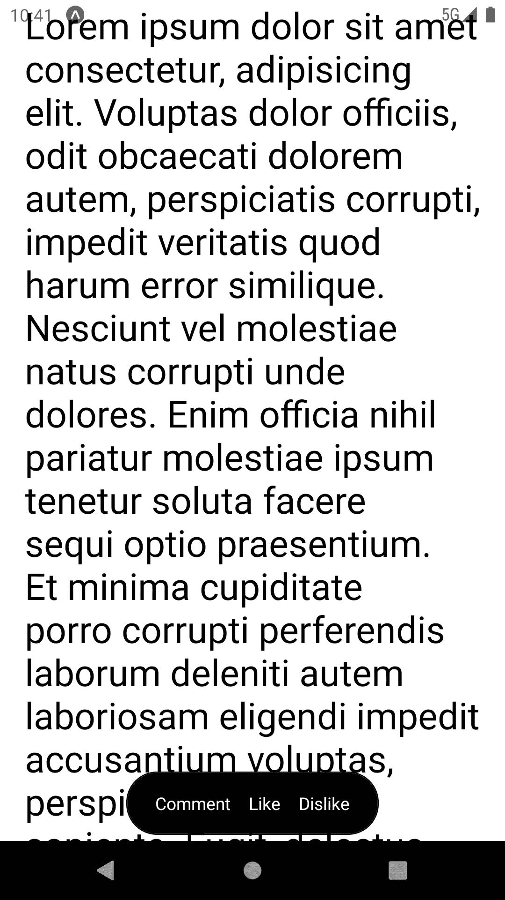
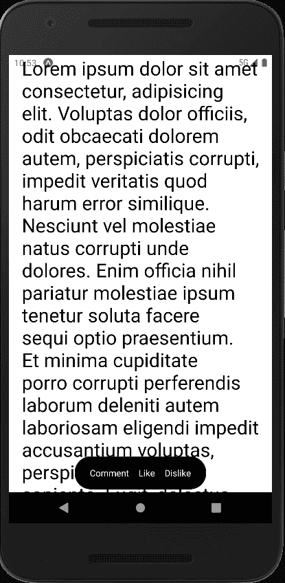

# 如何显示和隐藏 React Native 和 reactive 中上下滚动的内容

> 原文：<https://levelup.gitconnected.com/how-to-show-and-hide-content-scrolling-up-and-down-in-react-native-with-reanimated-12d20af00db7>

[Vojtech Bruzek](https://unsplash.com/@vojtechbruzek?utm_source=medium&utm_medium=referral) 在 [Unsplash](https://unsplash.com?utm_source=medium&utm_medium=referral) 上拍摄的照片

在这篇文章中，我们将创建一些类似于 Medium 的应用程序文章动作的东西，当你向上滚动时出现，当你向下滚动时消失，这是一种我们称为“滚动显示”的技术，并且还添加了一个简单的动画。那么，我们开始吧。

我们现在可以滚动了，但是文章操作栏还没有消失。我们将利用返回事件处理程序引用的`[useAnimatedScrollHandler](https://docs.swmansion.com/react-native-reanimated/docs/api/hooks/useAnimatedScrollHandler/)`。

首先，编写逻辑来检查用户是向上滚动还是向下滚动。

我们定义了一个`scrollHandler`，并将其附加到`ScrollView.`

请注意，我已经将`ScrollView`改为`Animated.ScrollView`，将`View`改为`Animated.View`。在`Animated`中包装组件允许处理器正确触发。另外，注意我们用来存储值的`useSharedValue`钩子。钩子携带数据，提供对变化作出反应的方法，并驱动动画。

现在我们可以检测用户何时上下滚动，我们可以隐藏和显示文章操作栏。我们将利用 translate style 属性来实现这一点。当用户向上滚动时，`translateY`属性的值应该是 0 和 100。

添加了一个新的钩子，`useAnimatedStyle.`我们将使用`[useAnimatedStyle](https://docs.swmansion.com/react-native-reanimated/docs/api/useAnimatedStyle)` [钩子](https://docs.swmansion.com/react-native-reanimated/docs/api/useAnimatedStyle)来生成一个小工作包。这个钩子返回一个对象样式，然后我们可以将这个样式添加到一个元素中。在上面的代码中，我将由`useAnimatedStyle`返回的样式对象添加到文章操作栏中。

我还使用了`withTiming`函数来实现动画。如果没有这个函数，元素就不会有动画效果。

仅此而已。你可以查看一下 [snackbar](https://snack.expo.dev/@dhatguy/7e0970) 和 [GitHub 库。](https://github.com/dhatGuy/reveal-on-scroll)

# 分级编码

感谢您成为我们社区的一员！更多内容请参见[升级编码出版物](https://levelup.gitconnected.com/)。
跟随:[推特](https://twitter.com/gitconnected)，[领英](https://www.linkedin.com/company/gitconnected)，[通迅](https://newsletter.levelup.dev/)
**升一级正在转型的理工大招聘➡️** [**加入我们的人才集体**](https://jobs.levelup.dev/talent/welcome?referral=true)