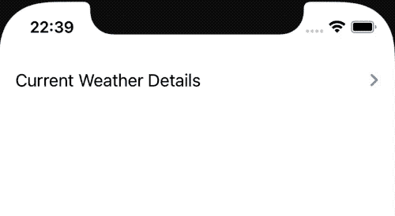
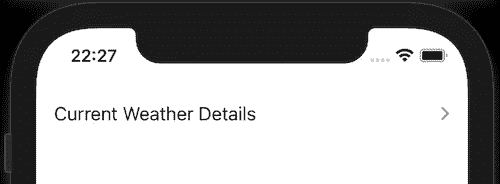
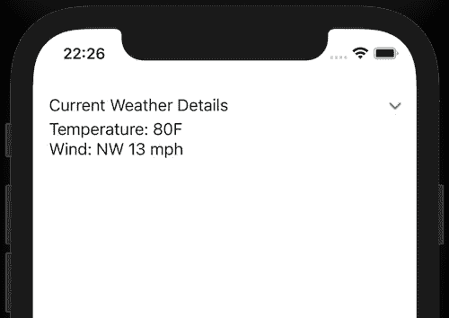
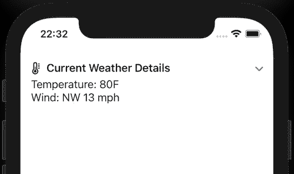
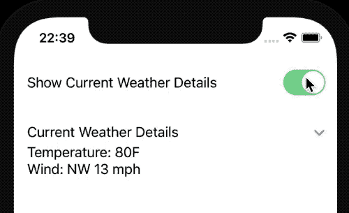
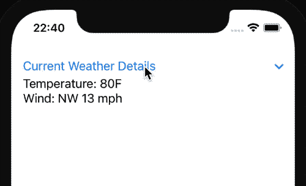

# 如何使用 SwiftUI 显示和隐藏 DisclosureGroup 的内容

> 原文：<https://levelup.gitconnected.com/how-to-show-and-hide-content-with-disclosuregroup-using-swiftui-dae78e319afc>

显示和隐藏部分信息是移动应用程序的一个重要功能，尤其是考虑到手机屏幕比笔记本电脑或台式电脑小得多。


Jonas Jacobsson 在 [Unsplash](https://unsplash.com/?utm_source=medium&utm_medium=referral) 上拍摄的照片。

现在有了新的 SwiftUI 功能，我们可以用`DisclosureGroup`折叠内容。让我们看看如何以各种方式使用它。

# 显示可折叠的内容

让我们从最简单的方法开始，建立一个可以显示或隐藏的可折叠视图。它带有一个披露箭头指示器和漂亮的动画。

在这篇博文中，让我们用一个例子来展示天气状况，这将是一个 SwiftUI 视图`WeatherDetailsView`并显示温度和风力信息。

如果我们想要显示或隐藏这些信息，我们可以使用`DisclosureGroup`初始化器，只需传递一个字符串值，然后将内容输出到`WeatherDetailsView`视图。

```
DisclosureGroup("Current Weather Details") {
  WeatherDetailsView()
}
```



# 修改`DisclosureGroup`

现在让我们看看如何修改`DisclosureGroup`。目前，我们不能做太多，这是相当有限的，但我们可以改变口音的颜色和禁用它。

让我们从禁用显示和隐藏天气信息的选项开始。我们可以通过使用`disabled`修改器来实现。

```
DisclosureGroup("Current Weather Details") {
  WeatherDetailsView()
}
.disabled(true)
```



默认情况下，显示箭头为蓝色。通过使用`accentColor`修改器，我们可以切换到我们想要的颜色。我们可以使用系统颜色或资产目录中定义的颜色。



# 配置`DisclosureGroup`标题

到目前为止，我们只改变了披露组视图的内部内容。如果你想把标题改成标签视图呢？新的[标签](https://developer.apple.com/documentation/swiftui/label)带有一个初始化器来传递文本标题和系统映像的使用。为此，我们可以使用一个特殊的`DisclosureGroup`初始化器来提供自定义标签。

```
DisclosureGroup(
  content: {
    WeatherDetailsView()
  },
  label: {
    Label("Current Weather Details", systemImage: "thermometer")
      .font(.headline)
  }
)
```



# 手动控制显示/隐藏状态

为了显示或隐藏披露组的内容，我们依赖用户点击箭头。有些情况下，我们希望使用切换按钮来改变这种行为。要做到这一点，我们可以使用一个状态布尔变量来指示公开组是否展开。

```
@State private var isExpanded = false/// ...Toggle("Show Current Weather Details", isOn: $isExpanded)DisclosureGroup("Current Weather Details", isExpanded: $isExpanded) {
  WeatherDetailsView()
}
```



奇怪的是，你一按标题，它就不展开；相反，我们需要指出我们的手指，并按下披露箭头按钮。我们可以通过将标题实现为按钮并控制`isExpanded`属性来解决这个问题。

```
DisclosureGroup(
  isExpanded: $isExpanded,
  content: { WeatherDetailsView() },
  label: {
    Button("Current Weather Details") {
      withAnimation {
        isExpanded.toggle()
      }
    }
  }
)
```



# TL；速度三角形定位法(dead reckoning)

由于有限的屏幕尺寸，显示和隐藏一些信息对于移动应用来说是一个不错的选择。

新的 SwiftUI 版本为我们提供了一个专门针对`DisclosureGroup`的现成组件。

目前，它是相当有限的，但提供了一些可能性，如果我们需要定制它。

# 链接

*   [样本代码](https://github.com/fassko/swiftui-DisclosureGroup)
*   [官方文件](https://developer.apple.com/documentation/swiftui/disclosuregroup)
*   [如何使用 DisclosureGroup 隐藏和显示内容](https://www.hackingwithswift.com/quick-start/swiftui/how-to-hide-and-reveal-content-using-disclosuregroup)
*   [SwiftUI DisclosureGroup 教程](https://www.ioscreator.com/tutorials/swiftui-disclosure-group-tutorial)
*   [iOS 14 中 SwiftUI 的 GroupBox、OutlineGroup、disclosure group](https://betterprogramming.pub/swiftuis-groupbox-outlinegroup-and-disclosuregroup-in-ios-14-cf9fb127cdc0)