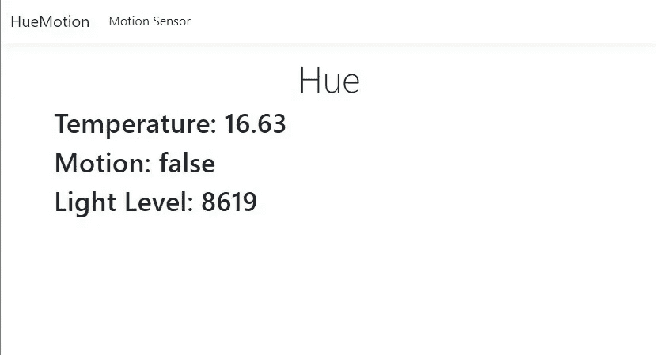

# 如何在网站上显示色调运动数据

> 原文：<https://levelup.gitconnected.com/how-to-show-hue-motion-data-on-a-website-d575796c169>

## 了解如何使用飞利浦 Hue 运动传感器做更多事情，并在网站上显示所有收集的信息


照片由[詹姆斯·哈里逊](https://unsplash.com/@jstrippa?utm_source=medium&utm_medium=referral)在 [Unsplash](https://unsplash.com?utm_source=medium&utm_medium=referral) 拍摄

也许你已经看过你的色相运动传感器，并认为:“我可以用这个做更多吗？”。你并不孤单。我有完全相同的想法，并开始思考什么是**一个好的用例**。由于飞利浦色调运动传感器捕捉的不仅仅是它是否看到运动的事实，我决定对所有信息做一些事情。

这是我决定创建一个网站来放置上的**温度、运动和光照水平的时候。为了完成这个任务，我创建了一个 C#。NET 6 网站**，可以在这个 [GitHub 页面](https://github.com/koenvzeijl/HueMotion)找到。如果你想看不同的编程语言，请留下评论，这样我也可以用另一种语言来尝试。

# 1.介绍

在我们可以在网站上展示我们捕获的运动数据之前，我们需要做几件事情。首先，我们要创建一个新的 **C# web 应用**。创建应用程序后，就该设置本地配置了。然后我们应该**配置一个 HttpClient** 来与您的本地桥对话，并创建**适当的服务来使用这个 HttpClient** 。最后，我们需要在网页上显示我们的运动数据。



# 2.创建 web 应用程序

如果你没有这方面的任何经验，我想让你参考一下这个教程，确保你已经安装了 Visual Studio。对于本教程，基本的 web 模板非常合适。为你的网站创建一个新文件夹，例如 HueMotion，然后**运行以下命令**:

```
dotnet new webapp
```

这将自动**为您创建一个基本的新 web 应用程序**。您也可以在 Visual Studio 中的**中完成此操作，方法是在启动应用程序后选择“创建新项目”。继续打开由命令或 Visual studio 创建的`.csproj`文件。**尝试运行应用程序**，如果成功，您可以进入下一步。**

# 3.改变配置

在 C#应用程序中，您将配置添加到名为`appsettings.json`的设置文件中。为了让这个应用程序工作，我们需要配置您的本地网桥 IP 和应用程序密钥。如果你还没有这些，请[跟随这个教程](https://morehue.com/easily-toggle-philips-hue-depending-on-your-pc-state-v2/)直到第二部分。现在将以下部分添加到 appsettings.json 中，并用自己的值替换这些值**。**

```
{   
    ///  
    "HueApi": {
       "BridgeIp": "YOUR_BRIDGE_ID",
       "ApplicationKey": "YOUR_APPLICATION_KEY"
   },
   ///
}
```

# 4.配置 HttpClient 并创建服务

为了尽可能保持应用程序的整洁，我们希望实现一个使用通用 HTTP 客户端的最佳实践。有关这个客户端 HttpClientFactory 的更多信息，请阅读本教程。在将 HttpClient 添加到`program.cs`时，我们需要确保设置了正确的**基址**(带有桥 IP)和 **DefaultRequestHeaders** (带有应用程序密钥)。基址现在看起来像这样: **https:// <您的 IP 地址> /clip/v2/resource** 这使得稍后调用端点更加容易。

如你所见，在本教程中，我们不验证证书并直接返回 true。在 GitHub 项目中，我使用一个 [CertificateValidator](https://github.com/koenvzeijl/HueMotion/blob/master/HueMotion/CertificateValidator.cs) 来验证从桥返回的证书。

现在是添加 [HueApiService](https://github.com/koenvzeijl/HueMotion/blob/master/HueMotion/Services/HueApiService.cs) 的时候了。在这个服务中，我添加了 3 种方法来接收来自运动传感器的温度、运动和亮度数据。获取运动数据的示例如下:

正如您在 GitHub 页面上看到的，该方法使用 HttpClient 从“/motion”端点获取数据。然后这被转换成一个 [C#模型](https://github.com/koenvzeijl/HueMotion/blob/master/HueMotion/Models/RootMotion.cs)并返回到[控制器](https://github.com/koenvzeijl/HueMotion/blob/master/HueMotion/Controllers/HueController.cs)。现在，要使用该服务，您需要在您的`program.cs`中对其进行如下配置:

```
builder.Services.AddScoped<IHueApiService, HueApiService>();
```

# 5.创建网页

为了在 web 页面上显示捕获的数据，我创建了一个新的 [HueController](https://github.com/koenvzeijl/HueMotion/blob/master/HueMotion/Controllers/HueController.cs) ，它包含 3 个方法。首先，我们有`MotionSensor`方法，该方法**返回实际视图**。然后我们有`GetHueMotionSensorDetails`方法来**每 20 秒刷新一次数据**。最后，我们有一个返回包含所有数据的视图模型的方法。该数据是通过服务中的不同方法获取的。在[视图](https://github.com/koenvzeijl/HueMotion/blob/master/HueMotion/Views/Hue/MotionSensor.cshtml)中，我们使用 jQuery 的这个位每 20 秒刷新一次数据:

就这样，启动您的应用程序，并在浏览器中看到它运行！如果它不能直接工作，请下载我的 GitHub 项目并寻找不同之处。

**提醒**:请更换`appsettings.json`的网桥 IP 和应用密钥

# 6.结论

在 Hue 应用程序的**中，你可以用运动传感器**做很多很酷的事情。但是这个传感器**从应用程序中捕获的数据比显示的**要多。在本指南中，我们创建了一个**网站来提取所有数据点**并在一个简单的网页上显示它们。以此为起点，充分发挥你的创造力。如果你想让我写一个不同的很酷的话题，请写在评论里。

编码快乐！

关于其他指南，请访问我的[指南页面](https://morehue.com/category/guides/)。

【https://morehue.com】原载于 2022 年 4 月 1 日[](https://morehue.com/how-to-show-hue-motion-data-on-a-website/)**。**