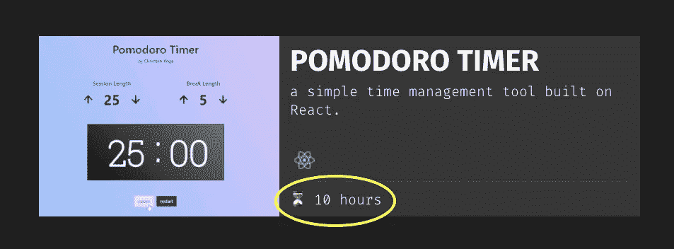
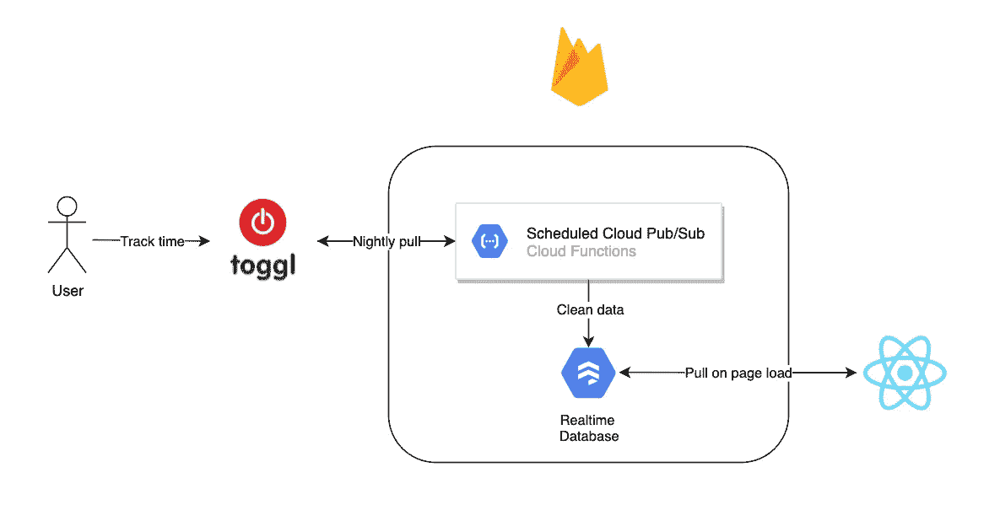
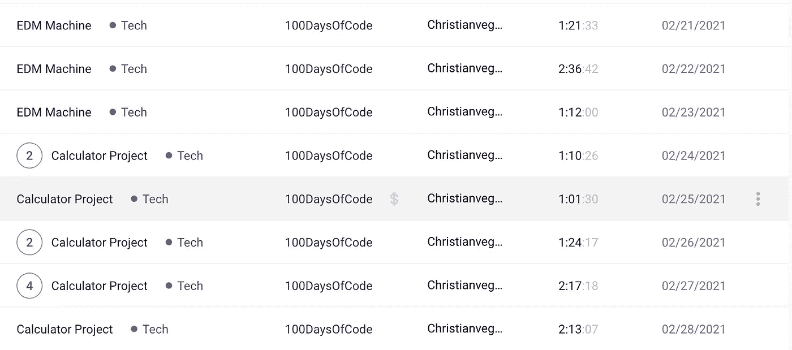
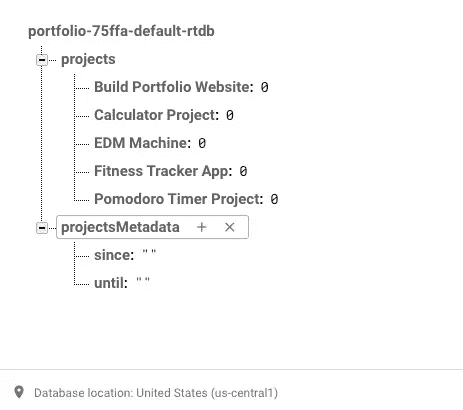
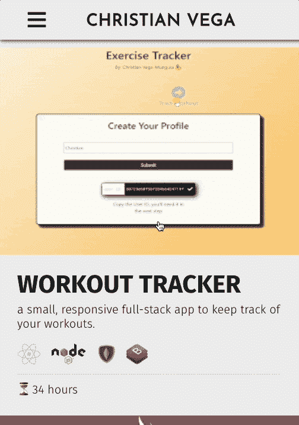

# 如何炫耀你在编码项目上工作的时间

> 原文：<https://levelup.gitconnected.com/how-to-show-off-the-hours-you-worked-on-coding-projects-b616b042973d>

## 用 Firebase & Toggl 的 API 构建 React 组件

真实数据，每日更新！

在没有计算机科学学位的情况下，展示你对软件的热情和知识的最好方式是通过构建东西。做得更好的唯一方法是**投入时间**。

在本教程中，我将向你展示如何建立我的[作品集网站的项目部分](http://christianvega.me/projects)，在那里我炫耀(或者像孩子们喜欢说的那样 *flex、*)我在那些项目上付出的辛苦时间。

为了更好地理解，您应该具备关于**类型脚本、React** 和**REST API**的工作知识。

# 概观

高层设计。(用[图纸 io](http://draw.io) 制作)

[**Toggl**](https://toggl.com/) 是一个带有[公共 API](https://github.com/toggl/toggl_api_docs) 的在线时间跟踪工具，我们将使用它作为数据源。

在最细粒度上，数据集由每个单独工作任务的记录组成，例如，花 1 小时编写 CSS 或花 30 分钟完成机器学习课程。

来自 Toggl 的 API 的样本记录。

虽然 Toggl 有**项目**的概念，但我所有的编码项目目前都在同一个 Toggl 项目下跟踪(天才，我知道)。

这意味着特定编码项目的每条记录都需要有完全相同的名称，这样数据聚合就不会变得比需要的更复杂。

每条记录都简单地以编码项目本身命名(最左边的一列)。

目标是合计每个编码项目的时间，并在相应的 React 组件上显示它们。

“愚蠢”的实现是每当用户访问页面时，直接从前端获取 Toggl 数据，但是这种方法有两个问题:

*   Toggl 限制每秒 1 个请求，它的响应每 50 条记录分页一次。我们提取了 250 多条记录，因此每个用户至少需要等待 5 秒钟才能加载数据。在 2021 年，这不是一个好的用户体验。
*   使用我的私有 API 令牌对调用进行身份验证，这将把它暴露给任何访问该站点的人。

这就是火基的用武之地。不用在每次用户访问页面时都调用 API，我们只需通过一个预定的函数将数据加载到数据库，并直接从前端查询数据库，这是 Firebase 支持的。

# 在 Firebase 上建立实时数据库

说我已经建立了一个生产数据库有点荒谬，因为我只有 8 个键，没有任何模式实施，但是唉，这就是云 NoSQL 的魔力。

以上是我的数据库，我在其中创建了两个主要节点:`projects`和`projectsMetadata` **。**

`Projects`是我在 Toggl 中跟踪的项目的字典式对象，格式为{项目名称:跟踪的小时数}。数据库中的每个键对应于 API 响应中的一个键，所以没有拼写错误是很重要的。

`ProjectsMetadata`将存储数据的时间范围，这将在某一天派上用场，因为 API 只允许检索长达 1 年的时间跨度。

如果我想开始跟踪数据库中的一个新项目，我必须手动将其对应的键添加到 DB 中。

下面是一个神奇的调度函数:

该函数使用 cron 风格的调度，声明它将在每天凌晨 4 点运行。

为了简单起见，我将时间存储为带有一个小数点的小时。

首先，`getDateToLoad`检查今天的数据是否已经加载。如果有，它返回一个空字符串，如果没有，它返回今天的日期。

然后，`getFirebaseProjectData`从 Firebase 中检索现有数据，`getTogglProjectData`调用 API 来检索过去 24 小时的会话。

我使用了 [axios](https://www.npmjs.com/package/axios) 库来发出请求，并将所需的参数定义为环境变量。

最后，我们遍历新的会话，计算新的总数，将值推送到 firebase，并将今天的日期设置为最后加载的日期。

# 创建 React 组件

现在是有趣的部分:我将省去痛苦的 CSS 细节，把重点放在这个项目的反应方面。

为了获得优化的用户体验，我决定在第一次页面加载时获取项目数据，而不管用户进入的是什么页面。这是通过我们的老朋友 useEffect 实现的。

然后，这些数据被保存在应用程序级别的状态中，并作为 props 传递给项目页面。

只有当状态中的数据被更新时，项目页面才会依次呈现项目及其相应的图像。

否则，用户界面将只显示一个旋转的图标。这可以防止“未定义”数据的半秒钟闪烁。

最后，我们将时间数据作为道具传递给每个项目，同时传递的还有特定于我决定如何显示组件的属性。

在一点儿 **CSS** 魔法之后，我们有了成品:一个 Instagram 风格的项目提要，其中没有喜欢，而是有时间！

