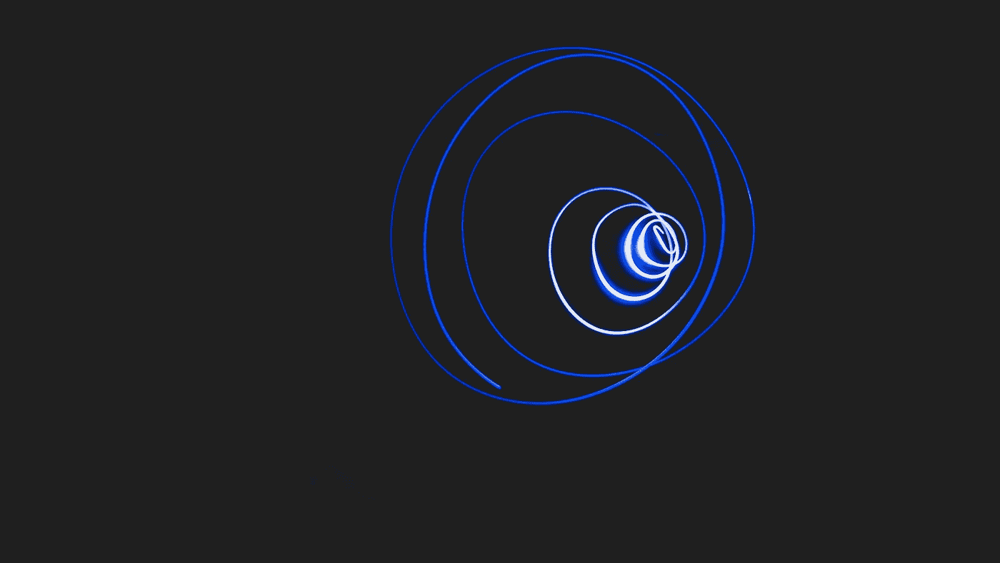
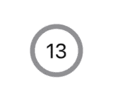
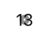
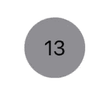

# 如何用 SwiftUI 显示圆圈内的文本

> 原文：<https://levelup.gitconnected.com/how-to-show-text-inside-a-circle-with-swiftui-93a375d571f8>

这一次，我们将研究几种使用 SwiftUI 在圆内显示文本标签的方法。我们将使用`ZStack`视图、`.background`和`.overlay`修改器更深入地研究三种不同的方式。最后，作为一个小奖励，我们将看看如何使用`.clipShape`修饰符在一个圆上显示一个文本标签。



奥克塔维奥·福萨蒂在 [Unsplash](https://unsplash.com/?utm_source=medium&utm_medium=referral) 上拍摄的照片。

我们的最终目标是这样的:



# 用`ZStack`布局

`ZStack`swift ui 中有一个独特的视图，它将所有子视图一个接一个地显示出来。它的工作原理类似于 CSS 中的`z-index`。因此，让我们尝试显示一个`Circle`视图，然后在顶部显示`Text`视图。为了不让`Circle`填满整个屏幕，我们需要设置一个恒定的视图宽度和高度。

```
ZStack {
  Circle()
    .stroke(circleColor, lineWidth: 4)

  Text("13")
}
.frame(width: 40, height: 40)
```

# 练习`.background`修改器

现在让我们看看如何使用`.background`修改器。遗憾的是，苹果没有给我们提供任何关于如何使用它的文档，所以我们需要自己去努力理解它。我们可以检查源代码，并尝试理解这个视图修改器在做什么。

```
func background<Background>(_ background: Background, alignment: Alignment = .center) -> some View where Background : View
```

通过应用这个修饰符，我们需要传入一个`View`并可选地指定两个轴上的对齐。让我们设置如何将它用于我们的`Text`字段。这次我们不打算检查`alignment`参数。我们想显示一个圆形作为`Text`字段的背景。

```
Text("13")
  .background(
    Circle()
      .stroke(circleColor, lineWidth: 4)
      .padding(6)
  )
```



结果并不完全是我们想要的。为了改善它，我们需要在文字和圆圈之间留一些空间，这样看起来会更好一些。

为了在数字和圆圈之间有一个很好的间隙，我们可以使用`.padding()`修改器。现在，文字和圆圈之间有了一些喘息的空间。

```
Text("13")
  .padding()
  .background(
    Circle()
      .stroke(circleColor, lineWidth: 4)
      .padding(6)
  )
```


# 解开`overlay`修改器

这次苹果没有再提供文档说明。让我们来看看源代码。它相对简单，类似于`.background`修改器。

```
func overlay<Overlay>(_ overlay: Overlay, alignment: Alignment = .center) -> some View where Overlay : View
```

它将视图放在它的上面，而不是下面。我们不应该忘记在数字和圆圈之间有一个间隔的修饰词。使用前面的例子，将`background`改为`overlay`，我们会得到相同的结果。

```
Text("13")
  .padding()
  .overlay(
    Circle()
      .stroke(circleColor, lineWidth: 4)
      .padding(6)
  )
```

虽然看起来一模一样，但工作原理不同。如果我们想在顶部显示一个可交互的视图，这种方法很方便。假设我们想在顶部呈现一个可点击的按钮。我不会特别建议这样做，但它解释了这个想法。

# 额外收获:裁剪为形状

作为一个额外的提示，让我们看看如何使用`.clipShape`修饰符来显示填充了颜色的圆圈内的文本字段。`.clipShape`修改器将视图剪辑成一个特定的形状，我们应该将它作为参数传递。为此，我们可以使用苹果公司提供的几种形状，如圆形、胶囊形、矩形和更多的形状。或者我们可以借助`Path`轮廓自己画一个形状。自定义形状不在这篇博文的讨论范围之内。

```
Text("13")
  .padding()
  .background(circleColor)
  .clipShape(Circle())
```



# TL；速度三角形定位法(dead reckoning)

有了 SwiftUI，同样的事情在视觉上可以通过多种方式实现。使用`ZStack`将所有视图堆叠在文本上，可以在文本周围放置一个圆圈。另一种方法是使用`.background`或`.overlay`修改器。

# 链接

*   [样本代码](https://github.com/fassko/text-in-circle-swiftui)
*   `[ZStack](https://developer.apple.com/documentation/swiftui/zstack)` [文档](https://developer.apple.com/documentation/swiftui/zstack)
*   `[clipShape](https://developer.apple.com/documentation/swiftui/view/clipshape(_:style:)` [文档](https://developer.apple.com/documentation/swiftui/view/clipshape(_:style:)
*   [形状文件](https://developer.apple.com/documentation/swiftui/shape)
*   [绘制路径和形状教程](https://developer.apple.com/tutorials/swiftui/drawing-paths-and-shapes)
*   [路径文档](https://developer.apple.com/documentation/swiftui/path)
*   [SwiftUI 遮罩和覆盖图](https://ordinarycoding.com/articles/swiftui-masks-and-overlays/)