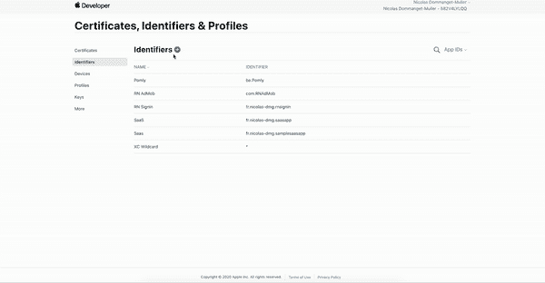
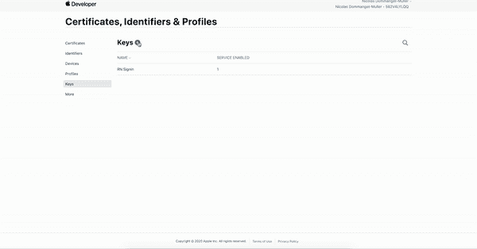
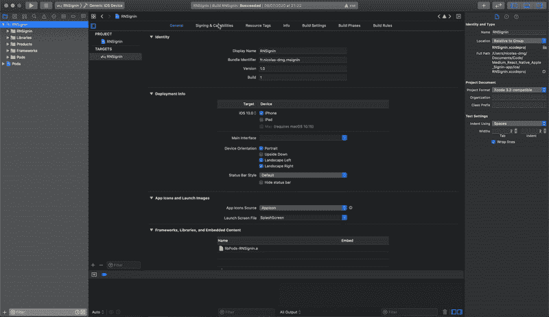
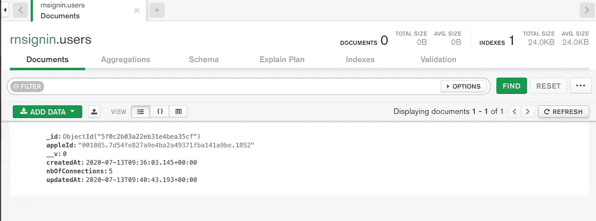

# 如何在 React Native 上“登录苹果”

> 原文：<https://levelup.gitconnected.com/how-to-sign-in-with-apple-on-react-native-4c445de5ff8c>

在 React Native 和 Node.js 上使用 Apple 认证用户的简单指南


Unsplash: [Sascha Sturm](https://unsplash.com/@saschasturm)

最近，我们的一个客户在 App Store 上被拒绝了，因为我们启用了第三方认证(脸书),但没有添加“登录苹果”。

所以，我们不得不处理它，并在我们的应用程序中实现“登录苹果”。我们希望拥有:

*   “使用 Apple 登录”按钮
*   链接“苹果帐户”与我们的后端帐户。

## 什么是“登录苹果”？

“登录 Apple”是一种鉴定方法，允许我们:

*   使用双因素身份验证保护帐户
*   给用户电子邮件或不给应用程序(如果没有，苹果会给一个别名)
*   获取用户信息
*   等等…

在本文中，我们将创建一个简单的登录系统，并计算用户登录的次数

# 设置

要阅读本文，您需要:

*   一个 React 土著(真的？😂)
*   苹果开发者账户
*   Node.js 后端

现在，我们将在苹果开发者网站上配置我们的应用。

## 创建您的应用 ID

在证书、标识符和配置文件>标识符上:



创建应用 ID

在 App ID 功能中添加“登录 Apple ”:


添加功能

## 创建密钥

现在应用程序 ID 已经准备好了，我们将创建一个密钥来与 Node.js 一起使用。这一次我们需要继续:证书、标识符和配置文件>密钥

并添加一个键:

*   给它一个名字
*   选中“登录 Apple”
*   配置“登录苹果”，选择你的应用程序 ID
*   注册密钥
*   **下载**(你将无法重新下载)



## 在 Xcode 中修改项目

创建应用 ID 和密钥后，您可以在 Xcode 上添加功能。

您需要选择如下开发团队:

在“签名和功能”中，选择您的开发团队:



然后，您可以添加一项功能:


# 添加登录按钮

我们的 app 已经可以使用“登录苹果”了。我们将通过使用**@蔗糖酶/react-native-apple-authentic ation**包来添加一个使用该方法的按钮:

```
yarn add @invertase/react-native-apple-authentication
```

对于这个例子，我已经用 Expo minimal (TypeScript)创建了一个项目。并在 App.tsx 上添加了如下的登录按钮:

登录的工作方式如下:

*   用户按下按钮->调用 onAppleButtonPress()
*   我们向苹果公司提出请求
*   我们获得用户凭证
*   如果用户被授权，我们调用 API

反应原生部分到此为止😎

# 我们的后端部分

如前所述，我们希望在 API 中将 Apple auth 链接到我们的帐户。我已经创建了一个示例 API，你可以在这里找到:[dmg.link/blog-apple-signin-api-repo](https://dmg.link/blog-apple-signin-api-repo)。如果你已经做了一个 REST API，你就会明白 HTTP 请求是如何处理的。因此，我们将只看到授权部分😉

我们可以创建一个控制器，它将:

*   从 Post 请求中获取令牌(AccessToken)
*   从 AccessToken 获取 Apple 数据
*   获取 appleId
*   统计用户的连接数
*   返回用户

如您所见，我正在从 utils 文件夹导入“AppleAuth”文件。此文件用于创建与 Apple 服务器的连接:

# 享受这个应用程序

我们的后端和应用程序现在已经准备好登录苹果。我们可以测试一下😎：

## 在应用程序上


演示应用程序

## 在数据库中



MongoDB 集合

我们可以看到用户通过 Apple ID 链接，并且已经登录了 5 次。

现在，你可以实现“用苹果登录”，让你的用户更快地登录。

GitLab 回购:

*   app:[dmg.link/blog-apple-signin-app-repo](https://dmg.link/blog-apple-signin-app-repo)
*   API:【dmg.link/blog-apple-signin-api-repo 

**你可以在这里** **找到我的其他文章并关注我** [**。感谢阅读，我希望你今天学到了一些新东西🚀**](https://dmg.link/blog)

[](/automate-your-react-native-app-with-fastlane-ea516b4a893) [## 使用浪子自动化您的 React 原生应用程序

### 简化截图、测试版部署、应用商店部署和 React 原生应用的登录🚀

levelup.gitconnected.com](/automate-your-react-native-app-with-fastlane-ea516b4a893) [](https://medium.com/swlh/how-to-use-face-id-with-react-native-or-expo-134231a25fe4) [## 如何在 React Native 或 Expo 中使用 Face ID

### 将生物认证应用到 React Native 或 Expo 应用中。让您的用户使用它登录。

medium.com](https://medium.com/swlh/how-to-use-face-id-with-react-native-or-expo-134231a25fe4)