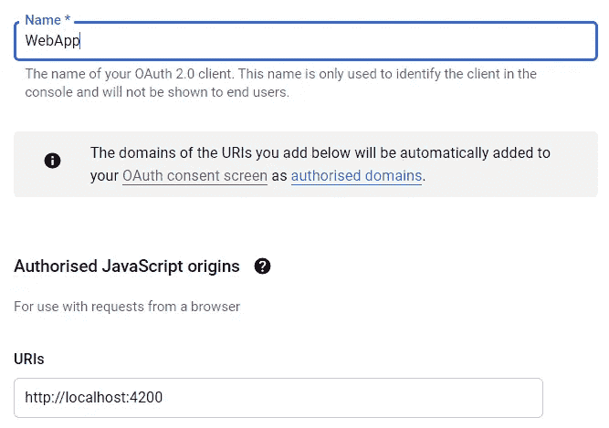

# 如何登录谷歌角和使用 JWT 为基础的？网络核心 API 认证(RSA)

> 原文：<https://levelup.gitconnected.com/how-to-sign-in-with-google-in-angular-and-use-jwt-based-net-core-api-authentication-rsa-6635719fb86c>


本指南向您展示了构建一个 **Angular SPA** 的所有步骤，其中**侧重于认证**。单页网络应用程序使用谷歌和 **angularx-social-login** 进行**登录。**。NET Core** 认证后端创建**非对称签名令牌**来访问另一个 **REST-API** 。该样本完全正常工作，可以作为类似微服务架构的基础。**

*认证工作流程及涉及组件:*


# 本指南的背景和结构

当我想创建这种应用程序时，我发现许多描述显示了它的一部分。**本指南将各个部分汇集在一起。它是结构化的，因此您可以在继续下一步之前有选择地测试每一步。**

本指南主要关注关键方面。我链接到其他文章以获得详细信息和工具的下载位置。我使用 [Visual Studio 社区](https://visualstudio.microsoft.com/en/vs/community/)进行 ASP.NET 核心 3.1 开发。

## 内容

1.  创建角度应用程序
2.  添加登录功能
3.  中的身份验证 API。网络核心后端
4.  使用身份验证 API
5.  使用访问令牌来调用服务 API
6.  最后的想法和展望

# 1.创建角度应用程序

**下载安装**[**Node.js/NPM**](https://nodejs.org/en/download/)**。**

创建文件夹`C:\dev`并打开命令提示符。

**安装 Angular** (我在编写本指南时使用 Angular 9):

```
C:\dev>npm install -g @angular/cli
```

**创建应用:**

```
C:\dev>ng new SampleAuthentication
```

**安装 angularx 社交登录模块**

```
C:\dev>npm install angularx-social-login
```

## (可选)测试应用程序

启动应用程序，在浏览器中打开它，看看是否一切正常:

```
C:\dev>ng serve
```

*延伸阅读:* [*认识棱角并创造你的第一个应用*](https://javascript.plainenglish.io/understanding-angular-and-creating-your-first-application-4b81b666f7b4) *由* [*重力井(罗布·汤姆林)*](https://medium.com/u/4a1da74ae506?source=post_page-----6635719fb86c--------------------------------)

# 2.添加登录功能

## 从谷歌获得一个客户 ID

在[谷歌开发者控制台](https://console.developers.google.com/)中为你的应用创建一个配置。并将 Angular 调试服务器的 URL(http://localhost:4200)添加为“授权的 JavaScript 源”:



**获取谷歌为你创建的应用程序客户端 ID** 。复制客户端 ID。您将在本指南的后续步骤中用到它。


## 配置社交登录模块

使用您的 google 客户端 ID，在 app.module.ts 的提供商部分激活社交登录模块:

上面的代码还添加了 HttpClient 模块，本指南后面会用到它。

*延伸阅读:* [*谷歌角状认证*](https://medium.com/@danilrabizo/google-authentication-in-the-angular-application-e86df69be58a) *由* [*丹尼尔·拉比佐*](https://medium.com/u/611a7387c87b?source=post_page-----6635719fb86c--------------------------------)

## 创建登录代码

编辑应用程序.组件. ts

编辑 app.component.html

## (可选)测试登录

启动应用程序

```
c:\dev>ng serve
```

在浏览器中打开应用程序 URL，点击“使用 google 登录”打开登录对话框。**使用您的 google 凭据登录**:


**您现在已经登录:**


**使用 chrome 浏览器** [**的调试器**](https://www.google.com/intl/de_de/chrome/) **获取 idToken** 等信息:


Google 在每次登录时都会创建一个新的 idToken。令牌仅在短时间内有效。

复制 idToken。如果您想要手动测试 API，您将在本指南的下一步中需要它。

# 3.中的身份验证 API。网络核心后端

身份验证 API 将使用来自 google 的 idToken 并对其进行验证。然后，它创建一个访问令牌，授予对应用程序的其他 API 的访问权限。

> 在生产环境中运行这段代码之前，您必须提高安全性:更短的令牌生命周期和刷新，可能使用会话代替令牌，等等。

**用 ASP.NET 和 web 开发工作量安装** [**Visual Studio 社区**](https://visualstudio.microsoft.com/en/vs/community/) (免费)。创建一个 ASP.NET 核心 Web API 项目。

## idToken 的验证

使用 Visual Studio 包管理器**安装 google 认证包** :
`Install-Package Google.Apis.Auth`

**创建一个 API 来验证 idToken。**

**将** `**settings.Audience**` **中的值更改为您在本指南第一步中创建的 google 客户端 ID** :

对`GoogleJsonWebSignature.ValidateAsync`的调用将在出错时抛出。`Authenticate`方法使用`JwtGenerator`类创建并返回一个定制的访问令牌。

## 在中创建自定义访问令牌。使用非对称签名的. NET 核心

使用非对称 JWT 签名，只有身份验证服务知道私钥。认证服务使用私钥来签署访问令牌，而其他 API 仅使用公钥来验证访问令牌。

**添加** `**JwtGenerator**` **类**，即生成令牌:

JwtGenerator 使用从 UserController 传递的私钥。**将密钥添加到 appsettings.json** ，用户控制器从这里读取密钥。

您可以使用我的私钥进行测试，但是您必须创建自己的私钥-公钥对以供生产使用。您还必须调整令牌的生命周期等。供生产使用。

*延伸阅读:*[*ASP.NET 核心*](https://edstefanescu.medium.com/jwt-authentication-with-asymmetric-encryption-using-certificates-in-asp-net-core-7790d3ce499)*[*爱德华【斯特凡内斯库】*](https://medium.com/u/28f44cc82906?source=post_page-----6635719fb86c--------------------------------) *使用证书进行非对称加密的 JWT 认证。这个故事还展示了如何创建自己的公钥-私钥对。**

***编辑 Startup.cs，**配置 ASP.NET 核心后端以使用配置，允许从 Angular 客户端访问，等等。：*

# *4.使用身份验证 API*

*配置。HTTPS 端口 5001 上调试模式下的 NET Core API 项目:*

**

*在 Visual Studio 中启动身份验证 API:*

**

## *(可选)手动访问身份验证 API*

*使用 [postman](https://www.postman.com/downloads/) 访问位于`https://localhost:5001/user/authenticate`的 API*

*发布您在本指南第二步中从 Chrome 调试器复制的 idToken:*

**

## *从应用程序调用身份验证 API*

*使用 Angular HttpClient 将 idToken 发送到身份验证 API。**修改 app.component.ts** :*

*   *第 5 行:导入 HttpClient*
*   *第 21 行:发送 idToken*

## *(可选)测试应用程序中的工作流*

*按照本指南的第一步进行操作。*

*启动应用程序*

```
*c:\dev>ng serve*
```

*登录并使用调试器，登录 chrome 浏览器，验证调用后端和接收生成的访问令牌是否正常工作:*

**

*如果您想在本指南的下一步中进行手动测试，请复制访问令牌。*

# *5.使用访问令牌来调用服务 API*

*来自身份验证 API 的访问令牌将授予对这个新服务 API 的访问权。*

***创建一个 ASP.NET 核心 Web API 项目**，并在 HTTPS 端口 5002 上配置调试模式:*

**

***安装 JwtBearer 包** :
`Install-Package Microsoft.AspNetCore.Authentication.JwtBearer`*

***添加控制器:***

***编辑 Startup.cs** 。我花了一些时间来配置令牌的验证。身份验证 API 的相应私钥的公钥用于验证令牌。困难的部分是注入公钥。有关详细信息，请参见源代码中的注释:*

## *(可选)使用 postman 访问服务 API*

*使用 [postman](https://www.postman.com/downloads/) 通过 HTTP GET at: `https://localhost:5002/secured`访问服务 API*

*在本指南的前一部分，您在 Chrome 调试器中复制了访问令牌。**将其作为无记名令牌添加到呼叫中**:*

**

## *本指南的最后一步:使用应用程序访问服务 API*

***修改 app.component.ts** 向服务 API 发布访问密钥:*

***您成功访问了受保护的服务 API:***

**

# *6.最后的想法和展望*

***您的应用程序现已完全运行！**但这只是一个示例应用程序，你必须**清理代码**和**应用安全最佳实践**，也许使用更安全的 OAuth 流程，使用 Angular 和。NET 核心设计模式、错误处理等。在生产中使用。你还需要自己的私有-公共密钥对(参见爱德华·斯特凡内斯库的《使用 ASP.NET 核心中的证书进行不对称加密的 JWT 认证》。*

*你可以**添加其他提供商**比如 facebook 或者你自己的账户数据库。另见我的**后续故事**:*

*   *[如何使用 **NSwag 自动生成 TypeScript 客户端**访问。NET 核心服务 API，并使用 **OpenAPI/Swagger** 来描述 API](/how-to-jwt-authenticate-with-angular-to-an-asp-net-4cfab5298d08)*
*   *[如何**部署？NET Core API 和 Angular App 作为微服务使用 **Ingress** 对 Kubernetes** 和使用 **Docker Desktop**](https://dev.to/christianzink/how-to-build-an-asp-net-core-kubernetes-microservices-architecture-with-angular-on-local-docker-desktop-using-ingress-395n) 对 local 进行开发*

*如果您有任何问题、想法或建议，请联系我。*