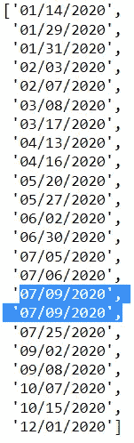

# 如何用 Python 模拟和可视化生日悖论

> 原文：<https://levelup.gitconnected.com/how-to-simulate-and-visualize-the-birthday-paradox-using-python-528d304f215b>

## 一堂 5 分钟的 Python 课:

## 通过编码提高你对概率的理解


豪尔赫·依班娜在 [Unsplash](https://unsplash.com?utm_source=medium&utm_medium=referral) 上的照片

# 什么是生日悖论？

有一天在工作中，我的一个同事带着礼物进来庆祝他的生日。当我们都聚集在他的办公桌旁吃零食和聊天时，有人提到公司的另一个人也是同一天生日。这让我想到了老 T4 的生日悖论，它提出了一个问题:

> **在一群人中，两个人同一天生日的可能性有多大？**

我知道我们都想在自己特别的日子里感到特别，但数学显示，在一个只有 23 人的团体中，大约有 50/50 的机会有人同一天过生日。在一个 70 人的团体中，有 99.9%的机会是同一天生日。由于我在一家雇用数百人的公司工作，我想知道是否有人真的和我同一天生日？🤔


照片由[罗伯特·安德森](https://unsplash.com/@fochrist1?utm_source=medium&utm_medium=referral)在 [Unsplash](https://unsplash.com?utm_source=medium&utm_medium=referral) 上拍摄

# 使用 Python 探索问题

在深入研究公式之前，让我们首先剖析这个问题，并编写一个强力示例，输出组大小为 N 的随机生日，这样我们就可以尝试对这个问题有一些直觉。当然，我们首先假设每个出生日期发生的可能性相同。

请记住，我们不需要担心年份，只需要担心月份和日期，因此我们可以简单地提供一个开始日期，并随机添加 N 次日期来生成生日列表。使用 [**datetime** 库](https://docs.python.org/3/library/datetime.html)，我们可以生成 2020 年 1 月 1 日的开始日期。然后使用[](https://docs.python.org/3/library/datetime.html#timedelta-objects)****从库中，通过 0 到 366 之间的随机整数值修改开始日期(因为 2020 年有闰日)。****

****创建一个名为 **generate_birthdays** 的函数，它接受一个**int**value***group _ size***。也导入所需的依赖项:****

```
**from datetime import datetime, timedelta
import randomdef generate_birthdays(group_size):**
```

****然后通过为 2020 年 1 月 1 日创建一个日期时间对象来添加 **jan_first** 变量:****

```
**def generate_birthdays(group_size):
    jan_first = datetime(2020, 1, 1)**
```

****从这里，我们可以使用[列表理解](https://towardsdatascience.com/my-trick-to-learning-list-comprehensions-in-python-8a54e66d98b)来制作一个随机生日列表:****

```
**def generate_birthdays(group_size):
    jan_first = datetime(2020, 1, 1)
    birthday_list = [(jan_first + timedelta(days=random.randint(0, 366))).strftime("%m/%d/%Y") for i in range(group_size)]**
```

****注意，我将 [strftime("%m/%d/%Y")](https://docs.python.org/3/library/datetime.html#strftime-and-strptime-behavior) 追加到 datetime 值，以便将对象输出为字符串，使其更易于阅读。****

****最后，返回一个排序后的生日列表，这样我们就可以很容易地发现重复的出生日期。下面是完整的函数:****

```
**def generate_birthdays(group_size):
    jan_first = datetime(2020, 1, 1)
    birthday_list = [(jan_first + timedelta(days=random.randint(0, 366))).strftime("%m/%d/%Y") for i in range(group_size)]
    return sorted(birthday_list)**
```

****使用 *group_size* = 23 运行函数，因为我们想要检查给定一组 23 个人，是否真的有 50/50 的机会共享生日。请记住，由于日期是随机的，所以您的输出不会与我的相匹配。****

```
**generate_birthdays(23)**
```

********

****generate_birthdays 的输出(23)****

****正如我们在示例输出中看到的，我们的生日列表包含一个副本！现在，如果我们想深入了解共同生日发生的概率，我们可以运行这个函数 X 次并记录我们的结果。当然有可能，但手工操作也很繁琐。幸运的是，我们可以通过编写更多的函数来告诉我们该列表是否包含重复项，从而让 Python 来为我们完成这项繁琐的工作:****

```
**def shared_bday(group_size):
    birthdays = random_birthdays(group_size)
    #print(birthdays)
    for a, birthdayA in enumerate(birthdays):
        for b, birthdayB in enumerate(birthdays[a + 1 :]):
            if birthdayA == birthdayB:
                return True**
```

****该函数接受 *group_size* 并生成一个生日列表。然后，它遍历生日列表，将每个生日与列表中的其他生日进行比较。如果两个生日匹配，该函数返回 True。****

****由于我们不想手动统计输出，我们可以编写最后一个函数来运行 X 次试验的 **shared_bday** ，然后返回 shared_bday 为真的次数之和除以 X 次试验，以获得 0 到 1 之间的概率值:****

```
**def generate_trials(group_size, trials):
    counts = []
    for i in range(trials):
        if shared_bday(group_size) == True:
            counts.append(1)
    return sum(counts)/trials**
```

****使用 *group_size* = 23 和 *trials* = 10000 运行该功能。请注意，返回值始终为~0.50，这表明在 10，000 次试验中，大约有 50%的情况下，一组 23 个人中至少有两个生日共享同一天。****

# ****一个更简单的解决方案和可视化的概率****

****虽然我们的强力解决方案给了我们一个答案，但有一个更简单的方法来计算概率，并且使可视化概率变得轻而易举。与其试图计算同一天生日的概率，不如计算没有同一天生日的概率，并从 1:****

*****P* ( *共享生日*)= 1*P*(*无共享生日*)****

## ****找不到共享生日****

****为了使数学更容易解释，让我们假设我们有一个 5 人小组。人 A 必须有生日，并且是 366 天中的一天。人 b 的生日也是 366 天中的一天……我们可以简单地写成 366⁵，而不是 366 x 366 x 366 x 366 x 366****

****因为生日不能共享，所以人 A 有 366 个可能的日子，但是人 B 只有 365 个，而人 C 只有 364 个…等等。使用 Python，我们可以为一个 5 人小组求解如下等式:****

```
**1 - (366 * 365 *364 * 363 * 362) / 366**5
=.027**
```

****使用循环的*,我们可以生成一系列群体大小的概率，创建一个字典，并将群体大小和概率加载到[熊猫数据帧](https://pandas.pydata.org/docs/reference/api/pandas.DataFrame.html)中。一旦进入数据帧，我们可以使用 [Plotly express](https://plotly.com/python/line-charts/) 创建一个交互式图形:*****

```
**#import dependencies
import pandas as pd
import plotly.express as px#set number of days in a year
numerator = 366
denominator = 366#create empty list to store dictionary
probabilities = []#for loop to generate probabilities
for i in range(2, 100):
    numerator = numerator * (366 + 1 - i)
    denominator = denominator * 366
    probabilities.append({'group_size':i, 'probability':round(1 - (numerator / denominator), 3)})
    #print(round(probabilities, 3))#load dataframe
df = pd.DataFrame(probabilities)#graph probabilities
fig = px.line(df, x='group_size', y='probability', title='Probability of Sharing B-Day')
fig.show()**
```

********

****概率图(作者图片)****

****正如我们再次看到的，23 人的组返回 0.506 的概率。Plotly 图形是交互式的，可以很容易地看到沿着绘制线的任何 group_size 值的概率。****

# ****结束语****

****生日悖论是一个大问题，因为它揭示了指数的非直观性。使用 Python 探索这个问题允许我们用不同的方法解决它。通过理解问题和解决方案，它有助于训练大脑从不同的角度看待问题，因为不用暴力解决生日悖论的技巧是首先计算在小组内共享生日的可能性有多大。****

# ****谢谢大家！****

*   *****如果你喜欢这个，* [*关注我的 Medium*](https://medium.com/@erickleppen) *了解更多*****
*   ****[*通过订阅*](https://erickleppen.medium.com/membership) 获得完全访问权限并帮助支持我的内容****
*   *****我们连线上*[*LinkedIn*](https://www.linkedin.com/in/erickleppen01/)****
*   *****用 Python 分析数据？查看我的* [*网站*](https://pythondashboards.com/)****

****[**—埃里克·克莱本**](http://pythondashboards.com/)****