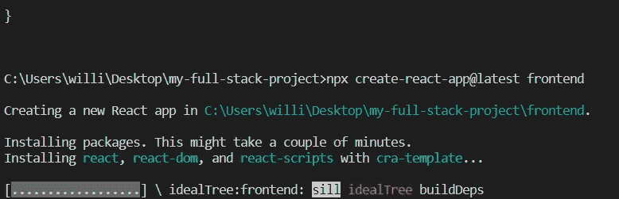

# 如何在一个文件夹中同时运行您的全栈应用的客户端和服务器实例。

> 原文：<https://levelup.gitconnected.com/how-to-simultaneously-run-the-client-and-server-of-your-full-stack-app-in-one-folder-ef5a988d56d7>

你有没有想过如何同时运行你的全栈应用的前端和后端部分？拿着我的咖啡，让我们开始喝吧。

假设您正在构建一个全栈应用程序，在前端使用 React，在后端使用 Nodejs & ExpressJs。第一步是创建您希望项目所在的目录。

用于创建工作目录的 Shell 命令

完成后，您可以继续编写下一系列命令，或者用代码编辑器打开目录。您可以通过使用命令“cd folder-name”检查目录，然后输入“code”来做到这一点

如何用代码编辑器(已经安装)打开目录

用代码编辑器打开的目录

下一步是在代码编辑器中打开终端，为此，同时按住 CTRL + J。

航站楼开放了

接下来要做的是初始化我们的项目，在您的终端中，输入“npm init -y”

项目已初始化

您可以稍后编辑 package.json 文件，因此对于我们的前端，让我们使用 React。在同一个目录下，输入以下命令:“npx create-react-app @ latest frontend”。“前端”是一个任意的词，我想用它来命名我们的前端应用程序，你可以随意命名。

启动我们的前端应用程序。

前端应用程序已创建，控制台已清空

出于本教程的目的，我们不会创建一个具有 API 和特性的全栈应用程序，目标是让后端和前端同时运行。注意，让我们创建一个后端文件夹，在项目根文件夹中，输入“mkdir backend”。“后端”再次是一个任意的词。

后端文件夹已创建

就像我们在根目录中所做的一样，让我们初始化后端文件夹，

检查后端目录并输入“npm init -y”

后端应用程序已初始化

只是为了让它正常工作。在后端文件夹中创建一个文件，命名为 index.js 并在其中写一些东西，简单的如“Hello World”。

您可以通过在终端中运行“node index.js”来测试它是否工作，正如您在上面的图像中看到的，它运行了。现在完成了，让我们进入后端文件夹中的 package.json 文件，而不是根目录中的文件，添加一个启动脚本，如下所示:

要测试它，在后端文件夹中，输入“npm start”。

因此，让我们创建一个简单的连接，安装 express 和 nodemon，express 将是一个依赖项，nodemon 将是一个 devdependency，要检查依赖项和 devdependency 之间的区别，请检查以下链接:[https://stack overflow . com/questions/18875674/whats-the-difference-between-dependencies-dev dependencies-and-peer dependencies](https://stackoverflow.com/questions/18875674/whats-the-difference-between-dependencies-devdependencies-and-peerdependencies)

让我们安装 express 和 nodemon，对于 express，“npm i express”就足够了，对于 nodemon，“npm i nodemon -D”将安装它，确保您仍然在后端目录中。您将看到以下结果:

已安装的依赖项反映在 package.json 文件中

在 index.json 文件中，键入以下代码:

启动我们服务器的简单代码

第 16 -18 行简单地为我们创建了一个简单的 API，在 localhost:5000 上有一个响应消息，为了测试这个简单的 API，让我们在我们的浏览器上转到 localhost:5000，您应该看到以下内容:

现在，让我们使用 nodemon，nodemon 只是用于热重载，热重载在我们保存文件或在开发过程中进行更改时重启我们的服务器，而不是每次都必须手动重启。要实现它，请转到 package.json，将启动脚本中的“node”替换为“nodemon”。

Nodemon 已实现

活动中的节点

既然已经解决了，让我们集中精力同时启动后端和前端。我省略了前端的操作，因为“create-react-app”附带了一个我们可以使用的脚本模板，“npm start”适用于 react。

React 应用包. json

让我们转到项目的根目录，为此，输入以下内容:“cd../"在后端目录中，这将引导我们到根目录。

在根目录下，让我们“并发”安装，npm 包将帮助我们同时运行后端和前端。完成后，转到根文件夹中的 package.json，并在脚本部分键入以下内容:

同时运行前端和后端的脚本。

我将解释服务器，客户端和开发脚本同步意味着什么。

“服务器”脚本代表启动服务器的命令，在 backend package.json 中，我们已经指定了它，前缀“-”指示代码在后端目录中运行命令，同样的事情发生在“客户端”脚本中，该命令是为了确保前端应用程序启动。命令“npm run dev”将运行“dev”脚本，它使用“concurrently”关键字同时运行两个脚本，如下所示:

对于 React，默认端口是 3000，我们为后端服务器选择了 5000。运行脚本后，在浏览器中分别检查 http://localhost:3000 和 [http://localhost:5000](http://localhost:5000) ，您将看到前端和后端实例同时运行。

我是威廉·派普，谢谢你来听我的 Ted 演讲。😃♥️