# 如何使用频率计数器求解算法

> 原文：<https://levelup.gitconnected.com/how-to-solve-an-anagram-algorithm-using-a-frequency-counter-5bb1f0b817ef>

如果你正在学习如何解决算法，也许是为了准备一个技术面试，你可能学会使用的第一个策略是频率计数器。这是一个相当简单的工具，可以用在不同难度的不同算法中。一旦你掌握了窍门，并学会了识别何时使用它，你可能会发现你已经让算法对你自己来说不那么可怕了。

另一个计数的好方法

我将一步一步地演示如何在一个有点简单的算法中使用频率计数器——检查两个单词是否是彼此的变位组合。我将在本指南中使用 JavaScript，我将解释每一个步骤，这样即使是对算法或编码完全陌生的人也能理解。可能有更有效的方法来解决这个问题，但这是一个简单而有效的方法。

*   当然，你要做的第一件事是声明一个函数。

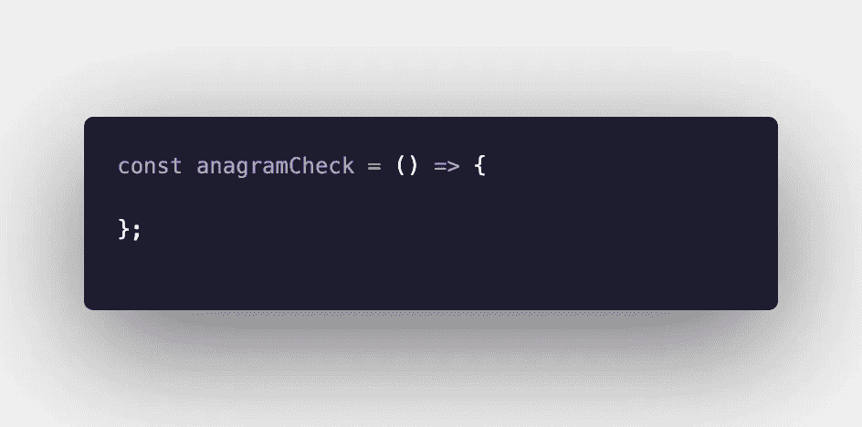

*   因为我们需要比较两个单词，所以我们需要传入两个参数。

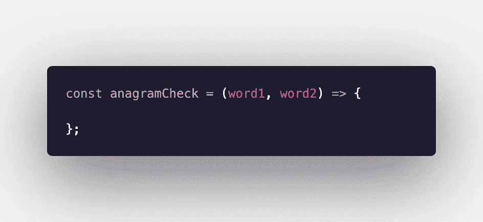

*   频率计数器将成为一个对象，所以我们需要初始化一个空对象。

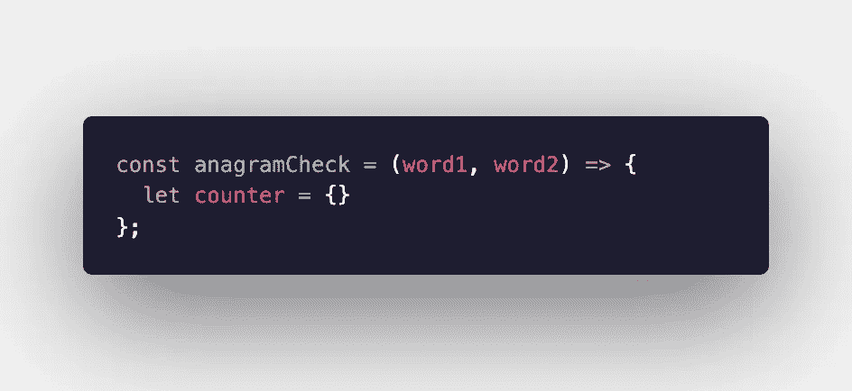

*   如果两个单词都包含相同次数的相同字母(即它们是变位词)，我们希望该函数返回“真”，否则返回“假”。如果这两个单词包含的字母数量不同，我们无需做任何其他事情就可以立即知道它们不是变位词。我们可以用一个简单的 if 语句来实现。

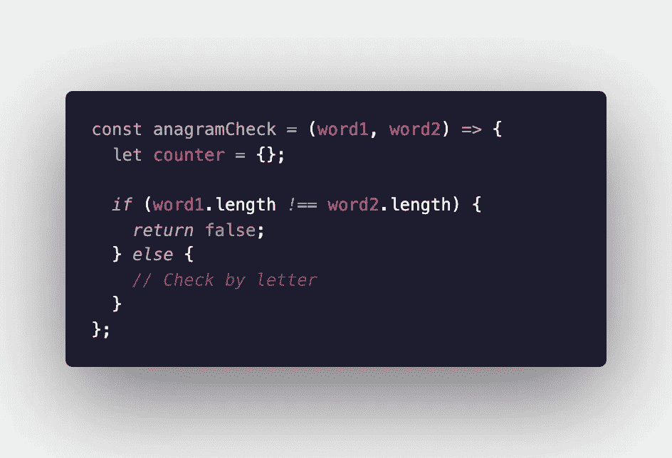

如果单词长度不同，则返回 false。否则，我们可以继续。

*   我们想要迭代第一个单词中的每个字母。我们可以用许多不同的方法做到这一点。我选择用 for…of 循环来做这件事。

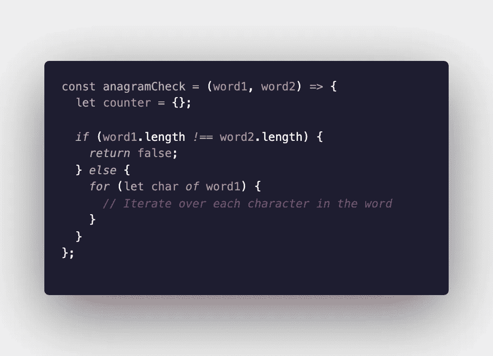

*   在这个循环中，我们想要建立我们的频率计数器。我选择用三元运算符来实现这一点。三元运算符的前三分之一检查计数器对象是否有任何键-值对，其键等于被迭代的单词中的字符。如果是，它会将该键的值加 1。如果它还不存在，它会添加键并将值设置为 1。

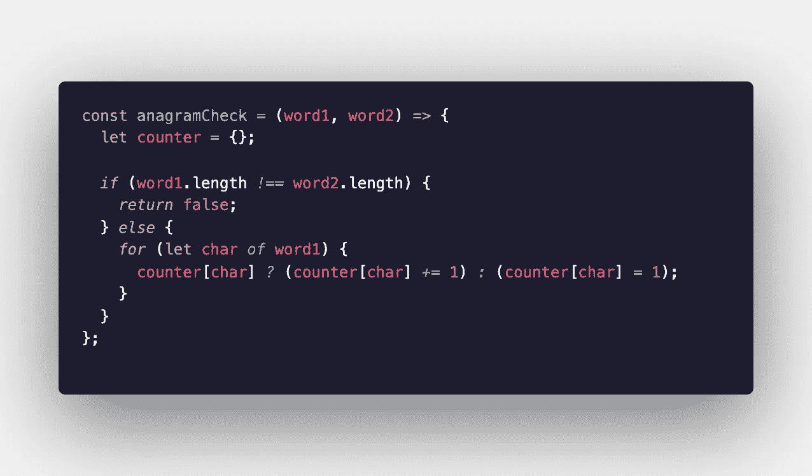

此时，如果我们打印或 console.log()计数器对象，我们将看到:

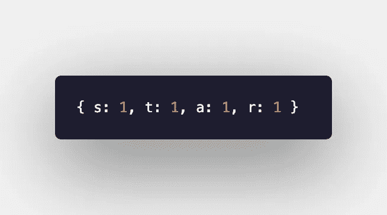

我传入单词“star”，但是您的函数将为您传入的任何单词返回类似的结果。

*   接下来，我们想对第二个单词做一些类似的事情，做一些小的改动。同样，三元运算符检查该字母是否已经作为一个键存在于频率计数器中。这一次，如果在计数器对象中找到了字母，我们希望将计数减一。如果没有找到(即第二个单词中有一个字母在第一个单词中不存在)，我们可以立即返回“false”。

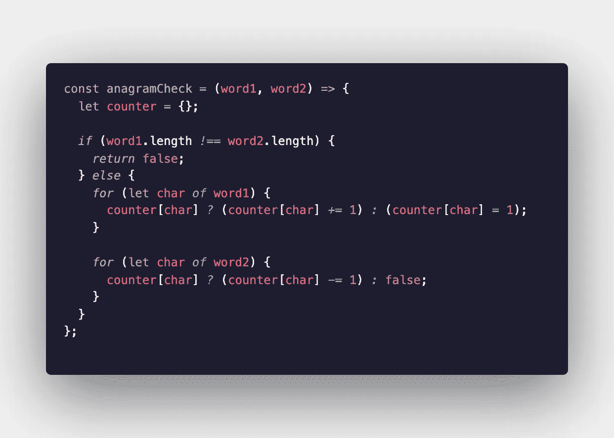

此时，如果我们传递了两个互为变位词的单词，频率计数器应该是这样的:

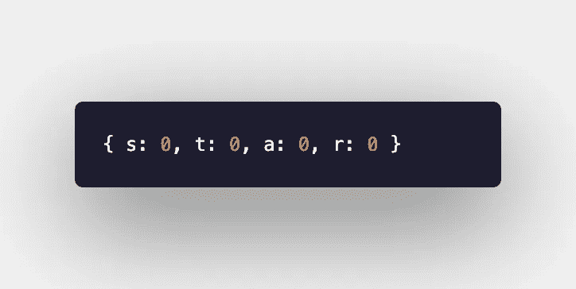

*   现在我们只需要检查我们的频率计数器，看看我们的话是不是字谜。我选择用 for…in 循环来做这件事。'

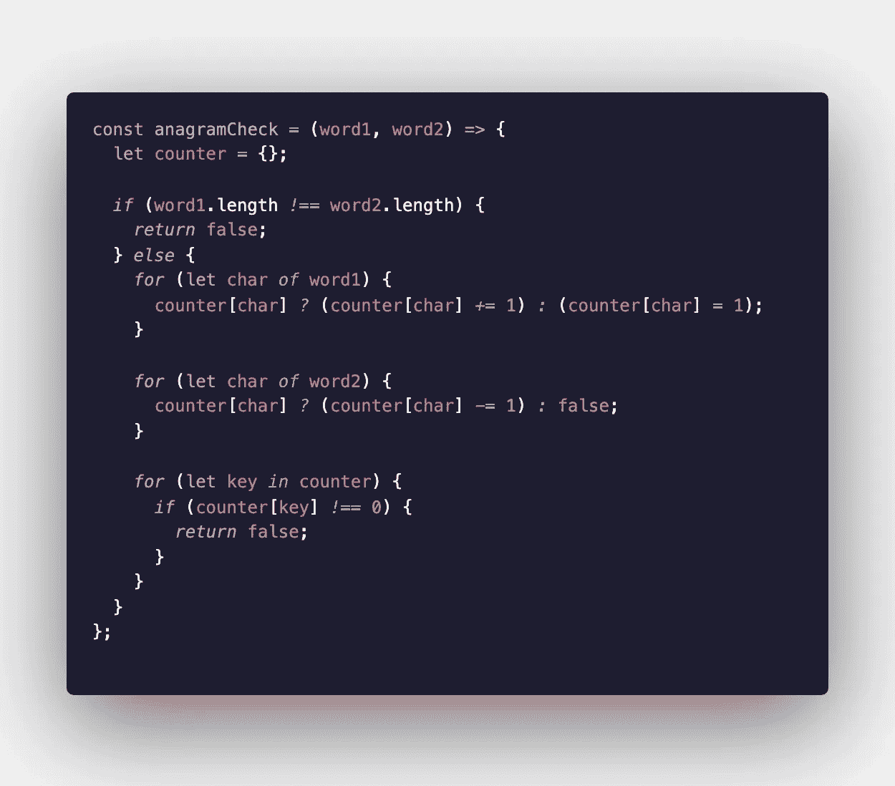

对于计数器对象中的每个键，如果该键的值不等于零，则返回 false。

如果我们已经做到了这一步，并且没有返回“false”，那么我们知道我们传入的两个单词是变位词，我们可以返回“true”我们想在任何循环之外，在函数的末尾这样做。

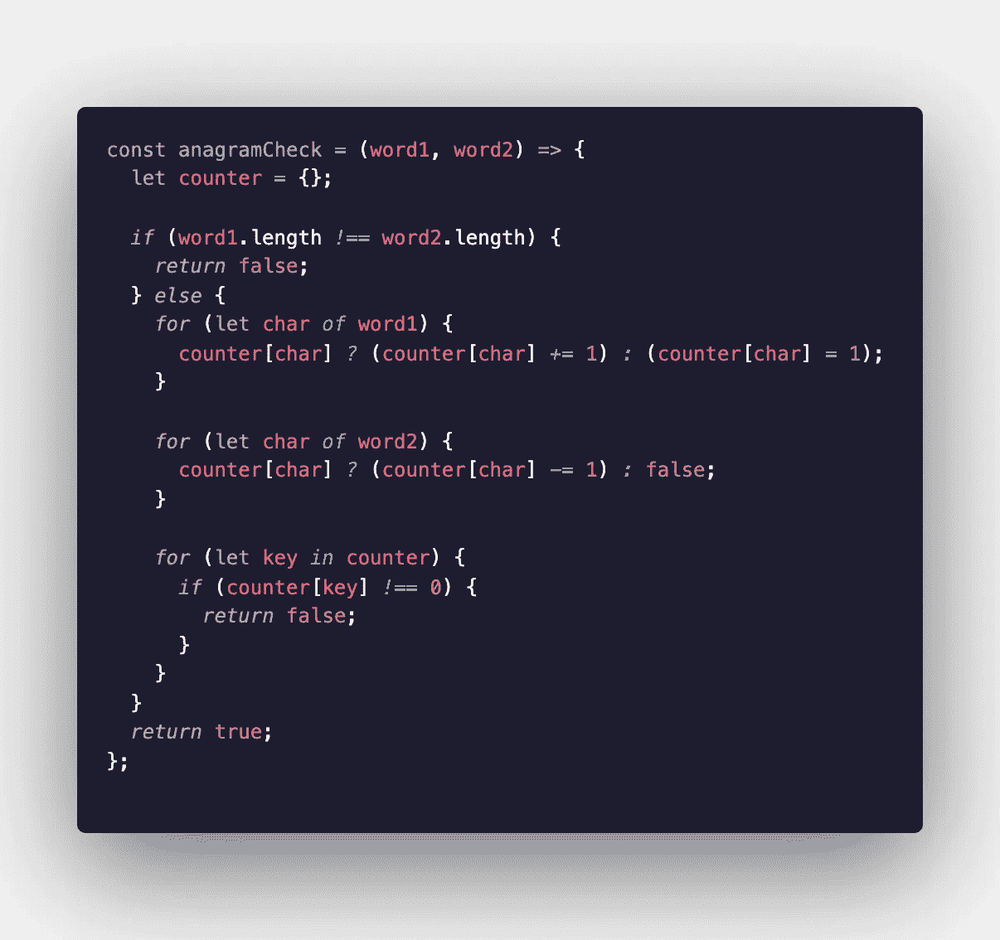

我们做到了！一个关于如何做一些事情的极其冗长和详细的答案，希望现在看起来相当简单！如果你一直在努力建造频率计数器，我希望这能帮助你弄明白它们！

阿曼达·特劳特勒