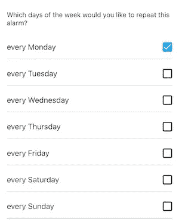

# 如何用 Swift 中的按位运算符解决问题

> 原文：<https://levelup.gitconnected.com/how-to-solve-problems-with-bitwise-operators-in-swift-90c370502ece>

## 学习使用 iOS 中的位运算和选项集。


最近，我不得不在工作中解决以下任务。

服务器发送一个在`0`和`127`之间的整数值，表示工作日选择的状态。当服务器发送一个`0`时，不应选择任何复选框。对于`127`，应选择所有复选框。中间的数字代表所有其他状态。任务是评估该值，以便能够预先选择适当的复选框。



当我们想象每个工作日由其位值表示时，整数值背后的逻辑很简单:

```
mon tue wed thu fri sat sun 
0000000 - equals 0 - no weekday is selected 
0000011 - equals 3 - sat sun are selected 
1010101 - equals 85 - mon wed fri sun are selected 
1111100 - equals 124 - mon tue wed thu fri are selected 
1111111 - equals 127 - all days are selected
```

使用这种模式，我们能够用从 0 到 127 的数字来表示这七个复选框的每一种状态。


那么，我们如何将服务器发送的数字转换成正确的复选框状态呢？

# 琐碎的解决方案

我们想到的第一种方法可能是这样的:

```
switch weekdaysSelectionValue {
    case 0:
        monCheckbox.isChecked = false
        tueCheckbox.isChecked = false
        wedCheckbox.isChecked = false
        thuCheckbox.isChecked = false
        friCheckbox.isChecked = false
        satCheckbox.isChecked = false
        sunCheckbox.isChecked = false
    case 1:
        monCheckbox.isChecked = false
        tueCheckbox.isChecked = false
        wedCheckbox.isChecked = false
        thuCheckbox.isChecked = false
        friCheckbox.isChecked = false
        satCheckbox.isChecked = false
        sunCheckbox.isChecked = true
    .
    .
    .
    case 127:
        monCheckbox.isChecked = true
        tueCheckbox.isChecked = true
        wedCheckbox.isChecked = true
        thuCheckbox.isChecked = true
        friCheckbox.isChecked = true
        satCheckbox.isChecked = true
        sunCheckbox.isChecked = true 
}
```

拥有 127 种开关情况非常有趣，但是让我们看看一种更通用的方法，用按位运算符来解决这个问题。

```
monCheckbox.isChecked = // get bit on position 6 & check if it's 1
tueCheckbox.isChecked = // get bit on position 5 & check if it's 1
wedCheckbox.isChecked = // get bit on position 4 & check if it's 1
thuCheckbox.isChecked = // get bit on position 3 & check if it's 1
friCheckbox.isChecked = // get bit on position 2 & check if it's 1
satCheckbox.isChecked = // get bit on position 1 & check if it's 1
sunCheckbox.isChecked = // get bit on position 0 & check if it's 1
```

为了实施上述解决方案，让我们看看如何在 Swift 中使用 bits。

# Swift 中的 bits 基础知识

一位是最小的信息，可以是 1 或 0。八位合在一起称为一个字节。Swift 中的无符号`UInt8`类型由 8 位表示，这意味着我们可以用`UInt8`表示 2⁸ = 256 个不同的数字，这对我们来说足够了，因为我们只需要 127 个数字。

```
UInt80 = 00000000 = 0 * 2^0              
1 = 00000001 = 1 * 2^0
2 = 00000010 = 0 * 2^0 + 1 * 2^1
3 = 00000011 = 1 * 2^0 + 1 * 2^1    
...
6 = 00000110 = 1 * 2^0 + 1 * 2^1 + 1 * 2^2   
...
255 = 11111111 = 1 * 2^0 + 1 * 2^1 + 1 * 2^2 + 1 * 2^3 + 1 * 2^4 + 1 * 2^5 + 1 * 2^6
```

有符号的`Int8`类型也表示 256 个不同的数字，但是范围从-128 到 127，因为最左边的位用于表示整数是正还是负。所以理论上，我们也可以为我们的任务使用一个`Int8`。

在 Swift 中，当定义一个数时，我们可以选择记下它的位表示:

```
let value1: UInt8 = 3
let value2: UInt8 = 0b00000011
```

在上面的例子中，`value1`和`value2`是相同的值，只是记下来的方式不同。我们可以像以前一样对它们使用基本运算符:

```
let value3 = 3 + 0b00000011 // 6
let value4 = 3 - 0b00000011 // 0
```

# Swift 中的按位移位和按位运算符

除了基本运算符之外，Swift 还提供高级运算符用于位操作。

```
0b00000011 | 0b00000101 // Bitwise OR operator produces 0b00000111 
0b00000011 & 0b00000101 // Bitwise AND operator produces 0b00000001
0b00000010 << 1 // Bitwise LEFT SHIFT operator produces 0b0000100
0b00000010 >> 1 // Bitwise RIGHT SHIFT operator produces 0b0000001
```

*   只有当两位都是`0`时，**或**操作符`|`才会产生一个`0`。否则产生一个`1`。
*   只有当两位都是`1`时，**和**操作符`&`才会产生一个`1`。否则产生一个`0`。
*   **左移**运算符`<<`将每一位向左移动一定的位数。任何超出界限的位都将被丢弃。
*   **右移**操作器`>>`在另一个方向与左移操作器操作相同。

我们可以用上面的运算符来解决我们的任务。如果你对这些运营商感兴趣，你可以查看官方文档。

# 位运算的解决方案

在这些操作员的帮助下，我们现在可以做到以下几点。

```
monCheckbox.isChecked = ((serverValue & 0b01000000) >> 6) == 1 
tueCheckbox.isChecked = ((serverValue & 0b00100000) >> 5) == 1 
wedCheckbox.isChecked = ((serverValue & 0b00010000) >> 4) == 1 
thuCheckbox.isChecked = ((serverValue & 0b00001000) >> 3) == 1 
friCheckbox.isChecked = ((serverValue & 0b00000100) >> 2) == 1 
satCheckbox.isChecked = ((serverValue & 0b00000010) >> 1) == 1 
sunCheckbox.isChecked = ((serverValue & 0b00000001) >> 0) == 1
```

这里到底发生了什么？让我们选择一个值来说明这一点。

**1。想象一下，我们从服务器得到一个`85`。那是一个`0b01010101`位表示。**

**2。现在，我们想知道星期五的复选框是否被选中。为此，我们使用 AND 运算符使所有位无效，而不是位置`2`上的位。**

```
0b01010101 & 0b00000100 // produces 0b000000100
```

**3。**接下来，我们想知道第二个位置上的值是`1`还是`0`。为此，我们将`2`位置向左移动，因此该值现在位于位置`0`。

```
0b000000100 >> 2 // produces 0b000000001
```

**4。**最后，我们可以用基本的`==`操作符检查我们产生的值是`0`还是`1`。

```
0b000000001 == 1 // is true
```

实际上，我们甚至可以不用移位来解决这个问题。我们可以检查我们的值是否不是`0`，而不是向右移动并检查值是否是`1`:

```
friCheckbox.isChecked = serverValue & 0b00000100 != 0
```

# 带选项集的解决方案

既然我们已经了解了如何用按位运算符来解决这个问题，现在甚至有了一个更简单的解决方案。Swift 标准库提供了代表位集类型的`OptionSet`,其中每个位代表该集的一个成员。

```
struct WeekdayOptions: OptionSet {
    let rawValue: Int static let sun = WeekdayOptions(rawValue: 1 << 0)
    static let sat = WeekdayOptions(rawValue: 1 << 1)
    static let fri = WeekdayOptions(rawValue: 1 << 2)
    static let thu = WeekdayOptions(rawValue: 1 << 3)
    static let wed = WeekdayOptions(rawValue: 1 << 4)
    static let tue = WeekdayOptions(rawValue: 1 << 5)
    static let mon = WeekdayOptions(rawValue: 1 << 6)
}
```

在将我们的工作日选项定义为一个`OptionSet`之后，我们可以免费获得它背后的所有逻辑。为了检查是否选择了星期一，我们现在可以简单地使用`OptionSet`的`contains`方法。

```
let weekdayOptions = WeekdayOptions(rawValue: serverValue)
monCheckbox.isSelected = weekdayOptions.contains(.mon)
```

尽管一个`OptionSet`使它变得简单，了解位操作符和它如何在幕后工作使它的用法更加清晰。

当然，一个`OptionSet`提供了更多有用的方法。你可以在[官方文件](https://developer.apple.com/documentation/swift/optionset)中查看。

*最初发表于*[](https://tanaschita.com/posts/20201214-working-with-bits-in-swift/)**。**