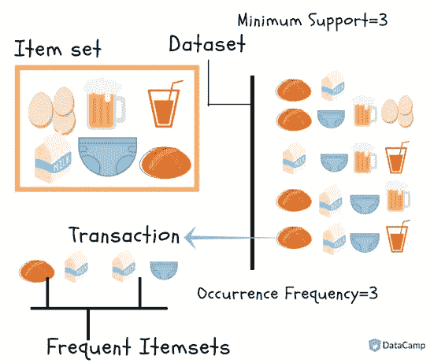
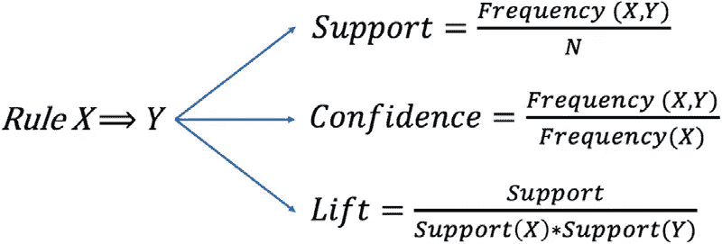
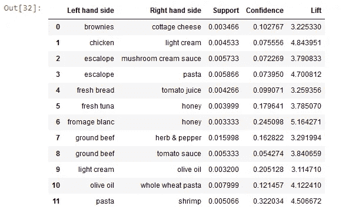

# 如何从零开始用简单的方法求解 Apriori 算法？

> 原文：<https://levelup.gitconnected.com/how-to-solve-the-apriori-algorithm-in-a-simple-way-from-scratch-9540cfc5c11a>


图像[来源](https://www.journaldev.com/44792/apriori-algorithm)

> 注意:图片的所有内容，包括表格、计算和代码都已经被我研究过了，没有必要引用任何参考资料。

# 介绍

[机器学习](https://www.javatpoint.com/machine-learning)有几种方法，如[关联](https://deepai.org/machine-learning-glossary-and-terms/association-learning)、[关联](https://medium.com/analytics-vidhya/what-is-correlation-4fe0c6fbed47)、[分类](https://towardsdatascience.com/machine-learning-classifiers-a5cc4e1b0623) & [聚类](https://machinelearningmastery.com/clustering-algorithms-with-python/)，本教程主要侧重于使用关联规则进行学习。通过关联规则，我们可以识别在一个表中同时出现的项目或属性的集合[1]。

# 关联规则学习

[关联](https://deepai.org/machine-learning-glossary-and-terms/association-learning)规则学习是[机器学习](https://www.javatpoint.com/machine-learning)中非常重要的概念之一，应用于**购物篮分析、Web 使用挖掘、连续生产等。**这里的购物篮分析是各大零售商用来发现商品之间关联的一种技术。我们可以以超市为例来理解，因为在超市里，所有一起购买的产品都放在一起[2]。

关联规则学习可以分为三类算法[2]:

1.  **先验**
2.  Eclat
3.  **F-P 增长算法**

# 先验导论

Apriori 是一个用于关联规则学习的[算法](https://www.britannica.com/science/computer-science/Algorithms-and-complexity)。它在数据集中搜索一系列频繁出现的项目集。它建立在项目集之间的关联和相关性上。这就是你在推荐平台上常见的“你可能也会喜欢”背后的算法[3]。


**图 1。**先验[3]

## 什么是 Apriori 算法？

Apriori [算法](https://www.britannica.com/science/computer-science/Algorithms-and-complexity)假设一个频繁项集的任何子集一定是频繁的。比方说，包含{牛奶，鸡蛋，面包}的交易也包含{鸡蛋，面包}。所以，根据先验原理，如果{牛奶，鸡蛋，面包}是频繁的，那么{鸡蛋，面包}也一定是频繁的[4]。

# Apriori 算法是如何工作的？

为了从这个小型企业场景的多个可能规则中选择出感兴趣的规则，我们将使用以下方法[4]:

*   **支持**
*   **信心**
*   **抬起**
*   **定罪**



**图 2。Apriori 算法工作[7]**

# 支持

对项目 *x* 的支持无非是项目 *x* 出现的交易数占总交易数的比例。

# 信心

置信度( *x* = > *y* )表示购买物品 *x* 时，物品 *y* 被购买的可能性。该方法考虑了项目 *x* 的流行度。

# 电梯

lift(*x*=>*y*)无非是物品 *x* 卖出时，物品 *y* 被购买的‘兴趣度’或可能性。与置信度( *x* = > *y* )不同，这种方法考虑了物品 *y* 的流行度。

*   **Lift(*x*=>y)**= 1 表示项集内没有相关性。
*   **Lift(*x*=>*y*)**>1 表示项目集内部存在正[相关性](https://medium.com/analytics-vidhya/what-is-correlation-4fe0c6fbed47)，即项目集中的产品， *x* 和 *y* 更有可能被一起购买。
*   **Lift(*x*=>*y*)**<1 表示项集内部存在负的[相关性](https://medium.com/analytics-vidhya/what-is-correlation-4fe0c6fbed47)，即项集、 *x* 和 *y* 中的产品不太可能一起购买。

# 定罪

对规则的确信可以定义如下:


**图三。**定罪公式[4]

其取值范围为[0，+∞]。

*   **conv(*x*=>*y*)= 1**表示 *x* 与 *y* 没有关系。
*   信念越强，对规则的兴趣就越高。



**图 4。关联规则 X ⟹ Y [5]的支持度、置信度和提升度公式**

# 现在，我们想用一种简单的方法来解决 Apriori 算法的一个问题:

## 部分(a):将先验[算法](https://www.britannica.com/science/computer-science/Algorithms-and-complexity)应用于以下数据集:


**图五。这套物品包括牛奶、面包、鸡蛋、饼干、咖啡和果汁**

## 第一步:

在第一步中，我们索引数据，然后计算每个数据的支持度，如果支持度小于最小值，我们就从表中删除它。


**图六。索引数据**

## 第二步:

计算每一项的支持度


**图 7。计算每个人的支持度**

## 第三步:

继续计算支持度并选择最佳答案


**图 8。继续计算支持度并选择最佳答案**

## 第(b)部分:显示对于包含第 a 部分中三个项目的项目集，置信度为 70%或更高的两个规则。

## 第一步:

计算置信度并遵循(b)部分的问题规则


**图 9。计算置信度**

## 第二步:

除了上面的规则，还可以考虑下面的，但是问题中只需要两个规则进行计算。


**图 10。置信度为 70%或更高的规则**

# 动手操作:Python 中的 Apriori 算法——购物篮分析

## 问题陈述:

对于 Apriori 算法的实现，我们使用从超市收集的数据，其中每一行表示在特定交易中购买的所有商品。

> 一家零售店的经理试图找出物品之间的关联规则，以找出哪些物品更经常一起购买，以便他可以将这些物品放在一起以增加销售额。
> 数据集有 7500 个条目。驱动链接下载 [**数据集**](https://drive.google.com/file/d/1nGzgX2cq8R4AT-9cMq_puzB1XgPnb6Pf/view)【4】【6】。

# 环境设置:

在我们继续之前，我们需要首先在命令提示符下安装‘a pyori’包。


**图 11。环境设置**

# Python 中的购物篮分析实现

在 Apriori 包的帮助下，我们将实现 Apriori 算法，以帮助经理进行购物篮分析。


**图 12。哪些物品应该放在一起？[4]**

## 步骤 1:我们导入实现所需的必要库

```
import numpy as np
import matplotlib.pyplot as plt
import pandas as pd
```

## 步骤 2:加载数据集

现在，我们必须继续读取现有的数据集，即 csv 格式的数据集。我们使用 pandas 模块的 read_csv 函数[6]来实现。

```
dataset = pd.read_csv("Market_Basket_Optimisation.csv")
```

## 第三步:看一眼记录

```
dataset
```


**图 13。看一眼记录**

## 第四步:看形状

```
dataset.shape
```


**图十四。数据集形状**

## 步骤 5:将熊猫数据帧转换成一个列表列表

```
transactions = []
for i in range(0, 7501):
 transactions.append([str(dataset.values[i,j]) for j in range(0,20)])
```

## 步骤 6:构建先验模型

我们从 apriori 模块导入 apriori 函数。我们将先验函数的结果输出存储在“rules”变量中。
对于 apriori 函数，我们传递 6 个参数:

1.  交易清单作为主要输入
2.  最小支持，我们将其设置为 0.003，我们通过考虑一个产品应该在一天内至少出现 3 次交易来获得该值。我们的数据是在一周内收集的。因此，支持值应该是 3*7/7500 = 0.0028
3.  最小置信度，我们选择为 0.2(通过分析各种结果获得)
4.  最小升力，我们设置为 3
5.  最小长度设置为 2，因为我们在计算购买商品 B 的提升值时，假设购买了另一个商品 A，所以我们考虑 2 个商品。
6.  使用相同的逻辑[6]将最小长度设置为 2。

```
from apyori import apriori
rules = apriori(transactions = transactions, min_support = 0.003, min_cinfidence = 0.2, min_lift = 3, min_length = 2, max_length = 2)
```

## 第 7 步:打印出列表中的规则数

```
results = list(rules)
```

## 第八步:浏览一下规则

```
results
```


**图 15。我们将结果打印成一个列表**


**图十六。购物篮分析[4]**

## 步骤 9:可视化结果

在 **LHS** 变量中，我们存储所有结果中的第一个项目，从中我们获得在该项目已经被购买之后购买的第二个项目，该项目现在存储在 **RHS** 变量中。
**支持度、置信度和升力**存储来自结果【6】的所有支持度、置信度和升力值。

```
def inspect(results):
    lhs         =[tuple(result[2][0][0])[0] for result in results]
    rhs         =[tuple(result[2][0][1])[0] for result in results]
    supports    =[result[1] for result in results]
    confidences =[result[2][0][2] for result in results]
    lifts        =[result[2][0][3] for result in results]
    return list (zip(lhs, rhs, supports, confidences, lifts))
resultsinDataFrame = pd.DataFrame(inspect(results), columns = ["Left hand side", "Right hand side", "Support", "Confidence", "Lift"])
```

最后，我们将这些变量存储到一个数据帧中，这样它们更容易可视化。

```
resultsinDataFrame
```



**图 17。变量放入一个数据帧**

**现在**，我们按照电梯的降序对这些最终输出进行排序。

```
resultsinDataFrame.nlargest(n = 10, columns = "Lift")
```


**图 18。对这些最终输出进行排序**

这是我们用 python 实现 apriori 的最终结果。超市将利用这些数据来促进他们的销售，并优先考虑提供具有更大提升值的一对商品[6]。

# 为什么是先验的？

1.  是一种易于实现，易于理解的算法。
2.  它可以很容易地在大型数据集上实现。

# Apriori 算法的局限性

尽管 Apriori 算法很简单，但它也有一些局限性，包括:

*   处理大量具有频繁项集的候选项时浪费时间。
*   当通过有限的存储器容量进行大量事务时，该算法的效率下降。
*   需要高计算能力，需要扫描整个数据库[4]。

# 摘要


**图 19。Apriori 算法流程图[8]**

关联规则学习是一种无监督学习技术，它检查一个数据项对另一个数据项的依赖性，并相应地进行映射，以便它可以更有利可图。它试图在数据集的变量之间找到一些有趣的关系或关联。它基于不同的规则来发现数据库中变量之间的有趣关系。上面的流程图将有助于总结算法的整个工作过程[2]。

> [Github 完整代码库](https://github.com/parisa-ahmadi/DataScience-MachineLearning-Projects)

# 参考资料:

[1]https://www.softwaretestinghelp.com/apriori-algorithm/

[2]https://www.javatpoint.com/association-rule-learning

[3][https://towardsdatascience.com/underrated-machine-learning-算法-apriori-1b1d7a8b7bc](https://towardsdatascience.com/underrated-machine-learning-algorithms-apriori-1b1d7a8b7bc)

[4][https://intelli paat . com/blog/data-science-apriori-algorithm/](https://intellipaat.com/blog/data-science-apriori-algorithm/)

[5]用户参与实验驱动软件开发的模式，作者。(s .亚曼)，(f .法格霍尔姆)，(m .穆尼塞罗)，(T .马尼斯特)。2019 年 12 月，[https://www . journals . Elsevier . com/information-and-software-technology](https://www.journals.elsevier.com/information-and-software-technology)

[6][https://djinit-ai . github . io/2020/09/22/apriori-algorithm . html # understanding-our-use-case](https://djinit-ai.github.io/2020/09/22/apriori-algorithm.html#understanding-our-used-case)

[https://www.datacamp.com/tutorial/market-basket-analysis-r](https://www.datacamp.com/tutorial/market-basket-analysis-r)

[8][https://www . researchgate . net/fig/flow-of-Apriori-algorithm _ fig 2 _ 351361530](https://www.researchgate.net/figure/Flowchart-of-Apriori-algorithm_fig2_351361530)

# **作者:帕里桑·艾哈迈迪**

联系人:[中](https://medium.com/@parisan.ahmadi)、 [Github](https://github.com/parisa-ahmadi) 、 [Kaggle](https://www.kaggle.com/parisanahmadi)

[](https://medium.com/@parisan.ahmadi) [## Parisan Ahmadi -中型

### 解决 Apriori 算法问题 a .将 Apriori 算法应用于以下数据集:答案:在第一个…

medium.com](https://medium.com/@parisan.ahmadi) [](https://github.com/parisa-ahmadi) [## parisa-ahmadi -概述

### 此时您不能执行该操作。您已使用另一个标签页或窗口登录。您已在另一个选项卡中注销，或者…

github.com](https://github.com/parisa-ahmadi) [](https://www.kaggle.com/parisanahmadi) [## Parisan Ahmadi |新手

### Parisan Ahmadi 的 Kaggle 简介

www.kaggle.com](https://www.kaggle.com/parisanahmadi)