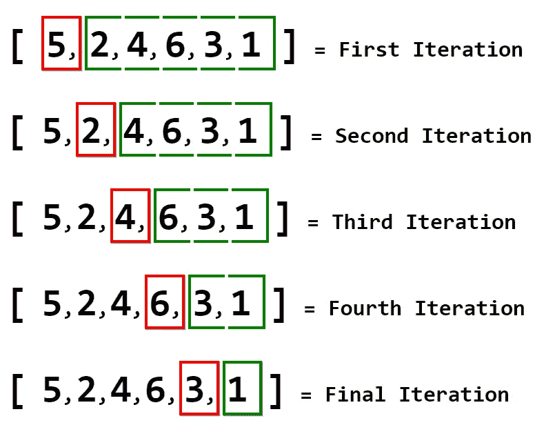
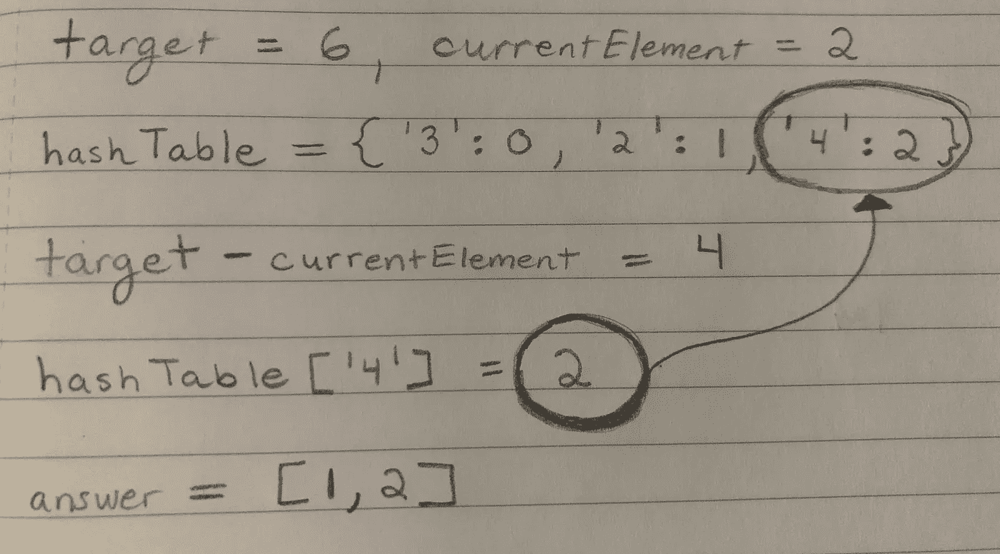
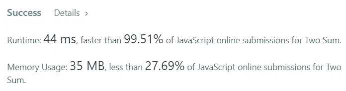

# 如何用 JavaScript 求解两个和

> 原文：<https://levelup.gitconnected.com/how-to-solve-two-sum-in-javascript-d1ebd9dfd3d3>

## 不用排序，线性时间解决经典面试问题。

两个和——这可能是现存最丰富的算法问题之一，因此，应该广泛练习。

尽管这是一个常见的问题，但这个问题有很多变体，可能会在面试中绊倒开发人员。

在面试中可以使用的一个约束是不允许**对输入数组**进行排序。这个约束是评估候选人是否彻底理解数据结构及其可能的时间复杂性的一个很好的方法。

本文将深入探讨**两个 Sum** 。以下是我们将使用的问题描述:

> 给定一个整数数组，返回**一个数组，包含两个数字的索引**，这两个数字加起来就是一个特定的目标。可以假设每个输入将有 ***恰好*** 一个解，并且*相同的*元素可以**而不是**被使用两次。最后，数组不能排序。

# 理解问题

问题描述的第一行非常具体:给定一个数组，返回两个数的索引，这两个数加起来就是某个目标。此外，很明显返回值应该是一个包含两个索引的**数组**。

给定了一个整数数组的**是肯定的，但是这个描述并没有明确目标是否可以是`null`或者除了`number`之外的数据类型。例如，**目标**可能是`'3'`，它是一个`string`，但可以被强制为`number`。**

在面试中，这些都是问面试官的好问题。出于这个问题的目的，假设**目标**将始终是`number`数据类型的整数。

第二句解释了对于一个设定的**目标**数，在一个给定的数组中只有**一个**解。因此，可以返回第一对和等于目标数的数字，而不会引发异常。

此外，同一元素不能使用两次。这意味着一个元素不能通过自身相加来达到目标数。

最后，最后一行表示数组不能排序。

既然问题已经解释清楚了，那就把它分解成小的需求。这将有助于创建算法。

1.  给定一个整数数组和一个整数。
2.  找出和等于整数输入的两个数，然后返回它们的索引。
3.  返回值应该是一个数组，其中存储了索引。
4.  给定索引中的同一元素不能使用两次。
5.  对于给定的数组和目标整数，只有一个解。
6.  不允许排序。

## 测试案例

这个问题实际上非常简单，所以没有必要覆盖大量的边缘情况；但是，有一种边缘情况需要考虑，那就是:**负整数**。

问题描述没有说整数一定是正数。因此，一个数组中有负元素的测试用例以及一个目标数为负的用例包含在测试套件中是明智的。

您可以根据需要包含任意多的测试，但是这些是本文的测试用例:

1.  `array = [3, 2, 4], target = 6`
2.  `array = [6, 2, 3, 9, -5, 5, 7, 2], target = 1`
3.  `array = [2, -3, 1, -5], target = -3`

是时候规划一个算法了。

> 注:`n`将代表`array`的`length`属性。

# 暴力算法是不够的

因为这个问题的本质是找到加起来等于某个数的元素对，这个问题的逻辑很容易理解:

1.  对于`array`中的`currentElement`，对照目标检查`currentElement`和`nextElement`的总和。如果是`sum === target`，返回`currentElement`和`nextElement`的索引。
2.  遍历`array`，检查每个元素以及每个具有更高索引的元素，直到找到正确的元素对。

这是一个**蛮力**解决方案。这不是一个有效的解决方案，因为在找到所需的对之前，它可能需要多次迭代`array`。

在大多数情况下，会有一个测试用例，它有一个包含数千个元素的数组。现在，假设元素的`sum === target`在索引`[array.length — 2, array.length — 1]`处。

为了到达这两个元素，来自`array`的`n-1`元素必须在`currentElement`循环的每次迭代中被迭代。

> 记住，`currentElement`必须与`array`中之后的每个元素**相加，因为`currentElement`之前的元素已经检查过了。**

这种嵌套循环会导致数千次不必要的迭代。

这里有一个图表，详细说明了检查整个`array`所需的迭代次数。请记住，这是一个非常小的输入；想象一下这种类型的算法在一个**巨大的**输入上。

红色的**窗口代表`currentElement`。**绿色**窗口代表所有必须添加`currentElement`以检查`sum === target`的元素。对于绿色窗口中的每个元素，都有一次迭代。**

用数学术语来表达，在一个`array`中有`n**2`个可能的配对。因此，这种算法最长(最坏的情况)可能需要`O(n**2)`时间，这是非常低效的。

可以看出，强力解决方案对于大型`array`输入并不理想。

必须有一种方法来最小化找到正确对所需的迭代次数。是否有一种数据结构允许恒定的`O(1)`查找时间？

## 哈希表

一个**散列表**是键和值对的集合。一个**散列函数**用于将值映射到索引，也称为键。这些键和值对允许恒定的查找时间。

在 JavaScript 中，我们可以使用一个`object`来创建一个散列表。下面是一个简单哈希表的例子:

如第 6–9 行所示，可以通过引用`hashTable`中的`value`从`values`访问每个元素的`index`。

使用哈希表的主要好处是`O(1)`查找时间。一旦值被映射到某种惟一的键，就可以使用它的键立即引用该值，而不需要遍历值列表来找到正确的值。

# 创建更高效的算法

因此，对两个 Sum 使用哈希表是一个明智的想法；然而，对于这个问题，使用 one 的正确方法是什么？

强力解决方案有两个循环，一个嵌套在另一个里面。耗时较长的循环是嵌套循环，因为它经历了几次`array`。在上图中，嵌套循环被着色为绿色。

如果只有第一个循环，由上图中的**红色**窗口表示，时间复杂度将是`O(n)`，因为在最坏的情况下`array`将需要被完全迭代以找到正确的对。

消除嵌套循环是个好主意。嵌套循环可以用哈希表代替吗？

是的——哈希表实际上可以很好地与单个循环一起工作。

因此，循环将一次迭代一个元素。这意味着`currentElement`必须与`array`中的所有其他元素进行核对。这如何用哈希表实现呢？

与`currentElement`配对的数字是`currentElement`和`target`之间的**差值**。因此，将`target — currentElement`存储在`currentDifference`中。使用哈希表的查找功能，检查`currentDifference`是否是哈希表中的**键**。

如果它存在于哈希表中，这意味着它是`array`的一个元素。

这里有一张图纸详细说明了算法的这一步。出于本图的目的，输入为:`array = [3, 2, 4], target = 6`。另外，`currentElement = 2`在循环中。

有时候，笔和纸是必要的。

这些输入的答案是`[1, 2]`，因为索引`1`和`2`处的`2`和`4`分别包含一对数字，其总和为`target = 6`。

上面提出的算法通过在`hashTable`中查找`currentDifference`来找到该元素是否存在，从而成功找到了正确的元素。然后，它返回索引`hashTable[currentDifference]`并在返回值`[1, 2]`中使用。`1`代表`array`中`currentElement`的索引。

然而，该算法的唯一警告是，元素不能与自身组合来匹配`target`。不过，对`currentElementIndex !== hashTable[currentDifference]`的简单检查将消除这种边缘情况。

所以，最后的算法是:

1.  创建一个对象，分别包含元素及其索引的键值对。
2.  迭代通过`array`。对于`currentElement`，计算`currentDifference`。
3.  如果`hashTable`和`currentElementIndex !== hashTable[currentDifference]`中存在`currentDifference`，则返回每个元素的索引。
4.  如果`currentDifference`不存在或者两个元素的索引相等，则移动到`array`中的下一个元素。

# 实现算法

首先，声明一个函数`twoSum`并声明一个变量来存储对象。

下一步是遍历`nums`数组。在一个`for`循环中这样做，这样`break`提前是可能的。

在这个循环中，还要检查哈希表中是否存在`currentDifference`:如果存在，`return`正确的索引。在`else`的情况下，将当前元素指定为`numsIndexes`上的属性，并将其值指向索引`i`。

是时候在 LeetCode 上测试这个解决方案了，以确保大型测试用例可以成功执行。

几乎 100%！

99.51%!那相当快。此外，整个测试套件被成功执行。

# 结论

这篇文章涉及大量信息和算法，因此在这一点上做得非常好。

可以看出，在算法中使用哈希表可以大大降低算法的时间复杂度。在这个问题中使用哈希表的策略可以很好地转移到许多其他问题中，所以在处理困难问题时要保持它。

编码快乐！