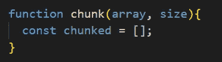
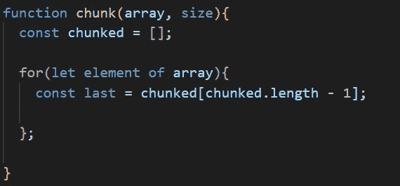
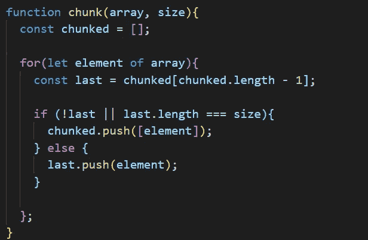

# 如何:解决“组块阵列”面试问题

> 原文：<https://levelup.gitconnected.com/how-to-solving-chunk-array-interview-questions-a0fe3db12598>

继续我为常见面试问题撰写[教程](https://medium.com/@briandsalemi)的主题，在这篇博文中，我将教你如何回答**组块数组**问题。该问题通常如下所示:

> 给定一个`array`和`chunk size`作为参数，编写一个函数，将`array`分成几个`subarrays`，其中每个`subarray`都有一个`chunk size`的`length`。

这个问题初看起来可能很难，但是一旦你找到了解决它的最佳方法，它就变得非常容易实现。

我们开始吧。首先，我们将从一个名为`chunk`的函数开始，它将接收一个`array`和一个`size`作为它的参数。

接下来，我们需要声明一个新变量`chunked`，并将其设置为一个空数组。这个数组将负责包含每个新的分块子数组。

接下来，我们将使用一个`for…of` 语句迭代`array` 中的每个元素。

在我们的`for…of`语句中，事情变得有点棘手。我们的第一步是声明一个名为`last`的新变量，并将其设置为等于我们的`chunked`数组中的最后一个元素。

接下来，我们将设置一个条件来检查两件事。首先，它会检查`last`是否不存在。如果它确实存在，那么我们将检查`last.length`是否等于我们的参数`size`。如果这些检查中的任何一个返回`true`，那么我们将`push`一个带有当前`element`的新子数组到我们的`chunked`数组中。

然而，如果这两个检查都返回`false`，我们将把当前的`element`返回到`last`，并从`array`的下一个元素开始迭代。

在我们的`for…of`语句的每一次迭代完成后，我们的`chunked`数组将被正确地填充长度等于`size`的子数组。为满足可交付结果，`return` `chunked`后的`for…of`语句完成此功能

## 用...解决。切片()

解决这个问题的另一种方法是使用 JavaScript 数组[方法](https://developer.mozilla.org/en-US/docs/Web/JavaScript/Reference/Global_Objects/Array/slice) `.slice()`。`.slice()`方法返回一个数组的**部分**的浅拷贝，从开始索引直到(但**不包括**)结束索引。例如，如果我们调用`array.slice(0,2)`，它将复制数组的第一个和第二个元素(`index 0 and 1`)，但不复制第三个元素(`index 2`)。

这个解决方案与前一个解决方案一样，通过设置一个等于空数组的变量`chunked`开始。

然而，与前面的解决方案不同，我们将使用一个`while loop`来迭代`array`，而不是一个`for…of`语句。`while loop`将从索引`0`开始，只要`index`小于`array.length`就会继续。

在`while loop`内我们要将`push`的一个`slice`的`array`放入我们的空`chunked`阵中。`.slice()`的参数将从`index`开始，在`index + size`之前结束。切片被推入`chunked`后，`index`将增加`size`。

与前面的解决方案一样，在`while loop`完成`return` `chunked`后，返回子数组并正确回答问题。

## 结论

**Chunk Array** 面试问题一开始可能有点难以计划，但是一旦核心概念被确定，它就变得容易处理了。这个问题，以及类似的问题，都需要一个**循环**来迭代数组参数和一个**空数组**来存储子数组。通过练习，记住这个基本框架，你将能够解决面试官可能抛给你的任何类型的问题。