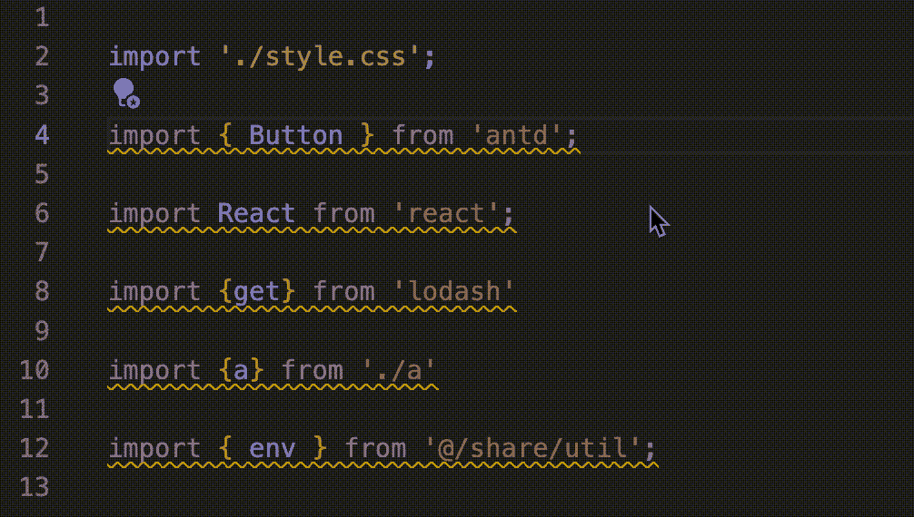
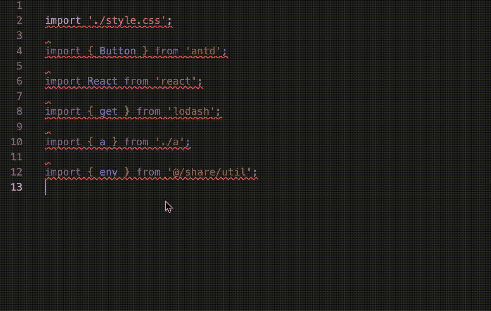

# 如何在 React 项目中对导入进行排序

> 原文：<https://levelup.gitconnected.com/how-to-sort-imports-in-react-project-550f5ce70cbf>

## Eslint 和 Prettier 都有插件来做这个


由[安德烈·泰森](https://unsplash.com/@andretaissin?utm_source=medium&utm_medium=referral)在 [Unsplash](https://unsplash.com?utm_source=medium&utm_medium=referral) 上拍摄的照片

# 前言

最近我遇到了一个非常奇怪的风格错误。在一个 SPA 项目中，如果先访问页面 A，再访问页面 B，那么页面样式就会出现问题。如果直接访问 B 页，效果很好。这个 bug 花了我很多时间去修复，但是 bug 的原因很简单。pageA 和 pageB 都导入一些相同的组件并覆盖样式，但是它们的顺序不同，这导致样式被覆盖。有一些演示代码:

```
// Page A
import "./styleA.css"; // override componentA and componentB style
import CompA from 'component/a';
import CompB from 'component/b';// Page B
import CompA from 'component/a';
import CompB from 'component/b';
import "./styleB.css"; // override componentA and componentB style
```

pageA 自定义样式的优先级高于 pageB 自定义样式。

他们可能有很多方法来修复这个 bug，比如使用作用域 css，命名空间等等..但是我发现最简单的方法是对进口商品进行分类。

在本文中，我们可以了解对导入进行排序的两种方法:

1.  较美丽
2.  埃斯林特

我正在使用 VS 代码开发一个 react 项目。我已经安装了 VS 代码的 beautiful 和 eslint 插件，不会在项目中单独安装。

# 用更漂亮的分类进口货

更漂亮的不支持这个功能，有一个很牛逼的插件可以用来排序导入——[GitHub——trivago/更漂亮的——插件——排序——导入](https://github.com/trivago/prettier-plugin-sort-imports)。

首先，让我们安装它:

```
npm install --save-dev @trivago/prettier-plugin-sort-imports// or use yarn
yarn add --dev @trivago/prettier-plugin-sort-imports
```

然后，我们开始为这个插件配置规则。这个插件非常灵活，有一些 API 可以帮助我们定制订单。

在我的项目中，我使用`importOrder`来定制导入的顺序，使用`importOrderSeparation`来分隔不同的部分:

```
// .prettierrc.json
{
  "importOrder": ["^react(.*)", "antd/(.*)", "<THIRD_PARTY_MODULES>", "@/(.*)", "^[./]"],
  "importOrderSeparation": true
}
```

导入顺序如下:

1.  反应，反应王国，反应路由器
2.  antd(用户界面库)
3.  包装/第三方进口，如 lodash。
4.  项目别名导入
5.  相对进口

这条规则的效果将是这样的:



当保存文件时，将自动使用更漂亮的格式，所以将自动排序的进口。

# 使用 Eslint 对导入进行排序

Eslint 有很多用于排序导入的插件，比如[eslint-plugin-simple-import-sort](https://github.com/lydell/eslint-plugin-simple-import-sort)、 [eslint-plugin-import](https://github.com/import-js/eslint-plugin-import) 、 [sort-imports](https://eslint.org/docs/rules/sort-imports) 。我更喜欢使用[eslint-plugin-simple-import-sort](https://github.com/lydell/eslint-plugin-simple-import-sort)，这更容易，也是配置组的一个选项。在下面内容中，我们将学习如何使用它。

首先，让我们在项目中安装依赖项:

```
npm install --save-dev eslint-plugin-simple-import-sort// or use yarn
yarn add eslint-plugin-simple-import-sort -D
```

然后，我们开始为这个插件配置规则:

```
// .eslintrc.js
module.exports = {
  //...
  plugin: ["simple-import-sort"],
  rules: {
    "simple-import-sort/imports": "error",
    //if we want to group imports can use below.
    "simple-import-sort/imports": ["error", {
      groups: [
        ["^react"],
        ["^antd"],
        ["^@?\\w"],
        ["@/(.*)"],
        ["^[./]"]
      ]
    }] 
  }
}
```

这将产生与“更漂亮”相同的效果，除了行与行之间的分隔符:



# 结论

在本文中，我们将学习如何使用 eslint 的 learn 对进口商品进行排序。建议使用更漂亮的方式，因为更漂亮会自动格式化代码样式，如分号、空格等。这两种方法都可以帮助我们编写更干净、可读和健壮的代码，特别是对于 CSS 规则覆盖。

感谢您的阅读，希望这篇文章能对您有所帮助，我期待您**跟随**我学习更多实用技巧，成为一名更好的开发人员。

# 分级编码

感谢您成为我们社区的一员！在你离开之前:

*   👏为故事鼓掌，跟着作者走👉
*   📰查看[升级编码出版物](https://levelup.gitconnected.com/?utm_source=pub&utm_medium=post)中的更多内容
*   🔔关注我们:[Twitter](https://twitter.com/gitconnected)|[LinkedIn](https://www.linkedin.com/company/gitconnected)|[时事通讯](https://newsletter.levelup.dev)

🚀👉 [**将像你这样的开发人员安置在顶级创业公司和科技公司**](https://jobs.levelup.dev/talent/welcome?referral=true)