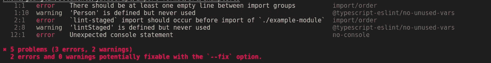

# 使用 Git 挂钩和 CI 管道统一自动地对 JavaScript/TypeScript 模块进行排序

> 原文：<https://levelup.gitconnected.com/how-to-sort-the-imported-modules-in-javascript-typescript-automatically-ab397eb0e67a>

## 学习以优雅的方式对 JavaScript/TypeScript 代码中导入的模块进行排序

图片来自[像素设计](https://pixabay.com/photos/tea-teabag-teas-drink-herbal-tea-1252397/)

当您的 JavaScript/TypeScript 项目变大时，您将导入越来越多的模块。如果你没有对模块进行正确的分类，它们看起来会很乱，并且很难阅读和维护。但是，如果你手动排序的话，其实是一件非常繁琐的工作。更糟糕的是，如果你在一个团队中工作，每个人可能都有他/她自己的模块分类习惯。结果，我们最终会在同一个存储库中拥有不同的排序模式，这并不酷。

幸运的是，有了 [***ESLint***](https://github.com/eslint/eslint) 和[***import***](https://github.com/import-js/eslint-plugin-import)插件，我们可以自动地以统一的方式对模块进行排序。在这篇文章中，我们将介绍 *ESLint* 和 *import* 插件的配置，以使用 Git 挂钩和 CI 管道对模块进行排序。有了这些工具，你将有统一的进口看起来整洁和专业。

为了使本教程更有用，并且命令/代码片段可以随时用于任何 JavaScript/TypeScript 项目，我们将介绍 *ESLint* 、[、*beautiful*、](https://github.com/prettier/prettier)、[、 lint-staged 、](https://github.com/okonet/lint-staged)[、 *Husky* 、](https://github.com/typicode/husky)的设置，它们共同组成了一个静态代码检查管道。这篇文章的重点将放在排序模块的 *ESLint* 和 *import* 插件的配置上。其他库的关键设置也将简要介绍。有关这些库的详细信息，请查看以下文章:

*   [如何使用 ESLint 在 JavaScript 和 TypeScript 中编写优雅的代码](https://betterprogramming.pub/use-eslint-to-make-your-javascript-typesript-code-more-professional-1170bbdff32b)
*   [创建一个预提交 Git 挂钩来自动检查和修复您的 JavaScript/TypeScript 代码](https://javascript.plainenglish.io/create-a-pre-commit-git-hook-to-check-and-fix-your-javascript-typescript-code-b04de61834bd)

## 依赖项的安装

我们需要为样式和林挺安装一系列的库。建议将它们作为依赖项安装，而不是全局安装，这样它们可以保存在`pacakage.json`中，从而可以被团队的所有成员使用。

运行以下命令安装依赖项:

请注意，还安装了 TypeScript 及其依赖项。如果您的项目是普通的 JavaSript 代码，您可以从上面的命令中删除 TypeScript 及其依赖项。同样，文章其他部分的命令和代码片段也将用于类型脚本代码。将它们用于 JavaScript 项目相当简单。您只需要删除 TypeScript 的相应部分，它们通常只适用于 JavaScript。

另外，*哈士奇*的安装方式不同，这是[推荐*哈士奇*的](https://typicode.github.io/husky/#/?id=automatic-recommended)方式。

## 设置本地 ESLint 排序规则

实际上， *ESLint* 可以用`[sort-imports](https://eslint.org/docs/latest/rules/sort-imports)`规则对导入的模块进行自动排序。然而，它不能区分内置、外部和内部模块，因此它不是完全自动的。尽管如此，它在对同一个导入语句中的成员进行排序方面做得很好，即对从同一个模块导入的多个函数/类/接口进行排序。

在本教程中，[这个 *ESLint* 配置文件](https://github.com/lynnkwong/js-ts-linting-example/blob/main/ts-only.eslintrc.js)将被用作 TypeScript 的起点，而[这个](https://github.com/lynnkwong/js-ts-linting-example/blob/main/js-only.eslintrc.js)将被用作 JavaScript 的起点。请注意，我们将删除格式化规则，因为它们将由*prettle*库实现。完整的配置文件可以在稍后的文章中找到。

`sort-imports`规则的设置如下:

请注意，`[ignoreDeclarationSort](http://ignoreDeclarationSort)`被设置为`true`,因此我们不会使用 *ESLint* 对导入语句进行排序。相反，我们将使用 *import* 插件，它可以识别内置、外部和内部模块，并相应地对它们进行排序。

## 设置导入插件

我们已经安装了[*eslint-plugin-import*](https://github.com/import-js/eslint-plugin-import)插件，可以使用它来识别内置、外部和内部模块，并相应地对它们进行排序。这个插件的[设置](https://github.com/import-js/eslint-plugin-import/blob/main/docs/rules/order.md)非常冗长。但是，通常默认设置对于大多数项目来说都可以正常工作。需要的时候可以根据自己的口味和要求进行微调。

*导入*插件的规则是用`import/order`规则指定的，本帖使用的设置如下:

关键点:

*   正如键和值所建议的，`groups`用于定义不同模块组的顺序。在本例中，列出了所有允许的组，但是您可以只保留需要的组。此外，通过将组放在方括号中，可以将它们混合在一起。例如，我们可以使用`["sibling", "parent"]`来合并兄弟和父导入。如果您想知道不同组的定义，请查看本参考资料。
*   当`newlines-between`设置为`always`时，我们将总是在不同的组之间放置一个新的行，这是可取的，并且可以使导入更容易阅读。
*   使用`alphabetize`，我们将按字母顺序对每个组中的导入进行排序。这里我们忽略大小写，按升序排序。

## 安装导入插件的类型脚本支持

我们安装了一个插件`eslint-import-resolver-typescript`，为`eslint-plugin-import`增加了 TypeScript 支持。这个插件的设置非常简单，我们只需要指定`tsconfig.json`的位置。

对于您自己的项目，请相应地将路径更改为`tsconfig.json`。这个插件的更多设置可以在[这里](http://eslint-import-resolver-typescript)找到。

## 完整的配置文件(`.eslintrc.js`)

恭喜你！与 *ESLint* 和 *import* 相关的插件的配置已经设置好了，我们已经可以开始使用它对我们的导入进行分类了。完整的设置文件是[这个](https://gist.github.com/lynnkwong/8dfe47b0a61c2243300bc84f921142c4):

## 其他库的配置

为了构建一个功能性的静态代码检查管道，我们需要配置更漂亮的*、 *lint-staged* 以及 *Husky* 。我们只是简单介绍一下设置文件，供大家参考。*

## *更漂亮的配置(`.prettierrc.json`*

*注意这里的线长键是`[printWidth](https://prettier.io/docs/en/options.html#print-width)`，而不是`[.editorconfig](https://editorconfig.org/)`文件中的`max_line_length`。*

*更多漂亮的配置可以在[这里](https://prettier.io/docs/en/configuration.html)找到。*

## *lint 分段(`.lintstagedrc.json`)配置*

*这个有点特别，值得多说几句:*

*   **lint 暂存*库可以只对暂存的文件进行 lint 处理，而不是所有文件。*
*   *默认情况下， *lint 暂存的*会将暂存的文件追加到命令中。这通常是需要的。但是，对于`tsc`，我们不能将`tsconfig.json`与输入文件一起指定。这是一个已知的问题，我们现在需要接受它。为了解决这个问题，我们需要使用 bash 的技巧，忽略传递给命令的参数。关于这个技巧的更多细节，请查看[这个线程](https://github.com/okonet/lint-staged/issues/468#issuecomment-605102567)。*

## *哈士奇(`.husky/pre-commit`)的配置*

*通过`npx husky-init && npm install`命令创建了一个`.husky`文件夹。这里有一个*预提交*文件，您可以在其中添加要在 [*预提交*](https://lynn-kwong.medium.com/use-pre-commit-commit-msg-and-pre-push-git-hooks-to-fix-your-python-code-asap-77d80d3ce412) 钩子中运行的命令。在本例中，我们只需运行`lint-staged`命令，该命令将依次运行林挺命令。此外，一个新的脚本`"prepare": "husky install"`已经被添加到`package.json`中，它将创建`.husky`文件夹，如果它还没有被创建的话。*

## *使用静态代码检查管道*

*现在一切都设置好了，我们可以开始使用代码检查管道来检查我们的代码。尝试将一些问题引入到一些 TypeScript 文件中，然后创建一个 commit，您将会看到错误消息:*

**

*然后可以根据错误消息改进代码。*

*本帖介绍的所有文件都可以在[这个 repo](https://github.com/lynnkwong/js-ts-import-sorting) 中找到。*

## *好处:设置服务器端 CI 管道*

*警惕！创建提交时，可以用`--no-verify`标志跳过上面设置的预提交挂钩。这可能是故意的，也可能是偶然的。然而，当代码被推送到远程存储库时，这是不允许的。为了解决这个问题，我们可以设置一个服务器端持续集成(CI)管道，当代码被推送到远程存储库时，它将检查代码。*

*我碰巧在工作中使用 GitLab，因此 CI 管道设置在`[.gitlab-ci.yml](https://docs.gitlab.com/ee/ci/quick_start/index.html#create-a-gitlab-ciyml-file)`中。但是，对于其他 CI 工具来说，它的工作方式应该是类似的。*

*`.gitlab-ci.yml`的内容是:*

*这里的要点是:*

*   *我们需要为 Node.js 使用 Docker 映像，并在那里安装软件包。请注意，GitLab 会自动将所有文件加载到 Docker 容器中，并且会安装在`package.json`(或`package-lock.json`中指定的依赖项。*
*   *我们不应该在服务器端修改文件，但是如果样式化或林挺步骤失败，应该让管道失败。注意，对于*更漂亮的*，我们需要指定`--check`标志，以便在代码格式不正确时让该步骤失败。如果没有`--check`标志，即使代码格式不正确，退出状态也将为 0。*

*干杯，如果你终于到达这里！我们已经介绍了为 JavaScript/TypeScript 项目设置静态代码检查管道所需的所有工具，重点是设置导入模块的自动排序。建议您亲自尝试管道，这样您可以更好地了解所有设置。*

*本帖介绍的所有代码都可以在[这个 repo](https://github.com/lynnkwong/js-ts-import-sorting) 中找到。您可以使用这些文件作为自己项目的起点。*

## *相关文章:*

*   *[如何使用 ESLint 用 JavaScript 和 TypeScript 写出优雅的代码](https://betterprogramming.pub/use-eslint-to-make-your-javascript-typesript-code-more-professional-1170bbdff32b)*
*   *[创建一个预提交 Git 钩子来自动检查和修复你的 JavaScript/TypeScript 代码](https://javascript.plainenglish.io/create-a-pre-commit-git-hook-to-check-and-fix-your-javascript-typescript-code-b04de61834bd)*