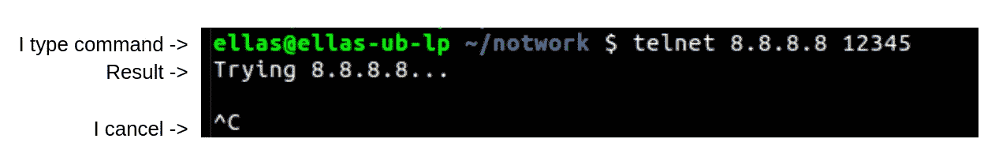
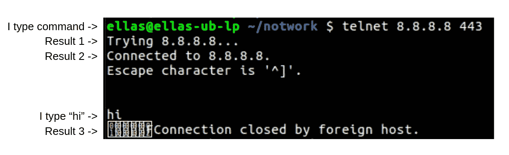
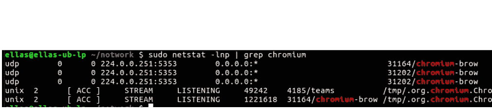
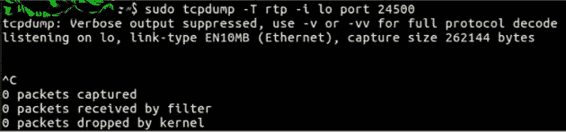
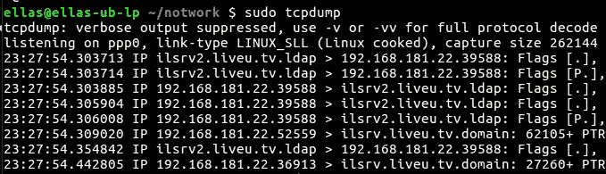

# 如何对端口进行分类

> 原文：<https://levelup.gitconnected.com/how-to-sort-your-ports-b43d5e15c8a6>

## 网络问题的常用命令

亚历克斯·达菲在 [Unsplash](https://unsplash.com/?utm_source=unsplash&utm_medium=referral&utm_content=creditCopyText) 上的照片

端口是通信端点，因此当我们出现通信问题时，它们是主要的嫌疑对象。

最近我在处理一个 bug，在我运行的应用程序中，客户端无法到达服务器。由于服务器和客户端都是第三方，我不能直接修改代码。我总结了我的调试步骤以及如何对这种情况进行故障排除，并给出了我的定位命令示例。

# 检查客户的观点

我首先模拟一个客户端，看看我是否可以通过运行

> telnet 8.8.8.8 443

telnet 是一个老式的消息传递应用程序，以其 start wars ASCII 艺术而闻名，但我使用它来检查我的 TCP 应用程序对于客户端是否可达。如果有一个路由问题，防火墙阻塞或没有人监听这个端口，你将永远卡在“尝试”上。

到达一个没有打开/没有监听器的端口会让你陷入“尝试”直到你取消

如果没有问题，我们将能够开始聊天，但当然，我们不太可能开始有意义的谈话，我们只是想建立最初的联系和接触。

# 检查服务器的视角

我正在将第三方应用程序集成到我自己的系统中，具体来说，我配置了通信细节，如 IP、端口和要绑定的接口。我检查了所有的配置，确保它是正确的。

> netstat -lnp | grep 铬

我使用这个命令来检查我的应用程序监听哪些端口。一个典型的错误是绑定到 127.0.0.1，因此只接受本地连接，所以客户端无法访问你的应用程序。

chromium 监听端口 5353、UDP 和所有接口

# 查看实时交通状况

数据流很快，我们通常无法理解它，但我们可以看到数据交换是否存在，以及它是否仅来自一个方向。

> 任何 udp 和端口

这是一个对你的机器网络的窃听命令，你可能会将这个巨大的搜索限制在某个接口、端口或协议上，以追踪你的确切问题。

没有与过滤器匹配的流量时的 TCPDUMP 命令示例

显示多个端口流量的 TCPDUMP 命令示例

Tcpdump 不干扰包交换，允许我们查看实时流量。
我发送视频流。我不能以这种方式传输图片本身，但我可以过滤和显示协议头(如 UDP 和 RTP)以进一步排除故障。

# 结论

这些命令中的每一个都有很多可以调整的选项，您可以使用我展示的简单示例，或者探索和微调适合您需求的独特命令。

你可以在这里阅读更多关于调试[的内容。](https://codeburst.io/when-great-developers-debug-they-f07efb4c032)