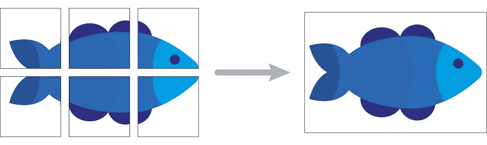

# 如何用 Python 将图像分割成小块

> 原文：<https://levelup.gitconnected.com/how-to-split-an-image-into-patches-with-python-e1cf42cf4f77>

## 使用这个 Python 库将图像分割成大小相等的部分


图片来自 [Pixabay](https://pixabay.com//?utm_source=link-attribution&amp;utm_medium=referral&amp;utm_campaign=image&amp;utm_content=1761410)

出于不同的原因，有人可能需要将图像分割成相同大小的小块。有一次，我不得不这样做，因为我的机器学习模型不能处理高分辨率的图像，因此，我将它们分成多个部分。一开始，我自己编写了用于拆分的代码，但后来我发现了 [Patchify](https://github.com/dovahcrow/patchify.py) ，这是一个为此目的而制作的很棒的库。它提供了两个功能:*修补*和*解除修补*和**。**前者用于将图像分割成小块，后者用于将它们合并。

要从 PyPI 安装最新版本的 Patchify，请使用:

```
pip install patchify
```

## 修补

此功能将图像分割成多个相同大小的小块。


修补。图片由作者提供。

**使用:**

```
patchify(image, patch_shape, step)
```

**论据:**

*   `image`是一个 NumPy 数组，其形状为 *(image_height，image_width)* 用于灰度图像，或 *(image_height，image_width，N)* 用于 N 通道图像(如果是 RGB， *3* )。
*   `patch_shape`是每个斑块的形状， *(patch_height，patch_width)* 或 *(patch_height，patch_width，N)* 。不需要定义一个正方形的面片，甚至可以定义一个矩形的面片。
*   `step`定义一个面片和下一个面片之间的距离(垂直和水平)。如果 *step ≥ patch_height* ，则同一行中的面片之间没有重叠。如果 *step ≥ patch_width* ，则同一列中的补丁之间没有重叠。

**返回:** 如果`image`为 N 通道，则该函数返回一个形状为 *(n_rows，n_cols，1，H，W，N)* ***，*** 的 NumPy 数组，其中 *n_rows* 为每列的面片数， *n_cols* 为每行的面片数。否则，如果`image`为灰度，该函数返回一个形状为 *(n_rows，n_cols，1，H，W)* 的 NumPy 数组。

以下代码拆分 RGB 图像，并使用递增的文件名将每个补丁保存在一个新文件中:

以下是从缩略图中提取的补丁:


## 解开补丁

该函数合并相同大小的面片。



解开补丁。图片由作者提供。

**调用它使用:**

```
unpatchify(patches_to_merge, output_shape)
```

**参数:**

*   `patches_to_merge`是一个形状为 *(n_rows，n_cols，1，patch_height，patch_width)* 或 *(n_rows，n_cols，1，patch_height，patch_width，N)* 的 NumPy 数组，与 *patchify 返回的相同。*
*   `output_shape`是合并后的图像输出形状:*(高度，宽度)*或*(高度，宽度，N)* 。

**返回:** 形状为`output_shape`的 NumPy 数组。

`output_shape`必须按照以下方式根据补丁大小和步长定义:

```
output_height = image_height -(image_height - patch_height) % step
output_width = image_width -(image_width - patch_width) % step
output_shape = (output_height, output_width, 3)
```

否则， *unpatchify* 抛出异常。

## 修补+解除修补

有些情况下，您需要将图像分成多个面片，处理每个面片，然后将它们合并回去。这可以通过结合修补和解除修补功能来实现。

下面的代码显示了这两个函数的组合:

当机器学习模型无法直接处理时，这种代码是从大图像中获得预测的常见解决方案。在这种情况下，代码需要的唯一更改是用 ML 算法或神经网络模型替换`process(patch)`函数。

感谢阅读，我希望你发现这是有用的。

如果你喜欢阅读我的故事，并想支持我成为一名作家，考虑注册成为一名灵媒。每月 5 美元，你可以无限制地阅读所有的故事。如果你用我的链接注册，我会赚一小笔佣金，费用和你一样。[https://mattiagatti.medium.com/membership](https://mattiagatti.medium.com/membership)