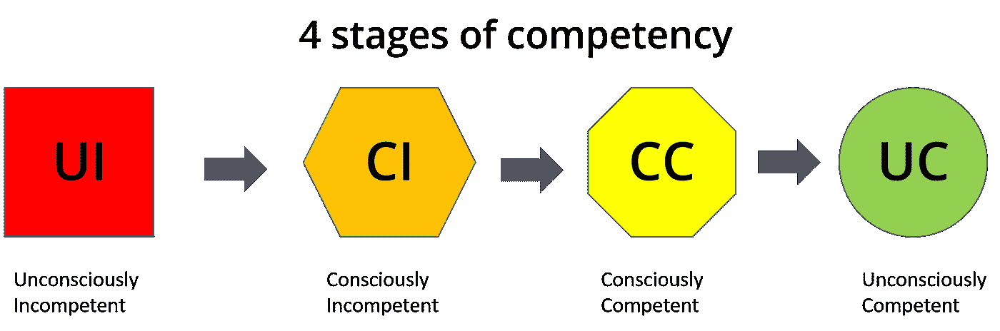
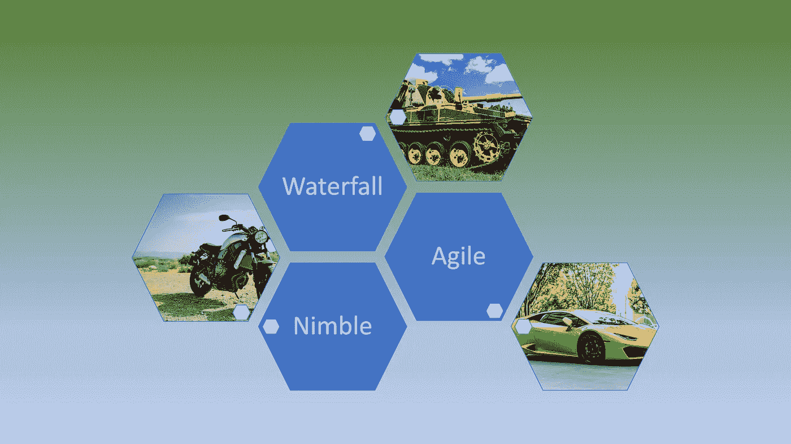

# 如何在敏捷中发现敏捷

> 原文：<https://levelup.gitconnected.com/how-to-spot-nimble-amongst-agile-2718f7702192>

介于良好意图和迷失方向之间的是灵活的原则

在 [Unsplash](https://unsplash.com?utm_source=medium&utm_medium=referral) 上由 [Francisco Requena](https://unsplash.com/@mackfrancis?utm_source=medium&utm_medium=referral) 拍摄的照片

最近，我和很多声称自己在做敏捷的公司谈过，我自己也在类似的地方工作过，很明显不是每个人都在做同样的“敏捷”。现在，意志坚强、干劲十足的布道者称这种**为伪敏捷**，并对此不屑一顾，但我认为这不公平。这当然不会鼓励处于这种情况下的企业和个人想要改善和继续前进。事实上，他们所在的地方可能是最适合该企业的地方。如果他们不完全符合某些人对纯粹敏捷的定义，那也没关系，但这确实表明他们正在做一些不同的事情，可能正在走向真正的敏捷(或者不是)。

描述这种情况的一个好词是敏捷。

> **敏捷**——快速轻巧

因此，一辆摩托车的照片似乎非常适合描述。

敏捷企业、人员和软件开发的特征:

*   快速做出**决定**并付诸行动(并不意味着他们总是正确的，但他们可以快速决定-行动-修改)。
*   有一个**理解的过程**(这比以前做的更快，并且通常没有记录，更多的是一种共同的感觉)。
*   **接受想法**、反馈和创新(乐意跳过工作软件、设计模式、COTS 库)。
*   能否**快速理解**背景、情况、约束和目标。
*   能够**适应**并使用手边的任何东西(他们可以用螺丝刀做一个粗糙的锤子)。
*   无论如何，对自己完成任务的能力充满信心。
*   能够赢得交易并快速推出新产品(针对小批量的专用机会)。
*   专注于近期的**。**
*   **学得快**(只要能胜任工作并领先一步，不需要成为某个领域的专家大师)。
*   诚实——很乐意承认他们没有遵循“真正的”方法，但希望得到比以前更好的认可。

# Nimble 正在走向敏捷？

如果我们看能力模型的标准 4 个阶段，那么 Nimble 可能是**有意识地不胜任(CI)。**当然，团队意识到他们没有采用敏捷方法，也没有采用传统方法。他们是否不称职，要由观众从他们的立场和创作者想达到的目的来解释。

当然，他们是当前解决方案领域的专家，是创新和提供软件来解决问题和需求的专家。当谈到敏捷方法的知识和经验时，答案是“不”。

另一个关于敏捷如何发生的可能解释与企业成长和扩展的方式有关。随着越来越多的工程师加入最初的创始人，这些人通常是来自大学的热情的新程序员。团队建立起来了，并且生产力很高，但是缺乏行业、市场、软件经验不知不觉地限制了增长的类型。由于新员工数量庞大或外部压力，有必要进行变革。这个敏锐的开发团队学习了足够多的知识，变得更加敏捷，并取得了一些成功。下一步要成为真正的敏捷要困难得多，因为进一步改进的需要更难证明。因此，业务可能会在这种敏捷状态下停留一段时间，直到出现另一个触发变化的事件。

# Nimble 有什么缺点吗？

很难招聘到具备灵活技能的新工程师。那些拥有敏捷技能的人可能会感到沮丧，因为这不是真正的东西。其他来自大公司或瀑布背景的人可能会发现敏捷的脚步和可怕的外表。

从转向真正的敏捷可能会有更多的潜在收益。

这很难描述，除了用敏捷这个词，它代表了一个比现实中更完整的期望。

# 最后的想法

我们应该认可、支持和鼓励那些已经改变、改进、加速和灵活的企业，而不是对它们不屑一顾。

如果 Nimble 介于传统和敏捷之间，那么在考虑我们的观点时，我们可以用一个老问题:杯子是半空还是半满。

> Nimble 是传统敏捷的改进还是失败和虚假的敏捷？

# 进一步阅读

 [## 让我们面对现实:学习如何发现和避免虚假的敏捷

### 通过避免这些虚假的，确保你的创业公司的技术是用真正敏捷的，迭代的，高效的过程开发的…

bryllyant.medium.com](https://bryllyant.medium.com/lets-get-real-learn-how-to-spot-and-avoid-fake-agile-692c9aa15071)  [## 不要先确定流程的开始

### 如何从原始混沌进化成某种过程

blog.devgenius.io](https://blog.devgenius.io/dont-fix-the-start-of-your-process-first-7d04b4564d14)  [## 你的 SDLC 烂透了！

### 如果你只有一把锤子，不要以为所有东西都是钉子

blog.devgenius.io](https://blog.devgenius.io/your-sdlc-sucks-b0ac06b09911)  [## 编码的艺术——导论

### 《孙子兵法》中一系列应用于编码的经验教训

levelup.gitconnected.com](/the-art-of-coding-an-introduction-796a8c1edaf3) 

# 关于作者的更多信息

**Greg** 是一名经验丰富的软件专业人士，也是[**outsource . dev**](https://outsource.dev/)**，**的首席技术官，他曾在多家公司工作过，现在热衷于帮助他人在软件开发、管理和外包方面取得成功。

如果你喜欢这篇文章，请鼓掌👏和**跟着**我。