# 如何挤压 git 提交

> 原文：<https://levelup.gitconnected.com/how-to-squash-git-commits-9a095c1bc1fc>

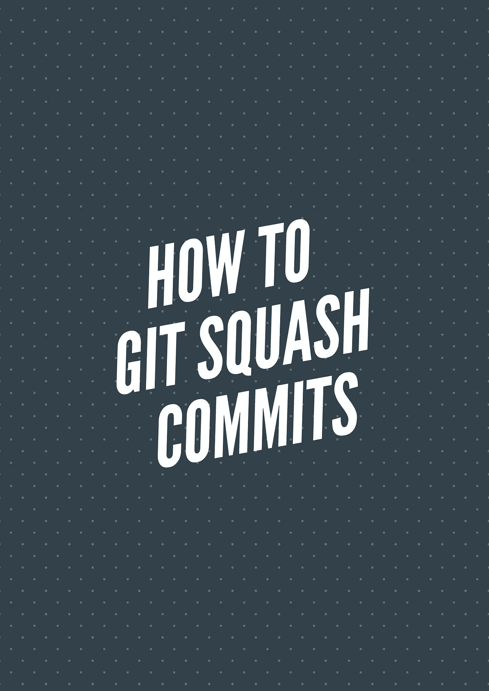

在学习如何挤压提交之前，让我们先看看`git squash`是什么。

Git squash 是一种帮助您进行一系列提交并将其浓缩为几个提交的技术。

例如，假设您有一系列 n 次提交。通过挤压，您可以将所有的 n 次提交变成一次提交。

挤压主要用于压缩大量提交，使其成为少量有意义的提交。这样我们可以让 git 的历史更加清晰。

合并分支时也会用到它。大多数人会建议您总是压缩提交，并将其与父分支(如 master 或 develop)重新组合。

因此，当你挤压和重置父分支时，主分支的历史将非常清晰，并且只有有意义的提交。

## 如何做 git 壁球

例如，考虑下面的 git 历史

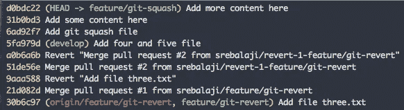

在这里，您可以看到最后三次提交。这三次提交说明我们添加了一个新文件，并添加了一些内容。

最好将它作为一次提交，说明新文件已经添加了一些内容。因此，让我们看看如何将最后三次提交压缩为一次提交。

```
git rebase -i HEAD~3
```

git rebase -i 是一个交互式工具，可以帮助你挤压提交。它有各种各样的选择。但我们只讨论饭桶南瓜。

如果您对 git-rebase 不太适应，也不用担心。使用交互式 git-rebase(即 git rebase -i)实现压缩提交是一种非常简单的技术

HEAD~3 解释了我们正在进行最后三次提交。

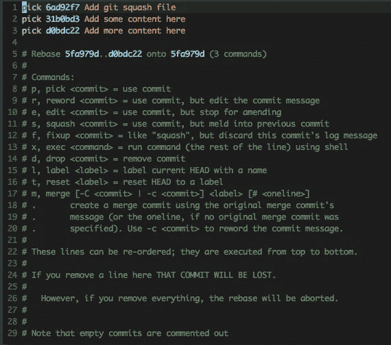

交互式 rebase 将打开编辑器。您可以看到 rebase -i 是如何进行最后三次提交的。注意它的选项数量。

让我们只关注壁球。

如前所述，让我们进行一次提交。

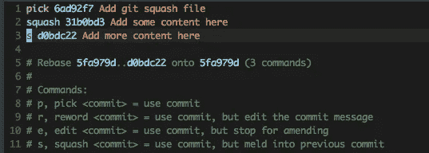

您可以看到，我们已经将最后两个提交标记为挤压。您可以使用**挤压**或 **s** 来标记挤压的提交。

在上面的例子中，被挤压的提交将被合并到主提交(即被标记为 pick 的提交)中。

标记提交后，您可以保存编辑器。

保存编辑器后，rebase -i 将打开另一个编辑器输入提交消息，如下图所示。

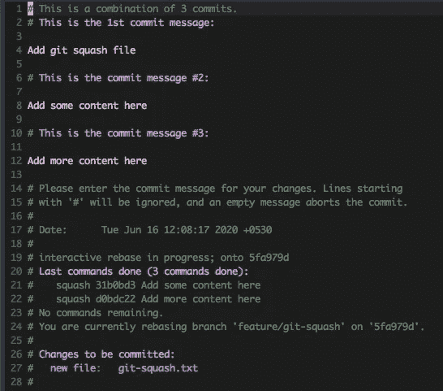

编辑提交消息后，您可以保存该编辑器。注意以 **#** 开头的行将被忽略。

git 日志如下

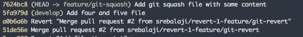

我已经编辑了提交消息，还注意到我们已经将这三个提交压缩为一个提交。

请注意，提交哈希也发生了变化。git rebase 将总是创建一个新的 commit，包含相应的更改。

**慎用**

记住挤压将改变 git 历史。因此，如果您已经将分支推到远程，则不建议挤压。

将更改推至远程之前，请始终挤压。

## 使用修复选项挤压

您还可以使用修复选项来压缩提交。修正和挤压是一样的，但是它不允许你编辑提交消息。它会将主提交(即标记为 pick 的提交)作为提交消息。

让我们看一个例子

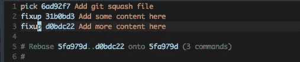

您可以使用**修复**或 **f** 来获得提交。获得提交后，您可以保存编辑器。交互式 rebase 将保存提交消息。

git 历史如下

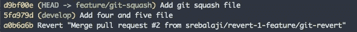

请注意，Git 已经接收了主提交消息，并将另外两个提交消息压入其中。另请注意，提交哈希也已经更改。

## 合并分支时使用挤压

Git 还提供了在合并分支时挤压的选项。这是一个非常有用的命令，非常方便。

我们大多数人将在分行工作。我们将检查分支，以建立一个新的功能或修复一些快速错误。

因此，当我们准备将这些变更合并到主分支(主分支或开发分支)时，压缩这些变更将更有意义。

因此，考虑下面的命令

```
git merge --squash target_branch_name
```

该命令将从目标分支获取所有提交，压缩它们，并在当前分支中存放所有更改。然后，您可以在一次提交中提交所有的更改。

让我们看一个例子

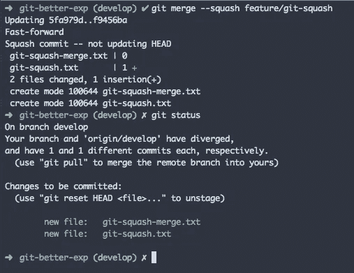

您可以看到，我们正在合并一个分支，以使用-squash 选项进行开发。Git 将接受所有的更改，并且已经准备好这些更改。

## 在 Github 中压缩提交

Github 还提供了挤压提交的选项。这也是一个非常有用的特性，在合并一个拉取请求时会很方便。

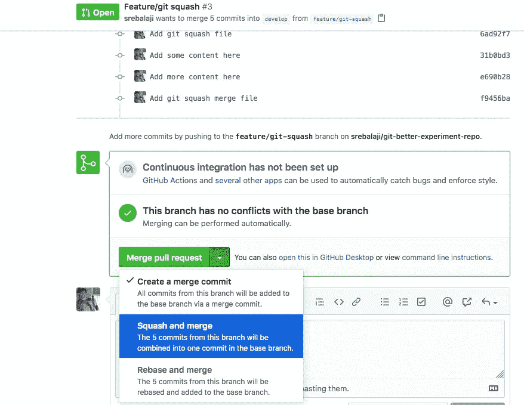

您可以挤压和合并更改。因此所有五次提交将被压缩为一次提交。

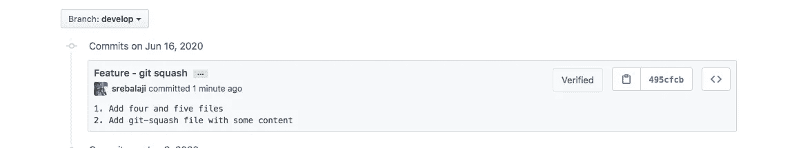

您可以看到，单次提交是通过相关的提交消息完成的。

感谢您的阅读:)

希望你学到了新东西:)

**你可以在这里找到我的其他 git 相关文章**

```
1\. [How to rewrite the latest commit with git amend](/how-to-rewrite-the-latest-commit-with-git-amend-48a8d5f27758)2\. [Useful tricks you might not know about git log](/useful-tricks-you-might-not-know-about-git-log-ed5ac32625ef)3\. [How git revert works](/how-git-revert-works-9b87b8b03dd3)4\. [How git cherry-pick works and how to use it effectively](/what-is-git-cherry-pick-and-how-to-use-it-effectively-665247192442)5\. [Automate repetitive tasks in Git](/automate-repetitive-tasks-with-custom-git-commands-76a4b71d262f)6\. [Useful tricks of git fetch and git pull](/how-to-use-git-fetch-and-git-pull-effectively-c6a4becfbc16)7\. [A very basic intro of Git](https://medium.com/@srebalaji/a-very-basic-intro-of-git-b9cab0e64153)
```

如果你已经来了这么久，那么我想你会对 Git 更感兴趣。可以订阅我的简讯[**Git better**](https://gitbetter.substack.com/)**获取 Git 的招数、技巧、高级话题。**

# 分级编码

感谢您成为我们社区的一员！[订阅我们的 YouTube 频道](https://www.youtube.com/channel/UC3v9kBR_ab4UHXXdknz8Fbg?sub_confirmation=1)或者加入 [**Skilled.dev 编码面试课程**](https://skilled.dev/) 。

[](https://skilled.dev) [## 编写面试问题

### 一个完整的平台，在这里我会教你找到下一份工作所需的一切，以及…

技术开发](https://skilled.dev)