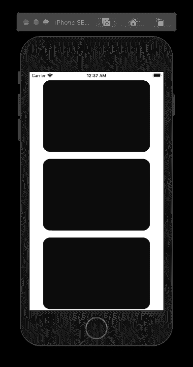
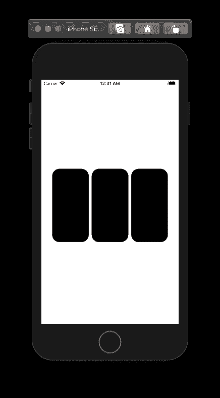
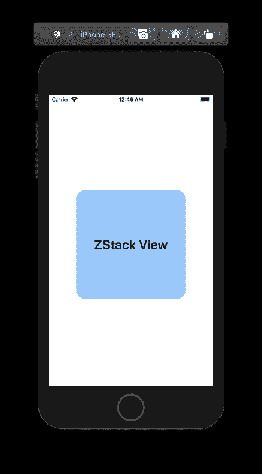
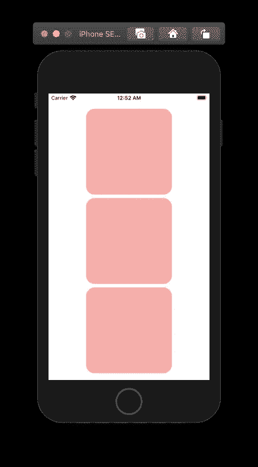
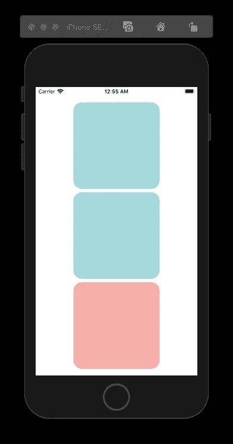

# 如何在 SwiftUI 中有效地堆叠视图和使用修饰符

> 原文：<https://levelup.gitconnected.com/how-to-stack-views-use-modifiers-efficiently-in-swiftui-e563c5e8989b>

## 了解如何使用 ZStack、VStack 和 HStack。

由 [Unsplash](https://unsplash.com?utm_source=medium&utm_medium=referral) 上的 [La-Rel Easter](https://unsplash.com/@lastnameeaster?utm_source=medium&utm_medium=referral) 拍摄的照片

SwiftUI 有三个内置的堆叠视图；VStack、HStack 和 ZStack。所有三个堆栈都是视图类型。堆栈有对齐和内容参数。VStack & HStack 也有一个间距参数。在 SwiftUI 中，最后一个参数可以省略，如果没有指定，默认的居中对齐和间距是动态的。
不用编写如下代码:

你可以用如下的简化方式来写:

# VStack

VStack 是一个视图，它将子视图排列成一条垂直线。下面的例子是垂直堆叠三个圆角矩形。圆形矩形是符合视图类型的形状。

# HStack

HStack 是一个以水平线排列其子视图的视图。下面的例子是水平堆叠三个圆角矩形。

ZStack

ZStack 是一个覆盖其子视图的视图，将它们在两个轴上对齐。下面的例子是堆叠圆角矩形形状和文本视图。

堆栈和修改器

上面解释的三个栈都是视图类型的。这允许我们使用视图的修改器。修饰符将应用于堆栈中的所有元素。在下面的例子中，所有的圆角矩形都应用了堆栈的前景色修改器。

堆栈视图内部元素的修饰符将覆盖堆栈视图的修饰符。下面的示例显示了第一个和第二个圆角矩形的前景色修改器覆盖堆栈的修改器。

感谢阅读。