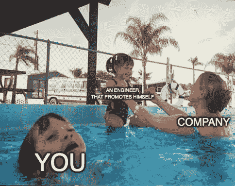

# 如何脱颖而出成为一名软件工程师

> 原文：<https://levelup.gitconnected.com/how-to-stand-out-as-a-software-engineer-f681a676d40d>

在 [Unsplash](https://unsplash.com?utm_source=medium&utm_medium=referral) 上由 [Alvan Nee](https://unsplash.com/@alvannee?utm_source=medium&utm_medium=referral) 拍摄的照片

如果你是一名软件工程师，你可能知道建立一个稳固的声誉是多么重要。如果你想在工作中晋升，这绝对是至关重要的。本指南重点介绍如何在工作中脱颖而出，成为一名软件工程师，从而获得团队领导和上级的更多认可。

为了脱颖而出，你需要做的不仅仅是写代码，还要按时完成任务。你必须为公司提供一些更难替代的有价值的东西，但是你怎么做呢？

# 主动

在软件工程的上下文中，“采取主动”可能意味着不同的事情，这取决于你在团队中的位置。了解自己的角色以及作为个人贡献者如何才能最好地为团队做出贡献非常重要。

我认为采取主动可以表明你有能力批判性地思考你的工作并独立解决问题，而不需要你的经理给你指出问题或任务。

倡议的一些想法:

*   消除重复的代码，如果需要的话通常进行重构(更多信息请见重构大师)
*   在缺少测试的地方添加测试
*   改进文档
*   降低成本(例如，[这就是优步如何将登录成本降低两个数量级的原因](https://www.uber.com/en-CA/blog/reducing-logging-cost-by-two-orders-of-magnitude-using-clp/)
*   通过寻找低挂起优化来减少慢速服务的执行时间。
*   通过记录系统中的重要流程来改进入职流程。

采取主动并不意味着必须自己做所有的工作。
你发现了一个差距，并获得了一些可能的解决方案——与其自己实施，另一种做法是创建一个任务来解决它，并由你的团队领导或项目经理对其进行优先排序。

为了对任务进行优先排序，它需要有商业价值，所以确保你准确地表达了你认为的差距是什么，以及为什么解决它是重要的。

事实上，你把你的头从战壕中抬起来，这是你的任务，为了改善系统的总体状态，这将受到赞赏。

成功地产生影响并弥补差距将会有很长的路要走，而且肯定能帮助你脱颖而出——但这不一定会自然而然地发生。你必须推销自己，这也是我的第二条建议。

# 推销自己

你采取了主动，做了艰苦的工作，但是如果没有人知道这一点也没有关系。

这只是一个迷因，放轻松

脱颖而出是为了得到认可。

让团队成员了解你的主动性以及你是如何改进系统的，这将有助于你获得更多同事的认可。

为了做到这一点，把你的成功发布在你公司的即时通讯平台上(slack，teams 等)，让其他工程师和经理知道你的计划或者你是如何改进系统的。

宣传你的成功很重要，因为这表明你不仅仅是一名技术人员，而是一个有上进心的人，为公司做出了贡献。

我能给你的另一个相关建议是把这些成功写在个人文档中。每当绩效评估或面试来临时，你都会有推荐人来回答这些棘手的问题。

# 坚持不懈地复习

不管你的头衔或工作经验有多少年，经常坚持不懈地检查你的简历。

审查 PRs 是一个很好的机会，可以向其他工程师学习，不用编写一行代码就能产生影响，同时让您的团队对最佳实践、编写良好的测试、正确的设计等负责。

对于任何团队来说，善于交流想法并提供有思想的反馈的工程师都是有价值的商品。

此外，我认为即使你是初级/中级，你也不应该害怕向你团队中的高级/负责人回顾、提问和提供新的想法。

无论如何，只有两种可能:

1.  你提出了一个很好的想法，得到了赞赏和重视，这绝对是一个成功。
2.  你失败了，这给了你学习的机会——仍然是一场胜利。

意识到你还不至于太年轻而不能复习，再加上给出好的、有思想的复习会让你脱颖而出。

为了获得更多关于代码审查和正确执行代码的建议，我个人喜欢阅读柯蒂斯·艾因斯曼的《T2》内容。

在总结之前，我认为值得一提的是，你应该按照自己的步调走，应用它需要时间，老实说，对我来说这也是一项正在进行的工作。

不要做得太过，会累垮的。

聪明地工作。
做最有影响力的事情。

# 结论

这三个技巧可以帮助你成为一名软件工程师。
下次评估你的表现时考虑一下它们，并把它们落实到你的工程流程中。

你越积极主动，你就能在你的团队、公司和社区中发挥越大的作用。

 [## 通过我的推荐链接加入 Medium-Eliran turge man

### 阅读 Eliran Turgeman(以及媒体上成千上万的其他作家)的每一个故事。您的会员费直接支持…

eliran9692.medium.com](https://eliran9692.medium.com/membership) 

我最近开始在 [substack](https://softwarengineer.substack.com/) 上写博客，如果你订阅了软件上的[，给工程师](https://softwarengineer.substack.com/)(完全免费)，我会很感激你的支持。