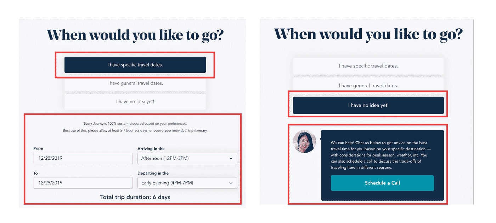
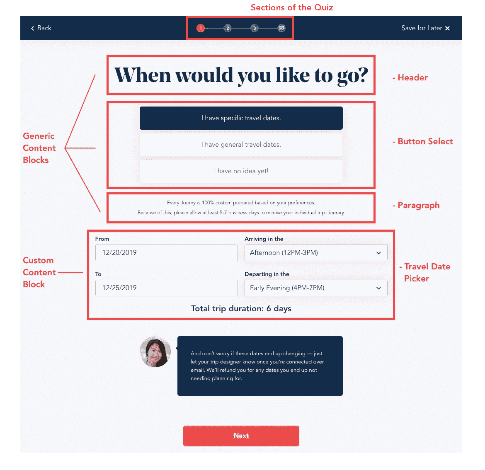
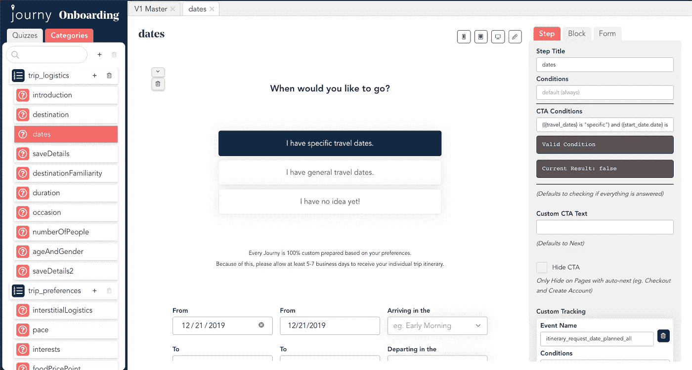
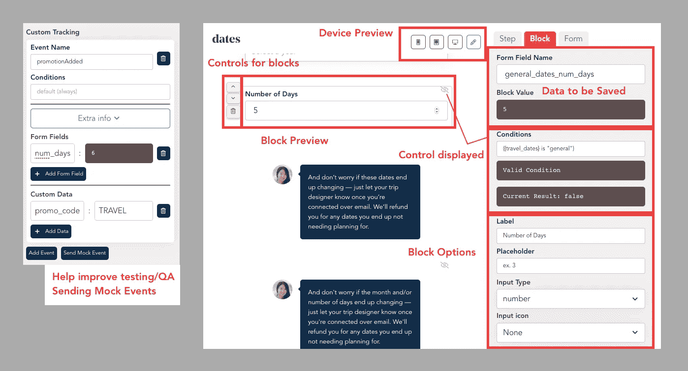

# 如何开始设计前端架构

> 原文：<https://levelup.gitconnected.com/how-to-start-designing-front-end-architectures-b24ce7dcf606>

## *这是关于* [*重新思考前端*](/rethinking-the-front-end-c0d86ccbbfe7?source=friends_link&sk=4e44c10ff075d46e3c7d8956097a89fe) *的多部分系列的第 2 部分。在这一部分中，我们将看一个设计相对较大的真实应用程序的具体例子。*

Paul Hanaoka 在 [Unsplash](https://unsplash.com/s/photos/organization?utm_source=unsplash&utm_medium=referral&utm_content=creditCopyText) 上拍摄的照片

作为一名开发人员，挑战之一是从初级到高级。这意味着超越实现，开始考虑设计和架构。

设计涉及两个技能:1。创造/发现/考虑目标和问题，2。构建方法/解决方案。

在本文中，我们将探讨一些最核心的考虑因素。

## 考虑所有利益相关者

在编写一行代码之前，从多个角度考虑您的产品以创建正确的概念和抽象非常重要。

好的代码不仅仅是功能代码。一个代码库的质量只有在它服务于它所接触的人时才是好的。一般来说，大多数产品都有三个主要的利益相关者:最终用户、产品人员和开发人员。这些是你可以获得大部分目标的地方。

## **最终用户和最终产品**

要对您的前端系统做出正确的决策，需要对最终用户和产品有深入的了解。最终用户设计通常是由 UX 设计师、平面设计和产品管理(包括市场营销)共同完成的。虽然关于设计的主要决策可能是由其他人做出的，但是理解最终产品将帮助您弄清楚项目需求，并做出关于设计实体/数据结构的决策。

**例子:**

在过去的一个月里，我的公司一直在开发一个工具来构建灵活的测验。我们的核心产品是为旅行者设计和创建定制旅程，这些旅行者希望获得真实的体验，而没有与旅行的每个方面的研究和预订相关的困难和压力。作为第一步，我们让顾客进行一次登机问卷调查，以帮助我们的旅行设计师设计完美的旅行。这意味着询问兴趣、旅行日期、价格、旅行原因等。

## 发现重要需求

最终用户和产品有助于理解所需的功能。将产品作为一个整体来理解，会使架构设计变得更加容易。既然你正在经历这个过程，试着想想你将如何实现每个部分，并考虑任何挑战和问题。例如，我们应用程序的一个重要特性是条件渲染:根据用户的反应改变显示的内容。

条件渲染

该功能根据用户的回答显示内容。如果我们没有提前考虑这一点，一个常见的前端错误可能是将问题的答案嵌入到组件本身中。

例如，`ButtonSelect`组件将把响应存储在它自己的本地状态中。在 React 中，你可以使用`useState`或`setState`，或者在 Vue 中，你可以使用`data`属性。

如果是这样的话，你将如何处理条件渲染？从同级组件中读取数据总是很尴尬。当用户提交时，您将如何提取测验的所有答案？如果不止一个块需要设置/共享相同的数据怎么办？

## 提取实体

将你的程序实体与客户对你的产品的看法联系起来是很重要的。对齐的实体使所有相关方更容易设计和推理功能。

使用最终用户设计实体。

通过在这个层次上思考，你可以思考事情应该如何组织。测验有部分，部分有步骤，步骤有内容块，等等…

正如您在上面看到的，有一些特定的块可以适应任何情况，而更多的自定义功能可能应该是自定义块(不灵活)。提前理解这些类型的需求有助于设计数据和组件。

很多时候，后端团队的工作是做出关于数据结构、API 和端点的决策。这是相当落后的，因为前端团队是数据的最终消费者。客户端的数据转换有很多问题(较大的包、较慢的运行时间、web 和移动平台之间可能的不一致等)。一个运行良好的团队，其实会有这两个单元的对话。前端团队将描述使编写代码最方便的数据类型，而后端团队将任何关注点或实现困难推后。

## **产品人**

为了改进产品，代码还必须具有灵活性和适应性。产品人员总是在分析和设计新的功能，创造新的内容，并思考新的方法来瞄准客户并与客户沟通。除非你的架构在需要的地方是灵活的，否则工程将是一个巨大的瓶颈。

在开始这个项目之前，我们以前的测验有一个问题。我们的调查问卷是用固定流程构建的:具有固定行为的预定义页面/视图。这使得 A/B 测试变得既困难又不可扩展，因为它需要工程人员对每个测试进行细微的编辑。我们需要的是一个工具，让我们的 UX 和非技术人员可以轻松地构建和编辑。

开发 1 个月后的应用程序

通过与产品人员交谈发现的特性:痛点。

进行单个副本更改、添加新的条件消息或添加没有生成器的单个自定义跟踪事件，每次更改将花费大约 30 分钟到 1 小时。为什么这么久？这些变更中的大部分需要一个简短的会议来向工程师描述变更，工程师需要找到正确的文件，进行小的变更，然后创建一个拉请求。然后是 QA、代码审查、代码测试和部署。

builder 应用程序将周转时间改为大约一分钟。与人交谈，找出什么工具将产生最大的影响！

**思考灵活性**

内部 CMS 工具可能并不总是解决问题的正确方法。灵活性意味着您的代码易于更改和添加。这意味着关注点的良好分离(您可以进行更改，而不用担心它会影响其他事情)，并添加您可以翻转以进行更改的选项/开关。灵活性的策略将在后面的文章中讨论。

## **开发商**

一个常见的统计数据是，开发人员花在阅读代码上的时间比写代码多 9 倍。为了获得良好的开发体验，应用程序内部的通信质量极其重要。

没有人愿意花时间从一个文件跳到另一个文件，试图找出他们关心的内容。这意味着良好的组织是至关重要的。良好的组织需要一定的远见。这意味着要花一到两周的时间来创建一个好的架构，然后创建一个 400-1000 字的简短文档来帮助向团队传达架构。开始时的这种努力将为您和您的团队节省几个月的实现时间。

## 好的代码组织？

你有没有做过所有文件都按“类型”组织的项目？视图放在一个文件夹中，组件放在另一个文件夹中，操作放在另一个文件夹中。听起来不错，对吧？开发 Ruby on Rails 应用程序？在 React app 工作？注意所有的应用程序看起来或多或少都是一样的，即使它们在做完全不同的事情。有什么问题？

按类型组织代码就像编写教科书，像字典或术语表一样组织所有的知识。人们阅读你的书，孤立地理解文件，但是如果他们试图了解你的程序总体上做了什么，他们会很困惑。

更有意义的是根据目标/关注点来组织事情。目标决定了我们必须在工作记忆中保存什么，以及代码在做什么。它帮助您找到您正在寻找的特定代码，而不会陷入上下文切换中。

## **不要害怕非标准的文件结构**

我们的应用程序的根目录如下:

**开发者便利/框架特定文件夹**

*   资产—图像、字体等的文件夹
*   块——通用可重用组件
*   成分—特定应用的组件
*   库导入—不同库的初始化脚本
*   样式—包括所有变量、函数和混合的基本样式表。

**基于特征的文件夹**

*   构建器应用程序—用于构建测验的应用程序
*   查看器应用程序—用于查看测验的应用程序
*   步骤模块—用于在测验中构建步骤的组件

您可以将文件夹的每一层视为一个关注层。这样，每个文件夹都有助于展示程序的一个层面。在顶层，你更关心的是各个部分如何组合在一起。随着对文件结构的深入研究，您会越来越关注实现。

这里的想法是你的文件夹结构有助于交流你的程序是如何工作的。

如果做得正确，读者可以理解你的程序是如何组合在一起的。他们不需要在文件目录中搜寻与抽象层次相关的文件(都在文件夹中)。这也意味着，新文件和文件夹相对于该层应该放在哪里是非常清楚的，从而使贡献更容易。这也是自述文件的一个自然去处！

第二个好处是，它自然地提供了一个更加“插件式”/模块化的架构。不再需要这段代码了吗？您可以删除文件夹和相关导入。没有必要四处寻找其他文件，可能是自重。

## 结论

本文简要概述了设计良好前端所需的一些高级考虑因素。我们讨论了如何设定设计目标，以及您需要解决的一些大问题。

1.  考虑所有利益相关者
2.  发现实体
3.  与您的后端通信以描述您想要的数据
4.  找出需求
5.  提前考虑实施和潜在问题
6.  决定什么需要灵活
7.  考虑文件结构和文档

少了什么？

1.  关注点分离
2.  成分组成
3.  将目标和问题转化为架构
4.  测试工具和策略
5.  规划和执行重构

下一章将讨论如何选择好的关注点分离/分组！

感谢阅读！请留下您想要涵盖的任何问题和反馈或主题！