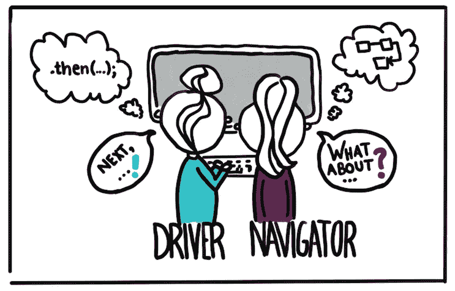

# 如何开始结对编程

> 原文：<https://levelup.gitconnected.com/how-to-start-pair-programming-ce302437280e>

对结对编程感兴趣？如果你没有听说过，这是两个开发人员使用一台机器协作解决同一个问题的地方。在过去的 10 年里，我已经能够进行结对编程，并且作为一名顾问向许多其他人传授了结对编程的好处和利弊。我将分享我在职业生涯中学到的东西，这样你就可以走捷径，快速上手，避免一些常见的陷阱。

阿尔瓦罗·雷耶斯在 [Unsplash](https://unsplash.com?utm_source=medium&utm_medium=referral) 上拍摄的照片

就像我上面提到的，[结对编程](https://en.wikipedia.org/wiki/Pair_programming)是两个开发人员在同一台机器上协同工作。你可能会认为这是非常低效的，但实际上恰恰相反。您获得了更多的一致性、更高的参与度、更少的错误，并且避免了在代码评审上浪费时间或者作为一个单独的开发人员走上错误的道路。

结对编程是来自[极限编程(XP)](https://amzn.to/3drXwd9) 的一种实践，目的是在开发软件时获得更快的反馈。把它想象成一个发生在编写代码时的*实时*代码审查，而不是事后审查。结对编程对于许多开发人员来说可能是一个两极分化的话题，尤其是对于那些有过糟糕经历的开发人员来说，因此为成功做好准备而不是让其他外部因素破坏整体利益是非常关键的。

照片由[安德鲁·尼尔](https://unsplash.com/@andrewtneel?utm_source=medium&utm_medium=referral)在 [Unsplash](https://unsplash.com?utm_source=medium&utm_medium=referral) 上拍摄

# 物理设置

结对时最好的体验是和另一个人在一起工作。疫情无疑给这种形式带来了麻烦，但我一会儿会谈到这一点。成功配对的关键是确保你和你的搭档都感到舒适，这意味着有足够的空间伸展你的腿，活动你的手臂，并能够切换谁全天连续驾驶。我推荐的设备如下:

*   两台显示器
*   两个键盘
*   两只老鼠
*   两把椅子

照片由 [LinkedIn 销售解决方案](https://unsplash.com/@linkedinsalesnavigator?utm_source=medium&utm_medium=referral)在 [Unsplash](https://unsplash.com?utm_source=medium&utm_medium=referral) 上拍摄

# 远程配对

在许多公司，甚至是我现在所在的公司，疫情已经迫使许多公司全职远程工作。远程工作有很多好处，但缺点之一是配对变得更加困难和费力。有许多工具每天都在变得越来越好，以便协作工作的障碍可以更加无缝，但真的没有什么比能够看到另一个人的肢体语言和视频疲劳更好的了。Screenhero 曾经是远程配对的首选工具，但在被 Slack 收购并被砍掉后，许多其他工具被开发出来，以填补留下的空白。这里有几个我用过的，推荐一下。

[Tuple](https://tuple.app/) —一款专门构建的应用程序，用于取代 Screenhero，并在结对编程时提供出色的体验。这个应用程序能够控制另一个人的整个电脑，并且不会阻止常用的键盘快捷键工作。

Tandem —一个聊天应用程序，允许你共享屏幕，并无缝地与另一对开发人员进行另一次聊天。目前仅限于 3 人，但很快就会扩大。

Zoom—可能每个人都熟悉 Zoom 作为虚拟会议客户端，它在共享屏幕和允许控制另一个人的屏幕方面做得相当好。有几个键盘快捷键是不允许的，但是只要有人共享他们的整个屏幕，那么你就能够进行富有成效的结对编程会话。有时你会有网络延迟或高峰，但总的来说，与许多其他客户端相比，它处理得很好。

# 入门指南

如果你或者你团队中的某个人已经对结对编程感兴趣了，那么恭喜你，这将会更容易让球滚动起来，并将其融入到你的正常流程中。如果你把它作为一个新的想法或实践带到团队中，确保你列出了期望或者把它作为一个实验。

慢慢开始，不要觉得你需要整天配对程序才能得到好处。结对在一开始是令人难以置信的消耗，有时对于那些更内向的人来说是这样，所以要定期休息。如果你发现你或你的伴侣开始变得目光呆滞，或者开始看他们的手机或其他东西，那么选择休息一下。只有当两个人都积极参与并解决问题时，你才能意识到结对编程的好处。

信用[https://martinfowler.com/articles/on-pair-programming.html](https://martinfowler.com/articles/on-pair-programming.html)

配对的时候有很多不同的风格；**司机/导航员、乒乓、测试编写员/测试修理员**。在结对练习中，交替使用不同的风格，每个人扮演不同的角色。我个人喜欢在一天中多次交换驾驶员/导航员，这样每个人都可以做一些打字工作，但不会因此而筋疲力尽。

考虑在短时间内工作，并有休息时间。使用[番茄工作法](https://todoist.com/productivity-methods/pomodoro-technique)可以让你更有条理，确保有规律地休息，而不会连续几个小时困在座位上。

我真的很喜欢与结对编程新手分享 Tuple 中的[结对编程指南，他们提供了很好的资源。如果你以前没看过，就来看看吧。](https://tuple.app/pair-programming-guide?__s=emxvfo1ct4nvs24pfsq2)

请记住，大多数团队在一起解决问题时，已经进行了某种形式的结对编程。你不应该试图一下子完全破坏或改变这种文化，而是引入结对编程，看看情况如何，找出最适合你和你的团队的方式。结对编程可以从你和另一个开发人员一周合作半天几次开始，然后看看更多的合作是否有益。

# 其他好处

你不仅可以放弃看起来一拖就是几天的正式的代码审查过程，我还看到了将结对编程作为你的规范的许多其他好处。

Joshua Michaels 在 [Unsplash](https://unsplash.com?utm_source=medium&utm_medium=referral) 上拍摄的照片

**消除领域和代码中的知识孤岛**

> 哦，我们不知道那部分代码。我们必须等到丹结束两周的假期回来。

如果你曾经听过这样一句话，它应该会让你畏缩。因为一个人不在，你就不能完成工作？当那个人不在公司的时候会发生什么？我把这称为彩票因素，也就是说，在你作为一家公司彻底完蛋之前，有多少人能赢得彩票并离开。您希望这个数字尽可能高，而不牺牲显著的吞吐量和交付工作，结对编程是可以提供这种好处的工具。当一起工作时，两个人开始理解给定特性或 bug 修复的代码，然后能够与更广泛的受众共享该信息。任期较长的开发人员将始终拥有代码中没有捕获的信息，这些信息可以与新开发人员共享，这样就不会丢失遗产。

**快速培养新开发人员**

类似于上面的观点，当你有两个开发人员在一起工作时，他们可以分享在你的公司成为一个更高效的软件工程师的技巧、诀窍和生产力诀窍。这有时会让人不知所措，但初级开发人员只要与另一名高级开发人员密切合作，就能取得重大的飞跃。稍后我会详细介绍这一点，但是一定要让初级开发人员在一天的大部分时间里开车，否则他们可能会检查或者不理解正在发生的事情。

我真的很喜欢首先询问团队中的新开发人员他们将如何解决问题，这样他们就可以给出新的视角。我可能已经知道我将如何解决这个问题，但是能够听到一个公正的观点可以为两个人和整个团队带来解决方案和结果。然后，我可以分享领域复杂性和某些边缘案例，以便在解决问题时考虑，这将有助于我的搭档对该领域的心理模型以及现在和将来可能发生的事情。

以我的经验来看，我见过开发人员在几周而不是几个月内就变得高效。在我们团队的第二周，我们通常会有新的开发人员部署到产品中，他们会立即为公司和团队提供价值。这是结对的最大好处之一，新的团队成员感觉他们是团队的一部分，而不仅仅是生产代码的齿轮中的一个齿轮。

由 [Unsplash](https://unsplash.com?utm_source=medium&utm_medium=referral) 上的 [krakenimages](https://unsplash.com/@krakenimages?utm_source=medium&utm_medium=referral) 拍摄

**协同工作充满乐趣！**

许多开发人员宁愿戴上耳机，低着头工作，除非绝对必要，不与任何人交谈。这在某些情况下是可行的，但是不幸的是，如果你在一个复杂的系统中与一个团队一起工作，那么你将不会知道所有的事情，你将需要和其他人交流才能成功，而不是浪费时间和资源。尽管我自己是一个内向的人，但我喜欢与他人交谈，并在软件开发方面做得更好。我喜欢反复检查我的工作，捕捉愚蠢的错误，如果我一个人，我会花一个小时左右的时间来识别，而不是立即解决并继续前进。软件是一项团队运动，与你的团队交流是制作最终用户喜欢的快乐软件的关键。

**完成更多高质量的工作**

对于社交媒体、技术博客文章、功能研究或电子邮件，当你是一名开发人员时，分心几乎是无止境的。当你情绪低落的时候，能够把注意力集中在另一个人身上，做出取舍，这是一个游戏改变者。大多数开发人员可以每天专注于 4 个小时，但是当结对时，你可以持续 6-8 个小时产生高质量的代码和解决方案。有很多次，离一天结束还有 15 分钟，我的搭档说“你认为我们能在一天结束前完成下一个功能吗？”。这对我是一个挑战，我喜欢编码挑战。我们尽我们所能做到最好，有时以失败的测试结束，第二天再回来。如果我没有这种额外的推动力，那么一天结束时的许多时间将会浪费在检查邮件或其他一些远非令人愉快的事情上。

由[凯利·西克玛](https://unsplash.com/@kellysikkema?utm_source=medium&utm_medium=referral)在 [Unsplash](https://unsplash.com?utm_source=medium&utm_medium=referral) 上拍摄的照片

# 需要注意什么

结对编程有很多好处，但归根结底，它是一种工具，可以在开发软件或解决技术解决方案时获得更快、更高质量的反馈。太多的好事也可能是坏事，以下是一些需要注意的情况:

**配对太多或强制规定一定的小时数**

我曾见过在让开发人员结对时，以固定的结对时间作为起点，但这可能会给一些开发人员留下不好的印象。重点是鼓励协作的工作环境，并在产品代码在更高的环境中导致问题之前对其进行审查。结对是实现这一目标的不可思议的工具，但它不是实现这一目标的唯一手段。目标是解决问题，而这些问题的解决方案并不总是技术性的，所以使用正确的工具。

过多的配对也会导致开发人员精疲力尽，特别是在变焦疲劳的情况下，你会感觉没有休息的灵活性，或者没有一天的时间来处理正在进行的工作。注意你和其他人有多少人在一起，并在回顾中询问每个人的日常表现。

在 [Unsplash](https://unsplash.com?utm_source=medium&utm_medium=referral) 上由[多库坎·沙欣](https://unsplash.com/@dogukan?utm_source=medium&utm_medium=referral)拍摄的照片

**不公开每天的认知负荷**

如果你不能集中注意力，或者因为个人问题度过了艰难的一天，那就向你的团队或你的搭档敞开心扉。长时间分心会剥夺结对编程的好处，增加你和你的团队的挫败感。如果你需要处理一些事情，甚至可以考虑请一天精神健康日，这是可以的，你的团队会感谢你照顾好自己，第二天带着更多的精力回来，而不是试图熬到工作日结束。没有人知道你脑子里在想什么，所以一定要把它具体化！

**不是每个人都想配对**

配对并不适合所有人。一些开发人员将结对编程与被监视和不被信任来做他们的工作联系在一起，并对此感到自负。一些开发人员不喜欢表达他们的想法，或者担心与他人意见相左。有人不想配对的原因有很多，这完全没问题。如果你的公司正在向全职结对编程模式发展，那么*让这成为你面试过程中的一个焦点*。**多次询问某人是否想在一个协作环境中工作，在那里他们将在一天中进行几个小时的同步视频通话**。直言不讳，不要试图粉饰。最好是让某人在被雇佣和加入你的团队之前就确切地认识到你要求他们做什么。

请注意那些喜欢使用键盘的开发人员，他们不想指导初级开发人员，也不想让他们在导航时就把实现赶出去。我见过太多次这样的情况，一个高级开发人员搞砸了一个实现，而他们的团队却被遗忘了，不知道发生了什么，更不用说解决方案是什么了。注意占用键盘会损害其他人的学习和效率。

照片由 [Antoine Dautry](https://unsplash.com/@antoine1003?utm_source=medium&utm_medium=referral) 在 [Unsplash](https://unsplash.com?utm_source=medium&utm_medium=referral) 上拍摄

**分离出“难题”并在**上配对

有很多公司在出现“难题”时会使用结对。对我来说，这是有用的，但失去了结对编程的精神，你没有获得消除知识孤岛或更好的入职体验的整体好处。结对意味着提供一致性，提升团队中的其他人，并继续一起解决*所有*问题，而不仅仅是最具技术挑战性的问题。

# 结论

我希望你现在已经准备好在某种程度上开始结对编程，或者继续将结对融入你的团队或公司。我个人*喜欢*结对，并寻找任何机会向他人学习，在一次良好的结对过程中烧掉积压的工作。要注意强制太多结对编程，以及推行太多的不良后果。

如果你喜欢这篇文章，考虑一下[订阅 Medium](https://medium.com/@ascourter/membership) ！

如果你或你的公司有兴趣找人进行技术面试，那么请在 Twitter ( [@Exosyphon](http://twitter.com/Exosyphon) )上给我发 DM，或者访问我的[网站](https://andrewcourter.com/)。如果你喜欢这样的话题，那么你可能也会喜欢我的 Youtube 频道。如果你想支持更多这样的内容 [buymeacoffee](https://www.buymeacoffee.com/andrewcourter) 。祝您愉快！