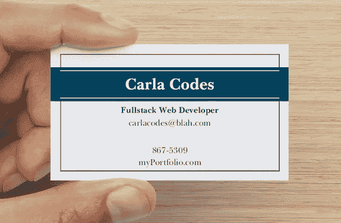

# 没有计算机科学学位，如何开始科技职业生涯

> 原文：<https://levelup.gitconnected.com/how-to-start-your-career-in-tech-without-a-computer-science-degree-fee66031f396>

凯文·Ku 在 [Unsplash](https://unsplash.com?utm_source=medium&utm_medium=referral) 上的照片

所以你已经决定你有兴趣在科技行业开始职业生涯，恭喜你！

根据美国消费者新闻与商业频道[的数据，美国大约有 70 万个技术岗位空缺](https://www.cnbc.com/2019/06/18/there-are-70000-open-tech-jobs-here-is-how-firms-are-hiring-for-them.html)。没有比这更好的开始时间了！

小小声明，我有计算机科学学位。然而，在我做过的每一份工作中——从 fullstack web 开发到研发——90%的同事都没有计算机科学(或类似)学位。此外，在我大学毕业后的第一份工作中，我是一名机器人过程自动化工程师，在我的整个工程师部门中，只有不到一半的人有大学学位。我想说的是:我见过双方，通常，老实说，除非你想在美国公司的某个地方找一份真正 fru-fru 软件工程的工作，否则这并不重要。

自从在这个领域工作以来，我明白了我的学位有多不重要。我在大学学到的几乎所有东西都可以在网上找到，而且是免费的。所以，如果你是一个积极主动的人，想要改变，一切都在等着你去寻找。

我和许多处于十字路口的朋友有过同样的对话:

*   “我有(空白的)副学士学位，我厌倦了做服务员”
*   “由于经济和家庭悲剧，我已经进出大学六年了”
*   “我获得了学士学位(空白),我讨厌我的工作”
*   “我是单身妈妈，需要一份有健康保险的工作”

我知道技术并不适合每个人，但如果你是一个专注和积极的人，我相信你能做到——你能做到！

为了简单起见，我假设你目前正在工作/学习，并且正在寻找职业改变。此外，我会假设你已经(或正在努力)获得大学学位。如果你没有，不要担心——我会写一篇单独的文章/录制一段单独的视频，告诉你如何在没有学位的情况下进入科技行业。尽管拥有学位可以让找科技行业的工作变得容易一些，但没有学位也不会让找工作变得不可能。

对许多人来说，这是关于获得一份稳定、高薪和福利的工作——这就是我想帮助你找到的。如果你梦想直接从编码训练营中获得一份工作，我可能无法帮你。

此外，这绝对不是一个完整的指南。你需要自己填补很多“空白”，做大量的研究，尝试和失败，努力工作，坚持不懈。我只是强调步骤的概述。

# 步骤 0:学习编程的基础知识(并决定这是否是你真正想做的事情)

**注**:你已经上过一门(或几门)编码课了吗？也许你有 STEM 或商业学位，你已经知道你对技术感兴趣——太棒了，你可以跳过这一步。

并非每个“技术工作”都是软件工程，但我 100%建议在前进之前先学习基础知识，原因如下:

1.  编程并不适合每个人。有些人绝对讨厌它——这没关系！在你可能投入成百上千的时间或金钱在训练营或认证上，却发现你不喜欢它之前，最好早点知道你是否讨厌它。我学习编程的头几个月(在我转专业到计算机科学之前)很有挑战性，但是每个人都是不同的。我通常需要把所有的东西都学两遍，因为在我第二次尝试的时候，概念似乎就“粘”住了。
2.  几乎每一项技术工作，即使你不会每天写代码，也需要基本的编程知识。

在这个阶段，你真正学习的编程语言并不重要。我个人会推荐 Python 或者 JavaScript。Python 更容易编写，因为代码([语法](https://en.wikipedia.org/wiki/Syntax_(programming_languages)))读起来很像普通英语，而且 Python 非常流行。JavaScript 也非常流行，在网站开发中大量使用，尽管代码语法不像 Python 那样“可读”，但它非常通用。一旦你知道了 JavaScript，就更容易跳到其他语言。

这也是学习 web 开发基础知识(HTML/CSS)的好时机，因为它们被广泛使用。

**注意**:我有另一篇关于初学者最佳语言和框架的文章/视频即将发布。

我推荐的一些(免费)资源是:

*   **代码学院**——[https://www.codecademy.com/catalog/language/javascript](https://www.codecademy.com/catalog/language/javascript)
*   **FreeCodeCamp** (这张是我的最爱！！)——[https://www.freecodecamp.org/learn](https://www.freecodecamp.org/learn)
*   **W3Schools**——[https://www.w3schools.com/](https://www.w3schools.com/)

如果你有 10-20 美元可以投资，我建议你等到 Udemy([https://www.udemy.com/](https://www.udemy.com/))大减价的时候(他们每隔几周就有一次)，买一门“编程语言入门”课程。它们更加结构化，提供数小时的视频、作业、帮助会话和练习项目。

玩玩代码，探索一下，开心一下，看看你喜欢什么或不喜欢什么。

现在，假设这是你喜欢的事情，现在你需要决定你想去的方向。

# 第一步:决定你对哪个技术领域最感兴趣

就像我之前说的，网页开发和软件工程并不是仅有的好的技术工作。科技领域如此之多，我无法一一列举。

## 以下是一些你可能想了解的技术领域:

**机器人流程自动化(RPA)**

*   我保证，如果你获得 RPA 认证(Blue Prism、UiPath、Automation Anywhere 等)，你将成为抢手货

**网络安全**

**网络管理或系统管理**

**质量保证**

**IT 支持**

**网页开发**

*   前端开发——构建用户访问网站时看到的内容。
*   后端开发——在应用程序的前端构建业务逻辑/代码。
*   全栈开发——前端和后端开发，你都做。

**用户界面/用户体验(UI/UX)**

**软件开发/工程**

**手机/应用开发**

**售前(解决方案/销售工程)**

**数据库管理**

**云行政**

还有更多的……

我建议研究这些领域，并选择几个领域进行深入研究。根据你对什么类型的工作或领域感兴趣，你需要决定你是想获得一个证书还是花几个月时间参加一个编码训练营。

# 第二步:认证还是不认证？训练营？这么多钱！

好了，那么你已经决定了你要朝哪个方向前进，太好了！现在你需要某种“凭证”来向潜在雇主证明你知道自己在说什么。

在移动、网络或软件开发的情况下，你(通常)有三种选择

1.  (**昂贵的**)参加一个编码训练营。编码训练营是编写代码的兼职或全职“速成班”。在某种程度上，这就像是一所技术学校。根据项目的不同，你将花 3 到 12 个月的时间学习编码。训练营可以是面对面的，也可以是远程的，费用从 0 美元到 25，000 美元以上不等。我在中西部看到的大多数编码训练营的价格在 10，000 到 15，000 美元之间。一些项目有一个“收入分享协议”,在这个协议中，你不用支付学费或预先为项目融资，而是在毕业后将你训练营后收入的一定比例拿出来。参加训练营是一项艰巨的任务，我会在以后更多地谈论它。
2.  (**便宜**)为自己打造一个梦幻般的项目组合。任何你想要的东西，一个匹配你和你的双胞胎狗的照片的网站，优步(空白)，一个网络聊天平台，等等。建立这些项目不仅会增加你对这个主题的了解，还会给招聘人员一些参考。不利的一面是你需要自己完成所有的学习。网上有很多免费的学习资源，但这需要花费大量的时间和精力。
3.  (**免费，而且越来越受欢迎**)去当学徒。越来越多的公司在这些领域提供学徒机会——尤其是规模较小的本地企业。一般来说，他们可能很难找到，但他们确实存在。我大学时的一个好朋友能够通过简单地询问一家打算雇佣初级开发人员的当地企业来获得实习机会。

假设你想进入几乎任何其他领域:网络安全、RPA、IT 支持、网络管理等。获得认证的最佳途径。一些受欢迎的认证是:

*   CCNA(思科认证网络助理)-[https://www . Cisco . com/c/en/us/training-events/training-certificates/certificates/Associate/ccna . html](https://www.cisco.com/c/en/us/training-events/training-certifications/certifications/associate/ccna.html)
*   CompTIA A+
*   谷歌 IT 支持
*   AWS(亚马逊网络服务)开发者
*   机器人过程自动化(RPA)认证(Blue Prism、UiPath、Automation Anywhere 等)

还有更多…..

假设你在自己选择的领域没有什么背景经验，根据证书的不同，通常需要 3 个月左右的勤奋学习来准备考试。

# 第三步:工作，实习，创业，孵化器！

所以，你有一个作品集，可能有一两个证书，你要么花时间在编码训练营，实习，或者疯狂地学习——是时候找一份技术方面的工作了吗？绝对的！不要让“冒名顶替综合症”影响到你。即使你认为自己没有准备好，也有很多公司在招聘初级专业人员。在这一点上，你很可能有足够的技能和能力来胜任初级职位。

首先，调整你的简历(我是 [OpenLeaf](https://www.overleaf.com/latex/templates/tagged/cv) 简历模板的粉丝)并获得反馈。请朋友、同事或网上的陌生人评论它。**一份扎实的简历大有帮助。一定要把注意力吸引到你的作品集或证书上。如果你在编码训练营，他们可能会帮你整理简历。**

下一步:申请，申请，申请。

找一份科技工作需要两样东西:运气和人脉。

去 Vistaprint(或类似的网站)投资 100 张左右的名片，上面有你的名字、电子邮件、电话号码和想要的职位。例如:

然后，登录脸书或 MeetUp，搜索你所在地区的任何科技活动。

在你当地的图书馆做关于 TenserFlow 的讲座？当地咖啡馆的编码器咖啡时间？专业机构欢乐时光？

这是认识你所在地区的其他技术专家并让你出名的最好方式。

当然，你可以在网上发出数百份求职申请，但以我个人的经验来看，当你像这样出去交际时，你会有这样的互动:

“厉害了，你有(空白认证)？我知道(公司)的某某人急需一个(你想要的职位)——你的联系方式是什么？”

我不是在讽刺，我个人已经多次看到这种情况发生。

让自己受到关注的其他一些建议:

1.  附近有创业孵化器吗？询问他们是否有任何常驻公司正在招聘。
2.  参加黑客马拉松，与招聘人员交谈。
3.  从事开源项目。
4.  申请实习
5.  在急需技术工人的“铁锈地带”寻找工作。
6.  写一个技术教程。

# 结论

我希望我能给你提供有用的信息。我知道这不是一个全面的指南，但我的目标是在你的头脑中放一个 bug，你绝对**能**做到，而且你不是唯一一个。

你可以看我在 YouTube 上关于这个话题的视频，这里:[https://youtu.be/b59LIdYut7o](https://youtu.be/b59LIdYut7o)

感谢您坚持到现在，请继续关注更多内容。