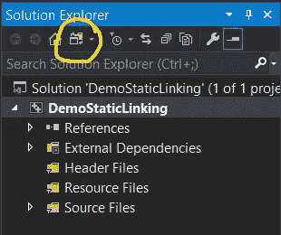

# 如何:用 vcpkg + Visual Studio 2019 静态链接 C++库

> 原文：<https://levelup.gitconnected.com/how-to-statically-link-c-libraries-with-vcpkg-visual-studio-2019-435c2d4ace03>

手动处理 C++库并将它们静态链接到您的项目可能是一件非常痛苦的事情。幸运的是，有像 vcpkg 这样的包管理器，可以使下载和管理 C++依赖项变得容易得多。不幸的是，(或者幸运的是，取决于你的观点)vcpkg works 使用开箱即用的动态链接，但是静态链接你的库需要一些跑腿的工作。我经历了很多痛苦才弄清楚如何用 vcpkg 和 Visual Studio 静态链接包，所以我写了这个教程，这样你就不必经历我经历的痛苦。在本教程中，我将向您展示如何设置 vcpkg 并将其与您的 Visual Studio C++项目集成。最后，我将介绍如何设置 Visual Studio 来使用 vcpkg 下载的静态库，让我们开始吧！


# 0.VCPKG 安装和设置

首先，请确保您的计算机上安装了 git 和 Visual Studio 2019。在这里你可以下载 [git](https://git-scm.com/downloads) 和 [Visual Studio](https://visualstudio.microsoft.com/downloads/) 。

接下来我们要下载 vcpkg。要做到这一点，你需要访问 vcpkg GitHub 库[这里](https://github.com/Microsoft/vcpkg)。一旦，你将点击绿色的“克隆或下载”按钮，并复制出现的链接。


GitHub vcpkg

现在回到你的桌面，输入:

> Windows 键+ R

并在对话框中输入:

> 煤矿管理局

将加载 Windows 命令提示符，您应该会看到如下内容:


Windows 命令提示符

在命令提示符下输入 git clone 和之前复制的 GitHub 链接，然后按 enter 键:

```
> git clone [https://github.com/microsoft/vcpkg.git](https://github.com/microsoft/vcpkg.git)
```

您的输出应该如下所示:


克隆 vcpkg 后的结果

您现在已经成功下载了 vcpkg！所以现在让我们安装它并下载一些软件包！

在命令提示符下，进入 vcpkg 目录:

```
> cd vcpkg
```

然后要安装，请输入:

```
> bootstrap-vcpkg.bat
```

您的输出应该如下所示:


安装 vcpkg

接下来，我们希望将 vcpkg 与 Visual Studio 的安装相集成，为此，您只需输入:

```
> vcpkg integrate install
```

您的输出将如下所示:


将 vcpkg 与 Visual Studio 集成

不要介意我现在在一个名为“项目”的文件夹中，因为我之前安装了 vcpkg。

# 1.下载依赖项

到目前为止你做得很好，所以让我们安装一些软件包！

要搜索要下载的包，请输入:

```
> vcpkg search <package name>
```

例如，让我们搜索 spdlog 库:


vcpkg 搜索 spdlog

我们找到 spdlog 包了！现在让我们下载它。

有两种方法可以解决这个问题。如果你想下载这个包并使用动态链接，你只需要输入: *vcpkg install spdlog* 。但是我们不想这样做，因为我们想为我们想要的平台下载静态库。在本例中，我们将为 x64 Windows 平台下载 spdlog。

为此，请输入:

```
> vcpkg install spdlog:x64-windows-static
```

您应该会看到以下输出:


安装 spdlog 静态库

我们现在已经下载了我们的库，所以让我们配置 Visual Studio 来使用它！

# 2.配置 Visual Studio

首先打开 Visual Studio 2019，点击“新建项目”。


Visual Studio 2019

选择“控制台应用程序”:


创建新项目

输入你的项目名称，点击“创建”按钮。


配置您的项目

现在有趣的事情开始了。

因为我们使用的是 x64 平台，所以我们要做的第一件事就是将我们的项目从默认的 x86 更改为 x64。

为此，将屏幕顶部的下拉列表从 x86 更改为 x64，如下所示:


调试 x64

接下来，转到解决方案浏览器，单击“文件夹视图”图标，并选择“文件夹视图”选项



文件夹视图图标

您应该会看到您的项目解决方案文件:


项目文件夹视图

点击。列表中的 vcxproj 文件。您将看到一个 xml 文档出现。向下滚动一点，直到看到*<property group Label = " Globals ">*标签。


属性组全局

在最底部添加下面一行:

```
<VcpkgTriplet Condition="'$(Platform)'=='x64'">x64-windows-static</VcpkgTriplet>
```

这将根据您决定使用的平台而有所不同，例如，如果您使用的是 win32 x86 应用程序，我们将输入:

```
<VcpkgTriplet Condition="'$(Platform)'=='Win32'">x86-windows-static</VcpkgTriplet>
```

事实上，您可以两者都使用，但是对于我们的示例，您的文件应该如下所示:


保存您的更改，再次点击“文件夹视图”图标并选择<yourproject>。在我的例子中，它是 DemoStaticLinking.sln。这是您将看到的结果:</yourproject>


点击“文件夹视图”图标后的结果

你需要再次加载你的项目，所以左键点击第一项选择“加载所有项目”,然后点击“是”,直到你回到你的主项目。


最后一步是将我们的 C 运行时环境更改为支持静态链接的环境。如果不这样做，当您试图使用您的库时，将会遇到链接器错误。

左键单击您的项目解决方案，并选择底部的属性或点击

> Alt + Enter

对话框弹出后，您需要进入 C/C++ >代码生成:


性能

如果您在顶部看到“配置:发布”，请将运行时库属性更改为“多线程(/MT)”:


点击应用。然后将“配置:发布”改为“配置:调试”，将 C 运行时库改为“多线程调试(/MTd)”:


至此我们完成了！我们现在可以使用我们的 vcpkg 静态库并编译它们了！

在您的主 cpp 文件(我的是 DemoStaticLinking.cpp)中添加以下内容:


单击顶部标有“Local Windows Debugger”的绿色三角形来运行项目，您应该会得到以下输出:


最终输出

你做到了！您成功地将 vcpkg 与 Visual Studio 集成，并将您的 Visual Studio 项目配置为链接静态库！现在，安装 C++库并将它们静态链接到您的项目应该比以前更容易了。我希望本教程有助于简化您的 C++开发工作流程。编码快乐！:)