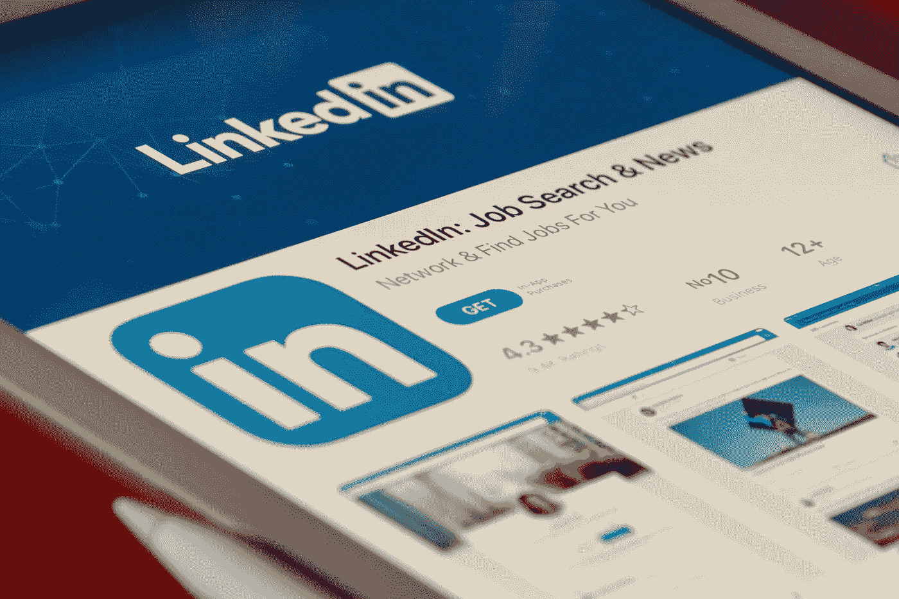
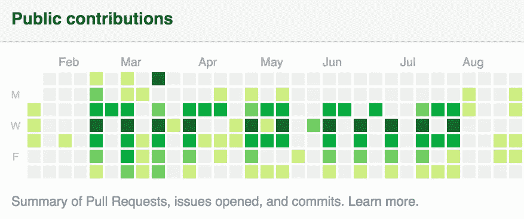

# 作为程序员如何在竞争中保持领先

> 原文：<https://levelup.gitconnected.com/how-to-stay-ahead-of-the-competition-as-a-programmer-5a32c2463578>

## 让自己与众不同并提升自己形象的小贴士

在 [Unsplash](https://unsplash.com/s/photos/programming?utm_source=unsplash&utm_medium=referral&utm_content=creditCopyText) 上由 [Max Duzij](https://unsplash.com/@max_duz?utm_source=unsplash&utm_medium=referral&utm_content=creditCopyText) 拍照

我最近在 [Quora](https://www.quora.com/How-can-one-stay-ahead-of-the-competition-as-an-average-programmer/answer/Matthew-Croak-1) 上回答了另一个问题，有人问…

> "作为一名普通的程序员，怎样才能在竞争中保持领先？"

我决定在一篇博文中详述这个答案，以防有人想更全面地了解我的主要观点。

让我们直接跳进来吧！

假设你正在以与竞争对手相同的水平/速度构建项目(构建是提高你的技能和拥有投资组合的最佳方式，这样雇主就可以看到你的熟练程度)，下面是一些你可以做的事情，让你从竞争中脱颖而出。

# **领英**

照片由 [Souvik Banerjee](https://unsplash.com/@rswebsols?utm_source=unsplash&utm_medium=referral&utm_content=creditCopyText) 在 [Unsplash](https://unsplash.com/s/photos/linkedin?utm_source=unsplash&utm_medium=referral&utm_content=creditCopyText) 上拍摄

其他竞争对手可能也有。

如果你还没有，你也应该有一个。

这很重要，不仅是因为人们可以看到你的职业历史和技能，也是因为当招聘人员在 LinkedIn 上寻找候选人时，你更容易被找到。LinkedIn 是一个很好的社交和寻找潜在角色的工具。

如果和帖子互动，分享项目等也不错。这样社区会更加熟悉你和你正在做的事情。这让我想到了提高你脱颖而出机会的第二种方法。

# 开源代码库

这是竞争对手可能会有的另一件事。你也应该有一个，这样你就可以托管你的应用程序和在线工作。通过这种方式，雇主可以访问你的 GitHub 并[看到很多绿色的](https://medium.com/@olyaB/making-your-github-green-again-dab6f414b04b)(即你定期提交代码，即你正在构建很多代码！).

图片来自[强迫症](https://medium.com/@olyaB/making-your-github-green-again-dab6f414b04b)

Github 和 LinkedIn 不会从本质上将你从竞争中分离出来。

然而，如果你互动/贡献得更多，那么招聘人员可能会更注意你——而且，无论如何你都需要这些个人资料，这样人们更容易看到你的兴趣和工作。另一个分享你的工作和兴趣的好方法是通过博客。

# **博客(中型)**

你和代码的关系怎么样？

这是一个很好的方法来分离你自己，原因有三。

1.  你的博客可以展示你的知识和你真正的兴趣。
2.  这是别人来找你时找到你的另一种方式。你的竞争对手可能会有 LinkedIn 和 Github。因此，如果除了这两个博客之外，还有一个写有你名字的中型博客，这是查看你工作的另一种方式，也是一个不同于其他候选人的评估渠道。
3.  这是一个很好的学习工具，因为它迫使你回顾你的工作，并解释你在做什么和为什么做。

我可以亲自证明我自己的博客在采访中被提及或引用。

当我面试我之前的工作时，一个面试我的人提到了我的一个职位。他们说它“令人印象深刻”，并让我解释为什么我选择了我写的那个图书馆，以及我是如何使用它的。

我不认为我的博客文章是我得到这份工作的*原因。然而，我绝对认为我是为数不多的能够在面试中进行这种对话的候选人之一(如果不是唯一的话)。*

如果你担心自己不是一个好作家，或者不知道该写些什么，放轻松。

一样的妹妹，一样的。

你不必每次都写小说。你做得越多，你的写作就会越好。

如果你需要一个帖子的想法，简单地写下…

1.  你在做什么，或者…
2.  你工作的一部分，或者…
3.  您选择的堆栈及其原因，或者…
4.  你犯过的错误以及你是如何改正的…

结合你正在做的事情，有比你想象的更多的事情要写。稍后会详细介绍。

还有，不一定要在培养基上做。然而，我喜欢 Medium，因为它是一个相当大的平台，有很多有价值的内容。它排名很好，被广泛使用(你现在正在使用它！)*和*你甚至可以最终[为你的内容](https://medium.com/earn)赚钱。

# **堆栈溢出**

这很有用，因为您可以…

1.  练习解题。
2.  表明你对反馈/询问来自 Stack 社区的问题感兴趣并感到自在(类似于开源贡献)。

我也认为这很好，因为我认识的许多在招聘过程中遇到的工程师很少在简历中展示或谈论这一点。

这很可能是因为他们主要用它来查找答案，而不是真正地提供答案，或者他们自己发布问题会感到不舒服。

如果你能在这方面做得很好，在我看来这绝对是一个优势。任何形式的开源贡献都好！

# 为开源做贡献

这个很好，因为它表明你不仅知道如何编码，而且理解开源社区的价值，并且是一个积极的参与者，而不仅仅是一个受益者。

*这类似于造成堆栈溢出的效果。*

这也表明你了解如何发布代码(【npmjs.org】、 [pub.dev](https://pub.dev/) 等)。).虽然这些贡献不一定简单，但是有很多教程/文档可以指导你如何去做。

如果你能证明你以前做过，那就是在竞争中的另一个优势。

# 如何一起做

让我们现实一点。申请工作很难——尤其是当你是这个领域的新手时。

做上面所有的事情看起来令人畏惧，你不需要做所有的事情。

然而…

尝试将它们结合在一起会让你受益匪浅，而且并不像你想象的那么难！这里有一个快速的框架来确保上面的项目可以相互补充和复合。

1.  构建一个项目(您应该已经在做了)。
2.  在 Github 上托管它(同样，你应该这样做)。
3.  你碰到一个块/特性，找到你关于栈溢出的解决方案(或者你提出一个关于栈溢出的问题，自己得到一个答案)。如果您没有碰到项目中的任何块，那么您需要构建一个更复杂的项目。
4.  写一篇关于你遇到的问题和你是如何解决的快速帖子(分三部分想:*我在做什么；我遇到了什么；我是如何修复的；* *结尾*)。
5.  在 LinkedIn 上分享帖子，展示你的人脉。

# **奖励:联系招聘人员**

不要误会我的意思，我认为如果工作量很大的话，技术人员的招聘是必要的，但是有招聘人员在你身边绝对是件好事。

对于招聘经理来说，这是一种比冷申请更直接的沟通方式，也比在 LinkedIn 的 DMs 中滑动更不容易被忽视。另外，你可以免费使用它们(如果招聘人员要求你支付费用的话)。

此外，如果一份工作不太适合你，那么很可能他们有其他你可以面试的工作。

# 摘要

这个列表并不详尽，但在我看来，这些让你从竞争中脱颖而出的方法对我很有帮助。它们在下面。

*   开源代码库
*   商务化人际关系网
*   博客
*   堆栈溢出
*   招聘人员

求职本身就是一份工作。

也就是说，您可以通过在它们的基础上进行构建，将上述一种或多种方法融入到您的日常编程旅程中。你可以建立一个项目(无论如何都应该这样做)，在 Github 上托管它(同样，你应该这样做)，写下它，然后在 LinkedIn 上分享帖子！

你认为程序员还有哪些方法可以从竞争中脱颖而出？请在评论中告诉我！

[***升级您的免费 Medium 会员资格***](https://matt-croak.medium.com/membership) *并接收来自各种出版物上数千名作家的无限量、无广告的故事。这是一个附属链接，你的会员资格的一部分帮助我为我创造的内容获得奖励。*

*您还可以通过电子邮件* *订阅，每当我发布新内容时，您都会收到通知！*

# 参考

 [## 让你的 Github 再次变绿

### 当我打开某人的 Github 个人资料时，我首先会查找头像。这是一个自然的愿望，想看到一张…

medium.com](https://medium.com/@olyaB/making-your-github-green-again-dab6f414b04b)  [## 谷歌地图反应初学者指南

### 能够在 React 应用中使用 Google Maps API 不仅为您提供了可靠的导航资源…

levelup.gitconnected.com](/google-map-react-beginners-guide-85bb1a94b04a)  [## 为你的写作挣钱

### 加入合作伙伴计划，通过写作赚钱。你可以为你发布的内容获得报酬…

medium.com](https://medium.com/earn)  [## 如何不招聘软件工程师第二部分

### 两次 LinkedIn 推介；两种截然不同的反应

levelup.gitconnected.com](/how-not-to-recruit-a-software-engineer-part-ii-d71acd581da3) 

# 分级编码

感谢您成为我们社区的一员！在你离开之前:

*   👏为故事鼓掌，跟着作者走👉
*   📰查看[升级编码出版物](https://levelup.gitconnected.com/?utm_source=pub&utm_medium=post)中的更多内容
*   🔔关注我们:[Twitter](https://twitter.com/gitconnected)|[LinkedIn](https://www.linkedin.com/company/gitconnected)|[时事通讯](https://newsletter.levelup.dev)

🚀👉 [**加入升级人才集体，找到一份惊艳的工作**](https://jobs.levelup.dev/talent/welcome?referral=true)