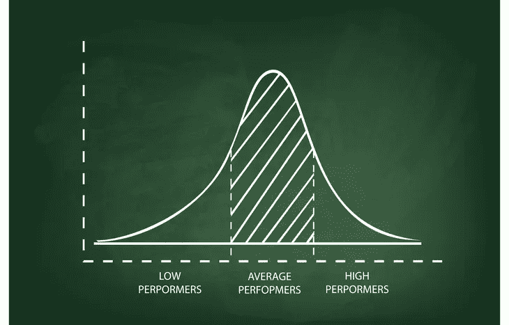

# 作为一名软件工程师，如何保持积极性

> 原文：<https://levelup.gitconnected.com/how-to-stay-motivated-when-learning-to-code-ef0f25df6d49>

动力是开始的好方法，但它是结束的最好方法吗？

照片由赛义德 [Qaarif Andrabi](https://www.pexels.com/photo/a-person-using-a-computer-keyboard-in-front-of-a-laptop-12495614/) 拍摄

## 残酷的事实是:

大多数人不能依靠个人/内心的意愿来完成事情。

***大学不算*** 因为大多数人觉得有义务获得大学学位。

真正重要的是当你在做某件事时，因为你没有 ***去做这件事。***

你这么做是因为你 ***想要*** 去做。

不多不少。

动机是一种强有力的工具，也是一种强烈的情感。当被另一个人的成功所激励，或者想到你的未来和你想要完成的事情时，它就会被唤起。

然而动机也有弱点。

它通常不会持续很长时间，通常会伴随着两个因素:**强度**和**激光聚焦**。问题是当强度减弱时，你通常会慢下来，你朝着学习编码的目标前进的速度也会慢下来。

大多数时候，你会发现你仍然有激光焦点，因为你知道你想完成什么——你想学习编码和构建酷软件。你仍然有远见。你只是没有动力了。

那么，在学习编码时，你能做些什么来保持动力呢？我们来分析一下情况。

我就直说了。动机仅仅是*不够*去学习编码。

通常完成任何有价值的目标都是不够的。动力的美妙之处在于它在你旅程的起点有如此大的强度…**。**

*当这种强度持续时，几乎没有什么可以阻止你。每天你都会坐下来，想要编码并学习成为一名伟大的软件工程师所必需的一切。*

*很好玩。*

*很刺激。*

*这一阶段不可避免地会很快结束。*

*因为总有一天你会不像以前那样兴奋地坐下来学习。然而，你很可能能够坚持下去，并让自己打出几行，但最终随着强度的减弱，你可能会决定学习编码不适合你，你可能会停止编码。原因是因为一旦强度消退，你会认为你已经失去了兴趣。这实际上是不正确的，这是激励的危险之一。让我们再深入一点。*

*动机的真相是它的礼物也是它的诅咒。在你的旅程开始时与如此巨大的强度相关的感觉不能被保持。然而，从长远来看，这些感觉仍然是需要的，所以你可能会在内心感到，因为那些兴奋的感觉已经减弱，你不能继续下去了。*

*这也是为什么学习编码不能只靠动力。你得靠第二部分动力:**激光聚焦**。*

## *焦点*

*重点是长期的。*

*这并不像开始时那种强烈的感觉那样迷人、浮华或有趣，但我认为专注给**提供了更多有益的结果**。像大多数事情一样，快速简单的解决方案不会持久。*

*当学习编码时，会有延迟的满足感，你必须习惯这一点，因为它是软件工程领域的中流砥柱。*

*你必须先走，然后才能跑。*

*(你得先学 HTML/CSS/JavaScript，才能学 React 之类的。)*

*我的建议是学会**享受散步**。*

*更重要的是，无论你是否喜欢，一定要坚持走下去。如果你停止(行走)，你将永远达不到你的目标。*

## *还有什么比激励更有效？*

***计划** —计划是一系列更小的、**可操作的目标**，可以导向最终目标。这里有一篇我写的关于软件工程师规划的文章。你的计划将决定你的方向和总体目标。*

***常规** —常规是一个有组织的计划，决定你将如何度过你的时间。你的日常生活将确保你行动的一致性，并帮助你开始一个好习惯。*

*如果你保持专注、适当的计划和常规，你会发现你会在整个过程中体验到兴奋和享受。*

*你也会经历挫折和痛苦，但是如果你透过延迟满足的镜头来看待奋斗，它实际上是美丽的。*

> *总有一天，回想起来，奋斗的岁月会让你觉得最美。― **西格蒙德·弗洛伊德***

## *其他陷阱*

*我发现，当你朝着最终目标努力时，即使目光短浅也会阻碍你的进步。原因是因为有时你的激光焦点太窄，看不到更大的画面。如果你专注于六个月到一年的时间，许多目标看起来就不值得了。关键是专注于对你特别重要/有意义的事情。*

*例子:你不仅将学习编码，而且你将能够构建能够影响你的社区的伟大软件。*

*使用任何必要的焦点来实现你的最终目标。*

## *你会很特别*

*如果你坚持下去，你会出类拔萃的。*

*当你每天都在不必要的时候出现，这真的很特别。你这么做的唯一原因是因为你已经设定了一个目标，并且你想要实现它。不是为了别人，也不是为了你自己的生存，只是因为这是你想做的事情。*

> *我没有和我自己谈判…我和我自己签了那份合同…这是没有商量余地的。我正在做。— **科比·布莱恩特***

*这将使你在软件领域或任何领域与众不同。*

*下面是一个钟形曲线。据说是人口的正态分布。*

**

*贝尔曲线由[莉安娜凯利](https://investmentu.com/bell-curve/)*

***左边的**是那些说他们将学习编码，但从未开始的人。*

*中间是大多数人跌倒的地方。他们会尝试，但随着时间的推移会放弃。*

***右边**是坚持下来成为伟大软件工程师的人。*

*我知道你想站在哪一边。这是我们都想去的地方，你可以通过一个计划、一个常规和适当的关注来达到目的。*

## *结论*

*学习编码很难。学习如此多的技术、框架和语言是一项艰巨的任务，但是你会发现你学得越多，你的学习能力就越强。你会学得更快，更好地记住概念。随着事情变得更加熟悉，你与自己建立了融洽的关系，你会对自己的能力有信心。我在这里写了另一篇文章，提供了更多关于你与自己建立融洽关系的细节。*

*动力稍纵即逝，短期内有效，但不可持续。*

*专注、计划和例行公事能增强一致性和进步，不要依赖转瞬即逝的感觉。*

*选择你的战士。*

*保重。*

*[**通过电子邮件获取我的文章**](https://anthonycg_.medium.com/subscribe) **|** [**购买 5 美元的中等会员资格**](https://medium.com/@anthonycg_/membership)*

*你好，我是安东尼！我当然希望你喜欢这个故事，更重要的是，我希望它能让你思考，这一直是我的目标。我目前正在进行成为一名熟练软件工程师的个人旅程，我希望你能加入我的行列。给我一个关注(和一两个掌声)，我们下次再见！*