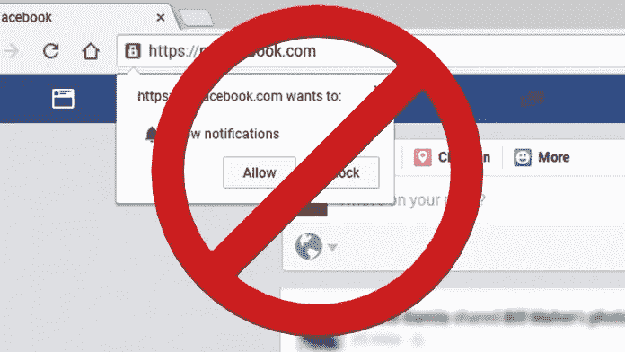
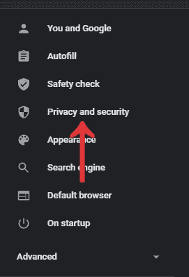
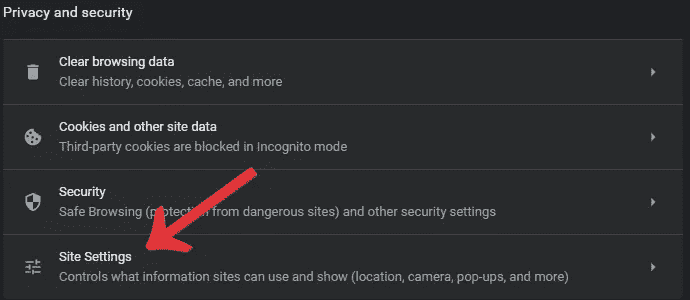
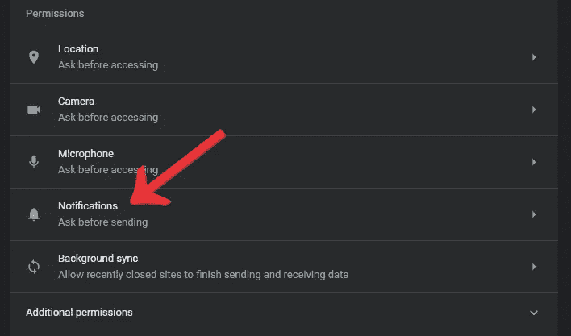
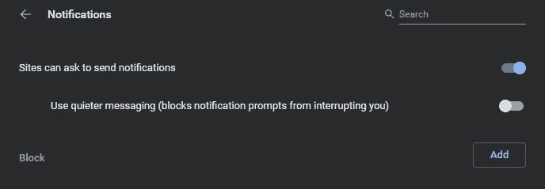
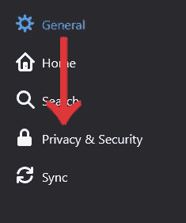
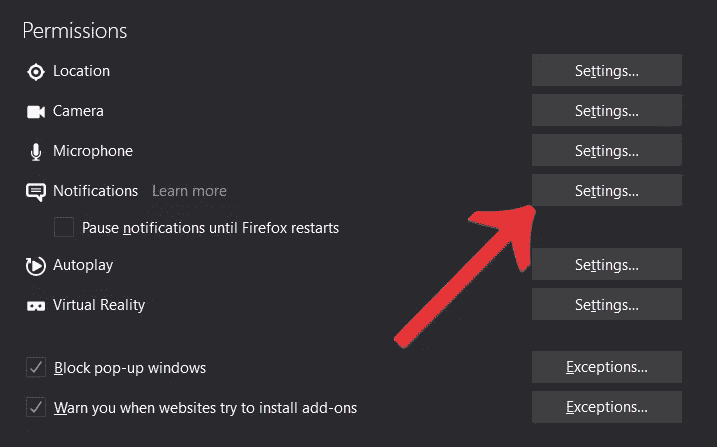
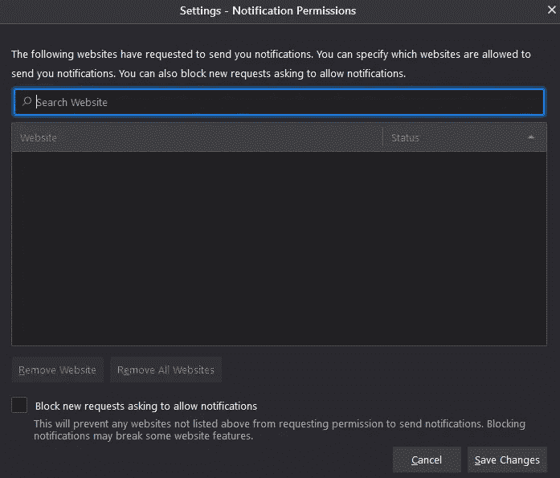
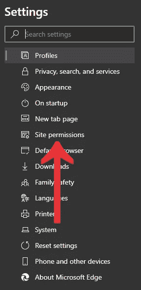
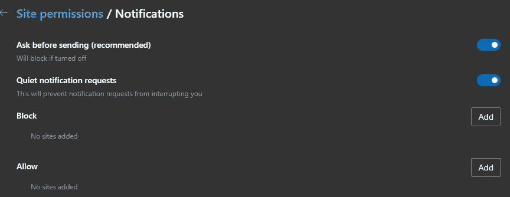

# 如何阻止网站发送通知

> 原文：<https://levelup.gitconnected.com/how-to-stop-websites-from-sending-notifications-973e428bfea0>

互联网上现在充斥着要求得到通知的网站，这是非常令人讨厌的。这篇博文就是关于这整个过程的，或者更好地表述为停止整个过程。这些弹出窗口往往会分散我们对内容的注意力，而且通常都很烦躁。我们将讨论如何在 Chrome、Firefox 和 Edge 浏览器中杜绝这种情况。

# 阻止通知访问请求:谷歌浏览器

要在 Chrome 浏览器中阻止通知请求，您需要遵循一些特定的简单步骤。

**第一步**:打开**谷歌 Chrome 浏览器**。点击三个点选择**设置**。
**第二步**:在**设置**中，找到位于左上角的**隐私与安全**选项卡。

隐私和安全

**第三步**:点击**站点设置**，然后点击**通知**。

网站设置

通知

**步骤 4** :切换开关，这样您就可以阻止通知。然后你就可以阻止网站在谷歌 Chrome 浏览器上发送这些无休止的通知访问请求。

# Firefox 浏览器还允许您阻止通知访问。为此，请遵循简单的步骤:

**第一步**:打开 **Mozilla Firefox** 。打开菜单，点击**选项**。
**第二步**:选择**隐私与安全**。

隐私与安全

**第三步**:向下滚动直到找到**权限**。在那里点击**通知设置。**

**步骤 4** :启用**模块**新请求请求允许通知。这就是阻止来自 Mozilla Firefox 的新通知请求的方法。

# Chromium Edge 浏览器在 Windows 10 上可用。要阻止来自那里的通知，您需要遵循以下步骤:

**第一步**:打开**铬基边缘浏览器**。然后点击三点菜单选择**设置**。

**步骤 2** :点击左侧面板中的**站点权限**。

网站权限

**第三步**:从**现场许可**中点击**通知**。
**第四步** : Chromium Edge 还有一个默认选项叫做**发送前询问**。

它就像谷歌 Chrome 浏览器。在那里，您必须更改您的选项或将您的选项切换到阻止。按照这些简单的步骤，您可以轻松地阻止来自 Chromium Edge 浏览器的通知访问请求。