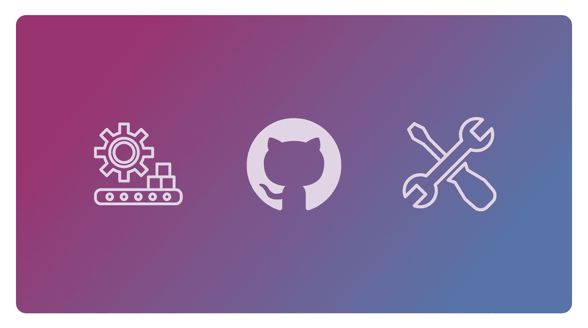
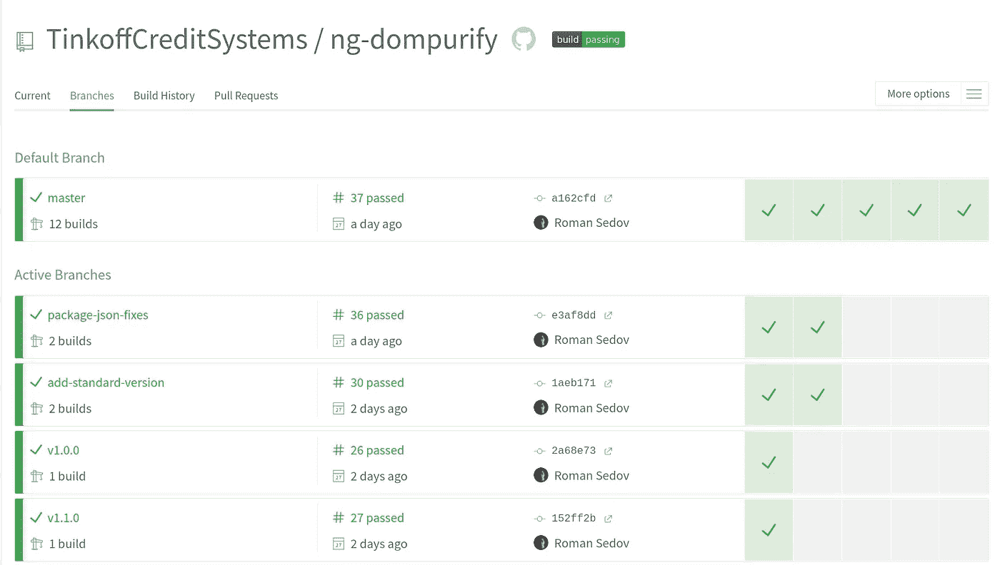
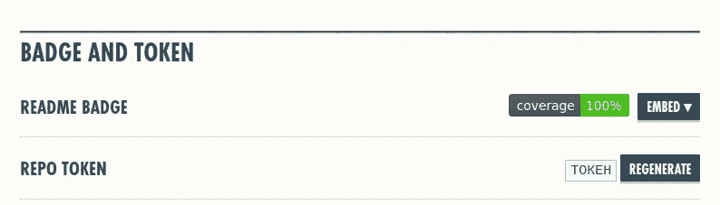
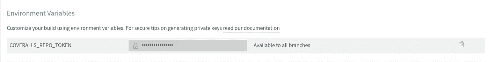
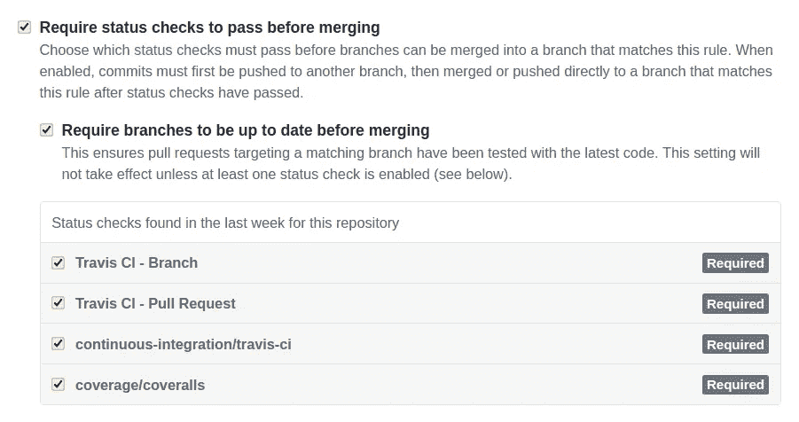
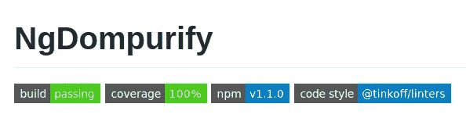

# 如何停止担心并开始开源(通过良好的部署、CI 和演示)

> 原文：<https://levelup.gitconnected.com/how-to-stop-worrying-and-start-opensource-with-a-good-deploy-ci-and-demo-50cfaa3d4526>

所以你做了一个新的很酷的东西，你想开源分享并发布到 NPM。

你不能只在公共库中发布你的代码。这将注定该项目缺乏发展和失败。另一方面，你知道有很多并行的工作:包的版本化和发布，设置持续集成，项目演示的托管和部署，组织社区贡献。

如果你只是想发布一个小的软件包，这样的工作量会把你吓跑。分享有用的东西的好主意会被埋在一个标有复杂任务的盒子里。

实际上，所有这些只需要不到一个小时。没有任何关于 DevOps 的知识，而且是免费的。



# 版本控制

如果你的库已经准备好第一次发布，你可以使用标准版本的。这个包将完全负责库的版本控制。它将升级 *package.json* 的版本，生成 CHAGELOG.md 文件，并为您的 git 历史添加标签。

它使用[常规提交](https://www.conventionalcommits.org/en/v1.0.0-beta.4/)来管理 *CHANGELOG.md* 。这也意味着您的包中将有一个清晰的提交消息格式。这对你和任何决定为你的项目做贡献的开发者都是有帮助的。

使用[标准版](https://github.com/conventional-changelog/standard-version)很容易。如何使用在 [Github 页面](https://github.com/conventional-changelog/standard-version#standard-version)有详细描述。我们还可以将一组发布命令添加到我们的 *package.json* 中，以使我们的发布更加方便:

```
"release": "standard-version",
"release:patch": "npm run release -- --release-as patch", "release:minor": "npm run release -- --release-as minor", "release:major": "npm run release -- --release-as major",
```

# 组织 CI

我建议使用 [Travis CI](http://travis-ci.org/) 进行持续集成。它对用户很友好:

1.  通过 Github 登录
2.  从列表中选择您的项目，并在其中激活 Travis
3.  在项目的根文件夹中添加一个简单的配置。Travis 将在 CI 上执行此配置

```
language: node_js
 node_js: - "10"
script:
 - npm run lint
 - npm run build
 - npm run test:ci
```

基本配置项准备就绪。Travis 将运行 linters，构建一个项目，并在每次更新存储库之后运行测试。

您还可以看到所有分支的状态，并提取请求和分析每个运行的构建。



其他开发人员会对使用您的包更有信心，因为您的所有代码都经过了测试。

我们可以将代码覆盖控制委托给特定于应用程序的服务[套装](https://coveralls.io/)。Travis 将在每次 CI 构建后发送测试结果。

我们只需要登录工作服，并把它放在一个仓库。就像特拉维斯一样。

**项目方工作:**

1.  将工作服设置为项目的开发相关性
2.  添加运行工作服的脚本，并将其添加到`test:ci`命令

```
"test:ci": "npm run test && npm run coveralls",
"coveralls": "cat coverage/lcov.info | coveralls",
```

不要忘记在你的`npm run test`脚本中有一面`--code-coverage`旗帜。工作服需要您的测试人员生成的文件 *lcov.info* 。如果你没有这样的标志，你可以使用 [istanbulJS](https://istanbul.js.org/) 包。

**在特拉维斯一侧工作:**

如果您的存储库是公共的，您可以在 *.travis.yml* 中用几个新字符串来设置它:

```
notifications:
   webhooks: https://coveralls.io/webhook
```

在任何其他情况下，您都可以使用令牌绑定它们:

1.  转到工作服上的存储库设置并生成回购令牌:



2.将令牌作为环境变量添加到 Travis 上的存储库设置中，名为 COVERALLS_REPO_TOKEN:



令牌绑定了这两个服务。现在我们也可以保护我们项目的*主*-分支:

1.  进入 Github 仓库->设置->分支
2.  为所有分支创建新规则:`*`
3.  打开状态检查。现在，在特拉维斯和工作服给你开绿灯之前，你不能将拉动请求合并到主*中*



现在我们可以回到*工作服*设置。有一个“拉取请求警报”部分。您可以设置代码覆盖率降低的级别，这将触发 CI 构建的失败。这样做是为了确保您的包经过了良好的测试。

# 改进工作流程

项目中的所有代码都应该遵循相同的编码约定。否则，代码库将逐渐退化，您将更难维护项目。不要忘记其他开发人员对你的代码风格指南并不感兴趣。这就是为什么你需要自动化这个问题。

首先，检查你有没有*。editorconfig* 文件在你的项目文件夹中，里面有关于如何格式化你的代码的设置。

之后，您应该安装以下开发依赖项: [husky](http://github.com/typicode/husky/) 和 [lint-staged](https://github.com/okonet/lint-staged) 。第一个在 git 挂钩上调用您的脚本。第二个只为准备提交的文件运行 linters。

例如，包含 TypeScript 和更少版本的包的设置示例:

package.json

如果你的项目中没有棉绒，我可以推荐你:

*   [更漂亮的](https://prettier.io/)用于代码格式化
*   [eslint](https://eslint.org/) 或 [tslint](https://eslint.org/) 作为 JS/TS 文件的 linter
*   [stylelint](https://stylelint.io/) 用于带样式的文件

Github 上有许多现成的配置，考虑了所有重要的林挺规则。比如你可以拿我们的解决方案: [@tinkoff/linters](https://github.com/TinkoffCreditSystems/linters)

# 在 NPM 上发布

现在是时候发布你的包了。向 *package.json* 添加一个简单的脚本:

```
"publish": "npm run build && npm publish ./dist"
```

在这种情况下，我们的存储库包含源代码和开发文件，但 NPM 只得到一个编译好的包，没有其他任何东西。

我们建造并出版。酷！

此外，您可以创建一些有助于发布的脚本。例如，让我们使用 NPM 钩子并添加 *postbuild* 脚本，该脚本将把 *README.md* 文件复制到 dist 文件夹。所以我们不会忘记更新 NPM 的包装说明。

```
"build": "..",
"postbuild": "node scripts/postbuild.js",
```

*scripts/postbuild.js*

# 设置演示

不是每个包都需要一个演示页面。如果您的包在它的公共 API 中有一些方法，并且有很好的文档记录，那么您可以跳过这一部分。

在其他情况下，展示一些东西会更好。别忘了我们出版了一个图书馆。Github 页面上的典型演示对我们来说不是最好的选择。对于开发人员来说，在一些在线 IDE 中打开您的演示更加方便:他们可以看到如何使用一个包，改变一些东西或者测试一个令人担忧的情况。

您可以在另一个存储库中制作一个演示，或者将它放入项目附近的一个新文件夹中。我们甚至不需要设置部署！现代的在线 ide 可以从 Github 中提取你的项目或者它们的单个分支/文件夹。

一些服务可让您在几分钟内打开项目:

*   [stackblitz.com](https://stackblitz.com/)可以开 Angular，React，Ionic，TypeScript，RxJs，Svelte。关于如何用一个链接从 Github 打开你的项目的信息在[这里](https://stackblitz.com/docs#import-from-github)。
*   [codesandbox.io](https://codesandbox.io/) 可以打开 Angular，React，Vue，编译 JavaScript。在这里，您还可以通过链接打开您的项目。
*   [repl.it](https://repl.it/github) 是一个可以导入带有 NodeJS，Express，NextJS，GatsbyJS 的存储库的服务。TypeScript 和 vanilla JS 也是可用的。

您可以选择任何选项，在您的 *README.md* 中添加一个链接，然后忘记设置演示页面。所有更新将自动运行。

您还可以向 CI 添加一个脚本，该脚本将使用最新版本的包在 NPM 构建一个演示。它可以是一个额外的检查，检查一个实际的版本在一个外部包上是否工作良好。

# 最后润色

将徽章添加到 *README.md* 中。这是一件小事，但它有助于你的包的访问者在 Github 上导航。

例如，有四个徽章说，该项目是建立和良好的代码覆盖率，你可以访问 NPM 在一个点击。



我推荐使用一个服务 [Shields.io](https://shields.io/) 来生成徽章。它们简单且质量高。

# 摘要

这样的一套工具足以给你的项目一个良好的开端。NPM 或 Github 上偶尔的访客会更有可能接受你的项目，因为它描述得很好，有一个很好的演示页面。

这个基础将允许您 restfully 地接受外部拉请求。其他开发人员会毫无问题地使用它。现在，您可以专注于包本身的实现，而不用担心围绕它的开发过程。